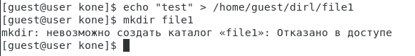

---
# Front matter
title: "Дискреционное разграничение прав в Linux."
subtitle: "Лабораторная работа № 2 -Основные атрибуты"
author: "Коне Сирики, НФИбд-01-20"
group: NFIbd-01-20
date: 2023 Sep 9th

# Generic otions
lang: ru-RU
toc-title: "Содержание"

# Pdf output format
toc: true # Table of contents
toc_depth: 2
lof: true # List of figures
lot: true # List of tables
fontsize: 12pt
linestretch: 1.5
papersize: a4
documentclass: scrreprt
### Fonts
mainfont: PT Serif
romanfont: PT Serif
sansfont: PT Sans
monofont: PT Mono
mainfontoptions: Ligatures=TeX
romanfontoptions: Ligatures=TeX
sansfontoptions: Ligatures=TeX,Scale=MatchLowercase
monofontoptions: Scale=MatchLowercase,Scale=0.9
## Biblatex
biblatex: true
biblio-style: "gost-numeric"
biblatexoptions:
  - parentracker=true
  - backend=biber
  - hyperref=auto
  - language=auto
  - autolang=other*
  - citestyle=gost-numeric
## Misc options
indent: true
header-includes:
  - \linepenalty=10 # the penalty added to the badness of each line within a paragraph (no associated penalty node) Increasing the value makes tex try to have fewer lines in the paragraph.
  - \interlinepenalty=0 # value of the penalty (node) added after each line of a paragraph.
  - \hyphenpenalty=50 # the penalty for line breaking at an automatically inserted hyphen
  - \exhyphenpenalty=50 # the penalty for line breaking at an explicit hyphen
  - \binoppenalty=700 # the penalty for breaking a line at a binary operator
  - \relpenalty=500 # the penalty for breaking a line at a relation
  - \clubpenalty=150 # extra penalty for breaking after first line of a paragraph
  - \widowpenalty=150 # extra penalty for breaking before last line of a paragraph
  - \displaywidowpenalty=50 # extra penalty for breaking before last line before a display math
  - \brokenpenalty=100 # extra penalty for page breaking after a hyphenated line
  - \predisplaypenalty=10000 # penalty for breaking before a display
  - \postdisplaypenalty=0 # penalty for breaking after a display
  - \floatingpenalty = 20000 # penalty for splitting an insertion (can only be split footnote in standard LaTeX)
  - \raggedbottom # or \flushbottom
  - \usepackage{float} # keep figures where there are in the text
  - \floatplacement{figure}{H} # keep figures where there are in the text
---

# Цель работы

Получение практических навыков работы в консоли с атрибутами файлов, закрепление теоретических основ дискреционного разграничения до-
ступа в современных системах с открытым кодом на базе ОС Linux.

# Ход работы

1. В установленной ОС создаю учетную запись пользователя guest.

  {#fig:1 width=100%}

2. Задаю пароль для созданного пользователя.

  {#fig:2 width=100%}

3. Вхожу в систему от имени созданного пользователя.

4. С помощью команды pwd определяю директорию. Определяю, что она является домашней.

  {#fig:3 width=100%}

5. Утоняю имя пользователя командой whoami.

  {#fig:4 width=100%}

6. Уточняю имя пользователя, группу, и группы, куда входит пользователь.

  {#fig:5 width=100%}

7. Сравниваю полученные данные с данными в приглашении командной строке.

8. Просматриваю файл /etc/passwd командой
cat /etc/passwd. Нахожу в нем свою учетную запись

  {#fig:6 width=100%}

  {#fig:7 width=100%}

9. Определите существующие в системе директории командой
ls -l /home/
Удалось ли вам получить список поддиректорий директории /home? Ка-
кие права установлены на директориях?

10. Проверьте, какие расширенные атрибуты установлены на поддиректо-
риях, находящихся в директории /home, командой:
lsattr /home
Удалось ли вам увидеть расширенные атрибуты директории?
Удалось ли вам увидеть расширенные атрибуты директорий других
пользователей?

11. Создайте в домашней директории поддиректорию dir1 командой
mkdir dir1
Определите командами ls -l и lsattr, какие права доступа и расши-
ренные атрибуты были выставлены на директорию dir1.

  {#fig:8 width=100%}

12. Снимите с директории dir1 все атрибуты командой
chmod 000 dir1
и проверьте с её помощью правильность выполнения команды
ls -l

13. Попытайтесь создать в директории dir1 файл file1 командой
echo "test" > /home/guest/dir1/file1
Объясните, почему вы получили отказ в выполнении операции по созда-
нию файла?
Оцените, как сообщение об ошибке отразилось на создании файла? Про-
верьте командой
ls -l /home/guest/dir1
действительно ли файл file1 не находится внутри директории dir1.

  {#fig:9 width=100%}

14. Заполните таблицу «Установленные права и разрешённые действия»
(см. табл. 2.1), выполняя действия от имени владельца директории (фай-
лов), определив опытным путём, какие операции разрешены, а какие нет.
Если операция разрешена, занесите в таблицу знак «+», если не разре-
шена, знак «-».
Замечание 1: при заполнении табл. 2.1 рассматриваются не все атрибу-
ты файлов и директорий, а лишь «первые три»: г, w, х, для «владельца».
Остальные атрибуты также важны

  {#fig:10 width=100%}

15. На основании заполненной таблицы определите те или иные минималь-
но необходимые права для выполнения операций внутри директории
dir1, заполните табл. 2.2.

  {#fig:11 width=100%}

# Выводы

Получены пракические навыки работы в консоли с атрибутами файлов, закреплены теоретические основы дискреционного разграничения доступа в современных системах на базе ОС Linux.

# Библиография

1. Методические материалы курса
