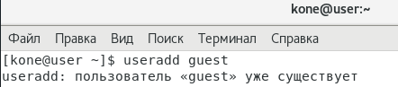
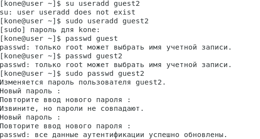
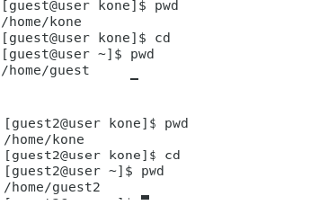
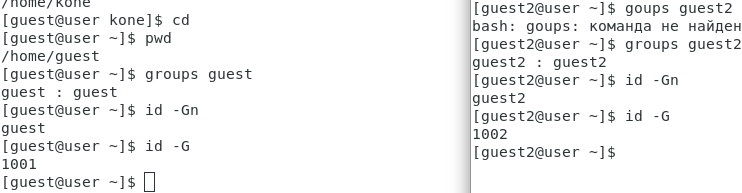
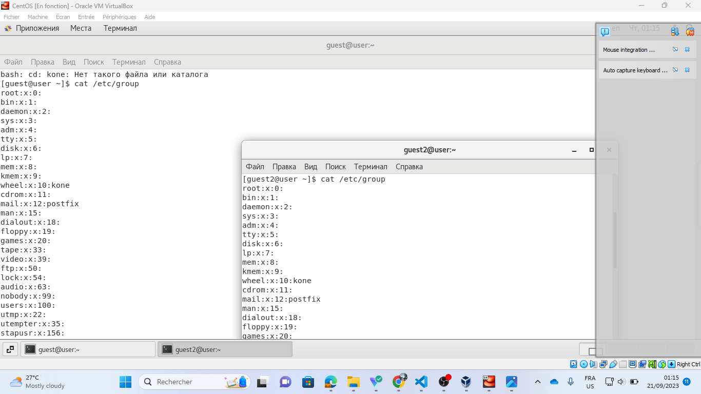
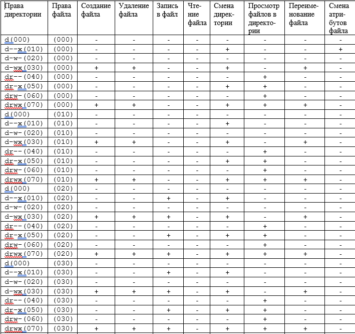
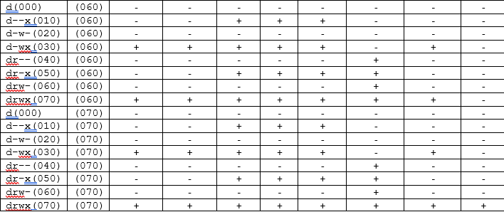
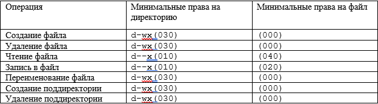

---
# Front matter
title: "Дискреционное разграничение прав в Linux."
subtitle: "Лабораторная работа № 3 -Два пользователя"
author: "Коне Сирики, НФИбд-01-20"
group: NFIbd-01-20
date: 2023 Sep 20th

# Generic otions
lang: ru-RU
toc-title: "Содержание"

# Pdf output format
toc: true # Table of contents
toc_depth: 2
lof: true # List of figures
lot: true # List of tables
fontsize: 12pt
linestretch: 1.5
papersize: a4
documentclass: scrreprt
### Fonts
mainfont: PT Serif
romanfont: PT Serif
sansfont: PT Sans
monofont: PT Mono
mainfontoptions: Ligatures=TeX
romanfontoptions: Ligatures=TeX
sansfontoptions: Ligatures=TeX,Scale=MatchLowercase
monofontoptions: Scale=MatchLowercase,Scale=0.9
## Biblatex
biblatex: true
biblio-style: "gost-numeric"
biblatexoptions:
  - parentracker=true
  - backend=biber
  - hyperref=auto
  - language=auto
  - autolang=other*
  - citestyle=gost-numeric
## Misc options
indent: true
header-includes:
  - \linepenalty=10 # the penalty added to the badness of each line within a paragraph (no associated penalty node) Increasing the value makes tex try to have fewer lines in the paragraph.
  - \interlinepenalty=0 # value of the penalty (node) added after each line of a paragraph.
  - \hyphenpenalty=50 # the penalty for line breaking at an automatically inserted hyphen
  - \exhyphenpenalty=50 # the penalty for line breaking at an explicit hyphen
  - \binoppenalty=700 # the penalty for breaking a line at a binary operator
  - \relpenalty=500 # the penalty for breaking a line at a relation
  - \clubpenalty=150 # extra penalty for breaking after first line of a paragraph
  - \widowpenalty=150 # extra penalty for breaking before last line of a paragraph
  - \displaywidowpenalty=50 # extra penalty for breaking before last line before a display math
  - \brokenpenalty=100 # extra penalty for page breaking after a hyphenated line
  - \predisplaypenalty=10000 # penalty for breaking before a display
  - \postdisplaypenalty=0 # penalty for breaking after a display
  - \floatingpenalty = 20000 # penalty for splitting an insertion (can only be split footnote in standard LaTeX)
  - \raggedbottom # or \flushbottom
  - \usepackage{float} # keep figures where there are in the text
  - \floatplacement{figure}{H} # keep figures where there are in the text
---

# Цель работы

Получение практических навыков работы в консоли с атрибутами файлов для групп пользователей

# Ход работы

1. В установленной операционной системе создайте учётную запись пользователя guest (использую учётную запись администратора).

{#fig:1 width=100%}

  
{#fig:2 width=100%}

2.Задайте пароль для пользователя guest (использую учётную запись администратора).

{#fig:3 width=100%}

3. Аналогично создайте второго пользователя guest2

 {#fig:4 width=100%}

4.Добавьте пользователя guest2 в группу guest.

{#fig:5 width=100%}

5. Осуществите вход в систему от двух пользователей на двух разных консолях: guest на первой консоли и guest2 на второй консоли.

{#fig:6 width=100%}

6.Для обоих пользователей командой pwd определите директорию, в которой вы находитесь. Сравните её с приглашениями командной строки.

{#fig:7 width=100%}

7. Уточните имя вашего пользователя, его группу, кто входит в неё
и к каким группам принадлежит он сам. Определите командами
groups guest и groups guest2, в какие группы входят пользователи guest и guest2. Сравните вывод команды groups с выводом команд
id -Gn и id -G.

{#fig:8 width=100%}

8. Сравните полученную информацию с содержимым файла /etc/group.
Просмотрите файл командой
cat /etc/group

{#fig:9 width=100%}

9. От имени пользователя guest2 выполните регистрацию пользователя
guest2 в группе guest командой
newgrp guest

{#fig:10 width=100%}

10. От имени пользователя guest измените права директории /home/guest,
разрешив все действия для пользователей группы:
chmod g+rwx /home/guest

{#fig:11 width=100%}

11. От имени пользователя guest снимите с директории /home/guest/dir1
все атрибуты командой

{#fig:12 width=100%}

12. Заполните таблицу «Установленные права и разрешённые действия»
(см. табл. 2.1), выполняя действия от имени владельца директории (фай-
лов), определив опытным путём, какие операции разрешены, а какие нет.
Если операция разрешена, занесите в таблицу знак «+», если не разре-
шена, знак «-».
Замечание 1: при заполнении табл. 2.1 рассматриваются не все атрибу-
ты файлов и директорий, а лишь «первые три»: г, w, х, для «владельца».
Остальные атрибуты также важны

{#fig:13 width=100%}

{#fig:14 width=100%}

{#fig:15 width=100%}

13. На основании заполненной таблицы определите те или иные минималь-
но необходимые права для выполнения операций внутри директории
dir1, заполните табл. 2.2.

{#fig:16 width=100%}

# Выводы

Получены пракические навыки работы в консоли с атрибутами файлов для групп пользователей, закреплены теоретические основы дискреционного разграничения доступа в современных системах на базе ОС Linux.

# Библиография

1. Методические материалы курса
