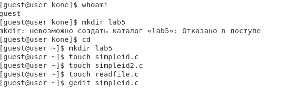
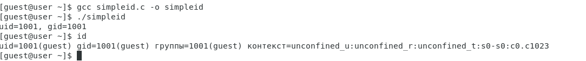
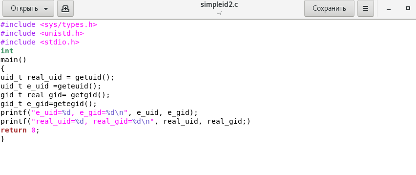
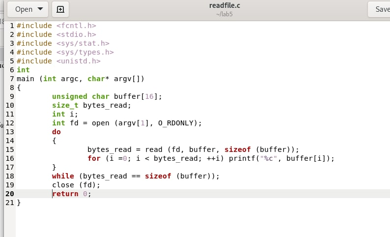

---
# Front matter
title: "Лабораторная работа № 5. Дискреционное
разграничение прав в Linux. Исследование
влияния дополнительных атрибутов"
author: "Коне Сирики, НФИбд-01-20"

# Generic otions
lang: ru-RU
toc-title: "Содержание"

# Pdf output format
toc: true # Table of contents
toc_depth: 2
lof: true # List of figures
lot: true # List of tables
fontsize: 12pt
linestretch: 1.5
papersize: a4
documentclass: scrreprt
## I18n
polyglossia-lang:
  name: russian
  options:
	- spelling=modern
	- babelshorthands=true
polyglossia-otherlangs:
  name: english
### Fonts
mainfont: PT Serif
romanfont: PT Serif
sansfont: PT Sans
monofont: PT Mono
mainfontoptions: Ligatures=TeX
romanfontoptions: Ligatures=TeX
sansfontoptions: Ligatures=TeX,Scale=MatchLowercase
monofontoptions: Scale=MatchLowercase,Scale=0.9
## Biblatex
biblatex: true
biblio-style: "gost-numeric"
biblatexoptions:
  - parentracker=true
  - backend=biber
  - hyperref=auto
  - language=auto
  - autolang=other*
  - citestyle=gost-numeric
## Misc options
indent: true
header-includes:
  - \linepenalty=10 # the penalty added to the badness of each line within a paragraph (no associated penalty node) Increasing the value makes tex try to have fewer lines in the paragraph.
  - \interlinepenalty=0 # value of the penalty (node) added after each line of a paragraph.
  - \hyphenpenalty=50 # the penalty for line breaking at an automatically inserted hyphen
  - \exhyphenpenalty=50 # the penalty for line breaking at an explicit hyphen
  - \binoppenalty=700 # the penalty for breaking a line at a binary operator
  - \relpenalty=500 # the penalty for breaking a line at a relation
  - \clubpenalty=150 # extra penalty for breaking after first line of a paragraph
  - \widowpenalty=150 # extra penalty for breaking before last line of a paragraph
  - \displaywidowpenalty=50 # extra penalty for breaking before last line before a display math
  - \brokenpenalty=100 # extra penalty for page breaking after a hyphenated line
  - \predisplaypenalty=10000 # penalty for breaking before a display
  - \postdisplaypenalty=0 # penalty for breaking after a display
  - \floatingpenalty = 20000 # penalty for splitting an insertion (can only be split footnote in standard LaTeX)
  - \raggedbottom # or \flushbottom
  - \usepackage{float} # keep figures where there are in the text
  - \floatplacement{figure}{H} # keep figures where there are in the text
---

# Цель работы

Изучение механизмов изменения идентификаторов, применения
SetUID- и Sticky-битов. Получение практических навыков работы в консоли с дополнительными атрибутами. Рассмотрение работы механизма
смены идентификатора процессов пользователей, а также влияние бита
Sticky на запись и удаление файлов.

# Последовательность выполнения работы

## Создание программы

1. Войдите в систему от имени пользователя guest.
{#fig:1 width=100%}

2. {#fig:2 width=100%}

3. Создайте программу simpleid.c:

        #include <sys/types.h>
        #include <unistd.h>
        #include <stdio.h>
        int
        main ()
        {
        uid_t uid = geteuid ();
        gid_t gid = getegid ();
        printf ("uid=%d, gid=%d\n", uid, gid);
        return 0;
        }

4. {#fig:3 width=100%}

5. Скомплилируйте программу и убедитесь, что файл программы создан:

        gcc simpleid.c -o simpleid

6. Выполните программу simpleid:

        ./simpleid

7. Выполните системную программу id:

        id

и сравните полученный вами результат с данными предыдущего пункта
задания.

  {#fig:1 width=100%}

8. Усложните программу, добавив вывод действительных идентификато-
ров:

        #include <sys/types.h>
        #include <unistd.h>
        #include <stdio.h>
        int
        main ()
        {
        uid_t real_uid = getuid ();
        uid_t e_uid = geteuid ();
        gid_t real_gid = getgid ();
        gid_t e_gid = getegid () ;
        printf ("e_uid=%d, e_gid=%d\n", e_uid, e_gid);
        printf ("real_uid=%d, real_gid=%d\n", real_uid,
        ,! real_gid);
        return 0;
        }

Получившуюся программу назовите simpleid2.c.

9. Усложните программу
 {#fig:1 width=100%}

10. Скомпилируйте и запустите simpleid2.c:

        gcc simpleid2.c -o simpleid2
        ./simpleid2
 {#fig:1 width=100%}

11. Создайте программу readfile.c:

        #include <fcntl.h>
        #include <stdio.h>
        #include <sys/stat.h>
        #include <sys/types.h>
        #include <unistd.h>
        int
        main (int argc, char* argv[])
        {
        unsigned char buffer[16];
        size_t bytes_read;
        int i;
        int fd = open (argv[1], O_RDONLY);
        do
        {
        bytes_read = read (fd, buffer, sizeof (buffer));
        for (i =0; i < bytes_read; ++i) printf("%c", buffer[i]);
        }
        while (bytes_read == sizeof (buffer));
        close (fd);
        return 0;
        }
12.  {#fig:1 width=100%}
13. Откомпилируйте её.

        gcc readfile.c -o readfile

  {#fig:9 width=100%}

Отразите полученный результат и ваши объяснения в отчёте.

## Исследование Sticky-бита

1. Выясните, установлен ли атрибут Sticky на директории /tmp, для чего
выполните команду

        ls -l / | grep tmp

2. От имени пользователя guest создайте файл file01.txt в директории /tmp
со словом test:

        echo "test" > /tmp/file01.txt

3. Просмотрите атрибуты у только что созданного файла и разрешите чте-
ние и запись для категории пользователей «все остальные»:

        ls -l /tmp/file01.txt
        chmod o+rw /tmp/file01.txt
        ls -l /tmp/file01.txt

4. От пользователя guest2 (не являющегося владельцем) попробуйте про-
читать файл /tmp/file01.txt:

        cat /tmp/file01.txt

5. От пользователя guest2 попробуйте дозаписать в файл
/tmp/file01.txt слово test2 командой

        echo "test2" > /tmp/file01.txt

Удалось ли вам выполнить операцию?

6. Проверьте содержимое файла командой

        cat /tmp/file01.txt

7. От пользователя guest2 попробуйте записать в файл /tmp/file01.txt
слово test3, стерев при этом всю имеющуюся в файле информацию ко-
мандой

        echo "test3" > /tmp/file01.txt

Удалось ли вам выполнить операцию?

8. Проверьте содержимое файла командой

        cat /tmp/file01.txt

9. От пользователя guest2 попробуйте удалить файл /tmp/file01.txt ко-
мандой

        rm /tmp/fileOl.txt

10. Повысьте свои права до суперпользователя следующей командой

        su -

и выполните после этого команду, снимающую атрибут t (Sticky-бит) с
директории /tmp:

        chmod -t /tmp

11. Покиньте режим суперпользователя командой
exit

12. От пользователя guest2 проверьте, что атрибута t у директории /tmp
нет:

        ls -l / | grep tmp

13. Скриншот выполнения:

  {#fig:14 width=100%}

# Выводы

Изучены механизмы изменения идентификаторов, применения
SetUID- и Sticky-битов. Получены практическе навыки работы в консоли с дополнительными атрибутами. Рассмотрены работы механизма
смены идентификатора процессов пользователей, а также влияние бита
Sticky на запись и удаление файлов.

# Библиография

1. Методические материалы курса