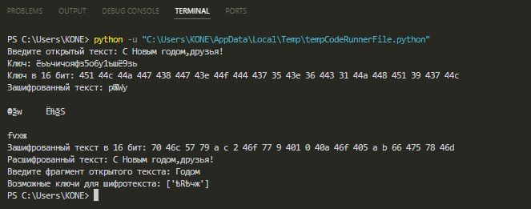
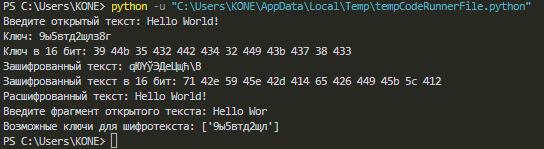

---
## Front matter
lang: ru-RU
title: "Лабораторная работа №7: Презентация."
subtitle: 
  Элементы криптографии. Однократное гаммирование.
author: 
    Коне Сирики. Группа - НФИбд-01-20.\inst{1}
institute: 
    \inst{1}Российский Университет Дружбы Народов

date: 20 октября, 2023, Москва, Россия

## i18n babel
babel-lang: russian
babel-otherlangs: english

## Formatting pdf
toc: false
toc-title: Содержание
slide_level: 2
aspectratio: 169
section-titles: true
theme: metropolis
header-includes:
 - \metroset{progressbar=frametitle,sectionpage=progressbar,numbering=fraction}
 - '\makeatletter'
 - '\beamer@ignorenonframefalse'
 - '\makeatother'
---

# Цели и задачи работы

## Цель лабораторной работы

Освоить на практике применение режима однократного гаммирования.

## Задание

1. Изучить метод Гаммирование.
2. Написать код на С++ с методом гаммирование.
3. Проверить и прогнать код на указанных примерах и условиях.

# Указание к работе

## Теоретический материал

Принцип легший в основу гаммирование предложил Vernam, Gilbert S. в 1926 в своей первой официальной публикации «Cipher Printing Telegraph Systems For Secret Wire and Radio Telegraphic Communications» попавшую в выпуск газеты  "Journal of the IEEE 55" под номером 109-115. В последствии называемая "схема однократного использования" или более популярное "Шифр Вернама".

Гаммирование представляет собой наложение (снятие) на открытые (зашифрованные) данные последовательности элементов других данных, полученной с помощью некоторого криптографического алгоритма, для получения зашифрованных (открытых) данных. Иными словами, наложение гаммы — это сложение её элементов с элементами открытого (закрытого) текста по некоторому фиксированному модулю, значение которого представляет собой известную часть алгоритма шифрования.

## Пример с пояснением

К. Шеннон доказал абсолютную стойкость шифра в случае, когда однократно используемый ключ, длиной, равной длине исходного сообщения, является фрагментом истинно случайной двоичной последовательности с равномерным законом распределения. Криптоалгоритм не даёт никакой информации об открытом тексте: при известном зашифрованном сообщении С все различные ключевые последовательности K возможны и равновероятны, а значит, возможны и любые сообщения P.
Необходимые и достаточные условия абсолютной стойкости шифра:
– полная случайность ключа;
– равенство длин ключа и открытого текста;
– однократное использование ключа.

---

Рассмотрим пример.
Ключ Центра:
05 0C 17 7F 0E 4E 37 D2 94 10 09 2E 22 57 FF C8 0B B2 70 54
Сообщение Центра:
Штирлиц – Вы Герой!!  (D8 F2 E8 F0 EB E8 F6 20 2D 20 C2 FB 20 C3 E5 F0 EE E9 21 21)
Зашифрованный текст, находящийся у Мюллера:
DD FE FF 8F E5 A6 C1 F2 B9 30 CB D5 02 94 1A 38 E5 5B 51 75
Дешифровальщики попробовали ключ:
05 0C 17 7F 0E 4E 37 D2 94 10 09 2E 22 55 F4 D3 07 BB BC 54
и получили текст:
Штирлиц - Вы Болван! (D8 F2 E8 F0 EB E8 F6 20 2D 20 C2 FB 20 C1 EE EB E2 E0 ED 21)

# Процесс выполнения лабораторной работы

## Условие задания

Нужно подобрать ключ, чтобы получить сообщение «С Новым Годом, друзья!». Требуется разработать приложение, позволяющее шифровать и дешифровать данные в режиме однократного гаммирования. Приложение должно:

1. Определить вид шифротекста при известном ключе и известном открытом тексте.
2. Определить ключ, с помощью которого шифротекст может быть преобразован в некоторый фрагмент текста, представляющий собой один из
возможных вариантов прочтения открытого текста.

## Код

```
import random
import string

def rusOrAng(text):
    if text[0] in string.ascii_lowercase:
        return string.ascii_lowercase+string.digits
    else:
        return "абвгдеёжзийклмнопрстуфхцчшщъыьэюя"+string.digits

def key_create(s, alf):
    k = "".join(random.choice(alf) for i in range(s))
    return k
```

---

```
def Hex_coder(cod):
    return " ".join(hex(ord(i))[2:] for i in cod)

def string_coder(text, k):
    return "".join(chr(ord(c) ^ ord(k)) for c, k in zip(text, k))

def find_plaintext(text, fragment):
    key_length = len(fragment)
    possible_keys = []
    for i in range(len(text) - key_length + 1):
        key = [chr(ord(c) ^ ord(k)) for c, k in zip(text[i:i + key_length], fragment)]
        intact_plaintext = string_coder(text, key)
        if fragment in intact_plaintext:
            possible_keys.append(''.join(key))
    return possible_keys
```

---

```
plaintext = input("Введите открытый текст: ")
size = len(plaintext)
leng = rusOrAng(plaintext)
key = key_create(size, leng)
print(f"Ключ: {key}", f"Ключ в 16 бит: {Hex_coder(key)}", sep='\n')

ciphertext = string_coder(plaintext, key)
print(f"Зашифрованный текст: {ciphertext}", f"Зашифрованный текст в 16 бит: {Hex_coder(ciphertext)}", sep='\n')

decryptedtext = string_coder(ciphertext, key)
print("Расшифрованный текст:", decryptedtext)

known_fragment = input("Введите фрагмент открытого текста: ")
possible_keys = find_plaintext(ciphertext, known_fragment)
print("Возможные ключи для шифротекста:", possible_keys)
```

# Результаты

{#fig:001 width=80% height=80%}

---

{#fig:002 width=80% height=80%}

# Контрольные вопросы

1. Поясните смысл однократного гаммирования.
Ответ: это шифрование симметричным методом, сущность которого заключается в «наложении» последовательности, сформированной из случайных чисел, на открытый текст. Прощё говоря это шифрование где количество символов совпадает в ключе и тексте совпадает и без ключа нельзя одназначно декодировать текст обратна. С моей точки зрения это аналог принципа шифрование в знаменитой Энигме, но с случайными символами в ключе.

2. Перечислите недостатки однократного гаммирования.
Ответ: Необходимо передавать ключ с словом так как его невозможно создать заранее, а также сложность обмена ключами в большой системе и вероятность его повреждение что сразу сделает дешифровку невозможной.

---

3. Перечислите преимущества однократного гаммирования.
Ответ: Простой и одинаковый процесс кодирования и декодирования, единый ключ для шифровки и дешифровки, скорость обработки и передачи так как требуется лишь текст и его ключ.

4. Почему длина открытого текста должна совпадать с длиной ключа?
Ответ: Так как при кодирование элемент ключа закрепляется за соответствующим элементом сообщения из-за чего и возможна одназначна декадировать сообщение.

---

5. Какая операция используется в режиме однократного гаммирования, назовите её особенности?
Ответ: Фактически ответ содержится в одном из названий этого принципа "Шифр XOR", тоесть в его основе находится строгая дизъюнкция которая и принимает в себя случайный ключ и текст и обратно "отзеркаливает" если вернуть зашифрованный текст вместе с ключём.

6. Как по открытому тексту и ключу получить шифротекст?
Ответ: Для получения шифротекста применяем операцию исключающего ИЛИ (XOR) между каждым символом открытого текста и соответствующим символом ключа. Процесс можно построить следующим образом: открытый текст и ключ в виде последовательности байтов или символов;  поэлементно выполняем операцию XOR с открытого текста и ключа; резуьтат этой операции и будет шифротекст.

---

7. Как по открытому тексту и шифротексту получить ключ?
Ответ: Сооответсвенно онологичная процедура из 6 пункта, так как процесс кодирование и декадирование одинаковы.

8. В чем заключаются необходимые и достаточные условия абсолютной стойкости шифра?
Ответ: Определить это можно проведя проверку через "Доказательство абсолютной стойкости Шеннона" (в основе которого лежит принцип абсолютной стойкости шифра — шифр, характеризующийся тем, что криптоаналитик принципиально не сможет извлечь статистическую информацию относительно выбираемых ключей из перехватываемого шифротекста.). Так Клод Шеннон доказал, что при определённых свойствах гаммы этот метод шифрования является абсолютно стойким (гамма выступает в роли случайно сгенерированного ключа) и данные условия просты: при шифрование ключ создаётся случайно и свегда занова, для гаммы нужно использовать "аппаратные генераторы случайных чисел" и длина гаммы должна быть не меньше длины защищаемого сообщения.

# Выводы по проделанной работе

## Вывод

В ходе выполнения лабораторной работы были освоены на практике применение режима однократного гаммирования.
