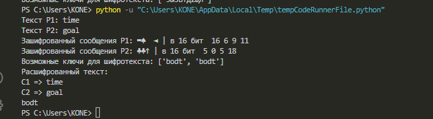
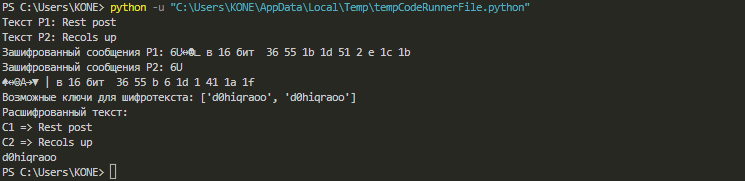

---
## Front matter
lang: ru-RU
title: "Лабораторная работа №8: отчет."
subtitle: "Элементы криптографии. Шифрование (кодирование) различных исходных текстов одним ключом."
author: "Коне Сирики. Группа - НФИбд-01-20."

## Generic otions
lang: ru-RU
toc-title: "Содержание"

## Bibliography
bibliography: bib/cite.bib
csl: pandoc/csl/gost-r-7-0-5-2008-numeric.csl

## Pdf output format
toc: true # Table of contents
toc-depth: 2
lof: true # List of figures
fontsize: 12pt
linestretch: 1.5
papersize: a4
documentclass: scrreprt
## I18n polyglossia
polyglossia-lang:
  name: russian
  options:
	- spelling=modern
	- babelshorthands=true
polyglossia-otherlangs:
  name: english
## I18n babel
babel-lang: russian
babel-otherlangs: english
## Fonts
mainfont: PT Serif
romanfont: PT Serif
sansfont: PT Sans
monofont: PT Mono
mainfontoptions: Ligatures=TeX
romanfontoptions: Ligatures=TeX
sansfontoptions: Ligatures=TeX,Scale=MatchLowercase
monofontoptions: Scale=MatchLowercase,Scale=0.9
## Biblatex
biblatex: true
biblio-style: "gost-numeric"
biblatexoptions:
  - parentracker=true
  - backend=biber
  - hyperref=auto
  - language=auto
  - autolang=other*
  - citestyle=gost-numeric
## Pandoc-crossref LaTeX customization
figureTitle: "Рис."
listingTitle: "Листинг"
lofTitle: "Список иллюстраций"
lotTitle: "Список таблиц"
lolTitle: "Листинги"
## Misc options
indent: true
header-includes:
  - \usepackage{indentfirst}
  - \usepackage{float} # keep figures where there are in the text
  - \floatplacement{figure}{H} # keep figures where there are in the text
---

# Цель работы

Освоить на практике применение режима однократного гаммирования на примере кодирования различных исходных текстов одним ключом.

# Задание

1. Рассмотреть особенности и особенности кодирование однократного гаммирования с использованием одного ключа.
2. Создать код который будет показывать принцип работы нескольких шифротекстов с одним ключом и его взлом.
3. изучить способы взлома и декодирование шифротекста без ключа.

# Указание к работе

## Описание метода

Пример:
Исходные данные - две телеграммы Центра:
P1 = НаВашисходящийот1204
P2 = ВСеверныйфилиалБанка
Ключ Центра длиной 20 байт:
K = 05 0C 17 7F 0E 4E 37 D2 94 10 09 2E 22 57 FF C8 OB B2 70 54
Режим шифрования однократного гаммирования одним ключом двух видов открытого текста реализуется в соответствии со схемой (смотреть лабораторную).

# Выполнение лабораторной работы

## Условие задания

Два текста кодируются одним ключом (однократное гаммирование). Требуется не зная ключа и не стремясь его определить, прочитать оба текста. Необходимо разработать приложение, позволяющее шифровать и дешифровать тексты P1 и P2 в режиме однократного гаммирования. Приложение должно определить вид шифротекстов C1 и C2 обоих текстов P1 и P2 при известном ключе ; Необходимо определить и выразить аналитически способ, при котором злоумышленник может прочитать оба текста, не зная ключа и не стремясь его определить.

## Код

```
import random
import string

def keyCreate(s, alf):
    k = ''.join(random.choice(alf) for i in range(s))
    return k

def Hex_coder(cod):
    return ' '.join(hex(ord(i))[2:] for i in cod)

def string_coder(text, k, iter_numb):
    if iter_numb == 1:
        return ''.join(chr(ord(c) ^ ord(k)) for c, k in zip(text, k))
    else:
        return [''.join(chr(ord(c) ^ ord(k)) for c, k in zip(t, k)) for t in text]

def find_Key(cypher, texts, s):
    possible_keys = []
    for f in range(len(texts)):
        for i in range(len(cypher[f]) - s + 1):
            key = [chr(ord(c) ^ ord(k)) for c, k in zip(cypher[f][i:i + s], texts[f])]
            intact_plaintext = string_coder(cypher[f], key, 1)
            if texts[f] in intact_plaintext:
                possible_keys.append(''.join(key))
    return possible_keys


P1 = input("Текст P1: ")
P2 = input("Текст P2: ")
if len(P1) != len(P2):
    exit(0)
size, char_set = len(P1), string.ascii_lowercase+string.digits
C1, C2 = string_coder([P1, P2], keyCreate(size, char_set), 2)

print(f"Зашифрованный сообщения P1: {C1} | в 16 бит  {Hex_coder(C1)}",
      f"Зашифрованный сообщения P2: {C2} | в 16 бит  {Hex_coder(C2)}", sep="\n")

possible_keys = find_Key([C1, C2], [P1, P2], size)
print("Возможные ключи для шифротекста:", possible_keys)

D1, D2 = string_coder([C1, C2], possible_keys[-1], 2)
print("Расшифрованный текст:", f"\nC1 => {D1}\nC2 => {D2}")

print(string_coder(C1, P1, 1))
```

## Результат

{#fig:001 width=80% height=80%}

{#fig:002 width=80% height=80%}

# Контрольные вопросы

1. Как, зная один из текстов (P1 или P2), определить другой, не зная при этом ключа?
Ответ: Это возможно сделать только в том случае если текст P1 и P2 одной длины и имеют общий ключ.

2. Что будет при повторном использовании ключа при шифровании текста?
Ответ: Из-за одинаковости способа кодирование и декодирование после повторного использование слова и ключа даст нам шифротекст.

3. Как реализуется режим шифрования однократного гаммирования одним ключом двух открытых текстов?
Ответ: Фактически следуя схеме 8.1 и принципу "шифра XOR" мы просто имеет два параллельных кодирование и декодирование с использованием одного ключа.

4. Перечислите недостатки шифрования одним ключом двух открытых текстов.
Ответ: Если вспомнить тредования для абсолютной стойкости шифра расмотренных в предедущей лабораторной то можно сразу понять по первому пункту что если ключ не будет случайным и каждый раз новым для каждой строки то найдя пересечения или аналоги в шифротекстах можно определить одинаковые символы что может пошатнуть защиту текста даже если у вас нет ни одного исходного кода, а если и есть то определить другие слова легко.

5. Перечислите преимущества шифрования одним ключом двух открытых текстов.
Ответ: На самом деле они есть, но они сомнительны: требуется передать один ключ что сделать проще и быстрее, при передаче большого количества шифротекста нет шанса запутаться в их порядке сочетания с ключами.

# Выводы

Освоил на практике применение режима однократного гаммирования и возможных способах взлома при отсутствие ключа и наличие исходных текстов и шифротекстов.

# Список литературы {.unnumbered}

1. [Лабораторная](https://esystem.rudn.ru/pluginfile.php/2090286/mod_resource/content/2/008-lab_crypto-key.pdf)
2. [Описание методов](https://retrolib.ru/realizacziya-algoritma-shifrovaniya-gammirovanie-pascalpaskal-python-piton/)
3. [Другая лабораторная об материале](https://ami.nstu.ru/~gultyaeva/pszi/Materials/lab1.pdf)
