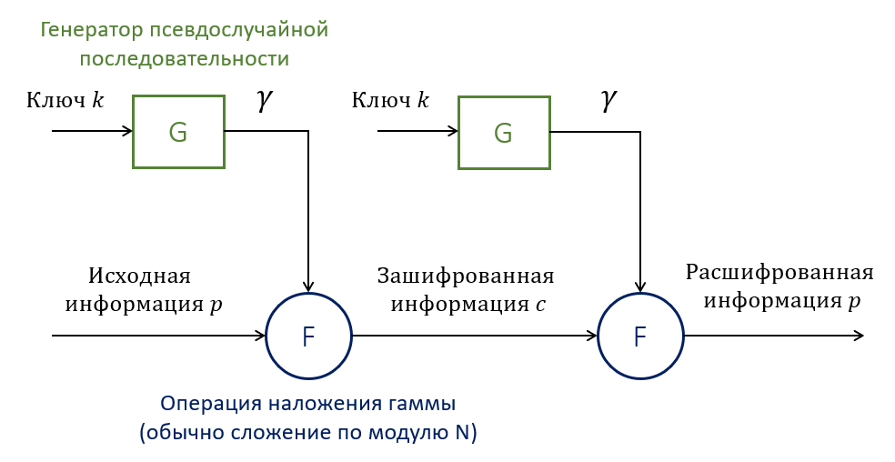
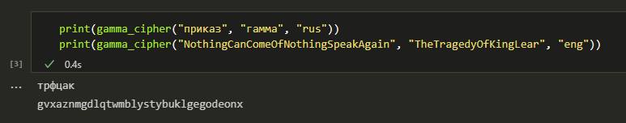

---
## Front matter
lang: ru-RU
title: Отчёт по лабораторной работе №3.  
    
subtitle: Шифрование гаммированием
author:
  - Коне Сирики
institute:
  - Российский университет дружбы народов, Москва, Россия
  - Объединённый институт ядерных исследований, Дубна, Россия
date: 08 октября 2024

## i18n babel
babel-lang: russian
babel-otherlangs: english

## Formatting pdf
toc: false
toc-title: Содержание
slide_level: 2
aspectratio: 169
section-titles: true
theme: metropolis
header-includes:
 - \metroset{progressbar=frametitle,sectionpage=progressbar,numbering=fraction}
---

# Информация

## Докладчик

:::::::::::::: {.columns align=center}
::: {.column width="70%"}

  * Коне Сирики
  * Студент физмат
  * профессор кафедры прикладной информатики и теории вероятностей
  * Российский университет дружбы народов
  * [konesirisil@yandex.ru](mailto:sirikisil@yandex.ru)
  * <https://github.com/skone19>

:::
::: {.column width="30%"}


:::
::::::::::::::


## Цели и задачи работы

Целью данной лабораторной работы является ознакомление с методом *шифрования гаммированием*, а также его последующая программная реализация для случая конечной гаммы.

**Задачи:**

1. Рассмотреть алгоритм шифрования гаммированием;

2. Реализовать его для случая конечной гаммы на языке программирования Python.

# Теоретическое введение

## Шифры гаммирования

*Шифры гаммирования* (или *аддитивные шифры*) осуществляют шифрование путем сложения символов исходного текста $P_i$ и ключа $K_i$ по модулю, равному числу букв в алфавите ($N$).

Table: Наложение гаммы путём сложения по модулю

-------------------------------------------------------------------------------------
 Модуль             Шифрование                           Дешифровка  
-----------  ---------------------------------  -------------------------------------
 N           $C_i = (P_i + K_i) \; \% \; N$       $P_i = (C_i + N - K_i) \; \% \; N$

 2           $C_i = P_i \oplus K_i$               $P_i = C_i \oplus K_i$
-------------------------------------------------------------------------------------

Здесь $C_i$ -- $i$-ый символ криптограммы, $\%$ -- взятие остатка.

## Стойкость шифра

 Стойкость аддитивных шифров определяется качеством гаммы, которое зависит от длины периода и случайности распределения по периоду. Для обеспечения абсолютной стойкости необходимо, чтобы:

 - последовательность символов в пределах периода гаммы была случайной;

 - символы алфавита гаммы были распределены равновероятно;

 - гамма совпадала по размеру или была больше исходного открытого текста;

 - гамма применялась только один раз.

## Генерация гамм

Так, могут использоваться или *истинно случайные гаммы*, или *псевдослучайные гаммы* -- последовательности чисел, вычисленные по определённой процедуре, но имеющие все свойства случайной последовательности чисел в рамках решаемой задачи.

{ #fig:001 width=70% }

# Ход выполнения и результаты

## Реализация (1/2)

```python
abc_rus = [chr(code) for code in range(ord('а'), ord('я') + 1)]
abc_eng = [chr(code) for code in range(ord('a'), ord('z') + 1)]

letter2number_rus = {abc_rus[i] : i for i in range(len(abc_rus))}
letter2number_eng = {abc_eng[i] : i for i in range(len(abc_eng))}

abc = {"rus" : abc_rus, "eng" : abc_eng}

letter2number = {"rus" : letter2number_rus, "eng" : letter2number_eng}
```

## Реализация (2/2)

```python
def gamma_cipher(message, key, language):
    mes = message.lower() # приводим сообщение к нижнему регистру
    n = len(abc[language]) # размерность алфавита

    gamma = key.lower() # приводим гамму к нижнему регистру
    while len(gamma) < len(mes): # пока она короче сообщения..
        gamma += gamma[len(gamma) - len(key)] # дополняем её повторениями

    message_encrypted = "" # криптограмма
    for i in range(len(mes)): # для каждого символа в сообщении
        m = letter2number[language][mes[i]]
        g = letter2number[language][gamma[i]]
        message_encrypted += abc[language][(m + g) % n]

    return message_encrypted
```

## Результаты

{ #fig:002 width=100% }

## Вывод

Таким образом, была достигнута цель, поставленная в начале лабораторной работы: было проведено краткое знакомство с методом шифрования гаммированием, а алгоритм шифрования заданной конечной гаммой был успешно реализован на языке программирования **Python**.

## {.standout}

Спасибо за внимание
