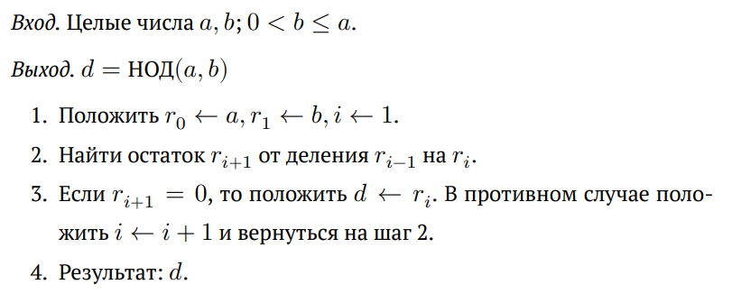
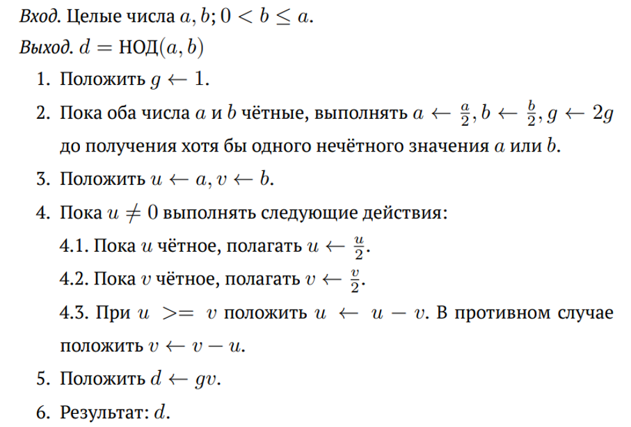
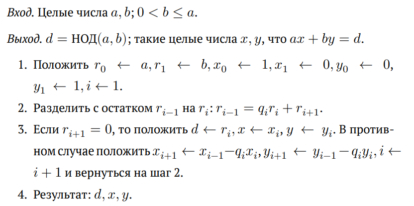
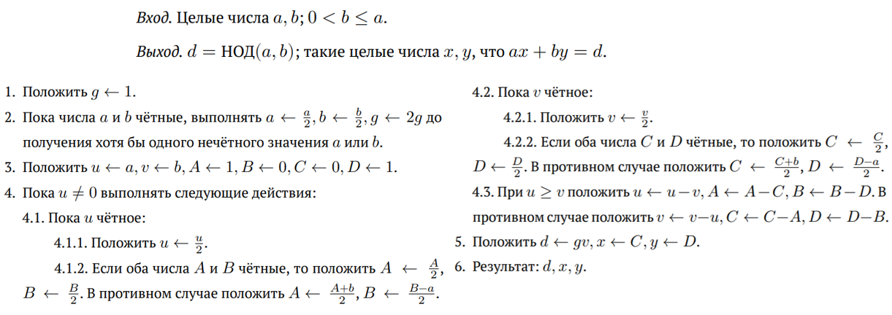
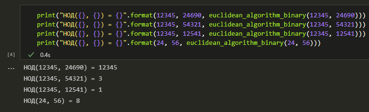
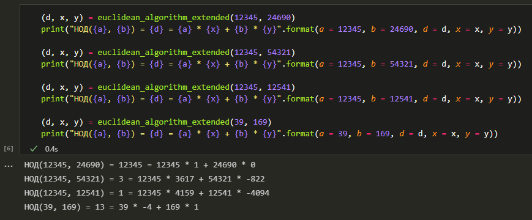

---
## Front matter
lang: ru-RU
title: Отчёт по лабораторной работе №4.  
    
subtitle: Вычисление наибольшего общего делителя
author:
  - Коне Сирики
institute:
  - Российский университет дружбы народов, Москва, Россия
  - Объединённый институт ядерных исследований, Дубна, Россия
date: 22 октября 2024

## i18n babel
babel-lang: russian
babel-otherlangs: english

## Formatting pdf
toc: false
toc-title: Содержание
slide_level: 2
aspectratio: 169
section-titles: true
theme: metropolis
header-includes:
 - \metroset{progressbar=frametitle,sectionpage=progressbar,numbering=fraction}
---

# Информация

## Докладчик

:::::::::::::: {.columns align=center}
::: {.column width="70%"}

  * Коне Сирики
  * Студент физмат
  * профессор кафедры прикладной информатики и теории вероятностей
  * Российский университет дружбы народов
  * [konesirisil@yandex.ru](mailto:sirikisil@yandex.ru)
  * <https://github.com/skone19>

:::
::: {.column width="30%"}


:::
::::::::::::::


## Цели и задачи работы

Целью данной лабораторной работы является ознакомление с двумя алгоритмами нахождения наибольшего общего делителя их расширениями для нахождения его линейного представления, а также их последующая программная реализация.

**Задачи**: Рассмотреть и реализовать на языке программирования Python:

1. Алгоритм Евклида;

2. Бинарный алгоритм Евклида;

3. Расширенный алгоритм Евклида;

4. Расширенный бинарный алгоритм Евклида.

# Теоретическое введение

## Общие понятия

 
      Пусть $x$ и $y$ -- целые числа. Говорят, что $x$ \textit{делит} $y$, если существует такое целое число $k$, что $y = kx$.
      
      Пусть $a, b \in \mathbb{Z}$. Целое число $d$ называется \textit{наибольшим общим делителем (НОД)} чисел $a$ и $b$, если:

     
      \item $d \; | \; a$ и $d \; | \; b$ (т.е. $d$ -- общий делитель $a$ и $b$);
      \item если $d'$ -- общий делитель $a$ и $b$, то $d' \; | \; d$.
     
Линейное представление НОД
      
      Наибольший общий делитель двух целых чисел $a, b$ существует и представляется в виде $d = a x + b y$ для некоторых целых $x, y$.


## Алгоритм Евклида (1 / 2)

Алгоритм Евклида для нахождения НОД($a, b$) при $a \ge b > 0$ основывается на следующем результате:


Если $a = bq + r$, то НОД($a, b$) = НОД($b, r$).


Строится последовательность чисел $a > b > r_1 > r_2 > \ldots > r_{n-1} > r_n \ge 0$, где $r_k$ -- остаток от деления двух предыдущих чисел, т.е. $r_{k-2} = r_{k-1} q_{k-1} + r_k$. Тогда НОД($a, b$) равен последнему ненулевому члену последовательности.

## Алгоритм Евклида (2 / 2)



## Бинарный алгоритм Евклида (1 / 2)

Бинарный алгоритм Евклида основан на следующих свойствах наибольшего общего делителя ($0 < b \le a$):

- если оба числа $a$ и $b$ чётные, то $\text{НОД}(a, b) = 2 \cdot \text{НОД}(\frac{a}{2}, \frac{b}{2})$;

- если число $a$ -- нечётное, число $b$ -- чётное, то $\text{НОД}(a, b) = \text{НОД}(a, \frac{b}{2})$;

- если оба числа $a$ и $b$ нечётные, то $\text{НОД}(a, b) = \text{НОД}(a - b, b)$;

- если $a = b$, то $\text{НОД}(a, b) = a$.

## Бинарный алгоритм Евклида (2 / 2)



## Расширенный алгоритм Евклида



## Расширенный бинарный алгоритм Евклида



# Ход выполнения и результаты

## Алгоритм Евклида. Реализация

```python
def is_even(a):
    return (True if a % 2 == 0 else False)
```

```python
def euclidean_algorithm(a, b):
    (a, b) = (abs(int(a)), abs(int(b)))
    if b > a:
        (a, b) = (b, a)
    r = [a, b] # шаг 1
    while r[1] != 0: # шаги 2-3
        (r[0], r[1]) = (r[1], r[0] % r[1])
    return r[0] # шаг 4
```

## Алгоритм Евклида. Результаты


## Бинарный алгоритм Евклида. Реализация

```python
def euclidean_algorithm_binary(a, b): <...>
    g = 1 # шаг 1
    while is_even(a) and is_even(b): # шаг 2
        (a, b, g) = (int(a / 2), int(b / 2), 2 * g)
    (u, v) = (a, b) # шаг 3
    while u != 0: # шаг 4
        while is_even(u):
            u = int(u / 2)
        while is_even(v):
            v = int(v / 2)
        if u >= v:
            u -= v
        else:
            v -= u
    return g * v # шаги 5-6
```

## Бинарный алгоритм Евклида. Результаты



## Расширенный алгоритм Евклида. Реализация

```python
def euclidean_algorithm_extended(a, b):
    (a, b) = (abs(int(a)), abs(int(b)))
    reversed = True if b > a else False
    (a, b) = (b, a) if reversed else (a, b)
    (r, x, y) = ([a, b], [1, 0], [0, 1]) # шаг 1
    while r[1] != 0: # шаги 2-3
        (r[0], r[1], q) = (r[1], r[0] % r[1], r[0] // r[1])
        if r[1] != 0: # если остаток ещё не нулевой..
            (x[0], x[1]) = (x[1], x[0] - q * x[1])
            (y[0], y[1]) = (y[1], y[0] - q * y[1])
    (d, x_r, y_r) = (r[0], x[1], y[1])
    if reversed:
        (x_r, y_r) = (y_r, x_r)
    return (d, x_r, y_r)
```

## Расширенный алгоритм Евклида. Результаты



## Расширенный бинарный алгоритм Евклида. Реализация

```python
def euclidean_algorithm_binary_extended(a, b):
    <...>
    g = 1 # шаг 1
    while is_even(a) and is_even(b): # шаг 2
        (a, b, g) = (int(a / 2), int(b / 2), 2 * g)
    (u, v, A, B, C, D) = (a, b, 1, 0, 0, 1) # шаг 3
    while u != 0: # шаг 4
        while is_even(u): # шаг 4.1
            u = int(u / 2) # шаг 4.1.1
            if is_even(A) and is_even(B): # шаг 4.1.2
                (A, B) = (int(A / 2), int(B / 2))
            else:
                (A, B) = (int((A + b) / 2), int((B - a) / 2))
```

## Расширенный бинарный алгоритм Евклида. Реализация

```python
        while is_even(v): # шаг 4.2
            v = int(v / 2) # шаг 4.2.1
            if is_even(C) and is_even(D): # шаг 4.2.2
                (C, D) = (int(C / 2), int(D / 2))
            else:
                (C, D) = (int((C + b) / 2), int((D - a) / 2))
        if u >= v: # шаг 4.3
            (u, A, B) = (u - v, A - C, B - D)
        else:
            (v, C, D) = (v - u, C - A, D - B)
    (d, x, y) = (g * v, C, D) # шаг 5
    if reversed:
        (x, y) = (y, x)
    return (d, x, y)
```

## Расширенный бинарный алгоритм Евклида. Результаты


## Заключение

Таким образом, была достигнута цель, поставленная в начале лабораторной работы: было проведено краткое знакомство с двумя алгоритмами нахождения наибольшего общего делителя -- алгоритмом Евклида, бинарным алгоритмом Евклида, -- и их расширенными версиями для нахождения линейного представления этого делителя, после чего все четыре алгоритма были успешно реализованы на языке программирования **Python**.

## {.standout}

Спасибо за внимание
