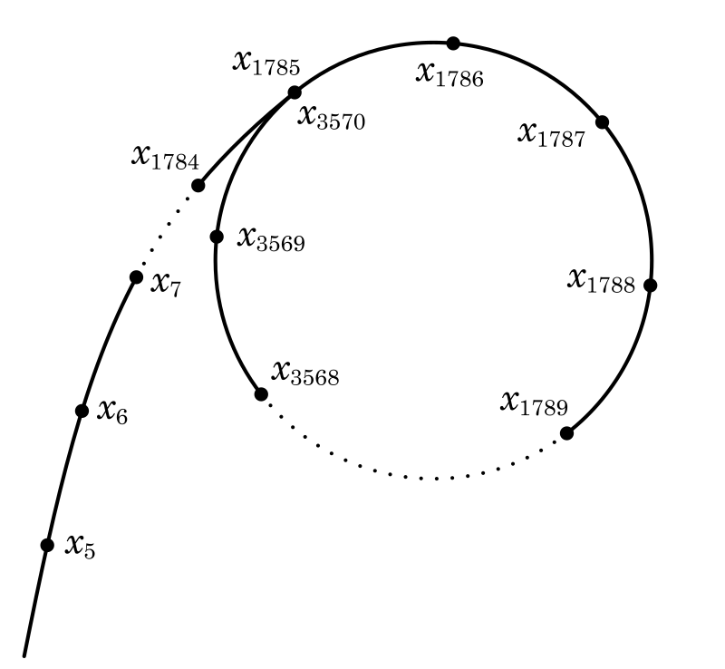
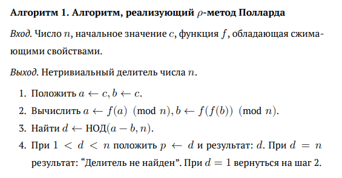
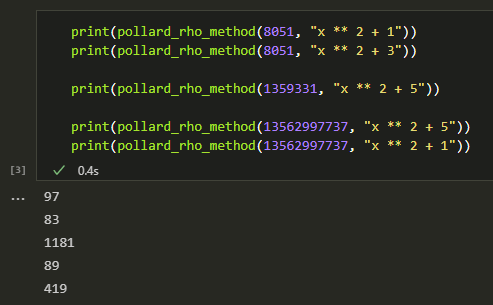

---
## Front matter
lang: ru-RU
title: Отчёт по лабораторной работе №6.  
    
subtitle: Разложение чисел на множители
author:
  - Коне Сирики
institute:
  - Российский университет дружбы народов, Москва, Россия
  - Объединённый институт ядерных исследований, Дубна, Россия
date: 10  декабря 2024

## i18n babel
babel-lang: russian
babel-otherlangs: english

## Formatting pdf
toc: false
toc-title: Содержание
slide_level: 2
aspectratio: 169
section-titles: true
theme: metropolis
header-includes:
 - \metroset{progressbar=frametitle,sectionpage=progressbar,numbering=fraction}
---

# Информация

## Докладчик

:::::::::::::: {.columns align=center}
::: {.column width="70%"}

  * Коне Сирики
  * Студент физмат
  * профессор кафедры прикладной информатики и теории вероятностей
  * Российский университет дружбы народов
  * [konesirisil@yandex.ru](mailto:sirikisil@yandex.ru)
  * <https://github.com/skone19>

:::
::: {.column width="30%"}


:::
::::::::::::::


## Цели и задачи работы

Целью данной лабораторной работы является краткое ознакомление с $\rho$-методом Полларда для нахождения нетривиального делителя целого числа, а также его последующая программная реализация.

**Задачи:** Рассмотреть и реализовать на языке программирования Python $\rho$-метод Полларда для нахождения нетривиального делителя целого числа.

# Теоретическое введение

## Факторизация чисел

Факторизацией целого числа называется его разложение в произведение простых сомножителей. Такое разложение, согласно основной теореме арифметики, всегда существует и является единственным (с точностью до порядка следования множителей).

Мы будем ограничиваться поиском разложения на два \textit{нетривиальных} множителя: $n = ab, 1 < a \le b < n$.

## $\rho$-метод Полларда (1 / 3)

Этот метод был разработан Джоном Поллардом в 1975 г. Пусть $n \in \mathbb{N}$ – число, которое следует разложить.

1 шаг:

:   Выбрать отображение $f: \mathbb{Z}_n \rightarrow \mathbb{Z}_n$. Обычно $f(x)$ -- многочлен степени большей или равной 2, например, $f(x) = x^2 + 1$.

2 шаг:

:   Случайно выбрать $x_0 \in \mathbb{Z}_n$ и вычислять члены рекуррентной последовательности $x_0, x_1, x_2, \ldots : x_i \equiv f(x_{i-1}) \pmod{n}$.

3 шаг:

:   Для некоторых номеров $j, k$ проверять условие $1 < \text{НОД}(x_j - x_k, n) < n$ до тех пор, пока не будет найден делитель числа $n$.

## $\rho$-метод Полларда (2 / 3)

{ #fig:000 width=60% }

## $\rho$-метод Полларда (3 / 3)

{width=100%}

# Ход выполнения и результаты

## Реализация (1 / 2)

```python
def euclidean_algorithm(a, b):
    """
    Находит НОД чисел a и b с помощью алгоритма Евклида
    """
    (a, b) = (abs(int(a)), abs(int(b)))
    if b > a:
        (a, b) = (b, a)
    r = [a, b]
    while r[1] != 0:
        (r[0], r[1]) = (r[1], r[0] % r[1])
    return r[0]
```

## Реализация (2 / 2)

```python
def pollard_rho_method(n, f, c = 1):
    a = c; b = c # шаг 1
    while True:
        x = a            #
        a = eval(f) % n  #
        x = b            #  шаг 2
        x = eval(f)      #
        b = eval(f) % n  #
        d = euclidean_algorithm(abs(a - b), n) # шаг 3
        if d > 1 and d < n:              #
            return d                     #
        if d == n:                       # шаг 4
            print("Делитель не найден")  #
            return 0                     #
```

## Результаты

{ #fig:002 width=80% }

## Заключение

Таким образом, была достигнута цель, поставленная в начале лабораторной работы: было проведено краткое знакомство с алгоритмом, реализующим $\rho$-метод Полларда для нахождения нетривиального делителя целого числа, после чего алгоритм был успешно реализован на языке программирования **Python**.

## {.standout}

Спасибо за внимание
