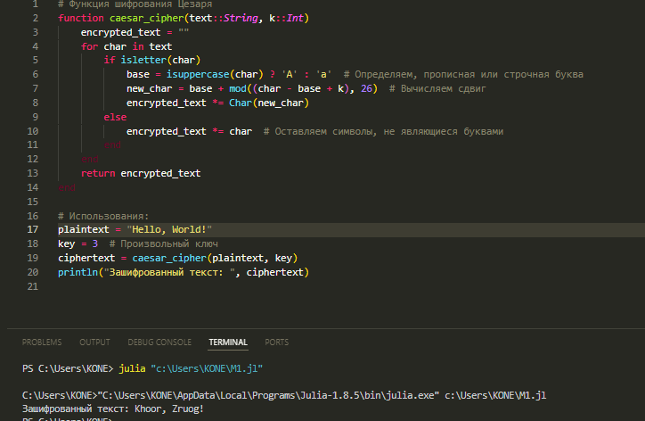
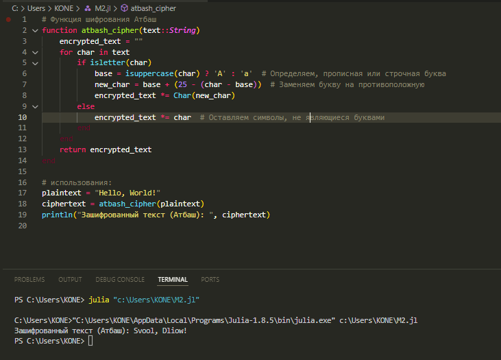

---
## Front matter
title: "Отчет по лабораторной работе №1"
subtitle: "Математические основы защиты информации и информационной безопасности"
author: "КОНЕ СИРИКИ"

## Generic otions
lang: ru-RU
toc-title: "Содержание"

## Bibliography
bibliography: bib/cite.bib
csl: pandoc/csl/gost-r-7-0-5-2008-numeric.csl

## Pdf output format
toc: true # Table of contents
toc-depth: 2
lof: true # List of figures
lot: true # List of tables
fontsize: 12pt
linestretch: 1.5
papersize: a4
documentclass: scrreprt
## I18n polyglossia
polyglossia-lang:
  name: russian
  options:
  - spelling=modern
  - babelshorthands=true
polyglossia-otherlangs:
  name: english
## I18n babel
babel-lang: russian
babel-otherlangs: english
## Fonts
mainfont: Times New Roman
romanfont: Times New Roman
sansfont: DejaVu Sans
monofont: DejaVu Sans Mono
mainfontoptions: Ligatures=TeX
romanfontoptions: Ligatures=TeX
sansfontoptions: Ligatures=TeX,Scale=MatchLowercase
monofontoptions: Scale=MatchLowercase,Scale=0.9
## Biblatex
biblatex: true
biblio-style: "gost-numeric"
biblatexoptions:
  - parentracker=true
  - backend=biber
  - hyperref=auto
  - language=auto
  - autolang=other*
  - citestyle=gost-numeric
## Pandoc-crossref LaTeX customization
figureTitle: "Рис."
tableTitle: "Таблица"
listingTitle: "Листинг"
lofTitle: "Список иллюстраций"
lotTitle: "Список таблиц"
lolTitle: "Листинги"
## Misc options
indent: true
header-includes:
  - \usepackage{indentfirst}
  - \usepackage{float} # keep figures where there are in the text
  - \floatplacement{figure}{H} # keep figures where there are in the text
---

# Цель работы

- Приобретение практических навыков работы в консоли с расширенными атрибутами файлов.

# Задание

- Познакомиться с щифры простой замены.


# 1.1	Реализовать шифр Цезаря спроизвольным ключом k.
```
 2	# Функция шифрования Цезаря
3	function caesar_cipher(text::String, k::Int)
4	    encrypted_text = ""
5	    for char in text
6	        if isletter(char)
7	            base = isuppercase(char) ? 'A' : 'a'  # Определяем, прописная или строчная буква
8	            new_char = base + mod((char - base + k), 26)  # Вычисляем сдвиг
9	            encrypted_text *= Char(new_char)
10	        else
11	            encrypted_text *= char  # Оставляем символы, не являющиеся буквами
12	        end
13	    end
14	    return encrypted_text
15	end
16	
17	# Использования:
18	plaintext = "Hello, World!"
19	key = 3  # Произвольный ключ
20	ciphertext = caesar_cipher(plaintext, key)
21	println("Зашифрованный текст: ", ciphertext)
```

# 1.2	 Реализовать шифр Атбаш
```
# Функция шифрования Атбаш
function atbash_cipher(text::String)
    encrypted_text = ""
    for char in text
        if isletter(char)
            base = isuppercase(char) ? 'A' : 'a'  # Определяем, прописная или строчная буква
            new_char = base + (25 - (char - base))  # Заменяем букву на противоположную
            encrypted_text *= Char(new_char)
        else
            encrypted_text *= char  # Оставляем символы, не являющиеся буквами
        end
    end
    return encrypted_text
end

# использования:
plaintext = "Hello, World!"
ciphertext = atbash_cipher(plaintext)
println("Зашифрованный текст (Атбаш): ", ciphertext)
```
# 1.3	Результат выполнения шифр Цезаря спроизвольным ключом k

{#fig:001 width=70%}

# 1.4	Результат выполнения шифр Атбаш

{#fig:002 width=70%}


# Выводы
В результате лабораторной работы я повысил навыки использования с щифры простой замены на языке програмированием Julia.
