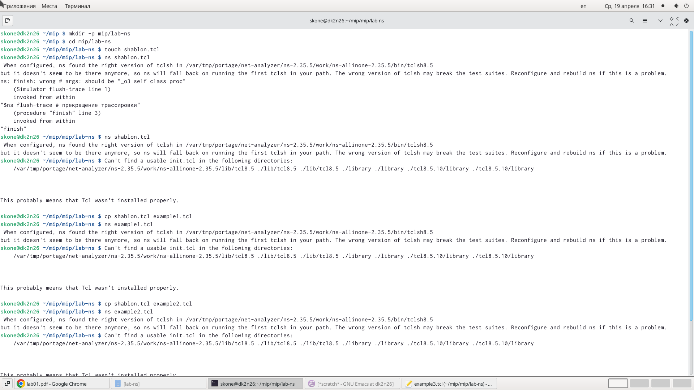
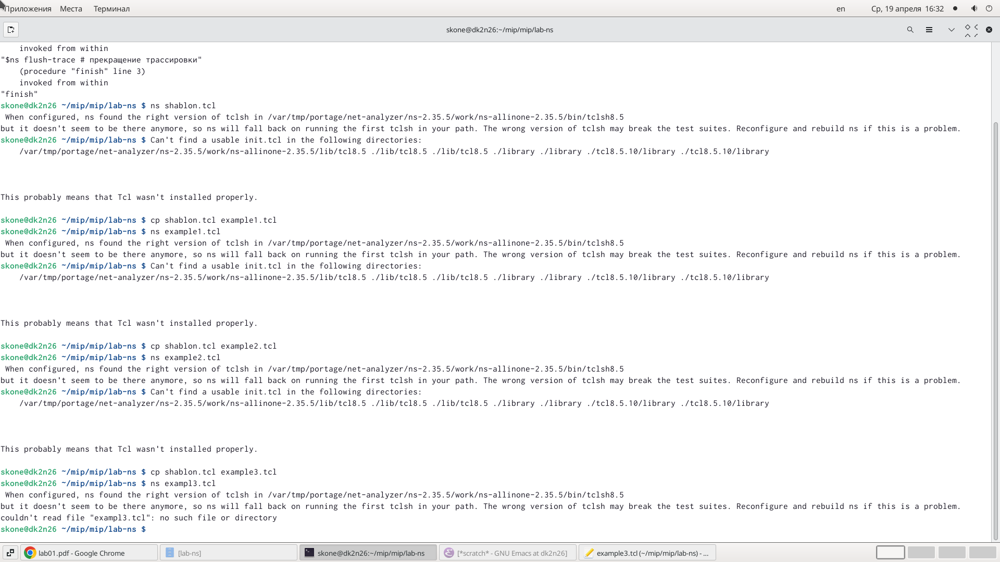
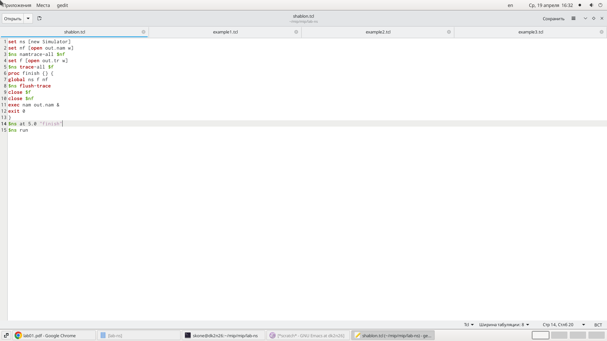
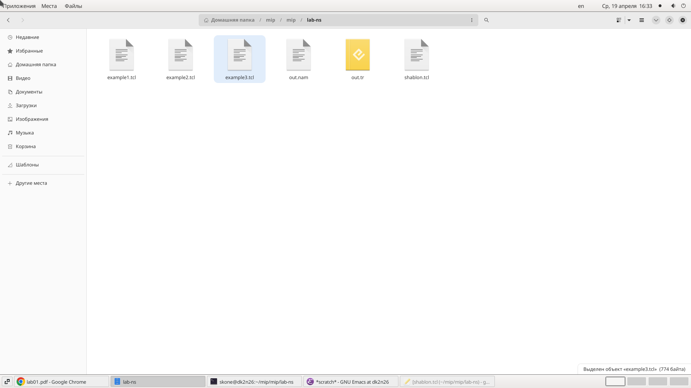
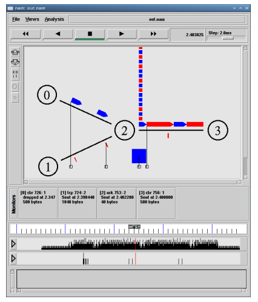
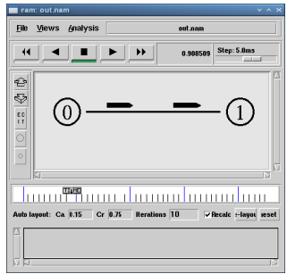
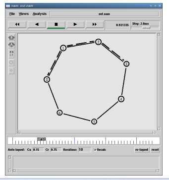
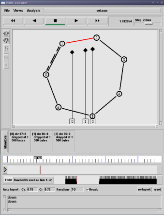
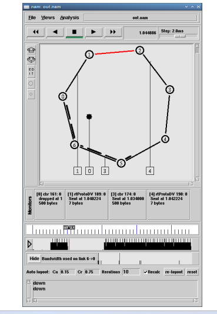
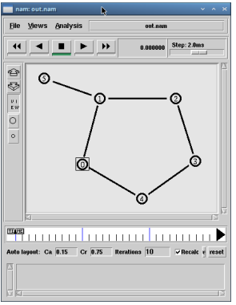

---
## Front matter
title: "Лабораторной работе №1."
subtitle: "Простые модели компьютерной сети"
author: "Коне Сирики. НФИбд-01-20"

## Generic otions
lang: ru-RU
toc-title: "Содержание"

## Bibliography
bibliography: bib/cite.bib
csl: pandoc/csl/gost-r-7-0-5-2008-numeric.csl

## Pdf output format
toc: true # Table of contents
toc-depth: 2
lof: true # List of figures
lot: true # List of tables
fontsize: 12pt
linestretch: 1.5
papersize: a4
documentclass: scrreprt
## I18n polyglossia
polyglossia-lang:
  name: russian
  options:
	- spelling=modern
	- babelshorthands=true
polyglossia-otherlangs:
  name: english
## I18n babel
babel-lang: russian
babel-otherlangs: english
## Fonts
mainfont: PT Serif
romanfont: PT Serif
sansfont: PT Sans
monofont: PT Mono
mainfontoptions: Ligatures=TeX
romanfontoptions: Ligatures=TeX
sansfontoptions: Ligatures=TeX,Scale=MatchLowercase
monofontoptions: Scale=MatchLowercase,Scale=0.9
## Biblatex
biblatex: true
biblio-style: "gost-numeric"
biblatexoptions:
  - parentracker=true
  - backend=biber
  - hyperref=auto
  - language=auto
  - autolang=other*
  - citestyle=gost-numeric
## Pandoc-crossref LaTeX customization
figureTitle: "Рис."
tableTitle: "Таблица"
listingTitle: "Листинг"
lofTitle: "Список иллюстраций"
lotTitle: "Список таблиц"
lolTitle: "Листинги"
## Misc options
indent: true
header-includes:
  - \usepackage{indentfirst}
  - \usepackage{float} # keep figures where there are in the text
  - \floatplacement{figure}{H} # keep figures where there are in the text
---

# Цель работы

Приобретение навыков моделирования сетей передачи данных с помощью средства имитационного моделирования NS-2, а также анализ полученных результатов
моделирования.

# Задание

1.	В своём рабочем каталоге создайте директорию mip, к которой будут выполняться лабораторные работы. Внутри mip создайте директорию lab-ns, а в ней файл

{ #fig:001 width=80% height=80% }

2.	Откройте на редактирование файл shablon.tcl. Можно использовать любой
текстовый редактор типа emacs.
Сначала создадим объект типа Simulator:

{ #fig:002 width=80% height=80% }

3.	Затем создадим переменную nf и укажем, что требуется открыть на запись nam-файл
для регистрации выходных результатов моделирования:

{ #fig:003 width=80% height=80% }

4. Вторая строка даёт команду симулятору записывать все данные о динамике модели
в файл out.nam.
Далее создадим переменную f и откроем на запись файл трассировки для регистрации всех событий модели:

{ #fig:004 width=80% height=80% }

5. После этого добавим процедуру finish, которая закрывает файлы трассировки
и запускает nam:

6. Наконец, с помощью команды at указываем планировщику событий, что процедуру finish следует запустить через 5 с после начала моделирования, после чего
запустить симулятор ns:

7. Сохранив изменения в отредактированном файле shablon.tcl и закрыв его,
можно запустить симулятор командой:

8. Постановка задачи. Требуется смоделировать сеть передачи данных, состоящую
из двух узлов, соединённых дуплексной линией связи с полосой пропускания 2
Мб/с и задержкой 10 мс, очередью с обслуживанием типа DropTail. От одного узла
к другому по протоколу UDP осуществляется передача пакетов, размером 500 байт,
с постоянной скоростью 200 пакетов в секунду.

{ #fig:001 width=80% height=80% }

9. Создаётся агент UDP и присоединяется к узлу n0. В узле агент сам не может
генерировать трафик, он лишь реализует протоколы и алгоритмы транспортного
уровня. Поэтому к агенту присоединяется приложение. В данном случае — это
источник с постоянной скоростью (Constant Bit Rate, CBR), который каждые 5 мс
посылает пакет R = 500 байт. 

{ #fig:009 width=80% height=80% }

10. получим в качестве результата запуск аниматора nam в фоновом режиме (рис. 1.1).
При нажатии на кнопку play в окне nam через 0.5 секунды из узла 0 данные начнут
поступать к узлу 1. Это процесс можно замедлить, выбирая шаг отображения в nam.
Можно осуществлять наблюдение за отдельным пакетом, щёлкнув по нему в окне
nam, а щёлкнув по соединению, можно получить о нем некоторую информацию.

{ #fig:010 width=80% height=80% }

11. – сеть состоит из 4 узлов (n0, n1, n2, n3);
Королькова А. В., Кулябов Д. С. Моделирование информационных процессов 31
– между узлами n0 и n2, n1 и n2 установлено дуплексное соединение с пропускной
способностью 2 Мбит/с и задержкой 10 мс;
– между узлами n2 и n3 установлено дуплексное соединение с пропускной способностью 1,7 Мбит/с и задержкой 20 мс;
– каждый узел использует очередь с дисциплиной DropTail для накопления пакетов,
максимальный размер которой составляет 10;
– TCP-источник на узле n0 подключается к TCP-приёмнику на узле n3
(по-умолчанию, максимальный размер пакета, который TCP-агент может генерировать, равняется 1KByte)
– TCP-приёмник генерирует и отправляет ACK пакеты отправителю и откидывает
полученные пакеты;
– UDP-агент, который подсоединён к узлу n1, подключён к null-агенту на узле n3
(null-агент просто откидывает пакеты);
– генераторы трафика ftp и cbr прикреплены к TCP и UDP агентам соответственно;
– генератор cbr генерирует пакеты размером 1 Кбайт со скоростью 1 Мбит/с;
– работа cbr начинается в 0,1 секунду и прекращается в 4,5 секунды, а ftp начинает
работать в 1,0 секунду и прекращает в 4,0 секунды.

{ #fig:011 width=80% height=80% }

12. Требуется построить модель передачи данных по сети с кольцевой топологией и динамической маршрутизацией пакетов:
– сеть состоит из 7 узлов, соединённых в кольцо;
– данные передаются от узла n(0) к узлу n(3) по кратчайшему пути;
– с 1 по 2 секунду модельного времени происходит разрыв соединения между
узлами n(1) и n(2);
34 Лабораторная работа 1. Простые модели компьютерной сети
– при разр

{ #fig:012 width=80% height=80% }

{ #fig:013 width=80% height=80% }

{ #fig:014 width=80% height=80% }

{ #fig:015 width=80% height=80% }

# Выводы

В ходе выполнения лабораторной работы была изучена простые модели компьютерной сети и Приобретение навыков моделирования сетей передачи данных с помощью средства имитационного моделирования NS-2, а также анализ полученных результатов
моделирования.

# Список литературы {.unnumbered}

1. [Простые модели компьютерной сети](https://asp24.ru/novichkam/osnovy-kompyuternyh-setey.-tema-1.-osnovnye-setevye-terminy-i-setevye-modeli/)
2. [Биология математическая](http://www.library.biophys.msu.ru/MathMod/BM.HTML)