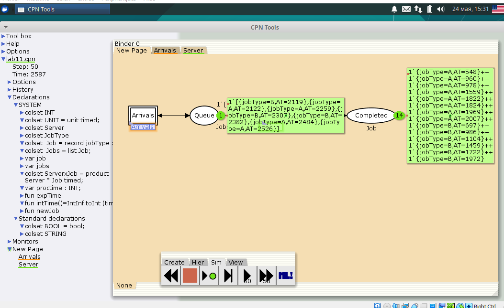

---
## Front matter
lang: ru-RU
title: Лабораторной работе №11.
subtitle: "Модель системы массового обслуживания $M|M|1$"
author:
  - Коне Сирики.
institute:
  - Российский университет дружбы народов, Москва, Россия
date: 27 Мая , 2023, Москва, Россия

## i18n babel
babel-lang: russian
babel-otherlangs: english

## Formatting pdf
toc: false
toc-title: Содержание
slide_level: 2
aspectratio: 169
section-titles: true
theme: metropolis
header-includes:
 - \metroset{progressbar=frametitle,sectionpage=progressbar,numbering=fraction}
 - '\makeatletter'
 - '\beamer@ignorenonframefalse'
 - '\makeatother'
---

# Информация

## Докладчик

:::::::::::::: {.columns align=center}
::: {.column width="70%"}

  * Коне Сирики
  * Студент физмат 
  * Российский университет дружбы народов
  * [konesirisil@yandex.ru](mailto:sirikisil@yandex.ru)
  * <https://github.com/skone19>

:::
::: {.column width="30%"}

:::
::::::::::::::

# Цель и задачи лабораторной работы

## Цель работы

Постройть Модель системы массового обслуживания $M|M|1$ с помощью CPNTools и провести  мониторинг параметров данной систем.

## Задачи лабораторной работы

В систему поступает поток заявок двух типов, распределённый по пуассоновскому
закону. Заявки поступают в очередь сервера на обработку. Дисциплина очереди -
FIFO. Если сервер находится в режиме ожидания (нет заявок на сервере), то заявка поступает на обработку сервером.

## Процесс выпольнение задачи

### Общий вид модели

(рис. @fig:001).

{#fig:001 width=70%}

 
## Процесс выпольнение задачи

### Общий вид модели

(рис. @fig:002).

{#fig:001 width=70%}

## Процесс выпольнение задачи

### Модель поступления и очереди

(рис. @fig:003).

{#fig:002 width=70%}

## Процесс выпольнение задачи

### Модель сервера

(рис. @fig:004).

{#fig:003 width=70%}

## Процесс выпольнение задачи

## Общий вид модели

(рис. @fig:005).

{#fig:004 width=70%}

## Процесс выпольнение задачи

### Модель поступления и очереди сервера

(рис. @fig:006).

{#fig:005 width=70%}

## Процесс выпольнение задачи

###  Модель сервера

(рис. @fig:007).

{#fig:007 width=70%}

## Процесс выпольнение задачи

###  Графика изменение в очередь

(рис. @fig:008).

{#fig:008 width=70%}

# Выводы

Постройли Модель системы массового обслуживания $M|M|1$ с помощью CPNTools и провели  мониторинг параметров данной систем..
:::
