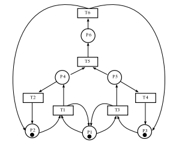
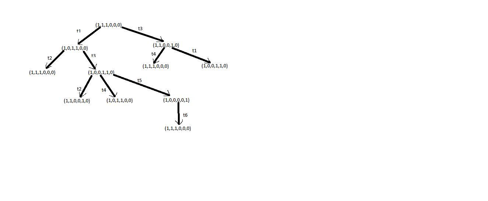
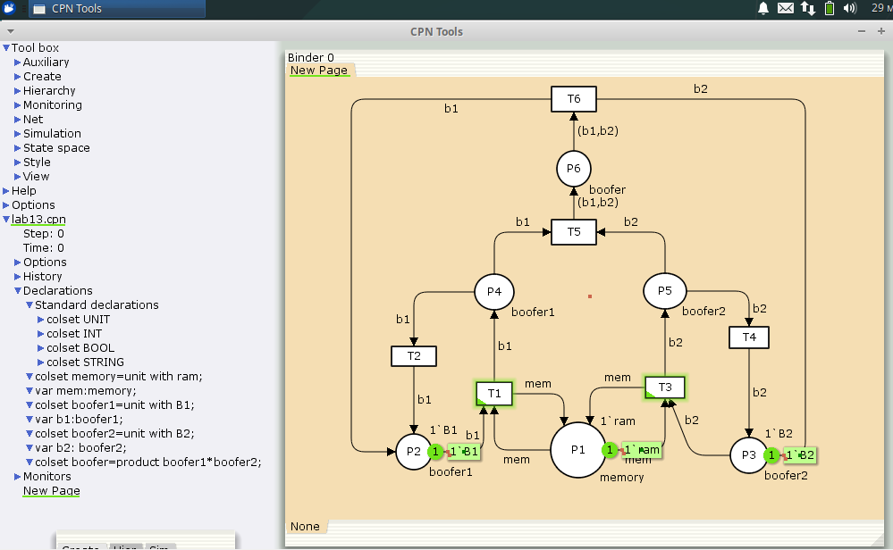
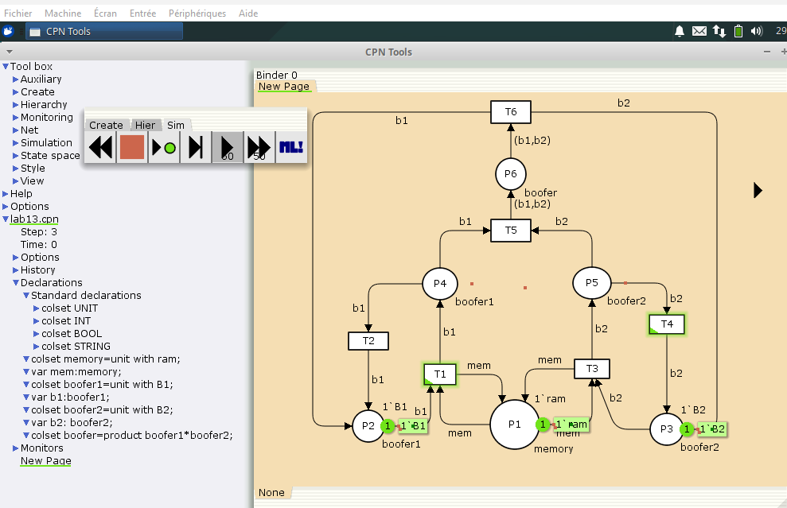
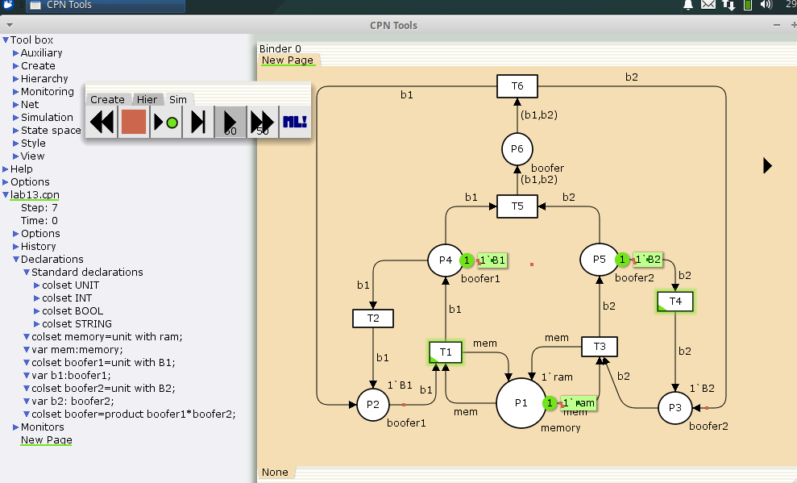
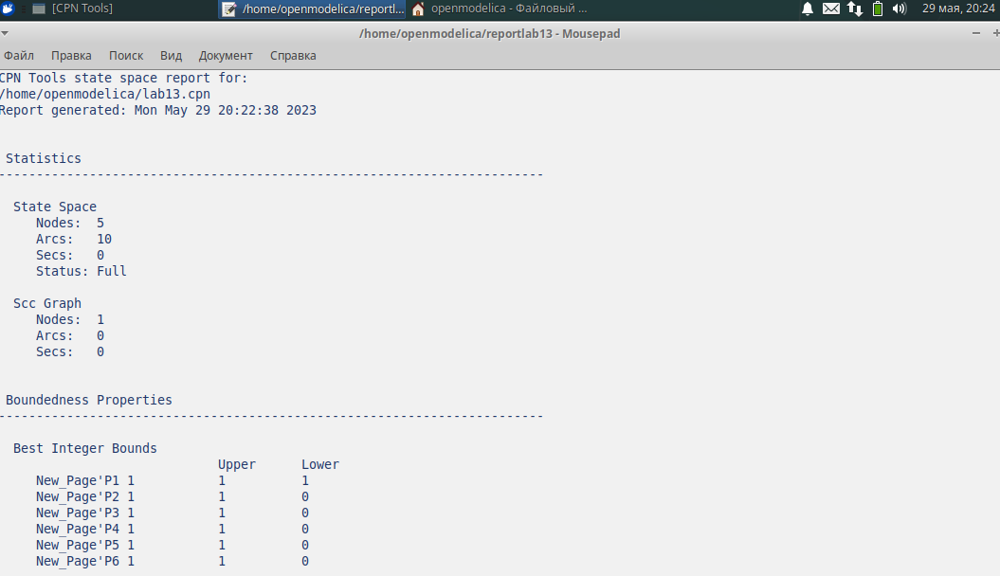
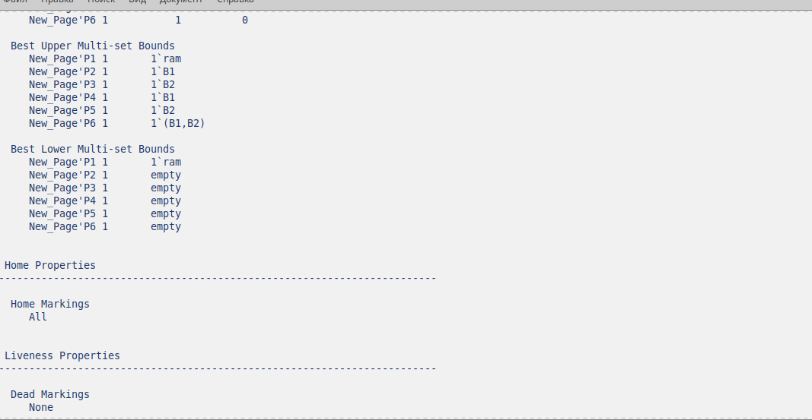
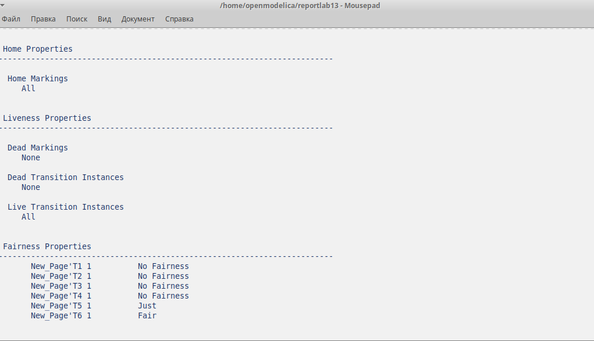
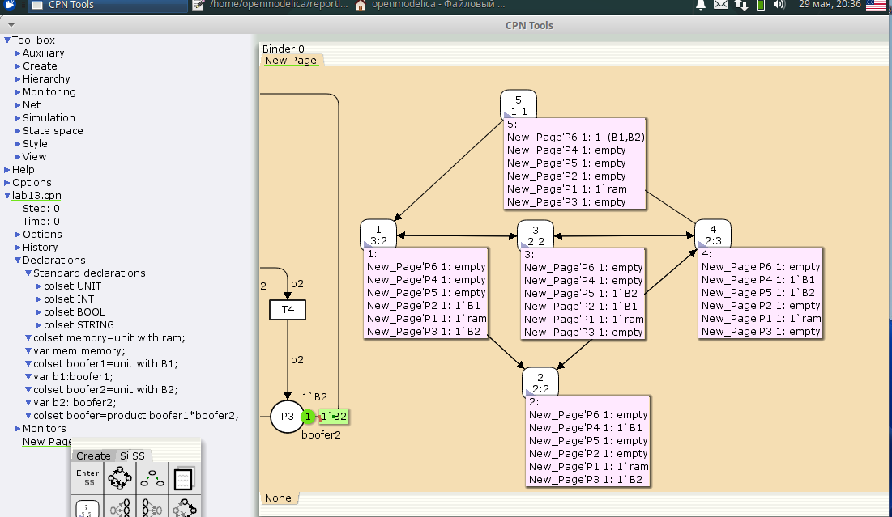
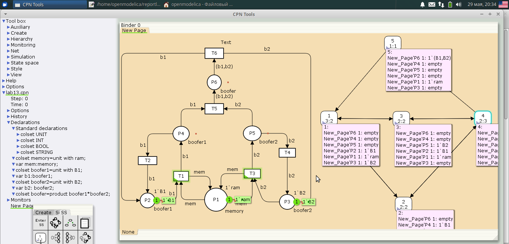

---
## Front matter
lang: ru-RU
title: Лабораторной работе №13.
subtitle: "Задание для самостоятельного выполнения"
author:
  - Коне Сирики.
institute:
  - Российский университет дружбы народов, Москва, Россия
date: 03 Инюня , 2023, Москва, Россия

## i18n babel
babel-lang: russian
babel-otherlangs: english

## Formatting pdf
toc: false
toc-title: Содержание
slide_level: 2
aspectratio: 169
section-titles: true
theme: metropolis
header-includes:
 - \metroset{progressbar=frametitle,sectionpage=progressbar,numbering=fraction}
 - '\makeatletter'
 - '\beamer@ignorenonframefalse'
 - '\makeatother'
---

# Информация

## Докладчик

:::::::::::::: {.columns align=center}
::: {.column width="70%"}

  * Коне Сирики
  * Студент физмат 
  * Российский университет дружбы народов
  * [konesirisil@yandex.ru](mailto:sirikisil@yandex.ru)
  * <https://github.com/skone19>

:::
::: {.column width="30%"}

:::
::::::::::::::

# Цель и задачи лабораторной работы

## Цель работы

Изучить и проанализировать представленую модель, реализовать её, проанализировать пространство состояний.

## Задачи лабораторной работы

1. Используя теоретические методы анализа сетей Петри, проведите анализ сети,
изображённой на рис. 13.2 (с помощью построения дерева достижимости). Определите, является ли сеть безопасной, ограниченной, сохраняющей, имеются ли
тупики.
2. Промоделируйте сеть Петри  с помощью CPNTools.
3. Вычислите пространство состояний. Сформируйте отчёт о пространстве состояний и проанализируйте его. Постройте граф пространства состояний.

## Процесс выпольнение задачи

### Данная модель следующий вид

(рис. @fig:001).

{#fig:001 width=50%}

## Процесс выпольнение задачи

### Постпроили дерево достижимости

(рис. @fig:002).

{#fig:002 width=70%}

## Процесс выпольнение задачи

###  Постпроили  Модель в cpntools

(рис. @fig:003).

{#fig:003 width=50%}

## Процесс выпольнение задачи

### Запустил симуляцию

(рис. @fig:004).

{#fig:004 width=50%}

## Процесс выпольнение задачи

### Запустил симуляцию

(рис. @fig:005).

{#fig:005 width=50%}

### Процесс выпольнение задачи

## Составил отчёт о пространсве состояний

(рис. @fig:006).

{#fig:006 width=70%}

## Процесс выпольнение задачи

### Запустил симуляцию

(рис. @fig:007).

{#fig:007 width=70%}

## Процесс выпольнение задачи

### Запустил симуляцию

(рис. @fig:008.)

{#fig:008 width=70%}

## Процесс выпольнение задачи

### Далее построили граф пространства состояний

(рис. @fig:009).

{#fig:009 width=70%}

## Процесс выпольнение задачи

### Запустил симуляцию

(рис. @fig:010).

{#fig:010 width=70%}

# Выводы

 Построили и проанализировали представленую сеть Петри , реализовали её,  пространство состояний.

:::
