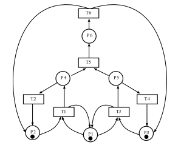
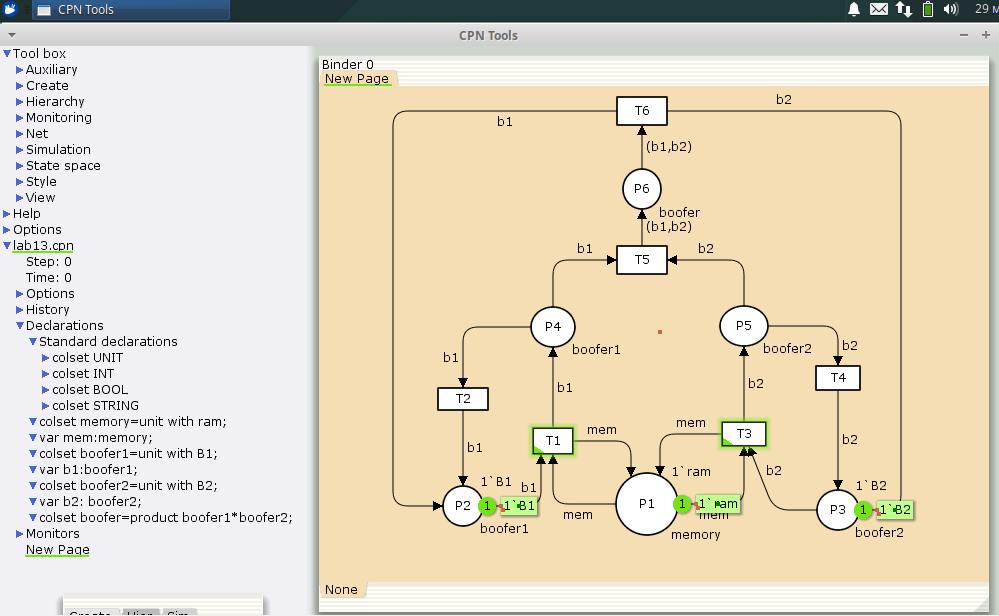
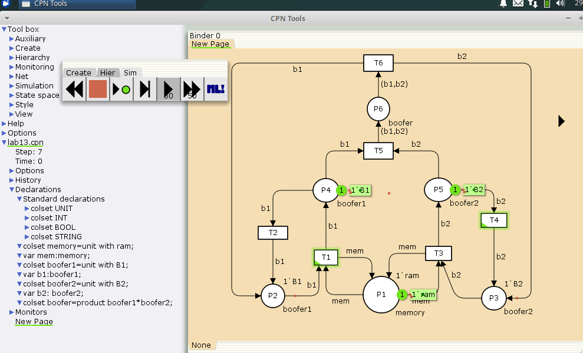
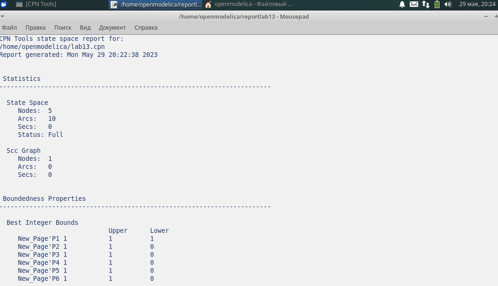
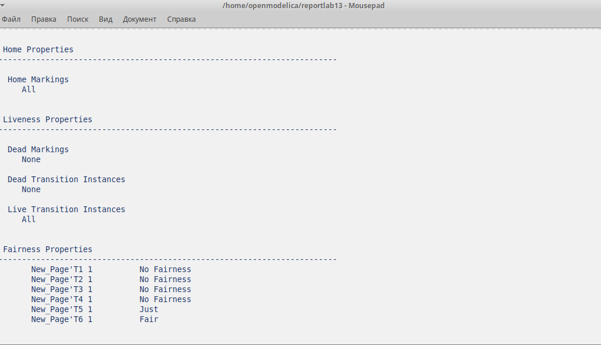

---
## Front matter
title: "Лабораторной работе №13."
subtitle: "Задание для самостоятельного выполнения"
author: "Коне Сирики. НФИбд-01-20"

## Generic otions
lang: ru-RU
toc-title: "Содержание"

## Bibliography
bibliography: bib/cite.bib
csl: pandoc/csl/gost-r-7-0-5-2008-numeric.csl

## Pdf output format
toc: true # Table of contents
toc-depth: 2
lof: true # List of figures
lot: true # List of tables
fontsize: 12pt
linestretch: 1.5
papersize: a4
documentclass: scrreprt
## I18n polyglossia
polyglossia-lang:
  name: russian
  options:
	- spelling=modern
	- babelshorthands=true
polyglossia-otherlangs:
  name: english
## I18n babel
babel-lang: russian
babel-otherlangs: english
## Fonts
mainfont: PT Serif
romanfont: PT Serif
sansfont: PT Sans
monofont: PT Mono
mainfontoptions: Ligatures=TeX
romanfontoptions: Ligatures=TeX
sansfontoptions: Ligatures=TeX,Scale=MatchLowercase
monofontoptions: Scale=MatchLowercase,Scale=0.9
## Biblatex
biblatex: true
biblio-style: "gost-numeric"
biblatexoptions:
  - parentracker=true
  - backend=biber
  - hyperref=auto
  - language=auto
  - autolang=other*
  - citestyle=gost-numeric
## Pandoc-crossref LaTeX customization
figureTitle: "Рис."
tableTitle: "Таблица"
listingTitle: "Листинг"
lofTitle: "Список иллюстраций"
lotTitle: "Список таблиц"
lolTitle: "Листинги"
## Misc options
indent: true
header-includes:
  - \usepackage{indentfirst}
  - \usepackage{float} # keep figures where there are in the text
  - \floatplacement{figure}{H} # keep figures where there are in the text
---

# Цель и задачи лабораторной работы

## Цель работы

Изучить и проанализировать представленую модель, реализовать её, проанализировать пространство состояний.

## Задачи лабораторной работы

1. Используя теоретические методы анализа сетей Петри, проведите анализ сети,
изображённой на рис. 13.2 (с помощью построения дерева достижимости). Определите, является ли сеть безопасной, ограниченной, сохраняющей, имеются ли
тупики.
2. Промоделируйте сеть Петри (см. рис. 13.2) с помощью CPNTools.
3. Вычислите пространство состояний. Сформируйте отчёт о пространстве состояний и проанализируйте его. Постройте граф пространства состояний.

## Процесс выпольнение задачи

### Данная модель следующий вид

(рис. @fig:001).

{#fig:001 width=70%}

### Постпроил дерево достижимости

(рис. @fig:002).

{#fig:002 width=70%}

###  Постпроил  Модель в cpntools

(рис. @fig:003).

{#fig:003 width=70%}

## Запустил симуляцию

(рис. @fig:004).

{#fig:004 width=70%}

(рис. @fig:005).

{#fig:005 width=70%}

## Составил отчёт о пространсве состояний

(рис. @fig:006).

{#fig:006 width=70%}

(рис. @fig:007).

{#fig:007 width=70%}

(рис. @fig:008.)

{#fig:008 width=70%}

## Далее построили граф пространства состояний

(рис. @fig:009).

{#fig:009 width=70%}

(рис. @fig:010).

{#fig:010 width=70%}

# Выводы

  Построили и проанализировали представленую сеть Петри , реализовали её,  пространство состояний.

:::
