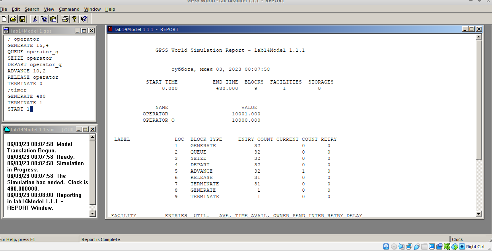
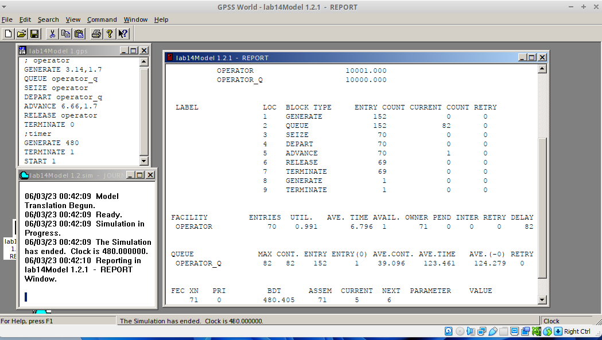
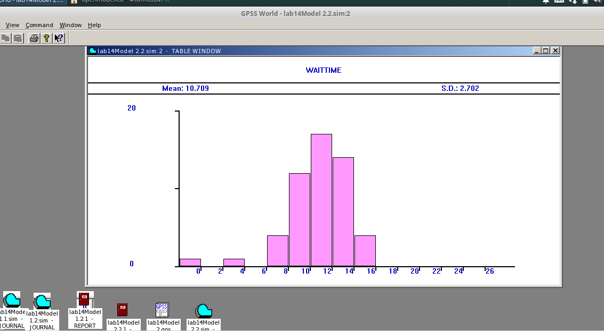
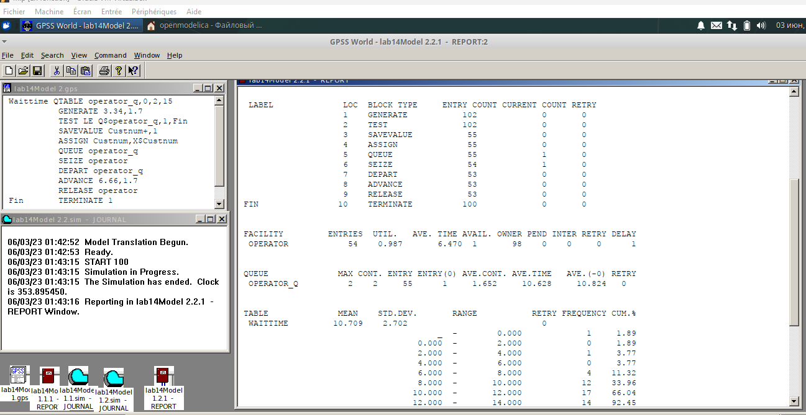
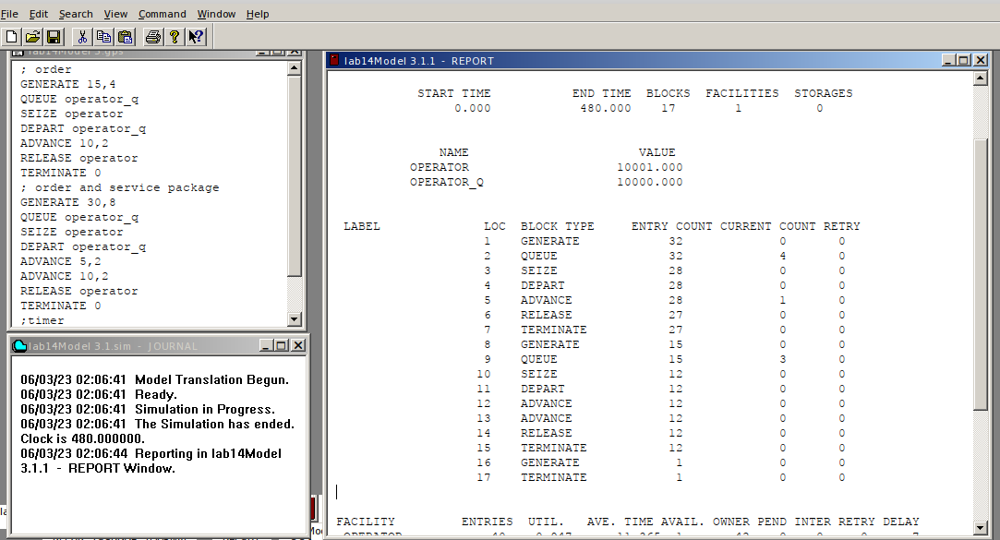
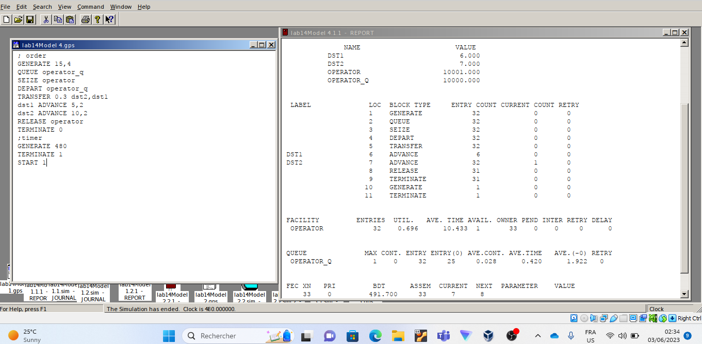
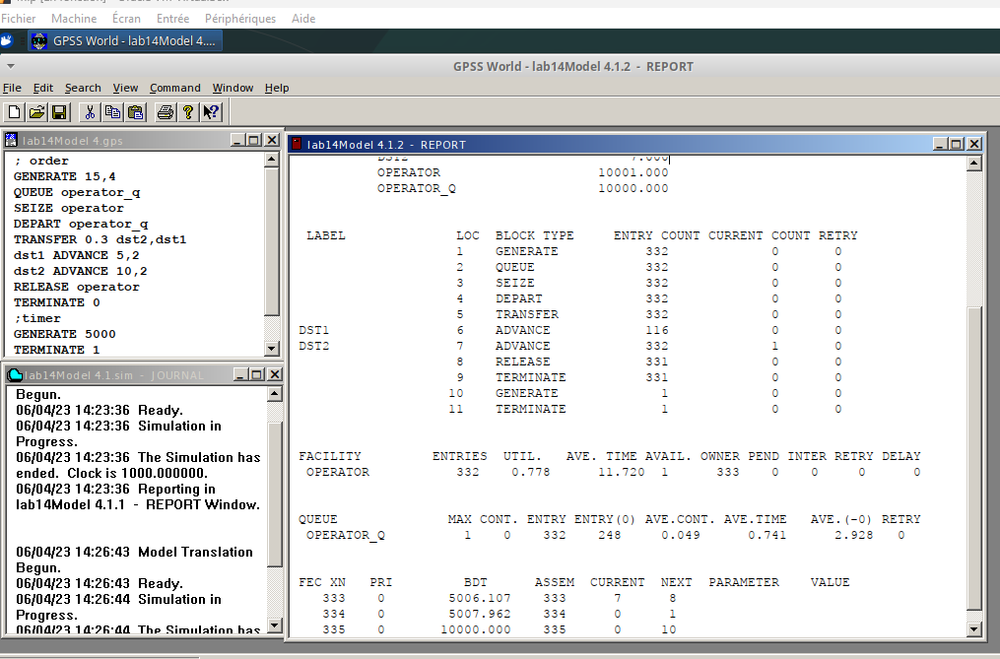
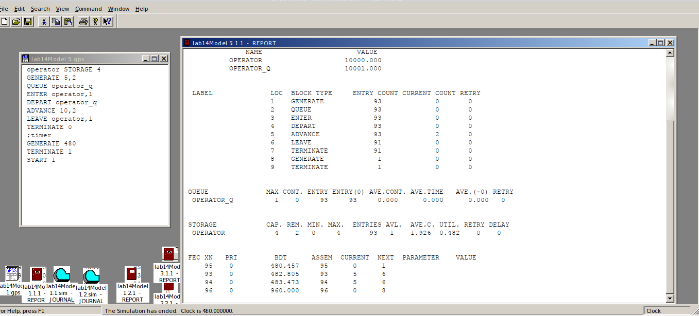
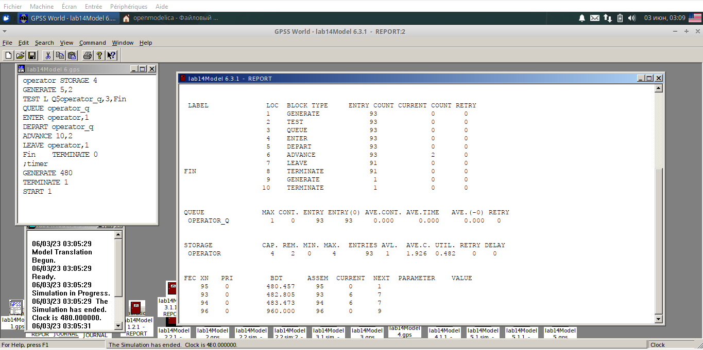
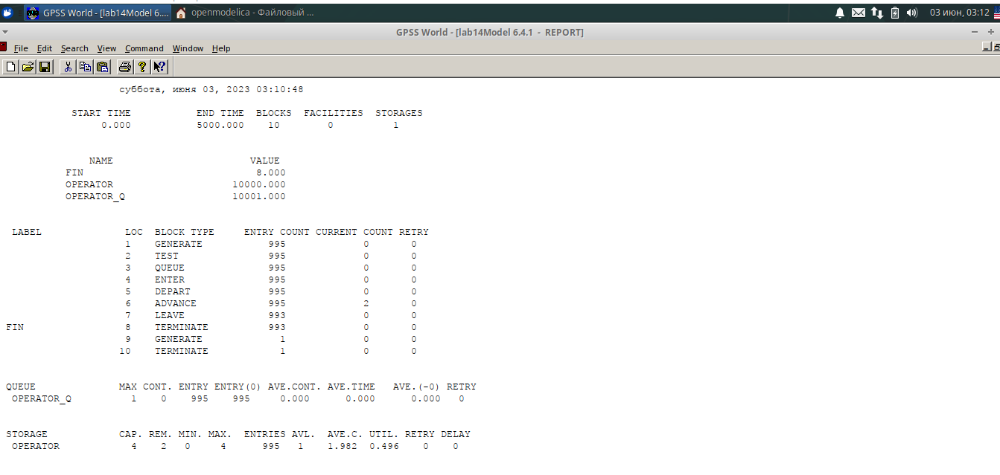

---
## Front matter
lang: ru-RU
title: Лабораторной работе №14.
subtitle: "Модели обработки заказов"
author:
  - Коне Сирики.
institute:
  - Российский университет дружбы народов, Москва, Россия
date: 10 Инюня , 2023, Москва, Россия

## i18n babel
babel-lang: russian
babel-otherlangs: english

## Formatting pdf
toc: false
toc-title: Содержание
slide_level: 2
aspectratio: 169
section-titles: true
theme: metropolis
header-includes:
 - \metroset{progressbar=frametitle,sectionpage=progressbar,numbering=fraction}
 - '\makeatletter'
 - '\beamer@ignorenonframefalse'
 - '\makeatother'
---

# Информация

## Докладчик

:::::::::::::: {.columns align=center}
::: {.column width="70%"}

  * Коне Сирики
  * Студент физмат 
  * Российский университет дружбы народов
  * [konesirisil@yandex.ru](mailto:sirikisil@yandex.ru)
  * <https://github.com/skone19>

:::
::: {.column width="30%"}

:::
::::::::::::::

# Цель и задачи лабораторной работы

## Цель работы

Построить и проанализировать модели обработки заказов в GPSS.

## Задачи лабораторной работы

1. Скорректируйте модель в соответствии с изменениями входных
данных: интервалы поступления заказов распределены равномерно с интервалом
3.14 ± 1.7 мин; время оформления заказа также распределено равномерно на интервале 6.66 ± 1.7 мин. Проанализируйте отчёт, сравнив результаты с результатами предыдущего моделирования.
2. Проанализируйте отчёт и гистограмму по результатам моделировани
3. Скорректируйте модель так, чтобы учитывалось условие, что число
заказов с дополнительным пакетом услуг составляет 30% от общего числа заказов.Используйте оператор TRANSFER. Проанализируйте отчёт.
4. 1. Проанализируйте полученный отчёт.
   2. Измените модель: требуется учесть в ней возможные отказы клиентов от заказа
— когда при подаче заявки на заказ клиент видит в очереди более двух других
заявок, он отказывается от подачи заявки, то есть отказывается от обслуживания
(используйте блок TEST и стандартный числовой атрибут Qj текущей длины
очереди j).
   3. Проанализируйте отчёт изменённой модели.

## Процесс выпольнение задачи

###  Постпроил  модель и запустил симуляцию

(рис. @fig:001).

{#fig:001 width=70%}

## Процесс выпольнение задачи

### Изменил распределения интервалов получения заказов и времени обработки, запустил симуляцию

(рис. @fig:002).

{#fig:002 width=70%}

## Процесс выпольнение задачи

###  Постпроил  гистограмму

(рис. @fig:003).

{#fig:003 width=70%}

## Процесс выпольнение задачи

### Отчёт

(рис. @fig:004).

{#fig:004 width=70%}

## Процесс выпольнение задачи

###  Постпроил модель обслуживания двух типов заказов

(рис. @fig:005).

{#fig:005 width=70%}

### Внес изменения , что заявок с доп. услугами теперь 30%

(рис. @fig:006).

{#fig:006 width=70%}

## Процесс выпольнение задачи

### Увеличил время , тепер из 332 заявок 116 с доп. услугами что ближе к 30%.

(рис. @fig:007).

{#fig:007 width=70%}

## Процесс выпольнение задачи

### Построил модель обработки несколькими операторами

(рис. @fig:008.)

{#fig:008 width=70%}

## Процесс выпольнение задачи

### Изменил модель, чтобы новые заявки не попадали в очередь если в ней больше 2 заявок

(рис. @fig:009).

{#fig:009 width=70%}

## Процесс выпольнение задачи

### Чтобы увидеть отсечение заявок 

(рис. @fig:010).

{#fig:010 width=70%}

# Выводы

  Построить и проанализировать модели обработки заказов в GPSS.

:::
