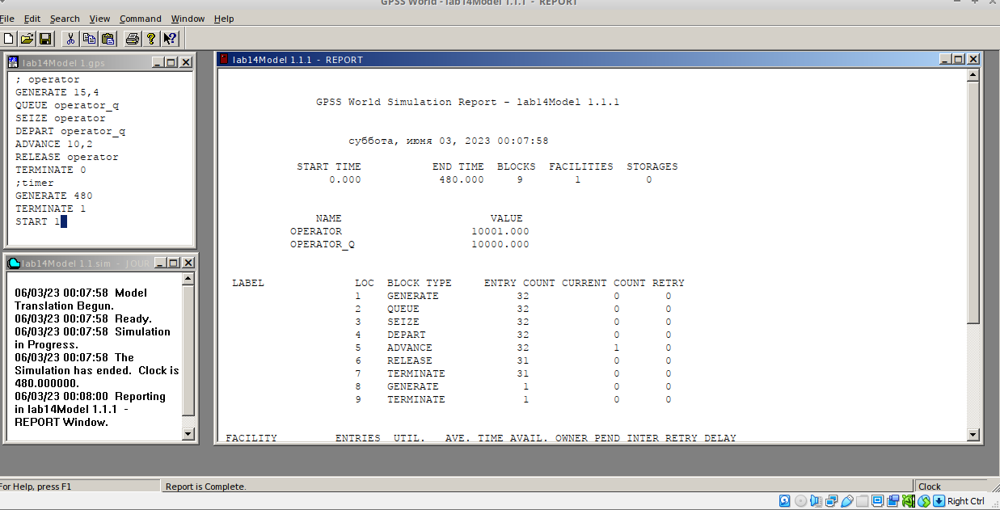
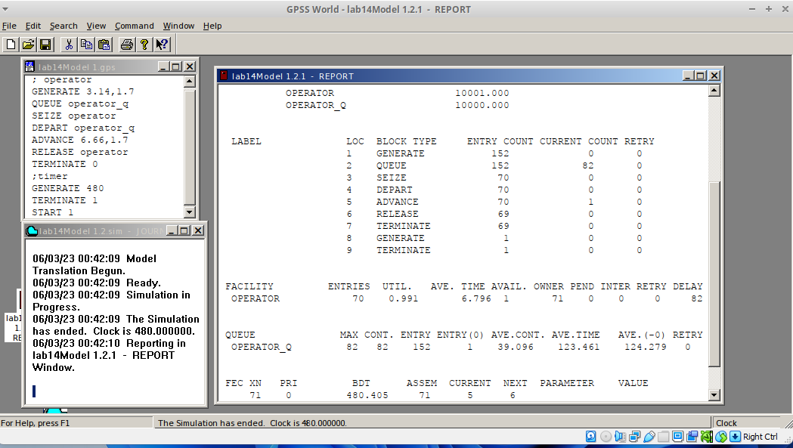
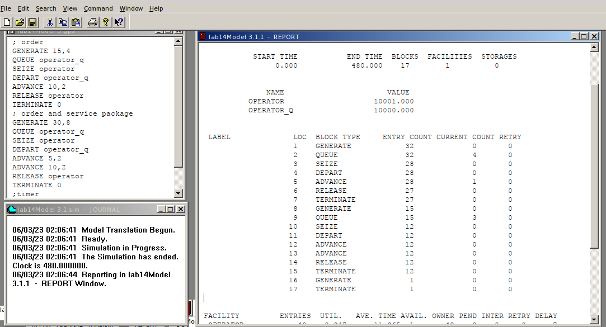
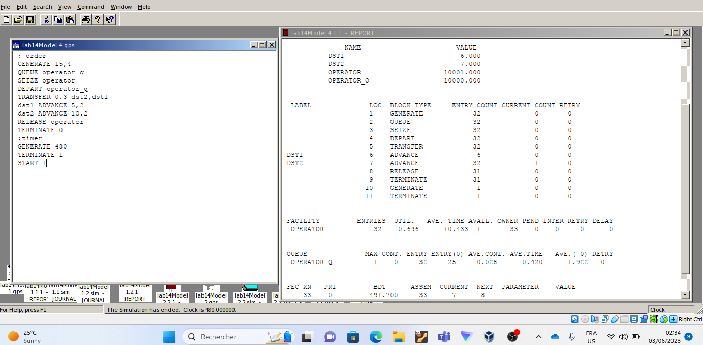
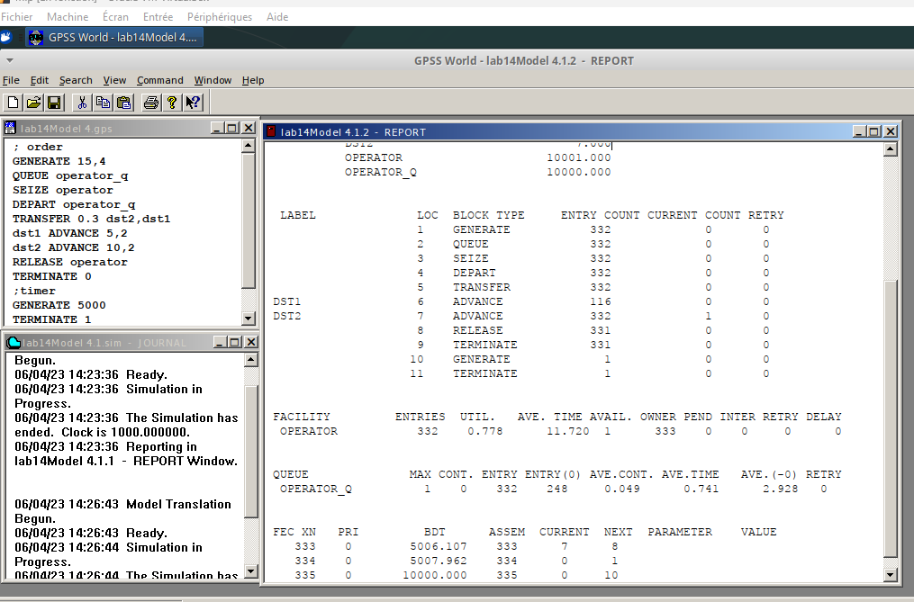
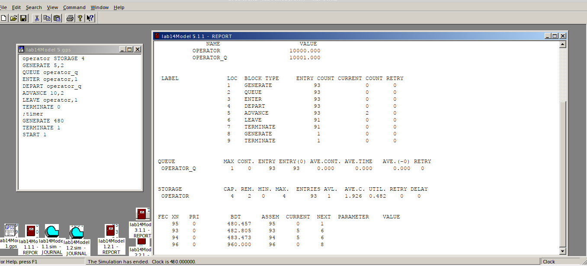
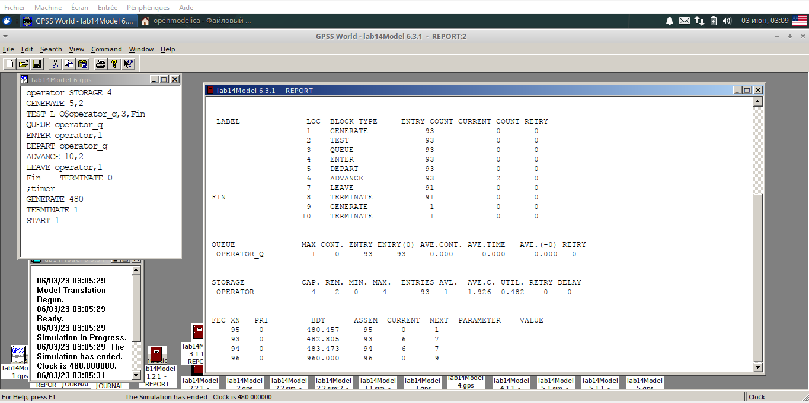
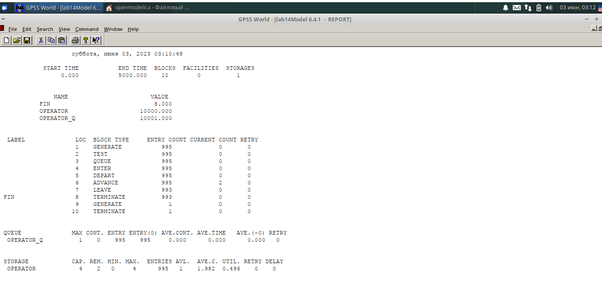

---
## Front matter
title: "Лабораторной работе №14."
subtitle: "Модели обработки заказов"
author: "Коне Сирики. НФИбд-01-20"

## Generic otions
lang: ru-RU
toc-title: "Содержание"

## Bibliography
bibliography: bib/cite.bib
csl: pandoc/csl/gost-r-7-0-5-2008-numeric.csl

## Pdf output format
toc: true # Table of contents
toc-depth: 2
lof: true # List of figures
lot: true # List of tables
fontsize: 12pt
linestretch: 1.5
papersize: a4
documentclass: scrreprt
## I18n polyglossia
polyglossia-lang:
  name: russian
  options:
	- spelling=modern
	- babelshorthands=true
polyglossia-otherlangs:
  name: english
## I18n babel
babel-lang: russian
babel-otherlangs: english
## Fonts
mainfont: PT Serif
romanfont: PT Serif
sansfont: PT Sans
monofont: PT Mono
mainfontoptions: Ligatures=TeX
romanfontoptions: Ligatures=TeX
sansfontoptions: Ligatures=TeX,Scale=MatchLowercase
monofontoptions: Scale=MatchLowercase,Scale=0.9
## Biblatex
biblatex: true
biblio-style: "gost-numeric"
biblatexoptions:
  - parentracker=true
  - backend=biber
  - hyperref=auto
  - language=auto
  - autolang=other*
  - citestyle=gost-numeric
## Pandoc-crossref LaTeX customization
figureTitle: "Рис."
tableTitle: "Таблица"
listingTitle: "Листинг"
lofTitle: "Список иллюстраций"
lotTitle: "Список таблиц"
lolTitle: "Листинги"
## Misc options
indent: true
header-includes:
  - \usepackage{indentfirst}
  - \usepackage{float} # keep figures where there are in the text
  - \floatplacement{figure}{H} # keep figures where there are in the text
---

# Цель и задачи лабораторной работы

## Цель работы

Построить и проанализировать модели обработки заказов в GPSS.

## Задачи лабораторной работы

1. Скорректируйте модель в соответствии с изменениями входных
данных: интервалы поступления заказов распределены равномерно с интервалом
3.14 ± 1.7 мин; время оформления заказа также распределено равномерно на интервале 6.66 ± 1.7 мин. Проанализируйте отчёт, сравнив результаты с результатами предыдущего моделирования.
2. Проанализируйте отчёт и гистограмму по результатам моделировани
3. Скорректируйте модель так, чтобы учитывалось условие, что число
заказов с дополнительным пакетом услуг составляет 30% от общего числа заказов.Используйте оператор TRANSFER. Проанализируйте отчёт.
4. 
 1. Проанализируйте полученный отчёт.
   2. Измените модель: требуется учесть в ней возможные отказы клиентов от заказа
— когда при подаче заявки на заказ клиент видит в очереди более двух других
заявок, он отказывается от подачи заявки, то есть отказывается от обслуживания
(используйте блок TEST и стандартный числовой атрибут Qj текущей длины
очереди j).
   3. Проанализируйте отчёт изменённой модели.

## Процесс выпольнение задачи

###  Постпроил  модель и запустил симуляцию

(рис. @fig:001).

{#fig:001 width=70%}

### Изменил распределения интервалов получения заказов и времени обработки, запустил симуляцию

(рис. @fig:002).

{#fig:002 width=70%}

###  Постпроил  гистограмму

(рис. @fig:003).

{#fig:003 width=70%}

### Отчёт

(рис. @fig:004).

{#fig:004 width=70%}

###  Постпроил модель обслуживания двух типов заказов

(рис. @fig:005).

{#fig:005 width=70%}

### Внес изменения , что заявок с доп. услугами теперь 30%

(рис. @fig:006).

{#fig:006 width=70%}

### Увеличил время , тепер из 332 заявок 116 с доп. услугами что ближе к 30%.

(рис. @fig:007).

{#fig:007 width=70%}

### Построил модель обработки несколькими операторами

(рис. @fig:008.)

{#fig:008 width=70%}

### Изменил модель, чтобы новые заявки не попадали в очередь если в ней больше 2 заявок

(рис. @fig:009).

{#fig:009 width=70%}

### Чтобы увидеть отсечение заявок 

(рис. @fig:010).

{#fig:010 width=70%}

# Выводы

  Построить и проанализировать модели обработки заказов в GPSS.

:::
