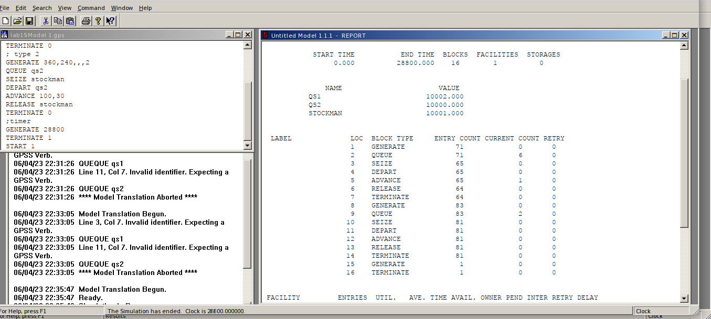
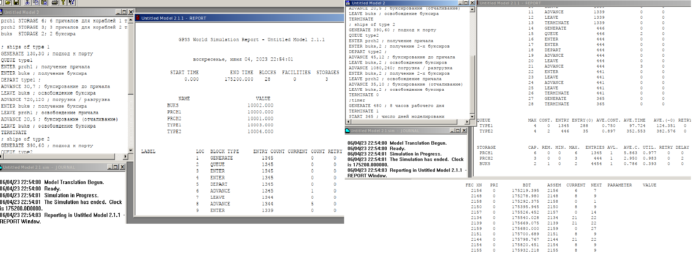

---
## Front matter
lang: ru-RU
title: Лабораторной работе №15.
subtitle: "Модели обслуживания с приоритетами"
author:
  - Коне Сирики.
institute:
  - Российский университет дружбы народов, Москва, Россия
date: 10 Инюня , 2023, Москва, Россия

## i18n babel
babel-lang: russian
babel-otherlangs: english

## Formatting pdf
toc: false
toc-title: Содержание
slide_level: 2
aspectratio: 169
section-titles: true
theme: metropolis
header-includes:
 - \metroset{progressbar=frametitle,sectionpage=progressbar,numbering=fraction}
 - '\makeatletter'
 - '\beamer@ignorenonframefalse'
 - '\makeatother'
---

# Информация

## Докладчик

:::::::::::::: {.columns align=center}
::: {.column width="70%"}

  * Коне Сирики
  * Студент физмат 
  * Российский университет дружбы народов
  * [konesirisil@yandex.ru](mailto:sirikisil@yandex.ru)
  * <https://github.com/skone19>

:::
::: {.column width="30%"}

:::
::::::::::::::

# Цель и задачи лабораторной работы

## Цель работы

Построить Модели обслуживания с приоритетами в GPSS.

## Задачи лабораторной работы

Проанализируйте полученный отчёт на каждом моделе после запуск программа.

## Процесс выпольнение задачи

###  Постпроил  модель обслуживания механиков на складе и запустил симуляцию

(рис. @fig:001).

{#fig:001 width=70%}

## Процесс выпольнение задачи

### Постпроил  модель обслуживания в порту судов двух типов и  запустил симуляцию

(рис. @fig:002).

{#fig:002 width=70%}

# Выводы

 Построили и проанализировали модели обслуживания с приоритетами в GPSS.

:::
