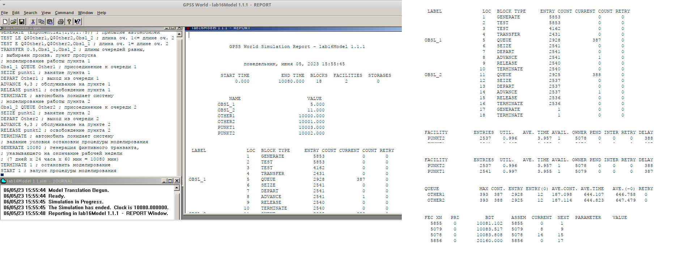
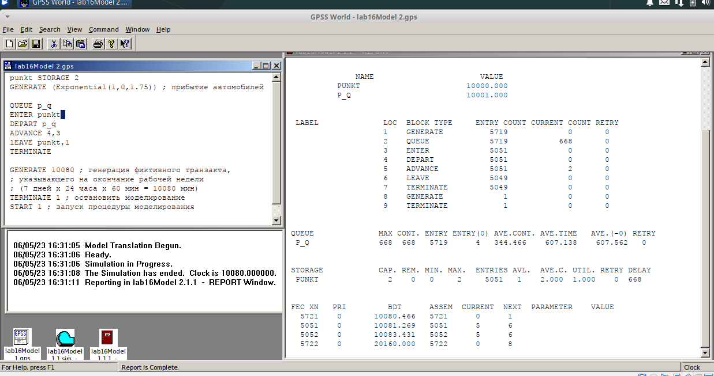
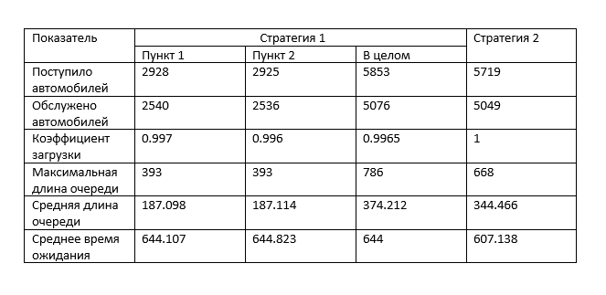
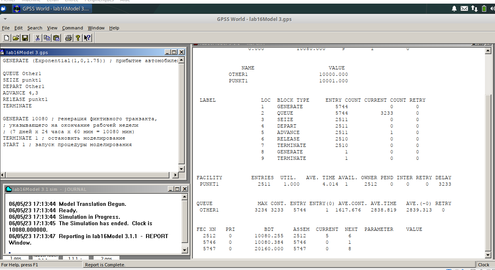
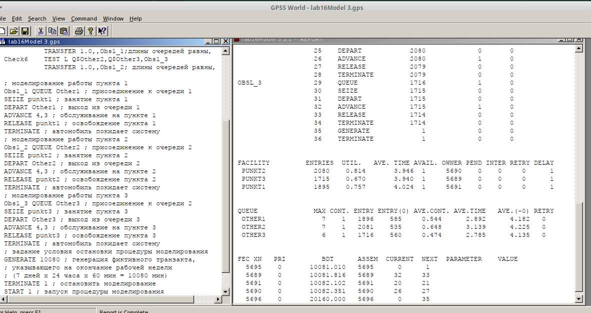
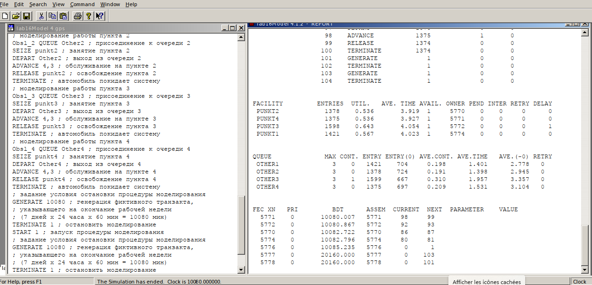
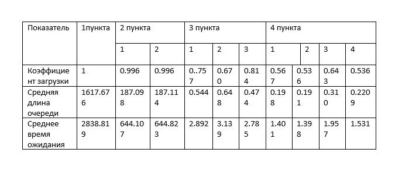
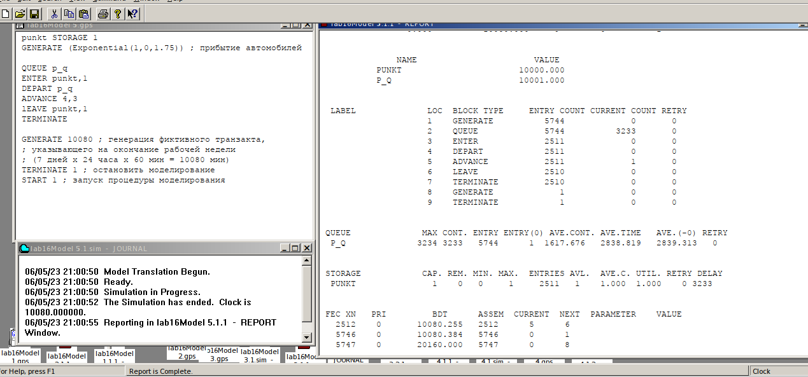
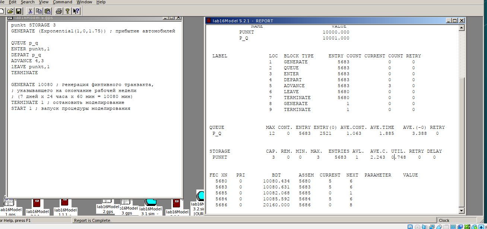
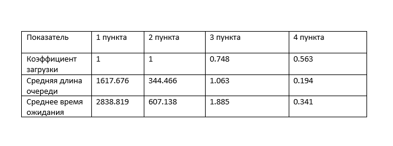

---
## Front matter
lang: ru-RU
title: Лабораторной работе №16.
subtitle: "Задачи оптимизации. Модель двух стратегий обслуживания"
author:
  - Коне Сирики.
institute:
  - Российский университет дружбы народов, Москва, Россия
date: 10 Инюня , 2023, Москва, Россия

## i18n babel
babel-lang: russian
babel-otherlangs: english

## Formatting pdf
toc: false
toc-title: Содержание
slide_level: 2
aspectratio: 169
section-titles: true
theme: metropolis
header-includes:
 - \metroset{progressbar=frametitle,sectionpage=progressbar,numbering=fraction}
 - '\makeatletter'
 - '\beamer@ignorenonframefalse'
 - '\makeatother'
---

# Информация

## Докладчик

:::::::::::::: {.columns align=center}
::: {.column width="70%"}

  * Коне Сирики
  * Студент физмат 
  * Российский университет дружбы народов
  * [konesirisil@yandex.ru](mailto:sirikisil@yandex.ru)
  * <https://github.com/skone19>

:::
::: {.column width="30%"}

:::
::::::::::::::

# Цель и задачи лабораторной работы

## Цель работы

Изучить задачи оптимизации, реализовать  модель двух
стратегий обслуживания в GPSS.  

## Задачи лабораторной работы

 1. составить модель для второй стратегии обслуживания, когда прибывающие автомобили образуют одну очередь и обслуживаются освободившимся пропускным
пунктом;
 2. свести полученные статистики моделирования в таблицу 16.1.
 3. по результатам моделирования сделать вывод о наилучшей стратегии обслуживания автомобилей;
4.  изменив модели, определить оптимальное число пропускных пунктов (от 1 до 4)
для каждой стратегии при условии, что:
5.  коэффициент загрузки пропускных пунктов принадлежит интервалу
[0, 5; 0, 95];
6.  среднее число автомобилей, одновременно находящихся на контрольно-пропускном пункте, не должно превышать 3;
7.  среднее время ожидания обслуживания не должно превышать 4 мин

## Процесс выпольнение задачи

###  Постпроил  модель первой стратегии и запустил симуляцию

(рис. @fig:001).

{#fig:001 width=70%}

## Процесс выпольнение задачи

### Постпроил  модель второй стратегии и запустил симуляцию.

(рис. @fig:002).

{#fig:002 width=70%}

## Процесс выпольнение задачи

###  Составил таблицу

(рис. @fig:003).

{#fig:003 width=70%}

## Процесс выпольнение задачи

### 1 с 1

(рис. @fig:004).

{#fig:004 width=70%}

## Процесс выпольнение задачи

###  1 с 3

(рис. @fig:005).

{#fig:005 width=70%}

## Процесс выпольнение задачи

### 1 с 4

(рис. @fig:006).

{#fig:006 width=70%}

## Процесс выпольнение задачи

### Таблица оцениваемых параметров.

(рис. @fig:007).

{#fig:007 width=70%}

## Процесс выпольнение задачи

### 2 с 1

(рис. @fig:008.)

{#fig:008 width=70%}

## Процесс выпольнение задачи

### 2 с 3

(рис. @fig:009).

{#fig:009 width=70%}

## Процесс выпольнение задачи

### 2 с 4

(рис. @fig:010).

{#fig:010 width=70%}

## Процесс выпольнение задачи

### Таблица оцениваемых параметров

(рис. @fig:011).

{#fig:011 width=70%}

# Выводы

Изучили задачи оптимизации, реализовали  модель двух
стратегий обслуживания в GPSS.  

:::
