---
## Front matter
title: "Лабораторной работе №16."
subtitle: "Задачи оптимизации. Модель двух стратегий обслуживания"
author: "Коне Сирики. НФИбд-01-20"

## Generic otions
lang: ru-RU
toc-title: "Содержание"

## Bibliography
bibliography: bib/cite.bib
csl: pandoc/csl/gost-r-7-0-5-2008-numeric.csl

## Pdf output format
toc: true # Table of contents
toc-depth: 2
lof: true # List of figures
lot: true # List of tables
fontsize: 12pt
linestretch: 1.5
papersize: a4
documentclass: scrreprt
## I18n polyglossia
polyglossia-lang:
  name: russian
  options:
	- spelling=modern
	- babelshorthands=true
polyglossia-otherlangs:
  name: english
## I18n babel
babel-lang: russian
babel-otherlangs: english
## Fonts
mainfont: PT Serif
romanfont: PT Serif
sansfont: PT Sans
monofont: PT Mono
mainfontoptions: Ligatures=TeX
romanfontoptions: Ligatures=TeX
sansfontoptions: Ligatures=TeX,Scale=MatchLowercase
monofontoptions: Scale=MatchLowercase,Scale=0.9
## Biblatex
biblatex: true
biblio-style: "gost-numeric"
biblatexoptions:
  - parentracker=true
  - backend=biber
  - hyperref=auto
  - language=auto
  - autolang=other*
  - citestyle=gost-numeric
## Pandoc-crossref LaTeX customization
figureTitle: "Рис."
tableTitle: "Таблица"
listingTitle: "Листинг"
lofTitle: "Список иллюстраций"
lotTitle: "Список таблиц"
lolTitle: "Листинги"
## Misc options
indent: true
header-includes:
  - \usepackage{indentfirst}
  - \usepackage{float} # keep figures where there are in the text
  - \floatplacement{figure}{H} # keep figures where there are in the text
---

# Цель и задачи лабораторной работы

## Цель работы

Изучить задачи оптимизации, реализовать  модель двух
стратегий обслуживания в GPSS.  

## Задачи лабораторной работы

 1. составить модель для второй стратегии обслуживания, когда прибывающие автомобили образуют одну очередь и обслуживаются освободившимся пропускным
пунктом;
 2. свести полученные статистики моделирования в таблицу 16.1.
 3. по результатам моделирования сделать вывод о наилучшей стратегии обслуживания автомобилей;
4.  изменив модели, определить оптимальное число пропускных пунктов (от 1 до 4)
для каждой стратегии при условии, что:
5.  коэффициент загрузки пропускных пунктов принадлежит интервалу
[0, 5; 0, 95];
6.  среднее число автомобилей, одновременно находящихся на контрольно-пропускном пункте, не должно превышать 3;
7.  среднее время ожидания обслуживания не должно превышать 4 мин

## Процесс выпольнение задачи

###  Постпроил  модель первой стратегии и запустил симуляцию

(рис. @fig:001).

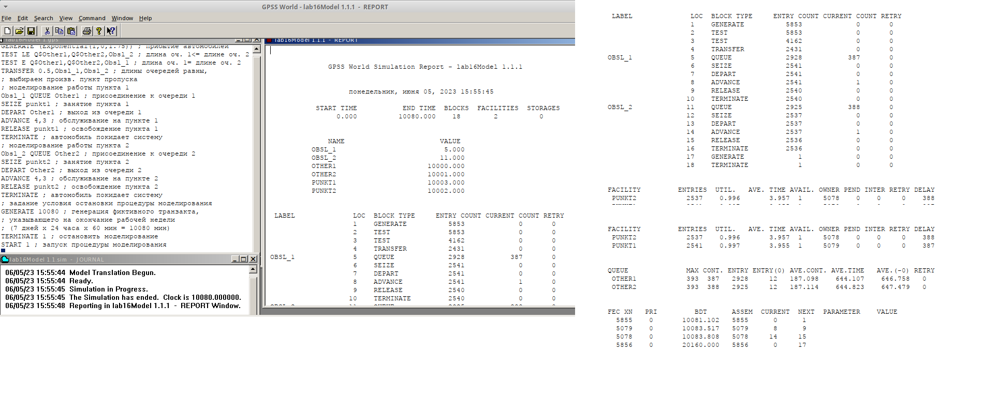{#fig:001 width=70%}

### Постпроил  модель второй стратегии и запустил симуляцию.

(рис. @fig:002).

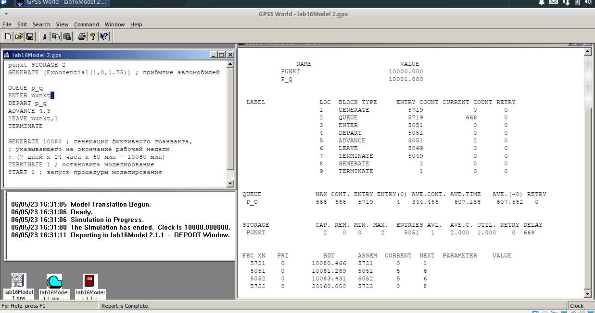{#fig:002 width=70%}

###  Составил таблицу

(рис. @fig:003).

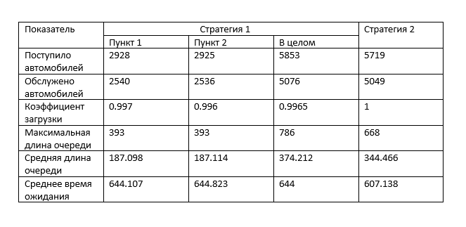{#fig:003 width=70%}

### 1 с 1

(рис. @fig:004).

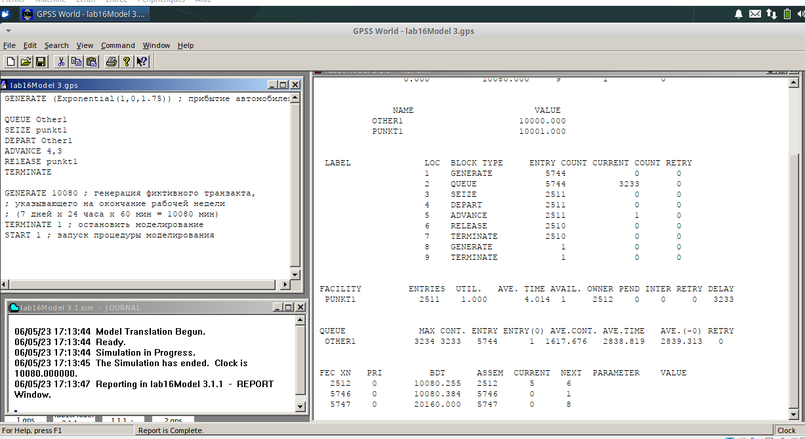{#fig:004 width=70%}

###  1 с 3

(рис. @fig:005).

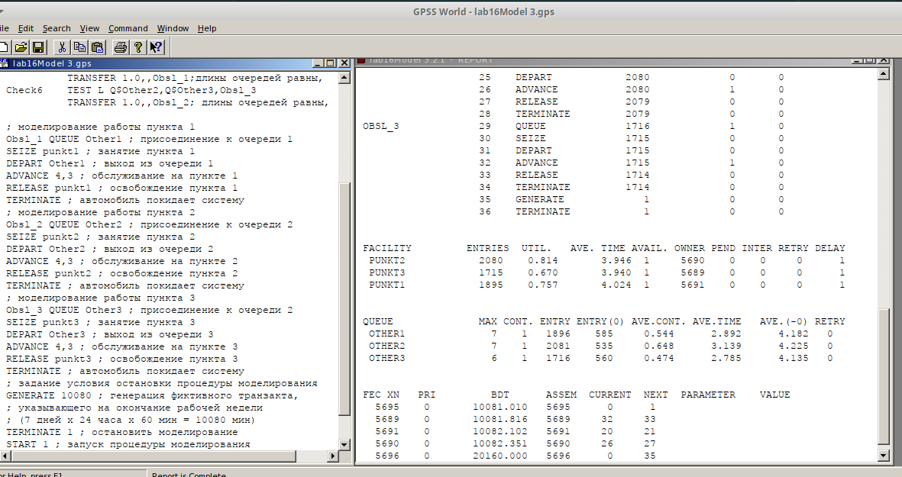{#fig:005 width=70%}

### 1 с 4

(рис. @fig:006).

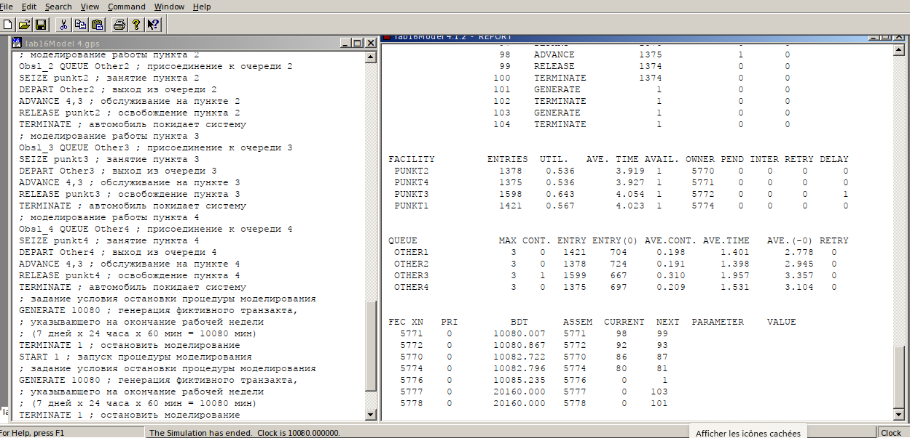{#fig:006 width=70%}

### Таблица оцениваемых параметров.

(рис. @fig:007).

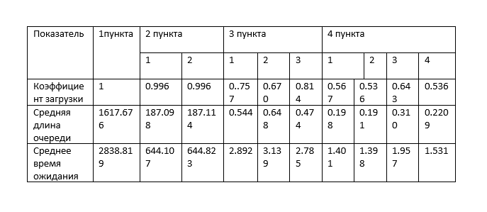{#fig:007 width=70%}

### 2 с 1

(рис. @fig:008.)

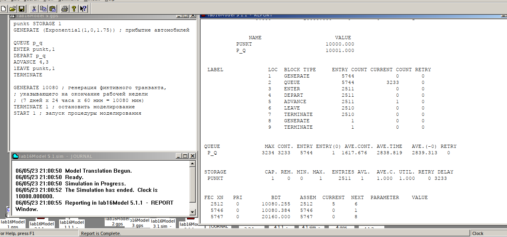{#fig:008 width=70%}

### 2 с 3

(рис. @fig:009).

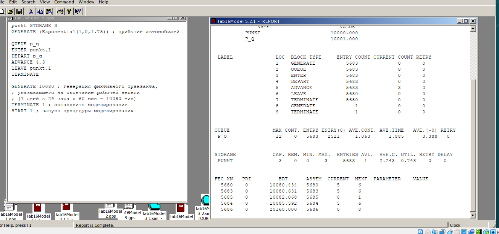{#fig:009 width=70%}

### 2 с 4

(рис. @fig:010).

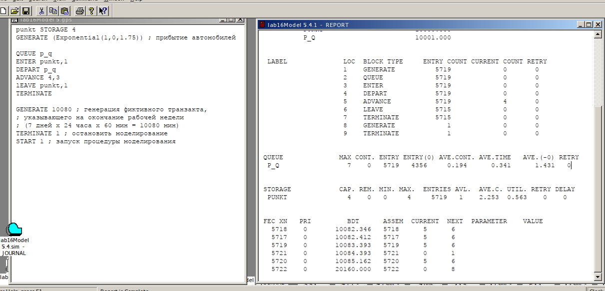{#fig:010 width=70%}

### Таблица оцениваемых параметров

(рис. @fig:011).

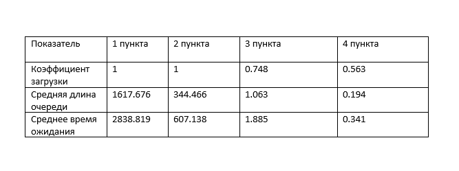{#fig:011 width=70%}

# Выводы

Изучили задачи оптимизации, реализовали  модель двух
стратегий обслуживания в GPSS.  

:::
