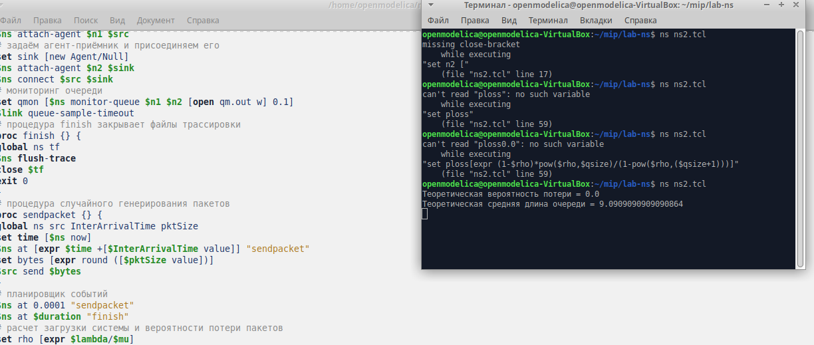
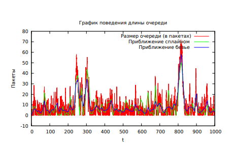

---
## Front matter
lang: ru-RU
title: Лабораторной работе №3.
subtitle: "Моделирование стохастических процессов"
author:
  - Коне Сирики.
institute:
  - Российский университет дружбы народов, Москва, Россия
date: 30 Апреля , 2023, Москва, Россия

## i18n babel
babel-lang: russian
babel-otherlangs: english

## Formatting pdf
toc: false
toc-title: Содержание
slide_level: 2
aspectratio: 169
section-titles: true
theme: metropolis
header-includes:
 - \metroset{progressbar=frametitle,sectionpage=progressbar,numbering=fraction}
 - '\makeatletter'
 - '\beamer@ignorenonframefalse'
 - '\makeatother'
---

# Информация

## Докладчик

:::::::::::::: {.columns align=center}
::: {.column width="70%"}

  * Коне Сирики
  * Студент физмат 
  * Российский университет дружбы народов
  * [konesirisil@yandex.ru](mailto:sirikisil@yandex.ru)
  * <https://github.com/skone19>

:::
::: {.column width="30%"}


:::
::::::::::::::

# Цели и задачи работы

##  Цель работы:

Цель работы - познакомиться работа с Исследование 
протокола TCP  и алгоритма управления очередью RED

# Выполнение теорический часть :

## Пример задания множества объектов мониторинга:

```
# создание объекта Simulator
set ns [new Simulator]
# открытие на запись файла out.tr для регистрации событий
set tf [open out.tr w]
$ns trace-all $tf
# задаём значения параметров системы
set lambda 30.0
set mu 33.0
# размер очереди для M|M|1 (для M|M|1|R: set qsize R)
set qsize 100000
# устанавливаем длительность эксперимента
set duration 1000.0
# задаём узлы и соединяем их симплексным соединением
# с полосой пропускания 100 Кб/с и задержкой 0 мс,
# очередью с обслуживанием типа DropTail
set n1 [$ns node]
set n2 [$ns no
set link [$ns simplex-link $n1 $n2 100kb 0ms DropTail]
# наложение ограничения на размер очереди:
$ns queue-limit $n1 $n2 $qsize
# задаём распределения интервалов времени
# поступления пакетов и размера пакетов
set InterArrivalTime [new RandomVariable/Exponential]
$InterArrivalTime set avg_ [expr 1/$lambda]
set pktSize [new RandomVariable/Exponential]
$pktSize set avg_ [expr 100000.0/(8*$mu)]
# задаём агент UDP и присоединяем его к источнику,
# задаём размер пакета
set src [new Agent/UDP]
$src set packetSize_ 100000
$ns attach-agent $n1 $src
# задаём агент-приёмник и присоединяем его
set sink [new Agent/Null]
$ns attach-agent $n2 $sink
$ns connect $src $sink
# мониторинг очереди
set qmon [$ns monitor-queue $n1 $n2 [open qm.out w] 0.1]
$link queue-sample-timeout
# процедура finish закрывает файлы трассировки
proc finish {} {
global ns tf
$ns flush-trace
close $tf
exit 0
}
# процедура случайного генерирования пакетов
proc sendpacket {} {
global ns src InterArrivalTime pktSize
set time [$ns now]
$ns at [expr $time +[$InterArrivalTime value]] "sendpacket"
set bytes [expr round ([$pktSize value])]
$src send $bytes
}
# планировщик событий
$ns at 0.0001 "sendpacket"
$ns at $duration "finish"
# расчет загрузки системы и вероятности потери пакетов
set rho [expr $lambda/$mu]
set ploss
[expr (1-$rho)*pow($rho,$qsize)/(1-pow($rho,($qsize+1)))]
puts "Теоретическая вероятность потери = $ploss"
set aveq [expr $rho*$rho/(1-$rho)]
puts "Теоретическая средняя длина очереди = $aveq"
# запуск модели
$ns run


```

# Задача лабораторной работы:

1. В каталоге с проектом создайте отдельный файл, например, graph_plot:
touch graph_plot

2. Откройте его на редактирование и добавьте следующий код, обращая внимание
на синтаксис GNUplot:


## Код программы: 

```
#!/usr/bin/gnuplot -persist
# задаём текстовую кодировку,
# тип терминала, тип и размер шрифта
set encoding utf8
set term pdfcairo font "Arial,9"
# задаём выходной файл графика
set out 'qm.pdf'
# задаём название графика
set title "График средней длины очереди"
# задаём стиль линии
set style line 2
# подписи осей графика
set xlabel "t"
set ylabel "Пакеты"
# построение графика, используя значения
# 1-го и 5-го столбцов файла qm.out
plot "qm.out" using ($1):($5) with lines
title "Размер очереди (в пакетах)",\
"qm.out" using ($1):($5) smooth csplines
title " Приближение сплайном ", \
"qm.out" using ($1):($5) smooth bezier
title " Приближение Безье "

```  
# Результаты работы программы

(рис. @fig:001).

{#fig:001 width=70%}

(рис. @fig:002).

{#fig:006 width=70%}


#  Выводы

Мы рассмотрели задачу  Моделирование стохастических процессов, познокомится работа с Моделирование стохастических процессов .
:::