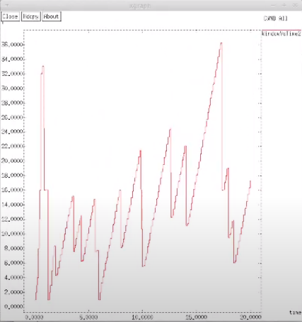
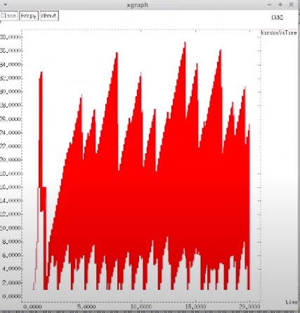
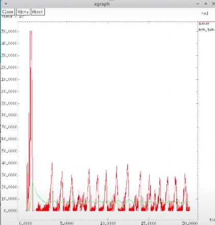
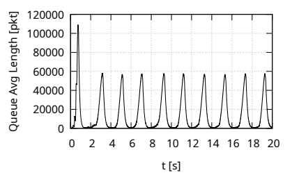

---
## Front matter
lang: ru-RU
title: Лабораторной работе №4.
subtitle: "Моделирование стохастических процессов"
author:
  - Коне Сирики.
institute:
  - Российский университет дружбы народов, Москва, Россия
date: 06 Мая , 2023, Москва, Россия

## i18n babel
babel-lang: russian
babel-otherlangs: english

## Formatting pdf
toc: false
toc-title: Содержание
slide_level: 2
aspectratio: 169
section-titles: true
theme: metropolis
header-includes:
 - \metroset{progressbar=frametitle,sectionpage=progressbar,numbering=fraction}
 - '\makeatletter'
 - '\beamer@ignorenonframefalse'
 - '\makeatother'
---

# Информация

## Докладчик

:::::::::::::: {.columns align=center}
::: {.column width="70%"}

  * Коне Сирики
  * Студент физмат 
  * Российский университет дружбы народов
  * [konesirisil@yandex.ru](mailto:sirikisil@yandex.ru)
  * <https://github.com/skone19>

:::
::: {.column width="30%"}


:::
::::::::::::::

# Цели и задачи работы

##  Цель работы:

Цель работы - Исследование TCP и RED.

# Выполнение теорический часть :

## Пример задания множества объектов мониторинга:

```
Описание моделируемой сети:
– сеть состоит из N TCP-источников, N TCP-приёмников, двух маршрутизаторов
R1 и R2 между источниками и приёмниками (N — не менее 20);
– между TCP-источниками и первым маршрутизатором установлены дуплексные
соединения с пропускной способностью 100 Мбит/с и задержкой 20 мс очередью
типа DropTail;
– между TCP-приёмниками и вторым маршрутизатором установлены дуплексные
соединения с пропускной способностью 100 Мбит/с и задержкой 20 мс очередью
типа DropTail;
– между маршрутизаторами установлено симплексное соединение (R1–R2) с пропускной способностью 20 Мбит/с и задержкой 15 мс очередью типа RED,
размером буфера 300 пакетов; в обратную сторону — симплексное соединение (R2–R1) с пропускной способностью 15 Мбит/с и задержкой 20 мс очередью
типа DropTail;
– данные передаются по протоколу FTP поверх TCPReno;
– параметры алгоритма RED: qmin = 75, qmax = 150, qw = 0, 002, pmax = 0.1;
– максимальный размер TCP-окна 32; размер передаваемого пакета 500 байт; время
моделирования — не менее 20 единиц модельного времени

```

# Задача лабораторной работы:
1. Для приведённой схемы разработать имитационную модель в пакете NS-2.
2. Построить график изменения размера окна TCP (в Xgraph и в GNUPlot);
3. Построить график изменения длины очереди и средней длины очереди на первом
маршрутизаторе.
4. Оформить отчёт о выполненной работе.

## Код программы: 

```
set ns [new Simulator]
set nf [open out.nam w]
$ns namtrace-all $nf
set f [open out.tr w]
$ns trace-all $f
set N 20
for {set i 0} {$i < $N} {incr i} {
#set node_(s$i) [$ns node]
set src_($i) [$ns node]
set dst_($i) [$ns node]
}
set node_(r1) [$ns node]
set node_(r2) [$ns node]


# Déplacement aléatoire des nœuds toutes les secondes
for {set i 1} {$i < $N} {incr i} {
$ns duplex-link $src_($i)   $node_(r1) 100Mb 20ms DropTail
$ns duplex-link $dst_($i)  $node_(r2) 100Mb 20ms DropTail
}
$ns simplex-link $node_(r2) $node_(r1) 15Mb 20ms DropTail
$ns simplex-link $node_(r1) $node_(r2) 20Mb 15ms RED
$ns queue-limit $node_(r1) $node_(r2) 300 ;
Queue/RED set thresh_ 75 
Queue/RED set maxthresh_ 150 
Queue/RED set q_weight 0.002 
Queue/RED linterm_ 10
for {set i 0} {$i < $N} {incr i} {
set tcp($i) [$ns create-connection TCP/Reno $src_($i) TCPSink $dst_($i) 1]
$tcp($i) set window_ 32
set ftp($i) [$tcp($i) attach-source FTP] 
 $ftp($i) set class_ 1 
 $ftp($i) set packetSize_ 500
}

$ns color 1 blue;
#set WindowVsTime "graph/windowVsTime"
#set windowVsTime [open "WindowsVsTime.tr" w]
set WindowVsTime [open WindowVsTimeReno w]
set WindowVsTime2 [open WindowsVsTime2 w]
set qmon [$ns monitor-queue $node_(r1) $node_(r2) [open qm.out w] 0.1];
#cbr 0.1 f;
[$ns link $node_(r1) $node_(r2)] queue-sample-timeout;
set redq [[$ns link $node_(r1) $node_(r2)] queue]
set tchan_ [open all.q w]
$redq trace curq_
$redq trace ave_
$redq attach $tchan_
proc plotWindow {tcpSource file} {
global ns
set time 0.01
set now [$ns now]
set cwnd [$tcpSource set cwnd_]
puts $file "$now $cwnd"
$ns at [expr $now+$time] "plotWindow $tcpSource $file"
}
proc finish {} {
global ns f nf
global tchan_
set awkCode {
{
if ($1 == "Q" && NF>2) {
print $2, $3 >> "temp.q";
set end $2
}
else if ($1 == "a" && NF>2)
print $2, $3 >> "temp.a";
}
}
set f [open temp.queue w]
puts $f "TitleText: red"
puts $f "Device: Postscript"
if { [info exists tchan_] } {
close $tchan_
}
exec rm -f temp.q temp.a
exec touch temp.a temp.q
exec awk $awkCode all.q
puts $f \"queue
exec cat temp.q >@ $f
puts $f \n\"ave_queue
exec cat temp.a >@ $f
close $f
# Запуск xgraph с графиками окна TCP и очереди:
exec xgraph -bb -bg white -tk -x time -t "CWND" WindowVsTime &
exec xgraph -bb -bg white -tk -x time -t "CWND All" WindowVsTime2 &
#exec xgraph -bb -bg white -tk -y time -t queue temp.queue &
exec xgraph -bb -bg white -tk -y queue -t "Queue Size" temp.queue &
$ns flush-trace 
close $f 
#close $nf 
exec nam out.nam &
exit 0

#exit 0
}
for {set i 0} {$i < $N} {incr i} {
$ns at 0.0 "$ftp($i) start"
$ns at 1.1 "plotWindow $ftp($i) $WindowVsTime"
}
$ns at 1.2 "plotWindow $ftp(0) $WindowVsTime2"
$ns at 20.0 "finish"
# Lancement de la simulation
$ns run

```  
# Результаты работы программы

(рис. @fig:001).

{#fig:001 width=70%}

(рис. @fig:002).

{#fig:002 width=70%}

(рис. @fig:003).

{#fig:003 width=70%}


(рис. @fig:004).

{#fig:006 width=70%}

(рис. @fig:004).

{#fig:004 width=70%}


#  Выводы

Мы рассмотрели задачу  Исследование TCP и RED, познокомится работа с Исследование TCP и RED.
:::