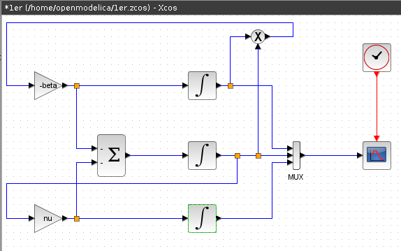
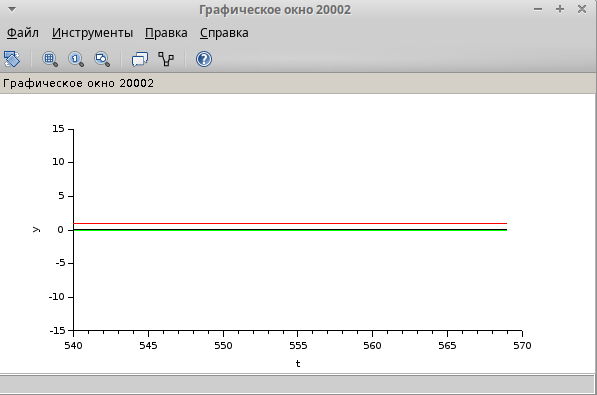
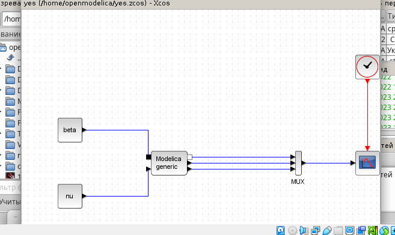
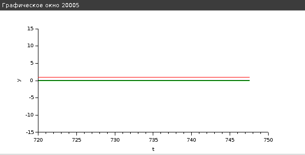
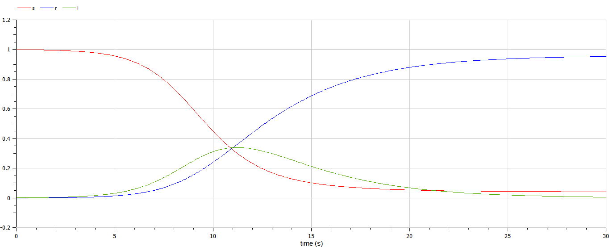
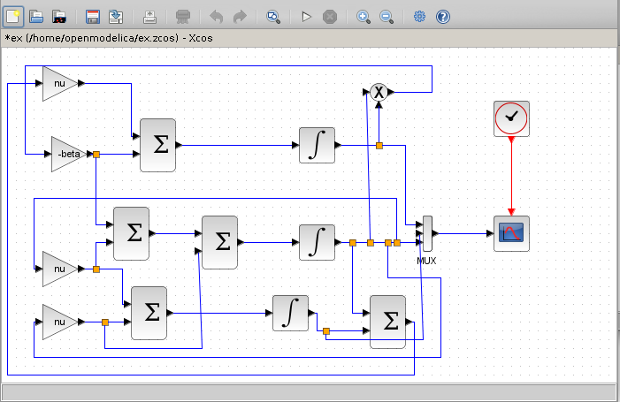
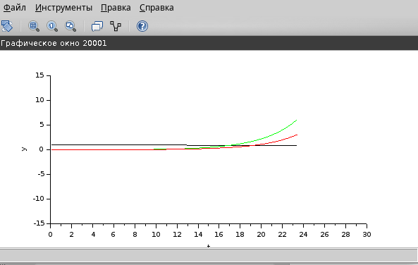

---
## Front matter
lang: ru-RU
title: Лабораторной работе №5.
subtitle: "Модель эпидемии (SIR)"
author:
  - Коне Сирики.
institute:
  - Российский университет дружбы народов, Москва, Россия
date: 13 Мая , 2023, Москва, Россия

## i18n babel
babel-lang: russian
babel-otherlangs: english

## Formatting pdf
toc: false
toc-title: Содержание
slide_level: 2
aspectratio: 169
section-titles: true
theme: metropolis
header-includes:
 - \metroset{progressbar=frametitle,sectionpage=progressbar,numbering=fraction}
 - '\makeatletter'
 - '\beamer@ignorenonframefalse'
 - '\makeatother'
---

# Информация

## Докладчик

:::::::::::::: {.columns align=center}
::: {.column width="70%"}

  * Коне Сирики
  * Студент физмат 
  * Российский университет дружбы народов
  * [konesirisil@yandex.ru](mailto:sirikisil@yandex.ru)
  * <https://github.com/skone19>

:::
::: {.column width="30%"}


:::
::::::::::::::

# Цели и задачи работы

# Цель лабораторной работы:

Цель работы -  Реализация модели в xcos.

# Изучение теорический часть 

## Математическая модель

## Реализация модели в xcos

## Модель SIR в xcos

(рис. @fig:001).

{#fig:001 width=60%}

## Эпидемический порог модели SIR 

(рис. @fig:002).

 {#fig:002 width=60%}


# Реализация модели с помощью блока Modelica в xcos

##  Модель SIR в xcos с применением блока Modelica

(рис. @fig:003).

{#fig:003 width=60%}

(рис. @fig:004).

{#fig:004 width=60%}

# Код на языке Modelica:

```
model codm
parameter Real beta=1;
parameter Real nu=0.3;
Real s(start=0.999), i(start=0.001), r(start=0.0);
equation
der(s)=-beta*s*i;
der(i)=beta*s*i-nu*i;
der(r)=nu*i;
end codm;
```

(рис. @fig:005).

{#fig:005 width=70%}

## Задание для самостоятельного выполнения

В дополнение к предположениям, которые были сделаны для модели SIR (5.1), предположим, что учитываются демографические процессы, в частности, что смертность
в популяции полностью уравновешивает рождаемость, а все рожденные индивидуумы появляются на свет абсолютно здоровыми. 
Тогда получим следующую систему уравнений:

$$
 \begin{cases}
	\frac{ds}{dt} = −βs(t)i(t) + µ(N − s(t))
	\\   
	\frac{di}{dt} = βs(t)i(t) − νi(t) − µi(t)
  \\
  \frac{dr}{dt} = νi(t) − µr(t)
 \end{cases}
$$

где $µ$ — константа, которая равна коэффициенту смертности и рождаемости.
Требуется:
1.  реализовать модель SIR с учётом процесса рождения  гибели особей в xcos (в
том числе и с использованием блока Modelica), а также в OpenModelica;
2.  построить графики эпидемического порога при различных значениях параметров
модели (в частности изменяя параметр $µ$);
3.  сделать анализ полученных графиков в зависимости от выбранных значений
параметров модели

# Результаты работы программы

(рис. @fig:006).

{#fig:006 width=60%}

(рис. @fig:007).

{#fig:007 width=60%}

# Выводы

Мы рассмотрели задачу   Модель эпидемии (SIR), познокомится работа с Модель эпидемии (SIR).
:::
