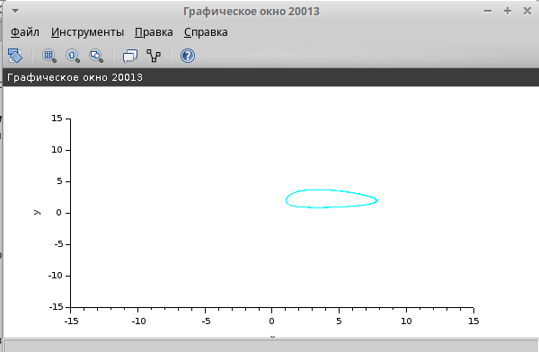
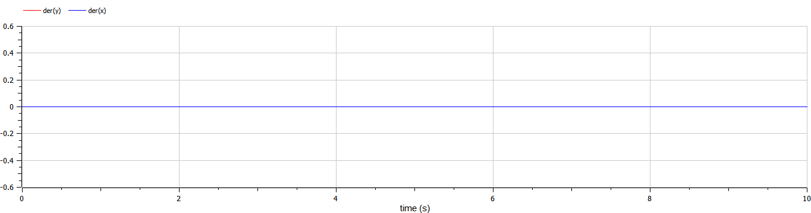

---
## Front matter
lang: ru-RU
title: Лабораторной работе №6.
subtitle: "Модель «хищник–жертва"
author:
  - Коне Сирики.
institute:
  - Российский университет дружбы народов, Москва, Россия
date: 13 Мая , 2023, Москва, Россия

## i18n babel
babel-lang: russian
babel-otherlangs: english

## Formatting pdf
toc: false
toc-title: Содержание
slide_level: 2
aspectratio: 169
section-titles: true
theme: metropolis
header-includes:
 - \metroset{progressbar=frametitle,sectionpage=progressbar,numbering=fraction}
 - '\makeatletter'
 - '\beamer@ignorenonframefalse'
 - '\makeatother'
---

# Информация

## Докладчик

:::::::::::::: {.columns align=center}
::: {.column width="70%"}

  * Коне Сирики
  * Студент физмат 
  * Российский университет дружбы народов
  * [konesirisil@yandex.ru](mailto:sirikisil@yandex.ru)
  * <https://github.com/skone19>

:::
::: {.column width="30%"}


:::
::::::::::::::

# Цели и задачи работы

## Цель работы 

Цель работы -Работа с модель хищник–жертва.

## Выполнение теорический часть

# Задача лабораторной работы

1. Реализуйте модель «хищник – жертва» в OpenModelica. 

2. Постройте графики изменения численности популяций и фазовый портрет.

## Математическая модель

## Реализация модели в xcos

(рис. @fig:001).

{#fig:001 width=70%}

## Модель «хищник–жертва» в xcos с применением блока Modelica

(рис. @fig:002).

{#fig:002 width=70%}

(рис. @fig:003).

{#fig:003 width=70%}

## Код на языке Modelica: 

```
model generic
  parameter Real a,b,c,d;
  Real x(start=2), y(start=1);
equation
  der(x)=a*x-b*x*y;
  der(y)=c*x*y-d*y;
end generic;
```

(рис. @fig:004).

{#fig:004 width=70%}

## Результаты работы программы

(рис. @fig:005).

{#fig:005 width=70%}


(рис. @fig:006).

{#fig:006 width=70%}

(рис. @fig:007).

{#fig:007 width=70%}

# Выводы

Мы рассмотрели задачу  Модель «хищник–жертва, познокомится работа с Модель «хищник–жертва.
:::
