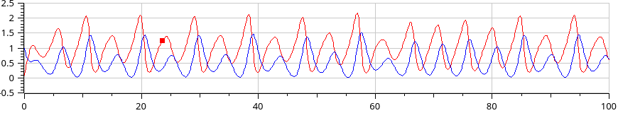
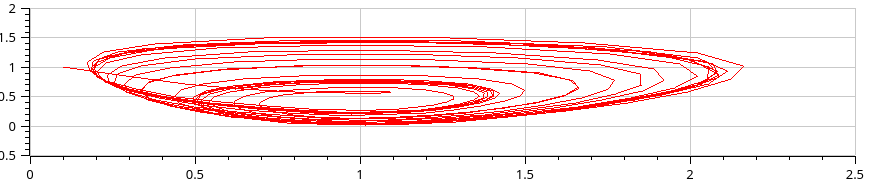
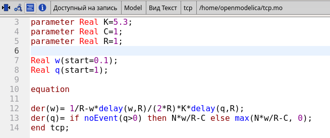
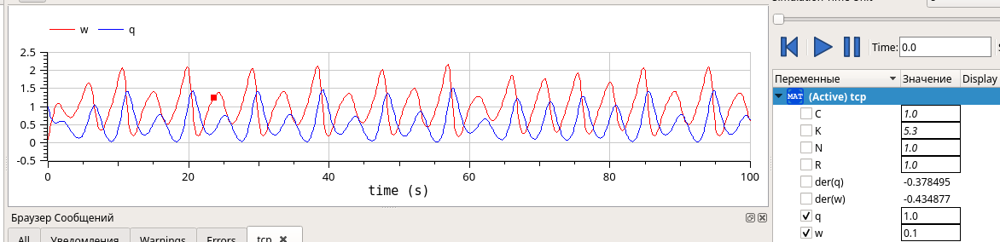
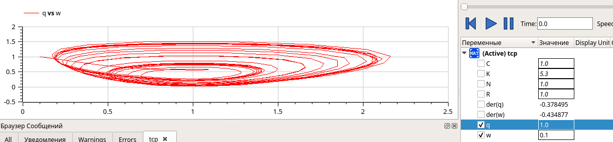
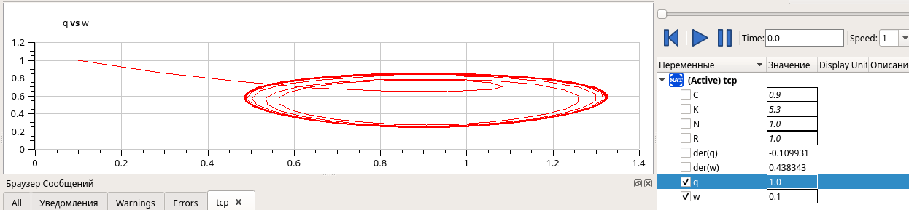

---
## Front matter
title: "Лабораторной работе №8."
subtitle: " Модель TCP$/$AQM"
author: "Коне Сирики. НФИбд-01-20"

## Generic otions
lang: ru-RU
toc-title: "Содержание"

## Bibliography
bibliography: bib/cite.bib
csl: pandoc/csl/gost-r-7-0-5-2008-numeric.csl

## Pdf output format
toc: true # Table of contents
toc-depth: 2
lof: true # List of figures
lot: true # List of tables
fontsize: 12pt
linestretch: 1.5
papersize: a4
documentclass: scrreprt
## I18n polyglossia
polyglossia-lang:
  name: russian
  options:
	- spelling=modern
	- babelshorthands=true
polyglossia-otherlangs:
  name: english
## I18n babel
babel-lang: russian
babel-otherlangs: english
## Fonts
mainfont: PT Serif
romanfont: PT Serif
sansfont: PT Sans
monofont: PT Mono
mainfontoptions: Ligatures=TeX
romanfontoptions: Ligatures=TeX
sansfontoptions: Ligatures=TeX,Scale=MatchLowercase
monofontoptions: Scale=MatchLowercase,Scale=0.9
## Biblatex
biblatex: true
biblio-style: "gost-numeric"
biblatexoptions:
  - parentracker=true
  - backend=biber
  - hyperref=auto
  - language=auto
  - autolang=other*
  - citestyle=gost-numeric
## Pandoc-crossref LaTeX customization
figureTitle: "Рис."
tableTitle: "Таблица"
listingTitle: "Листинг"
lofTitle: "Список иллюстраций"
lotTitle: "Список таблиц"
lolTitle: "Листинги"
## Misc options
indent: true
header-includes:
  - \usepackage{indentfirst}
  - \usepackage{float} # keep figures where there are in the text
  - \floatplacement{figure}{H} # keep figures where there are in the text
---

# Цель и задачи лабораторной работы

## Цель работы

Реализовать упрощенную модель TCP-подобного трафика в xcos с помощью блока modelica.
 Постройть графикдинамики изменения TCP окна W(t) и размера очередь Q(t) и фазовый портрет.

## Задание для самостоятельного выполнения

Реализуйте модель (8.4)–(8.5) с использованием языка Modelica в среде
OpenModelica. Для реализации задержки используйте оператор delay(). 
Постройте график динамики изменения размера TCP окна $W(t)$ и размера очереди $Q(t)$
и фазовый портрет $(W, Q)$.

## Процесс выпольнение задачи

### Код на  Modelica в среде OpenModelica при C=1

```
model tcp
parameter Real N=1;
parameter Real K=5.3;
parameter Real C=1;
parameter Real R=1;

Real w(start=0.1);
Real q(start=1);

equation

der(w)= 1/R-w*delay(w,R)/(2*R)*K*delay(q,R);
der(q)= if noEvent(q>0) then N*w/R-C else max(N*w/R-C, 0);
end tcp;

```

### Код на  Modelica в среде OpenModelica при C=0.9

```
model tcp
parameter Real N=1;
parameter Real K=5.3;
parameter Real C=0.9;
parameter Real R=1;

Real w(start=0.1);
Real q(start=1);

equation

der(w)= 1/R-w*delay(w,R)/(2*R)*K*delay(q,R);
der(q)= if noEvent(q>0) then N*w/R-C else max(N*w/R-C, 0);
end tcp;

```
## Результаты работы

### Схема xcos, моделирующая систему общее вид

(рис. @fig:001).

{#fig:001 width=70%}

### Динамика изменения размера TCP окна $W(t)$ и размера очереди $Q(t)$

(рис. @fig:002).

{#fig:002 width=70%}

### Фазовый портрет (W, Q)

(рис. @fig:003).

{#fig:003 width=70%}

(рис. @fig:004).

## Код на  Modelica в среде OpenModelica при C=1

{#fig:004 width=70%}

(рис. @fig:005).

### Динамика изменения размера TCP окна W(t) и размера очереди Q(t) при C = 1

{#fig:005 width=70%}

(рис. @fig:006).

###  Фазовый портрет (W, Q)

{#fig:006 width=70%}

(рис. @fig:007).

## Код на  Modelica в среде OpenModelica при C=0.9


{#fig:007 width=70%}

(рис. @fig:008).

### Динамика изменения размера TCP окна W(t) и размера очереди Q(t) при C =0.9

{#fig:008 width=70%}

(рис. @fig:009).

###  Фазовый портрет (W, Q)

{#fig:009 width=70%}

# Выводы

Реализовали упрощенную модель TCP-подобного трафика в xcos с  помощью блока modelica. 
Постройть графикдинамики изменения TCP окна $W(t)$ и размера очередь $Q(t)$ и фазовый портрет.

:::
