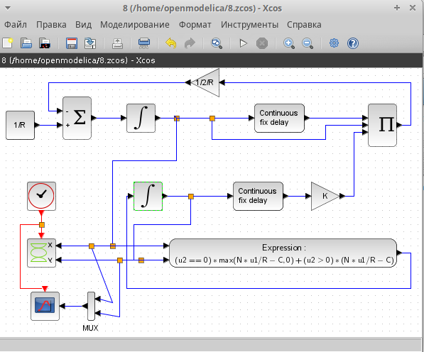

---
## Front matter
lang: ru-RU
title: Лабораторной работе №8.
subtitle: "Модель TCP/AQM"
author:
  - Коне Сирики.
institute:
  - Российский университет дружбы народов, Москва, Россия
date: 13 Мая , 2023, Москва, Россия

## i18n babel
babel-lang: russian
babel-otherlangs: english

## Formatting pdf
toc: false
toc-title: Содержание
slide_level: 2
aspectratio: 169
section-titles: true
theme: metropolis
header-includes:
 - \metroset{progressbar=frametitle,sectionpage=progressbar,numbering=fraction}
 - '\makeatletter'
 - '\beamer@ignorenonframefalse'
 - '\makeatother'
---

# Информация

## Докладчик

:::::::::::::: {.columns align=center}
::: {.column width="70%"}

  * Коне Сирики
  * Студент физмат 
  * Российский университет дружбы народов
  * [konesirisil@yandex.ru](mailto:sirikisil@yandex.ru)
  * <https://github.com/skone19>

:::
::: {.column width="30%"}


:::
::::::::::::::

# Цель и задачи лабораторной работы

## Цель работы

Реализовать упрощенную модель TCP-подобного трафика в xcos с помощью блока modelica.
 Постройть графикдинамики изменения TCP окна W(t) и размера очередь Q(t) и фазовый портрет.

## Задание для самостоятельного выполнения

Реализуйте модель (8.4)–(8.5) с использованием языка Modelica в среде
OpenModelica. Для реализации задержки используйте оператор delay(). 
Постройте график динамики изменения размера TCP окна $W(t)$ и размера очереди $Q(t)$
и фазовый портрет $(W, Q)$.

## Процесс выпольнение задачи

### Код на  Modelica в среде OpenModelica при C=1

```
model tcp
parameter Real N=1;
parameter Real K=5.3;
parameter Real C=1;
parameter Real R=1;

Real w(start=0.1);
Real q(start=1);

equation

der(w)= 1/R-w*delay(w,R)/(2*R)*K*delay(q,R);
der(q)= if noEvent(q>0) then N*w/R-C else max(N*w/R-C, 0);
end tcp;

```

### Код на  Modelica в среде OpenModelica при C=0.9

```
model tcp
parameter Real N=1;
parameter Real K=5.3;
parameter Real C=0.9;
parameter Real R=1;

Real w(start=0.1);
Real q(start=1);

equation

der(w)= 1/R-w*delay(w,R)/(2*R)*K*delay(q,R);
der(q)= if noEvent(q>0) then N*w/R-C else max(N*w/R-C, 0);
end tcp;

```
## Результаты работы

### Схема xcos, моделирующая систему общее вид

(рис. @fig:001).

{#fig:001 width=50%}

### Динамика изменения размера TCP окна $W(t)$ и размера очереди $Q(t)$

(рис. @fig:002).

{#fig:002 width=50%}

### Фазовый портрет (W, Q)

(рис. @fig:003).

{#fig:003 width=50%}

(рис. @fig:004).

## Код на  Modelica в среде OpenModelica при C=1

{#fig:004 width=50%}

(рис. @fig:005).

### Динамика изменения размера TCP окна W(t) и размера очереди Q(t) при C = 1

{#fig:005 width=50%}

(рис. @fig:006).

###  Фазовый портрет (W, Q)

{#fig:006 width=50%}

(рис. @fig:007).

## Код на  Modelica в среде OpenModelica при C=0.9


{#fig:007 width=50%}

(рис. @fig:008).

### Динамика изменения размера TCP окна W(t) и размера очереди Q(t) при C =0.9

{#fig:008 width=50%}

(рис. @fig:009).

###  Фазовый портрет (W, Q)

{#fig:009 width=50%}

# Выводы

Реализовали упрощенную модель TCP-подобного трафика в xcos с  помощью блока modelica. 
Постройть графикдинамики изменения TCP окна $W(t)$ и размера очередь $Q(t)$ и фазовый портрет.

:::
