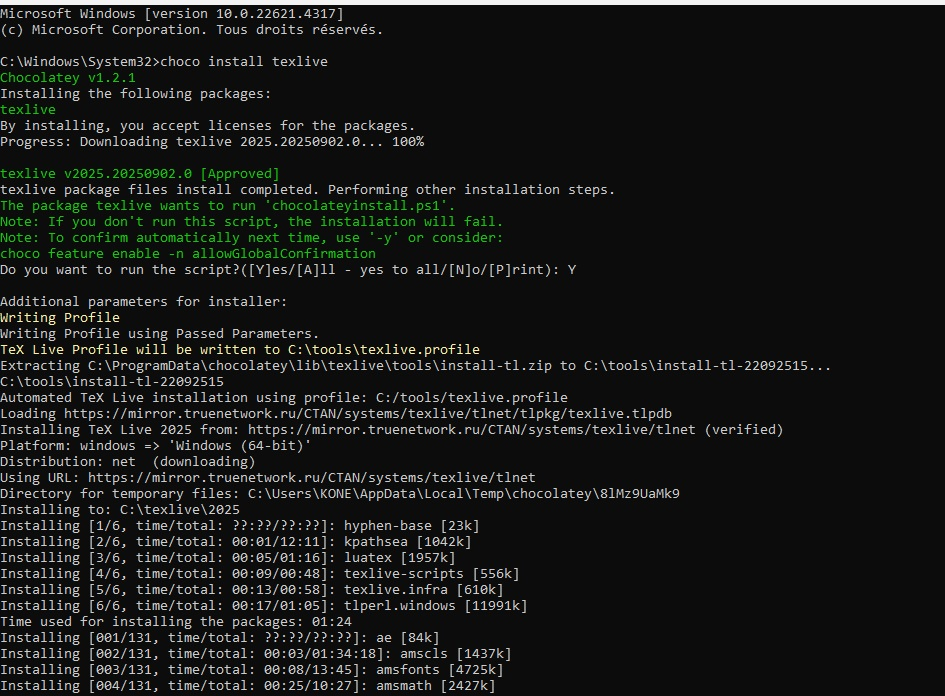

---
## Front matter
lang: en-US
title: Laboratory Work Report No. 1
subtitle: Practical Scientific Writing
author:
  - Kone Siriki
institute:
  - Peoples' Friendship University of Russia, Moscow, Russia
  - Joint Institute for Nuclear Research, Dubna, Russia
date: September 22, 2025

## i18n babel
babel-lang: english
babel-otherlangs: russian

## Formatting pdf
toc: false
toc-title: Table of Contents
slide_level: 2
aspectratio: 169
section-titles: true
theme: metropolis
header-includes:
 - \metroset{progressbar=frametitle,sectionpage=progressbar,numbering=fraction}
---

# Information

## Presenter

:::::::::::::: {.columns align=center}
::: {.column width="70%"}

  * Kone Siriki
  * Physics and Mathematics Student
  * Professor at the Department of Applied Informatics and Probability Theory
  * Peoples' Friendship University of Russia
  * [konesirisil@yandex.ru](mailto:sirikisil@yandex.ru)
  * <https://github.com/skone19>

:::
::: {.column width="30%"}


:::
::::::::::::::

## Work Objectives and Tasks

The objective of this laboratory work is to install TexLive.

**Tasks:** Review and work with the installation of TexLive.

# Theoretical Introduction

## Installing TeXlive

**TeX Live** — the most complete LaTeX distribution supported by the TeX community.

- Supports a large number of operating systems
- Developed since 1996
- Based on the teTeX distribution
- MacTeX — a variant for MacOS
- Main page: https://www.tug.org/texlive/
- TeX Live — is a distribution with continuous updates as part of the annual version of the distribution

### Installation from distribution packages [@lections]

**Ubuntu:**
```
apt install texlive-full
```

**Windows** (using Chocolatey package manager):
```
choco install texlive
```

### Manual installation

- Links on the site are to mirrors. The mirror is selected automatically
- Download the installer:
  - **Unix:** https://mirror.ctan.org/systems/texlive/tlnet/install-tl-unx.tar.gz
    ```
    cd /tmp/
    wget https://mirror.ctan.org/systems/texlive/tlnet/install-tl-unx.tar.gz
    ```
  - **Windows:** https://mirror.ctan.org/systems/texlive/tlnet/install-tl-windows.exe

**For Windows:** Run the executable file and install.

**For Linux:**
- Unpack the downloaded file:
  ```
  tar xzvf install-tl-unx.tar.gz
  ```
- Go to the unpacked directory and run the installer:
  ```
  cd install-tl-[0-9]*
  sudo ./install-tl
  ```
- It is recommended to create links to executable files in the `/usr/local/bin` directory. To do this, in the console version of the utility, select the O option, and then L. To return to the previous menu, use R.

## Updating to the next version of TeXlive

It is recommended to install the new version of TeX Live separately.

- But you can do a manual update using an existing installation
- Let's assume that our architecture is x86_64-linux
- If you have installed symbolic links to system directories (via installer option or `tlmgr path add`), remove them:

### 1.1 Installing TeX Live

```
tlmgr path remove
```

- Move the entire TeX Live directory to match the new version, for example:
  ```
  mv /usr/local/texlive/2024/ /usr/local/texlive/2025
  ```

- Remove package backups:
  ```
  rm /usr/local/texlive/2025/tlpkg/backups/*
  ```

- Create links to executables:
  ```
  /usr/local/texlive/2025/bin/x86_64-linux/tlmgr path add
  ```

- Download the latest version of the script update-tlmgr-latest.sh:
  ```
  wget https://mirror.ctan.org/systems/texlive/tlnet/update-tlmgr-latest.sh -O /tmp/update-tlmgr-latest.sh
  ```

- Run the script:
  ```
  sh /tmp/update-tlmgr-latest.sh --upgrade
  ```

- If you do not want to use the default repository for downloading new files, then replace it:
  ```
  tlmgr option repository <reponame>
  ```

- Update the TeX Live package manager:
  ```
  tlmgr update --self
  ```

- Update TeX Live packages:
  ```
  tlmgr update --all
  ```

- Set symbolic links to executables in system directories (/usr/local/bin):
  ```
  tlmgr path add
  ```

## LaTeX Basics

- You can recreate the cache lualatex under the user:
  ```
  mv ~/.texlive2024 ~/.texlive2025
  luaotfload-tool -fu
  ```

- If you don't do this, the cache will be recreated on the first run of lualatex.

# Laboratory Work Execution

## Before installing TeXlive

(see Fig. [-@fig:001])

{ #fig:001 width=100% }

## After installing TeXlive

(see Fig. [-@fig:002])

{ #fig:002 width=100% }

(see Fig. [-@fig:003])

{ #fig:003 width=100% }

## Verifying TeXlive installation

(see Fig. [-@fig:004])

{ #fig:004 width=100% }

# Conclusion

Thus, the objective of installing TeXlive was achieved.

## {.standout}

Thank you for your attention
