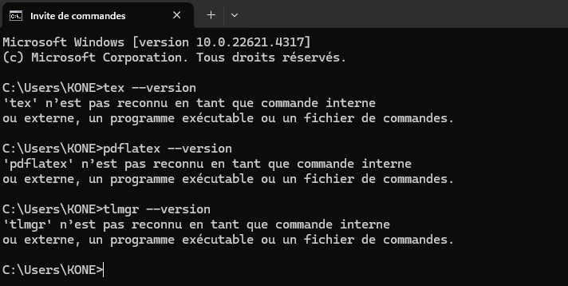
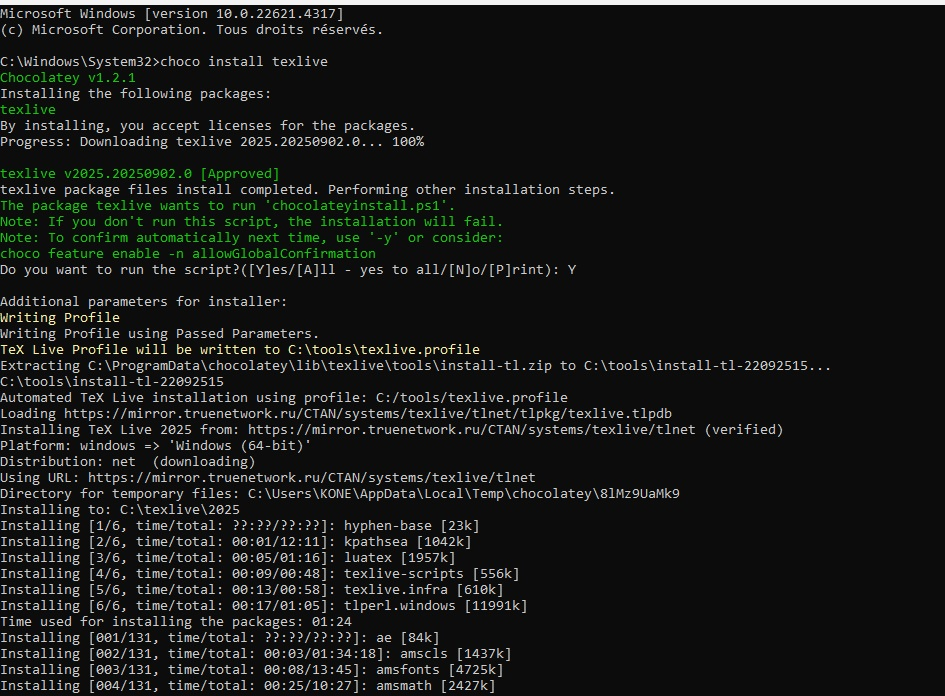
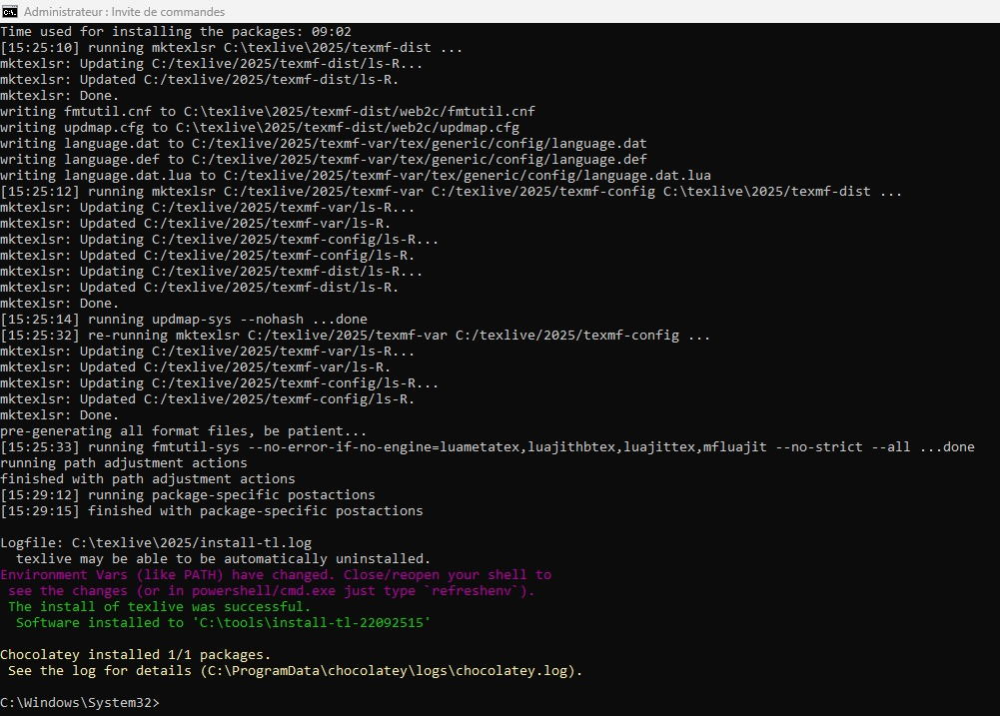
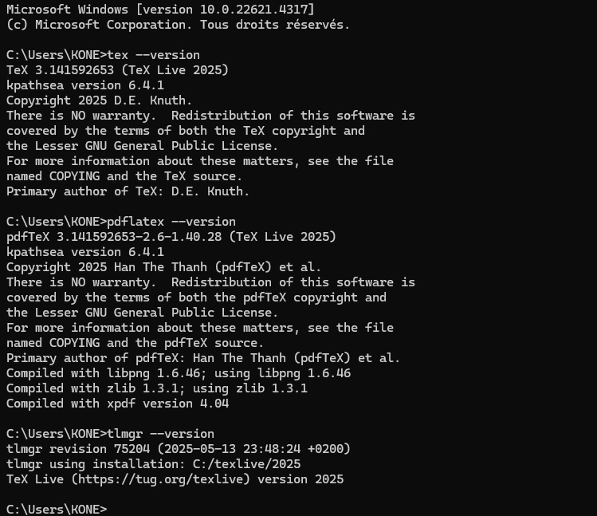

---
## Front matter
title: "Отчёта по лабораторной работе №1"
subtitle: "Практическое научное письмо"
author: "Коне Сирики"

## Generic otions
lang: ru-RU
toc-title: "Содержание"

## Bibliography
bibliography: bib/cite.bib
csl: pandoc/csl/gost-r-7-0-5-2008-numeric.csl

## Pdf output format
toc: true # Table of contents
toc-depth: 2
lof: true # List of figures
lot: true # List of tables
fontsize: 12pt
linestretch: 1.5
papersize: a4
documentclass: scrreprt
## I18n polyglossia
polyglossia-lang:
  name: russian
  options:
	- spelling=modern
	- babelshorthands=true
polyglossia-otherlangs:
  name: english
## I18n babel
babel-lang: russian
babel-otherlangs: english
## Fonts
mainfont: IBM Plex Serif
romanfont: IBM Plex Serif
sansfont: IBM Plex Sans
monofont: IBM Plex Mono
mathfont: STIX Two Math
mainfontoptions: Ligatures=Common,Ligatures=TeX,Scale=0.94
romanfontoptions: Ligatures=Common,Ligatures=TeX,Scale=0.94
sansfontoptions: Ligatures=Common,Ligatures=TeX,Scale=MatchLowercase,Scale=0.94
monofontoptions: Scale=MatchLowercase,Scale=0.94,FakeStretch=0.9
mathfontoptions:
## Biblatex
biblatex: true
biblio-style: "gost-numeric"
biblatexoptions:
  - parentracker=true
  - backend=biber
  - hyperref=auto
  - language=auto
  - autolang=other*
  - citestyle=gost-numeric
## Pandoc-crossref LaTeX customization
figureTitle: "Рис."
tableTitle: "Таблица"
listingTitle: "Листинг"
lofTitle: "Список иллюстраций"
lotTitle: "Список таблиц"
lolTitle: "Листинги"
## Misc options
indent: true
header-includes:
  - \usepackage{indentfirst}
  - \usepackage{float} # keep figures where there are in the text
  - \floatplacement{figure}{H} # keep figures where there are in the text
---

# Цель работы

Целью данной лабораторной работы является установка TexLive

# Теоретическое введение

### Installing TeXlive

 **TeX Live** — the most complete LaTeX distribution supported by the TeX community.
• Supports a large number of operating systems.
• Developed since 1996.
• Based on the teTeX distribution.
• MacTeX — a variant for MacOS.
• Main page: https://www.tug.org/texlive/.•
• TeX Live — is a distribution with continuous updates as part of the annual
version of the distribution.

> **Installation from distribution packages** [@lections]
>
> • Ubuntu:
apt install texlive-full
>
> • Windows. Use the Chocolatey package manager.
choco install texlive
>
### Manual installation

• Links on the site are to mirrors. The mirror is selected automatically.
• Download the installer:
• Unix: https://mirror.ctan.org/systems/texlive/tlnet/install-tl-unx.tar.gz
cd /tmp/
wget \
https://mirror.ctan.org/systems/texlive/tlnet/install-tl-unx.tar.gz
• Windows: https://mirror.ctan.org/systems/texlive/tlnet/install-tl-windows.exe
• For Windows: run the executable file and install.
• For Linux
• Unpack the downloaded file:
tar xzvf install-tl-unx.tar.gz
• Go to the unpacked directory and run the installer:
cd install-tl-[0-9]*
sudo ./install-tl
• It is recommended to create links to executable files in the /usr/local/bin
directory. To do this, in the console version of the utility, select the O option,
and then L. To return to the previous menu, use R.

# Updating to the next version of TeXlive

It is recommended to install the new version of TeX Live separately.

• But you can do a manual update using an existing installation.
• Let's assume that our architecture is x86_64-linux.
• If you have installed symbolic links to system directories (via installer option or tlmgr path add), remove them:

1.1 Installing TeX Live

```
tlmgr path remove
```

• Move the entire TeX Live directory to match the new version, for example:
```bash
mv /usr/local/texlive/2024/ /usr/local/texlive/2025
```

• Remove package backups:
```bash
rm /usr/local/texlive/2025/tlpkg/backups/*
```

• Create links to executables:
```bash
/usr/local/texlive/2025/bin/x86_64-linux/tlmgr path add
```

• Download the latest version of the script update-tlmgr-latest.sh:
```bash
wget https://mirror.ctan.org/systems/texlive/tlnet/update-tlmgr-latest.sh \
-O /tmp/update-tlmgr-latest.sh
```

• Run the script:
```
sh /tmp/update-tlmgr-latest.sh --upgrade
```

• If you do not want to use the default repository for downloading new files, then replace it:
```
tlmgr option repository <reponame>
```

• Update the TeX Live package manager:
```
tlmgr update --self
```

• Update TeX Live packages:
```
tlmgr update --all
```

• Set symbolic links to executables in system directories (/usr/local/bin):
```
tlmgr path add
```
## 1 LaTeX basics

• You can recreate the cache lualatex under the user:
```
mv ~/.texlive2024 ~/.texlive2025
luaotfload-tool -fu
```

• If you don't do this, the cache will be recreated on the first run of lualatex.

# Выполнение лабораторной работы

##  Перед установка teXlive

 (см. Рис. [-@fig:001]).

{ #fig:001 width=100% }


## После установки teXlive

 (см. Рис. [-@fig:002]).

{ #fig:002 width=100% }

(см. Рис. [-@fig:003]).

{ #fig:003 width=100% }

## Проверка установление teXlive

 (см. Рис. [-@fig:004]).

{ #fig:004 width=100% }

# Выводы
Таким образом, была достигнута цель установил TeXlive.

# Список литературы{.unnumbered}

::: {#refs}
:::
