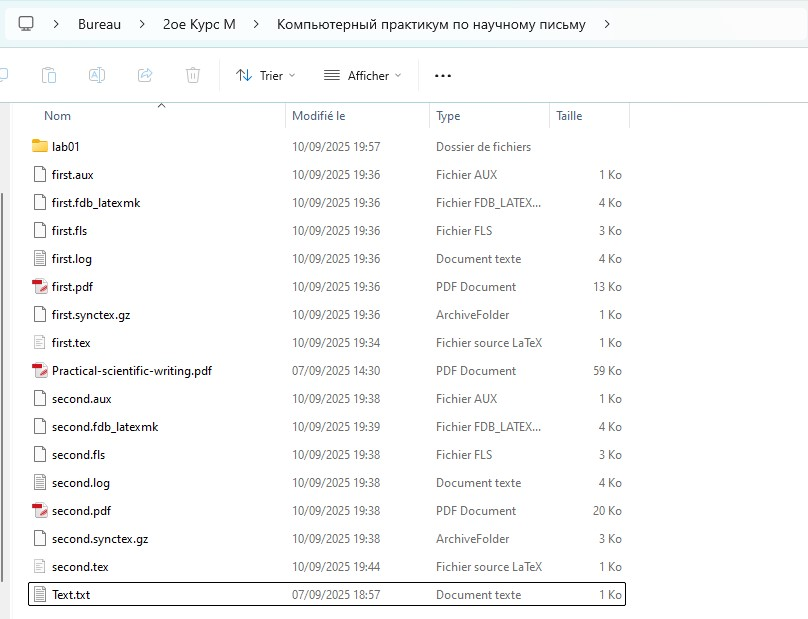

---
## Front matter
lang: en-US
title: Laboratory Work Report No. 2
subtitle: Practical Scientific Writing
author:
  - Kone Siriki
institute:
  - Peoples' Friendship University of Russia, Moscow, Russia
  - Joint Institute for Nuclear Research, Dubna, Russia
date: September 22, 2025

## i18n babel
babel-lang: english
babel-otherlangs: russian

## Formatting pdf
toc: false
toc-title: Table of Contents
slide_level: 2
aspectratio: 169
section-titles: true
theme: metropolis
header-includes:
 - \metroset{progressbar=frametitle,sectionpage=progressbar,numbering=fraction}
---

# Information

## Presenter

:::::::::::::: {.columns align=center}
::: {.column width="70%"}

  * Kone Siriki
  * Physics and Mathematics Student
  * Professor at the Department of Applied Informatics and Probability Theory
  * Peoples' Friendship University of Russia
  * [konesirisil@yandex.ru](mailto:sirikisil@yandex.ru)
  * <https://github.com/skone19>

:::
::: {.column width="30%"}


:::
::::::::::::::

## Work Objectives and Tasks

The objective of this laboratory work is to familiarize with the document structure in LaTeX.

**Tasks:** Review and work with the document structure in TexLive:

1. Try adding text to your first document, typesetting and seeing the changes in your PDF.
2. Make some different paragraphs and add variable spaces.
3. Explore how your editor works; click on your source and find how to go to the same line in your PDF.
4. Try adding some hard spaces and see how they influence line-breaking.

# Theoretical Introduction

## Basic LaTeX Document Structure

```latex
\documentclass{article}
\usepackage[T1]{fontenc}
\begin{document}
Hey world!
This is a first document.
\end{document}
```

(see Fig. [-@fig:001])

{ #fig:001 width=100% }

## Running LaTeX

### Compilation Process

(see Fig. [-@fig:002])

{ #fig:002 width=100% }

(see Fig. [-@fig:003])

{ #fig:003 width=100% }

(see Fig. [-@fig:004])

{ #fig:004 width=100% }

(see Fig. [-@fig:005])

{ #fig:005 width=100% }

## TeXlive Document with Footer

### Adding Footnotes and Formatting

```latex
\documentclass[a4paper,12pt]{article} % The document class with options
% select T1 font encoding: suitable for Western European Latin scripts
\usepackage[T1]{fontenc}
% A comment in the preamble
\begin{document}
% This is a comment
This is a simple
document\footnote{with a footnote}
This is a new paragraph.
\end{document}
```

(see Fig. [-@fig:006])

{ #fig:006 width=100% }

(see Fig. [-@fig:007])

{ #fig:007 width=100% }

(see Fig. [-@fig:008])

{ #fig:008 width=100% }

# Laboratory Work Execution

## Task 1: Creating First Document

### Adding Text and Typesetting

(see Fig. [-@fig:009])

{ #fig:009 width=100% }

```latex
\documentclass[a4paper,12pt]{article} % Document class
\usepackage[T1]{fontenc} % Font encoding

\begin{document}

Hello world!

This is my first document with \LaTeX.

% --- Paragraph 1 ---
Here is a first paragraph.  
It contains several sentences to test the PDF rendering.  
We can write text freely.    

% --- Paragraph 2 ---
Here is a second paragraph.   
Look: even if I put       many spaces between words,   
LaTeX automatically reduces them to a single space.  

% --- Paragraph 3 ---
With non-breaking spaces (hard spaces):  
Mr.~Dupont lives in Paris~7th district.  
We can see that "Mr." stays attached to "Dupont", and that "Paris 7th" cannot be broken at the end of a line.

% --- Paragraph 4 ---
Another example:  
Chapter~1 presents the introduction.  
Without the ~, LaTeX could have separated "chapter" and "1" on two lines.

\end{document}
```

## Task 2: Paragraphs and Variable Spaces

### Creating Different Paragraph Structures

(see Fig. [-@fig:010])

{ #fig:010 width=100% }

## Task 3 & 4: Editor Exploration and Hard Spaces

### Editor Features and Line-breaking Control

{ #fig:011 width=100% }

(see Fig. [-@fig:012])

{ #fig:012 width=100% }

# Conclusion

Thus, the objective of installing TeXlive was achieved, and I became familiar with working with its structure as well as with the LaTeX system. The laboratory work allowed me to practice creating LaTeX documents, understanding paragraph formatting, and using non-breaking spaces to control line-breaking behavior.

## {.standout}

Thank you for your attention
