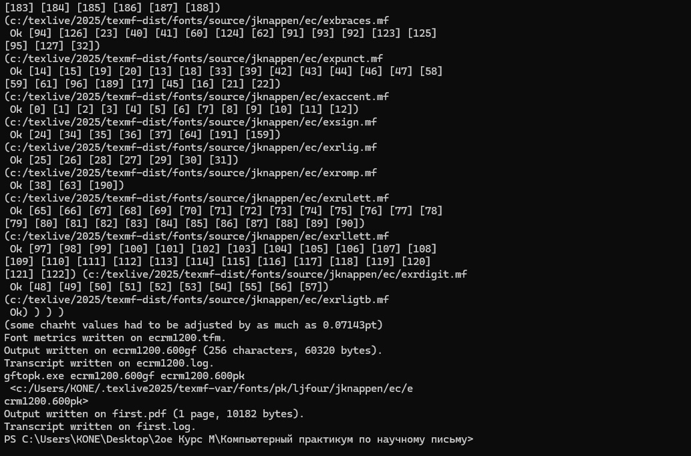
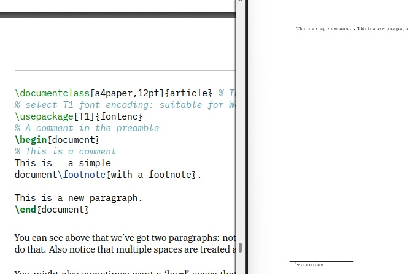

---
## Front matter
title: "Шаблон отчёта по лабораторной работе №2"
subtitle: "Practical scientific writing"
author: "Коне Сирики"

## Generic otions
lang: ru-RU
toc-title: "Содержание"

## Bibliography
bibliography: bib/cite.bib
csl: pandoc/csl/gost-r-7-0-5-2008-numeric.csl

## Pdf output format
toc: true # Table of contents
toc-depth: 2
lof: true # List of figures
lot: true # List of tables
fontsize: 12pt
linestretch: 1.5
papersize: a4
documentclass: scrreprt
## I18n polyglossia
polyglossia-lang:
  name: russian
  options:
	- spelling=modern
	- babelshorthands=true
polyglossia-otherlangs:
  name: english
## I18n babel
babel-lang: russian
babel-otherlangs: english
## Fonts
mainfont: IBM Plex Serif
romanfont: IBM Plex Serif
sansfont: IBM Plex Sans
monofont: IBM Plex Mono
mathfont: STIX Two Math
mainfontoptions: Ligatures=Common,Ligatures=TeX,Scale=0.94
romanfontoptions: Ligatures=Common,Ligatures=TeX,Scale=0.94
sansfontoptions: Ligatures=Common,Ligatures=TeX,Scale=MatchLowercase,Scale=0.94
monofontoptions: Scale=MatchLowercase,Scale=0.94,FakeStretch=0.9
mathfontoptions:
## Biblatex
biblatex: true
biblio-style: "gost-numeric"
biblatexoptions:
  - parentracker=true
  - backend=biber
  - hyperref=auto
  - language=auto
  - autolang=other*
  - citestyle=gost-numeric
## Pandoc-crossref LaTeX customization
figureTitle: "Рис."
tableTitle: "Таблица"
listingTitle: "Листинг"
lofTitle: "Список иллюстраций"
lotTitle: "Список таблиц"
lolTitle: "Листинги"
## Misc options
indent: true
header-includes:
  - \usepackage{indentfirst}
  - \usepackage{float} # keep figures where there are in the text
  - \floatplacement{figure}{H} # keep figures where there are in the text
---

# Цель работы

Целью данной лабораторной работы является ознакомление с работа с структура документа Latex

# Задание
1. Try adding text to your first document, typesetting and seeing the changes in your PDF.
2.  Make some different paragraphs and add variable spaces.
3. Explore how your editor works; click on your source and find how to go to the same line in your PDF.
4. Try adding some hard spaces and see how they influence line-breaking.

# Теоретическое введение

```
 \documentclass{article}
\usepackage[T1]{fontenc}
\begin{document}
Hey world!
This is a first document.
\end{document}
```
(см. Рис. [-@fig:001]).

{ #fig:001 width=100% }

## Running LaTeX

(см. Рис. [-@fig:002]).

{ #fig:002 width=100% }

(см. Рис. [-@fig:003]).

{ #fig:002 width=100% }

(см. Рис. [-@fig:004]).

{ #fig:002 width=100% }

(см. Рис. [-@fig:005]).

{ #fig:003 width=100% }

## Документ TeXlive с нижним колонтитулом

```
\documentclass[a4paper,12pt]{article} % The document class with options
% select T1 font encoding: suitable for Western European Latin scripts
\usepackage[T1]{fontenc}
% A comment in the preamble
\begin{document}
% This is a comment
Trhis is a simple
document\footnote{with a footnote}fi
This is a new paragraph.
\end{document}
```
(см. Рис. [-@fig:006]).

{ #fig:003 width=100% }

(см. Рис. [-@fig:007]).

{ #fig:003 width=100% }

(см. Рис. [-@fig:008]).

{ #fig:003 width=100% }

# Выполнение лабораторной работы

##  Try adding text to your first document, typesetting and seeing the changes in your PDF.

 
 (см. Рис. [-@fig:009]).

{ #fig:002 width=100% }

```
 \documentclass[a4paper,12pt]{article} % Classe de document
\usepackage[T1]{fontenc} % Encodage de la police

\begin{document}

Bonjour le monde !

Ceci est mon premier document avec \LaTeX.

% --- Paragraphe 1 ---
Voici un premier paragraphe.  
Il contient plusieurs phrases pour tester le rendu PDF.  
On peut écrire librement du texte.    

% --- Paragraphe 2 ---
Voici un deuxième paragraphe.   
Regarde : même si je mets       beaucoup d’espaces entre les mots,   
LaTeX les réduit automatiquement à un seul espace.  

% --- Paragraphe 3 ---
Avec les espaces insécables (hard spaces) :  
M.~Dupont habite à Paris~7e arrondissement.  
On voit que "M." reste collé à "Dupont", et que "Paris 7e" ne peut pas être coupé en fin de ligne.

% --- Paragraphe 4 ---
Encore un exemple :  
Le chapitre~1 présente l’introduction.  
Sans le ~, LaTeX aurait pu couper "chapitre" et "1" sur deux lignes.

\end{document}

```

## Make some different paragraphs and add variable spaces.

(см. Рис. [-@fig:010]).

{ #fig:003 width=100% }

## Explore how your editor works; click on your source and find how to go to the same line in your PDF.
## Try adding some hard spaces and see how they influence line-breaking.

{ #fig:005 width=100% }

 (см. Рис. [-@fig:011]).

{ #fig:005 width=100% }

# Выводы
Таким образом, была достигнута цель установил TeXlive, я познакомелся с работа с его структуры а также с системой LaTeX.

# Список литературы{.unnumbered}

::: {#refs}
:::
