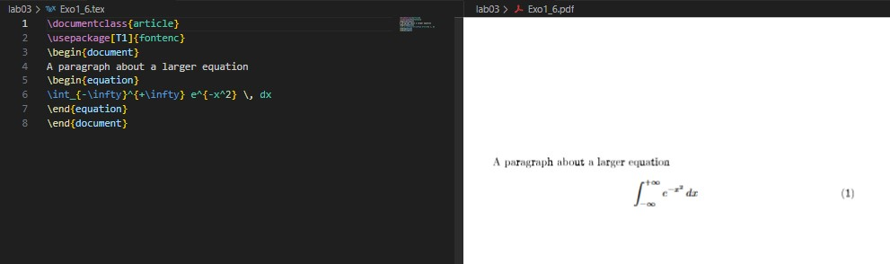

---
## Front matter
lang: ru-RU
title: Отчёт по лабораторной работе №3.  
    
subtitle: Mathematics Typing
author:
  - Коне Сирики
institute:
  - Российский университет дружбы народов, Москва, Россия
  - Объединённый институт ядерных исследований, Дубна, Россия
date: 08 Октября 2025

## i18n babel
babel-lang: russian
babel-otherlangs: english

## Formatting pdf
toc: false
toc-title: Содержание
slide_level: 2
aspectratio: 169
section-titles: true
theme: metropolis
header-includes:
 - \metroset{progressbar=frametitle,sectionpage=progressbar,numbering=fraction}
---
# Информация

## Докладчик

:::::::::::::: {.columns align=center}
::: {.column width="70%"}

  * Коне Сирики
  * Студент физмат
  * профессор кафедры прикладной информатики и теории вероятностей
  * Российский университет дружбы народов
  * [konesirisil@yandex.ru](mailto:sirikisil@yandex.ru)
  * <https://github.com/skone19>

:::
::: {.column width="30%"}

:::
::::::::::::::

## Цель работы

Целью данной лабораторной работы является ознакомление с основами набора математических выражений в LaTeX.

The purpose of this lab work is to learn how to typeset mathematical formulas and equations using LaTeX math mode and related packages.

## Задание

1. Study inline and display math modes.  
2. Use the `amsmath` package to align and format equations.  
3. Apply different math fonts.  
4. Use `mathtools` for advanced formatting.  
5. Try bold math and Unicode math.  
6. Perform the exercises with examples.

# Теоретическое введение

## 3.1 Математический режим / Math mode

В LaTeX существует два математических режима: **inline** и **display**.  
In LaTeX there are two main math modes: inline (within text) and display (centered block).

## 3.1.1 Inline math mode and mathematical notation

:::::::::::::: {.columns align=center}
::: {.column width="50%"}

:::
::::::::::::::

:::::::::::::: {.columns align=center}
::: {.column width="50%"}

 
:::
::::::::::::::

## 3.1.2 Display mathematics

:::::::::::::: {.columns align=center}
::: {.column width="50%"}

:::
::::::::::::::

:::::::::::::: {.columns align=center}
::: {.column width="50%"}

:::
::::::::::::::

:::::::::::::: {.columns align=center}
::: {.column width="50%"}

:::
::::::::::::::

## 3.2 Пакет amsmath / The amsmath package

Пакет `amsmath` расширяет стандартные возможности для набора формул и выравнивания уравнений.
The `amsmath` package enhances math typesetting and alignment.

:::::::::::::: {.columns align=center}
::: {.column width="50%"}

:::
::::::::::::::

:::::::::::::: {.columns align=center}
::: {.column width="50%"}

:::
::::::::::::::

## 3.3 Шрифты в математическом режиме / Fonts in math mode
В математике разные шрифты обозначают разные типы объектов.
Different font commands give different styles and meanings.

:::::::::::::: {.columns align=center}
::: {.column width="50%"}

:::
::::::::::::::

:::::::::::::: {.columns align=center}
::: {.column width="50%"}

:::
::::::::::::::

## 3.4 Дополнительные выравнивания / Further amsmath alignments
Environments like `gather` and `multline` are used for multi-line equations.

## 3.4.1 Columns in math alignments

:::::::::::::: {.columns align=center}
::: {.column width="50%"}

:::
::::::::::::::

:::::::::::::: {.columns align=center}
::: {.column width="50%"}

:::
::::::::::::::

## 3.5 Жирный шрифт в формулах / Bold Math
To bold entire or partial equations, we can use `\boldmath` or the `bm` package.

:::::::::::::: {.columns align=center}
::: {.column width="50%"}

:::
::::::::::::::

:::::::::::::: {.columns align=center}
::: {.column width="50%"}

:::
::::::::::::::

## 3.6 Пакет Mathtools / Mathtools package
`mathtools` builds upon `amsmath` and provides extended features like column alignment in matrices.

## 3.7 Юникодная математика / Unicode Math
Using `unicode-math` with OpenType fonts allows modern mathematical typesetting.

# Выполнение лабораторной работы
## 1. Переключение между режимами / Switching between math modes

## 2. Греческие буквы / Greek letters

## 3. Комбинирование шрифтов / Combining fonts

## 4. Параметры класса документа для уравнений / Equation alignment

:::::::::::::: {.columns align=center}
::: {.column width="50%"}

:::
::::::::::::::

:::::::::::::: {.columns align=center}
::: {.column width="50%"}

:::
::::::::::::::

:::::::::::::: {.columns align=center}
::: {.column width="50%"}

:::
::::::::::::::

## 5. Расширенное использование amsmath / Using Mathtools

## 6. Математика выделена жирным шрифтом с bm / Math in bold with bm

# Выводы
В ходе лабораторной работы №3 я изучил основы набора математических выражений в LaTeX, познакомился с пакетами `amsmath`, `mathtools`, `bm`, и `unicode-math`.
В результате я научился выравнивать уравнения, изменять математические шрифты, делать символы жирными и работать с многострочными выражениями.

As a result, the goal of the lab was achieved: mastering math mode in LaTeX and using key math packages for professional-quality typesetting.

# Список литературы

# Спасибо за внимание
 
