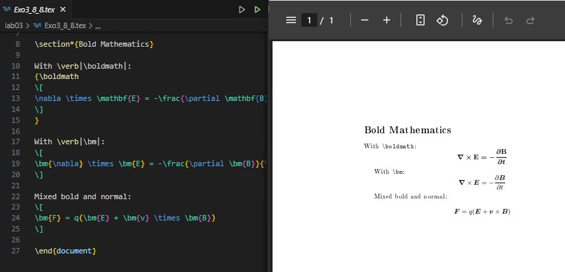

---
## Front matter
title: "Отчёта по лабораторной работе №3"
subtitle: "Mathematics Typing"
author: "Коне Сирики"

## Generic options
lang: ru-RU
toc-title: "Содержание"

## Bibliography
bibliography: bib/cite.bib
csl: pandoc/csl/gost-r-7-0-5-2008-numeric.csl

## Pdf output format
toc: true
toc-depth: 2
lof: true
lot: true
fontsize: 12pt
linestretch: 1.5
papersize: a4
documentclass: scrreprt

## I18n polyglossia
polyglossia-lang:
  name: russian
  options:
    - spelling=modern
    - babelshorthands=true
polyglossia-otherlangs:
  name: english

## I18n babel
babel-lang: russian
babel-otherlangs: english

## Fonts
mainfont: IBM Plex Serif
romanfont: IBM Plex Serif
sansfont: IBM Plex Sans
monofont: IBM Plex Mono
mathfont: STIX Two Math

## Biblatex
biblatex: true
biblio-style: "gost-numeric"

## Misc options
indent: true
header-includes:
  - \usepackage{indentfirst}
  - \usepackage{float}
  - \floatplacement{figure}{H}
---

# Цель работы

Целью данной лабораторной работы является ознакомление с основами набора математических выражений в LaTeX.

The purpose of this lab work is to learn how to typeset mathematical formulas and equations using LaTeX math mode and related packages.

# Задание
1. Study inline and display math modes.  
2. Use the `amsmath` package to align and format equations.  
3. Apply different math fonts.  
4. Use `mathtools` for advanced formatting.  
5. Try bold math and Unicode math.  
6. Perform the exercises with examples.

# Теоретическое введение

## 3.1 Математический режим / Math mode

В LaTeX существует два математических режима: **inline** и **display**.  
In LaTeX there are two main math modes: inline (within text) and display (centered block).

```latex
documentclass{article}
\usepackage[T1]{fontenc}
\begin{document}
A sentence with inline mathematics: $y = mx + c$.

A second sentence with inline mathematics: $5^{2}=3^{2}+4^{2}$.

A second paragraph containing display math.
\[
y = mx + c
\]
See how the paragraph continues after the display.
\end{document}
```
(рис.[-@fig:001])

{#fig:001 width=100% }


### 3.1.1 Inline math mode and mathematical notation

```latex
\documentclass{article}
\usepackage[T1]{fontenc}
\begin{document}
Superscripts $a^{b}$ and subscripts $a_{b}$.
\end{document}
```

(см. Рис. [-@fig:002])

{ #fig:002 width=100% }

```latex
\documentclass{article}
\usepackage[T1]{fontenc}
\begin{document}
Some mathematics: $y = 2 \sin \theta^{2}$.
\end{document}
```

(см. Рис. [-@fig:003])

{ #fig:003 width=100% }

### 3.1.2 Display mathematics

```latex
\documentclass{article}
\usepackage[T1]{fontenc}
\begin{document}
A paragraph about a larger equation
\[
\int_{-\infty}^{+\infty} e^{-x^2} \, dx
\]
\end{document}
```

(см. Рис. [-@fig:004])

{ #fig:004 width=100% }

```latex
\documentclass{article}
\usepackage[T1]{fontenc}
\newcommand{\diff}{\mathop{}\!d} % For italic
% \newcommand{\diff}{\mathop{}\!\mathrm{d}} % For upright
\begin{document}
A paragraph about a larger equation
\[
\int_{-\infty}^{+\infty} e^{-x^2} \diff x
\]
\end{document}
```

(см. Рис. [-@fig:005])

{ #fig:005 width=100% }

```latex
\documentclass{article}
\usepackage[T1]{fontenc}
\begin{document}
A paragraph about a larger equation
\begin{equation}
\int_{-\infty}^{+\infty} e^{-x^2} \, dx
\end{equation}
\end{document}
```

(см. Рис. [-@fig:006])

{ #fig:006 width=100% }

## 3.2 Пакет amsmath / The amsmath package

Пакет `amsmath` расширяет стандартные возможности для набора формул и выравнивания уравнений.
The `amsmath` package enhances math typesetting and alignment.

```latex
\documentclass{article}
\usepackage[T1]{fontenc}
\usepackage{amsmath}
\begin{document}
\begin{align*}
Q_{n,k} &= Q_{n-1,k} + Q_{n-1,k-1} + \binom{n}{k}, \\
&\quad \text{for } n,k>0.
\end{align*}
\end{document}
```
(см. Рис. [-@fig:007])

{ #fig:007 width=100% }

(см. Рис. [-@fig:008])

{ #fig:008 width=100% }

## 3.3 Шрифты в математическом режиме / Fonts in math mode

В математике разные шрифты обозначают разные типы объектов.
Different font commands give different styles and meanings.

```latex
\documentclass{article}
\usepackage{amsmath}
\begin{document}
$\mathrm{A}, \mathit{A}, \mathbf{A}, \mathsf{A}, \mathtt{A}, \mathbb{A}$
\end{document}
```

(см. Рис. [-@fig:009])

{ #fig:008 width=100% }

(см. Рис. [-@fig:010])

{ #fig:010 width=100% }


## 3.4 Дополнительные выравнивания / Further amsmath alignments

Environments like `gather` and `multline` are used for multi-line equations.

```latex
\documentclass{article}
\usepackage{amsmath}
\begin{document}
\begin{gather}
P(x)=ax^{5}+bx^{4}+cx^{3}+dx^{2}+ex+f\\
x^2+x=10
\end{gather}
\end{document}
```

(см. Рис. [-@fig:011])

{ #fig:011 width=100% }

## 3.4.1 Columns in math alignments

(см. Рис. [-@fig:012])

{ #fig:012 width=100% }

(см. Рис. [-@fig:013])

{ #fig:013 width=100% }

## 3.5 Жирный шрифт в формулах / Bold Math

To bold entire or partial equations, we can use `\boldmath` or the `bm` package.

```latex
\documentclass{article}
\usepackage{bm}
\begin{document}
$(x+\bm{y})(x-\bm{y}) = x^2 - \bm{y}^2$
\end{document}
```

(см. Рис. [-@fig:014])

{ #fig:014 width=100% }

(см. Рис. [-@fig:015])

{ #fig:015 width=100% }

## 3.6 Пакет Mathtools / Mathtools package

`mathtools` builds upon `amsmath` and provides extended features like column alignment in matrices.

```latex
\documentclass{article}
\usepackage{mathtools}
\begin{document}
\[
\begin{pmatrix*}[r]
10 & 11 \\
1 & 2 \\
-5 & -6
\end{pmatrix*}
\]
\end{document}
```

(см. Рис. [-@fig:016])

{ #fig:016 width=100% }

## 3.7 Юникодная математика / Unicode Math

Using `unicode-math` with OpenType fonts allows modern mathematical typesetting.

```latex
\documentclass{article}
\usepackage{unicode-math}
\setmainfont{TeX Gyre Pagella}
\setmathfont{TeX Gyre Pagella Math}
\begin{document}
\[
\log \alpha + \log \beta = \log(\alpha\beta)
\]
\end{document}
```

(см. Рис. [-@fig:017])

{ #fig:017 width=100% }

# Выполнение лабораторной работы

## 3.8 Упражнения / Exercises

### 1. Переключение между режимами / Switching between math modes

(см. Рис. [-@fig:018])
{ #fig:018 width=100% }

### 2. Греческие буквы / Greek letters

(см. Рис. [-@fig:019])
{ #fig:019 width=100% }

### 3. Комбинирование шрифтов / Combining fonts

(см. Рис. [-@fig:020])
{ #fig:020 width=100% }

### 4. Параметры класса документа для уравнений / Equation alignment

(см. Рис. [-@fig:021])
{ #fig:021 width=100% }

(см. Рис. [-@fig:022])
{ #fig:022 width=100% }

(см. Рис. [-@fig:023])
{ #fig:023 width=100% }

### 5. Расширенное использование amsmath / Using Mathtools

(см. Рис. [-@fig:024])
{ #fig:024 width=100% }

### 6. Математика выделена жирным шрифтом с bm / Math in bold with bm

(см. Рис. [-@fig:025])
{ #fig:025 width=100% }

# Выводы
В ходе лабораторной работы №3 я изучил основы набора математических выражений в LaTeX, познакомился с пакетами `amsmath`, `mathtools`, `bm`, и `unicode-math`.
В результате я научился выравнивать уравнения, изменять математические шрифты, делать символы жирными и работать с многострочными выражениями.

As a result, the goal of the lab was achieved: mastering math mode in LaTeX and using key math packages for professional-quality typesetting.

# Список литературы{.unnumbered}

::: {#refs}
:::
