---
## Front matter
lang: ru-RU
title: Отчёт по лабораторной работе №4  
subtitle: Including Graphics
author:
  - Коне Сирики
institute:
  - Российский университет дружбы народов, Москва, Россия
  - Объединённый институт ядерных исследований, Дубна, Россия
date: 20 Октября 2025

## i18n babel
babel-lang: russian
babel-otherlangs: english

## Formatting pdf
toc: false
toc-title: Содержание
slide_level: 2
aspectratio: 169
section-titles: true
theme: metropolis
header-includes:
 - \metroset{progressbar=frametitle,sectionpage=progressbar,numbering=fraction}
---

# Информация

## Докладчик

:::::::::::::: {.columns align=center}
::: {.column width="70%"}

  * Коне Сирики
  * Студент физмат
  * Российский университет дружбы народов
  * [konesirisil@yandex.ru](mailto:sirikisil@yandex.ru)
  * <https://github.com/skone19>

:::
::: {.column width="30%"}

:::
::::::::::::::

## Цель работы

Целью данной лабораторной работы является ознакомление с основами включения графики в документы LaTeX.

The purpose of this lab work is to learn how to include and manipulate graphics in LaTeX documents using the graphicx package and related tools.

## Задание

1. Study basic image inclusion with graphicx package
2. Learn to modify graphic appearance (size, rotation, scaling)
3. Understand float environments for image placement
4. Practice file naming and organization best practices
5. Learn cross-referencing for figures
6. Explore different float types and positioning options
7. Complete the exercises with practical examples

# Теоретическое введение

## 4 Включение графики / Including Graphics

Для включения внешних изображений в LaTeX используется пакет `graphicx`, который предоставляет команду `\includegraphics`.
To include external images in LaTeX, use the `graphicx` package which provides the `\includegraphics` command.

## 4.1 Изменение внешнего вида графики / Altering Graphic Appearance

Команда `\includegraphics` имеет множество опций для управления размером и формой изображений.
The `\includegraphics` command has many options to control image size and appearance.

{width=80%}

## 4.2 Создание плавающих изображений / Making Images Float

Изображения обычно включаются как плавающие объекты (floats) чтобы избежать больших пробелов на странице.
Images are typically included as floats to avoid large gaps on the page.

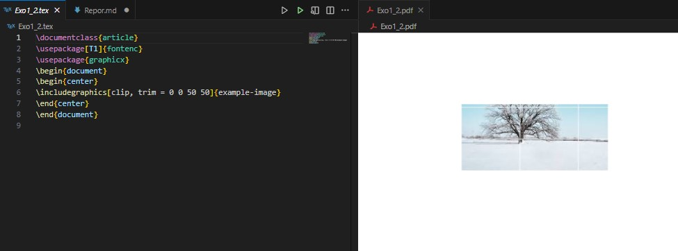{width=80%}

## 4.3 Размещение плавающих объектов / Placing Floats

Пакет `float` предоставляет опцию `H` для точного размещения плавающих объектов.
The `float` package provides the `H` option for precise float placement.

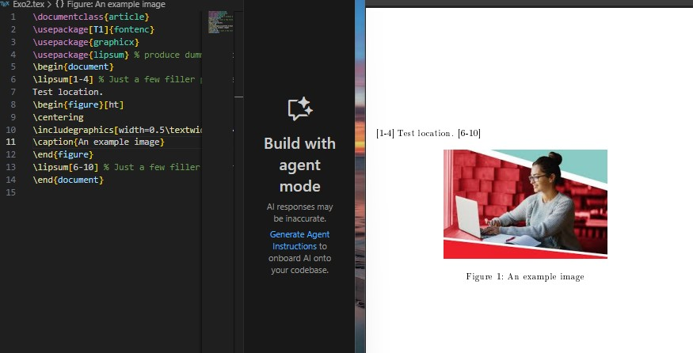{width=80%}

## 4.4 Перекрёстные ссылки / Cross-referencing

Механизм `\label` и `\ref` позволяет создавать ссылки на пронумерованные элементы.
The `\label` and `\ref` mechanism allows creating references to numbered elements.

:::::::::::::: {.columns align=center}
::: {.column width="50%"}

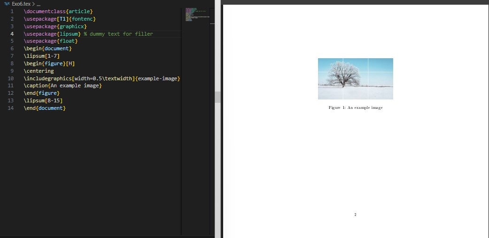{width=90%}

:::
::: {.column width="50%"}

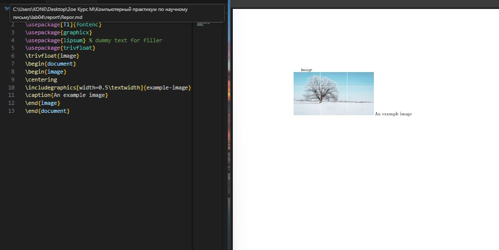{width=90%}

:::
::::::::::::::

# Выполнение лабораторной работы

## Упражнение 1-2: Включение изображений и опции размера

:::::::::::::: {.columns align=center}
::: {.column width="50%"}

**Упражнение 1**
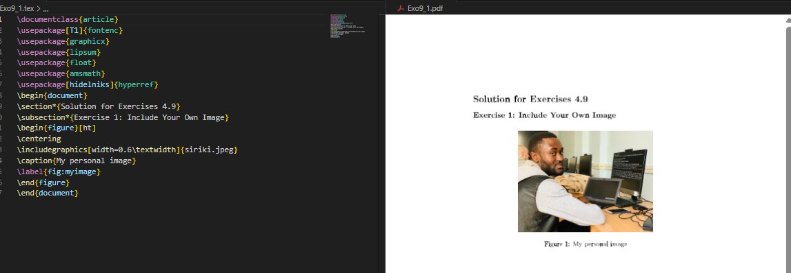{width=90%}

:::
::: {.column width="50%"}

**Упражнение 2**
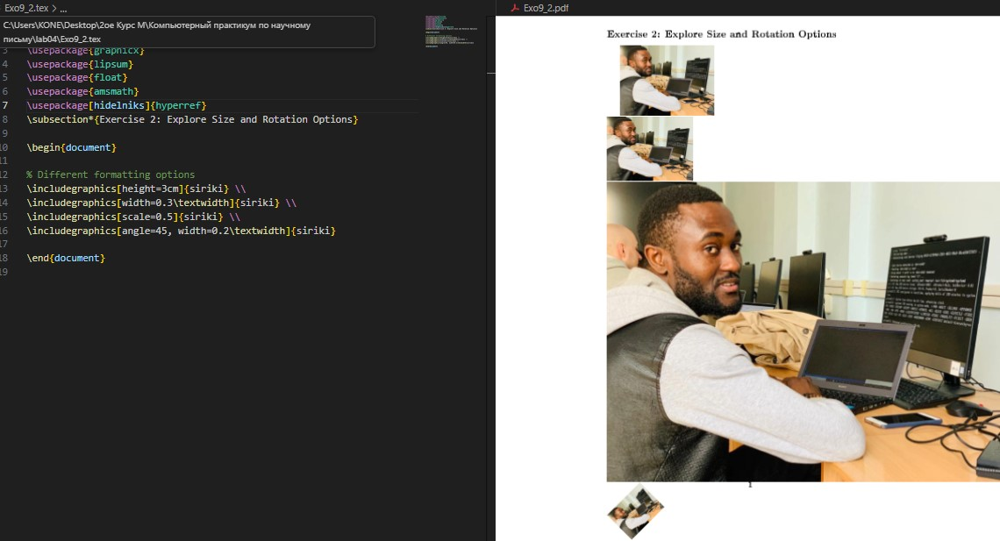{width=90%}

:::
::::::::::::::

## Упражнение 3-4: Сравнение размеров и размещение

:::::::::::::: {.columns align=center}
::: {.column width="50%"}

**Упражнение 3**
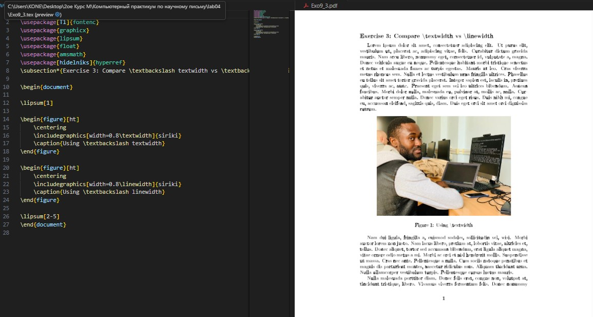{width=90%}

:::
::: {.column width="50%"}

**Упражнение 4**
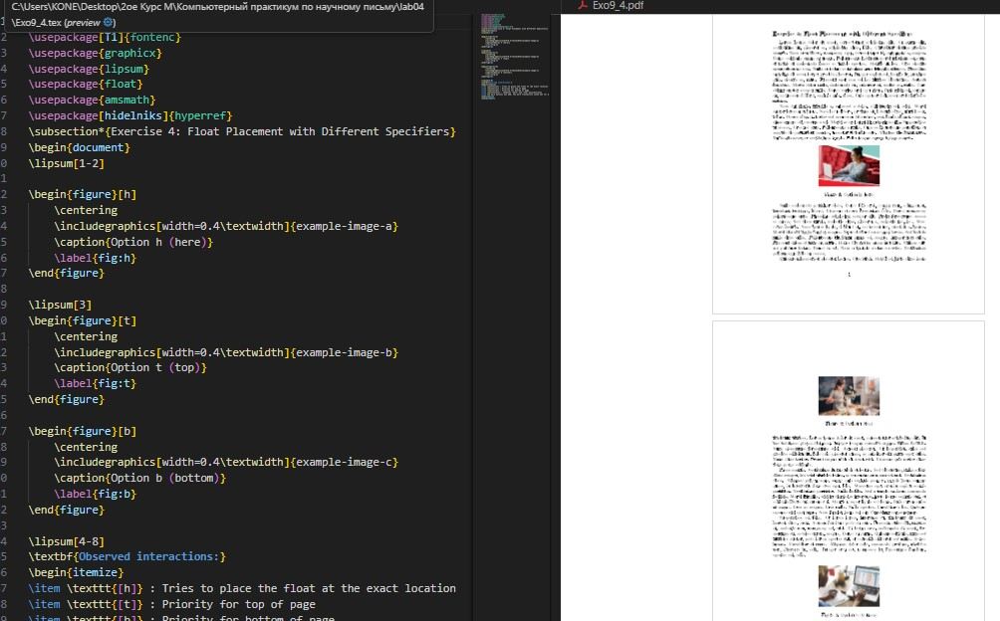{width=90%}

:::
::::::::::::::

## Упражнение 5-7: Перекрёстные ссылки

:::::::::::::: {.columns align=center}
::: {.column width="33%"}

**Упражнение 5**
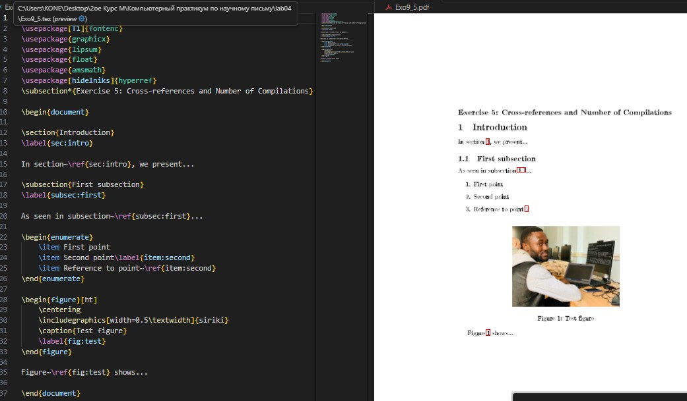{width=85%}

:::
::: {.column width="33%"}

**Упражнение 6**
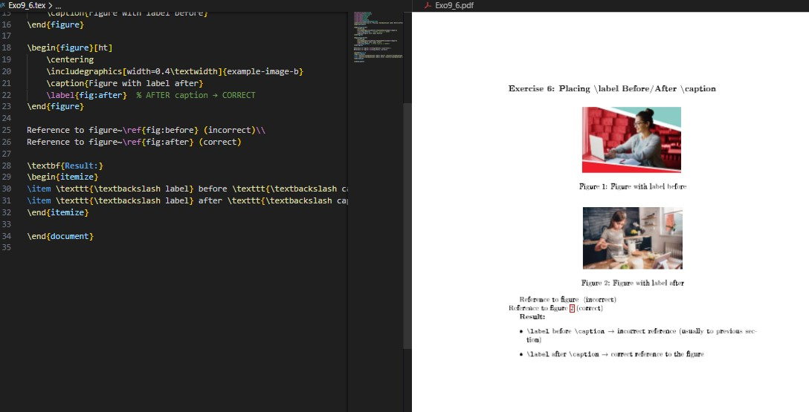{width=85%}

:::
::: {.column width="33%"}

**Упражнение 7**
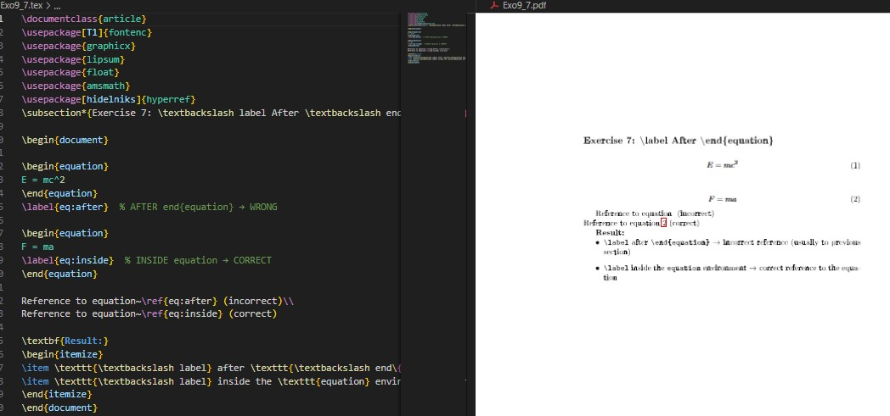{width=85%}

:::
::::::::::::::

# Выводы

В ходе лабораторной работы №4 я изучил основы включения и управления графикой в документах LaTeX. Освоил работу с пакетом `graphicx`, научился создавать плавающие объекты, управлять их размещением и создавать перекрёстные ссылки на изображения.

In this lab work #4, I learned the fundamentals of including and manipulating graphics in LaTeX documents. I mastered the `graphicx` package, learned to create float objects, control their placement, and create cross-references to images.

# Список литературы

# Спасибо за внимание