---
## Front matter
title: "Отчёт по лабораторной работе №4"
subtitle: "Including Graphics"
author: "Коне Сирики"

## Generic options
lang: ru-RU
toc-title: "Содержание"

## Bibliography
bibliography: bib/cite.bib
csl: pandoc/csl/gost-r-7-0-5-2008-numeric.csl

## Pdf output format
toc: true
toc-depth: 2
lof: true
lot: true
fontsize: 12pt
linestretch: 1.5
papersize: a4
documentclass: scrreprt

## I18n polyglossia
polyglossia-lang:
  name: russian
  options:
    - spelling=modern
    - babelshorthands=true
polyglossia-otherlangs:
  name: english

## I18n babel
babel-lang: russian
babel-otherlangs: english

## Fonts
mainfont: IBM Plex Serif
romanfont: IBM Plex Serif
sansfont: IBM Plex Sans
monofont: IBM Plex Mono
mathfont: STIX Two Math

## Biblatex
biblatex: true
biblio-style: "gost-numeric"

## Misc options
indent: true
header-includes:
  - \usepackage{indentfirst}
  - \usepackage{float}
  - \floatplacement{figure}{H}
---

# Цель работы

Целью данной лабораторной работы является ознакомление с основами включения графики в документы LaTeX.

The purpose of this lab work is to learn how to include and manipulate graphics in LaTeX documents using the graphicx package and related tools.

# Задание
1. Study basic image inclusion with graphicx package
2. Learn to modify graphic appearance (size, rotation, scaling)
3. Understand float environments for image placement
4. Practice file naming and organization best practices
5. Learn cross-referencing for figures
6. Explore different float types and positioning options
7. Complete the exercises with practical examples

# Теоретическое введение

## 4 Включение графики / Including Graphics

Для включения внешних изображений в LaTeX используется пакет `graphicx`, который предоставляет команду `\includegraphics`.
To include external images in LaTeX, use the `graphicx` package which provides the `\includegraphics` command.

```latex
\documentclass{article}
\usepackage[T1]{fontenc}
\usepackage{graphicx}
\begin{document}
This picture
\begin{center}
\includegraphics[height=2cm]{example-image}
\end{center}
is an imported PDF.
\end{document}
```

## 4.1 Изменение внешнего вида графики / Altering Graphic Appearance

Команда `\includegraphics` имеет множество опций для управления размером и формой изображений.
The `\includegraphics` command has many options to control image size and appearance.

```latex
\documentclass{article}
\usepackage[T1]{fontenc}
\usepackage{graphicx}

\begin{document}
\begin{center}
    \includegraphics[height=0.5\textheight]{example-image}
\end{center}
Некоторый текст
\begin{center}
    \includegraphics[width=0.5\textwidth]{example-image}
\end{center}
\end{document}
```
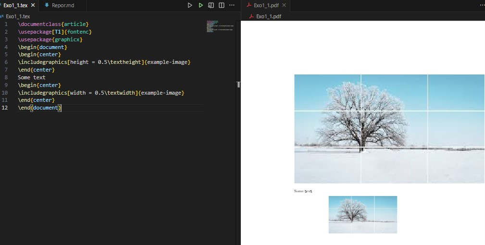{ #fig:001 width=100% }


```latex
\documentclass{article}
\usepackage[T1]{fontenc}
\usepackage{graphicx}

\begin{document}
\begin{center}
    \includegraphics[clip, trim=0 0 50 50]{example-image}
\end{center}
\end{document}
```

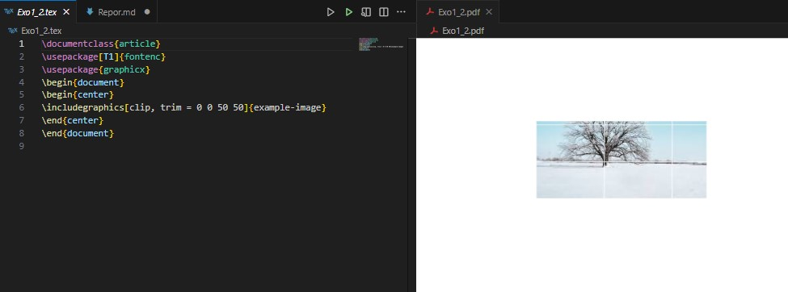{ #fig:002 width=100% }

## 4.2 Создание плавающих изображений / Making Images Float

Изображения обычно включаются как плавающие объекты (floats) чтобы избежать больших пробелов на странице.
Images are typically included as floats to avoid large gaps on the page.

```latex
\documentclass{article}
\usepackage[T1]{fontenc}
\usepackage{graphicx}
\usepackage{lipsum} % produce dummy text as filler
\begin{document}
\lipsum[1-4] % Just a few filler paragraphs
Test location.
\begin{figure}[ht]
\centering
\includegraphics[width=0.5\textwidth]{example-image-a.png}
\caption{An example image}
\end{figure}
\lipsum[6-10] % Just a few filler paragraphs
\end{document}
```
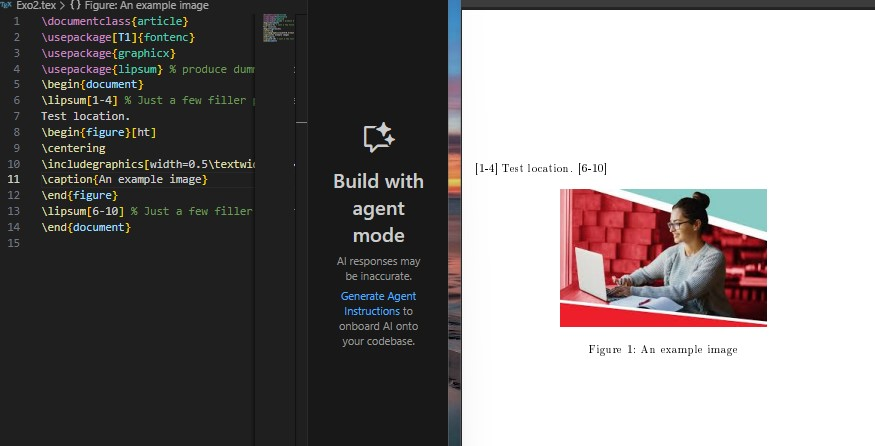{ #fig:003 width=100% }

## 4.3 Именование графических файлов / Naming Graphics Files

Рекомендуется использовать простые имена файлов без пробелов и специальных символов.
It's recommended to use simple file names without spaces or special characters.

```latex
\includegraphics[width=30pt]{pics/myimage.png}
```

## 4.4 Хранение графики в поддиректории / Storing Graphics in Subdirectory

Для организации файлов изображения можно хранить в поддиректориях.
To organize files, images can be stored in subdirectories.

```latex
\graphicspath{{figs/}{pics/}}
```

## 4.5 Создание графики / Producing Graphics

LaTeX поддерживает различные форматы изображений. Предпочтительно использовать PDF для векторной графики.
LaTeX supports various image formats. PDF is preferred for vector graphics.

```latex
% создания графики с TikZ
\documentclass{article}
\usepackage{tikz}
\begin{document}
\begin{tikzpicture}
\draw (0,0) circle (1cm);
\draw (-1,0) -- (1,0);
\end{tikzpicture}
\end{document}
```
## 4.6 Размещение плавающих объектов / Placing Floats

Пакет `float` предоставляет опцию `H` для точного размещения плавающих объектов.
The `float` package provides the `H` option for precise float placement.

```latex
\documentclass{article}
\usepackage[T1]{fontenc}
\usepackage{graphicx}
\usepackage{lipsum}
\usepackage{float}

\begin{document}
\lipsum[1-7]
\begin{figure}[H]
    \centering
    \includegraphics[width=0.5\textwidth]{example-image}
    \caption{Пример изображения}
\end{figure}
\lipsum[8-15]
\end{document}
```

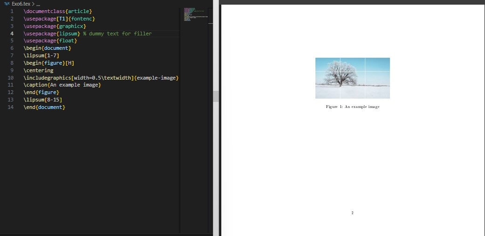{ #fig:004 width=100% }


## 4.7 Другие типы плавающих объектов / Other Types of Float

Пакет `trivfloat` позволяет создавать новые типы плавающих сред.
The `trivfloat` package allows creating new types of float environments.

```latex
\documentclass{article}
\usepackage[T1]{fontenc}
\usepackage{graphicx}
\usepackage{lipsum} % dummy text for filler
\usepackage{trivfloat}
\trivfloat{image}
\begin{document}
\begin{image}
\centering
\includegraphics[width=0.5\textwidth]{example-image}
\caption{An example image}
\end{image}
\end{document}
```

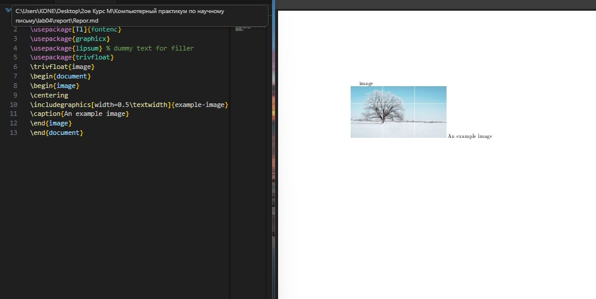{ #fig:005 width=100% }

## 4.8 Перекрёстные ссылки / Cross-referencing

Механизм `\label` и `\ref` позволяет создавать ссылки на пронумерованные элементы.
The `\label` and `\ref` mechanism allows creating references to numbered elements.

```latex
\documentclass{article}
\usepackage[T1]{fontenc}
\begin{document}
Hey world!
This is a first document.
\section{Title of the first section}
Text of material for the first section.
\subsection{Subsection of the first section}
\label{subsec:labelone}
Text of material for the first subsection.
\begin{equation}
e^{i\pi}+1 = 0
\label{eq:labeltwo}
\end{equation}
In subsection~\ref{subsec:labelone} is
 equation~\ref{eq:labeltwo}.
\end{document}
```

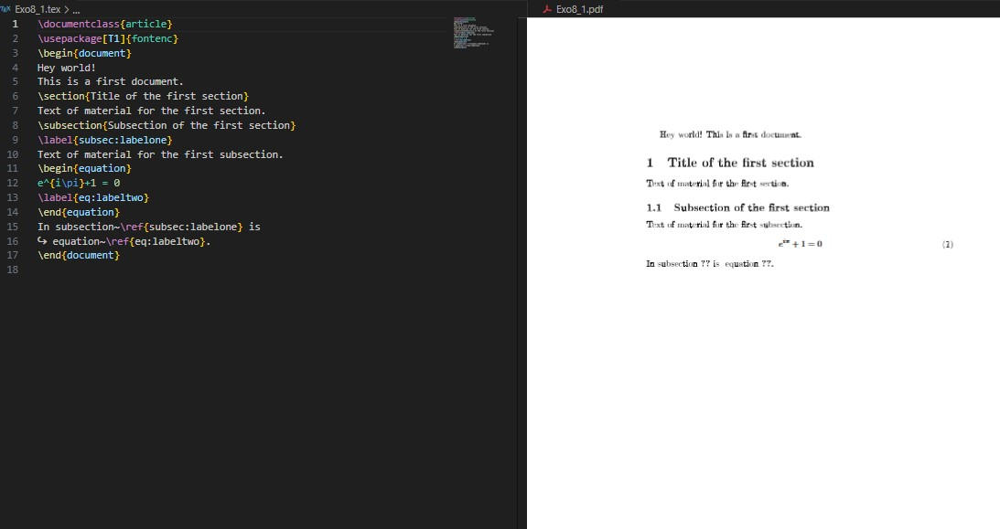{ #fig:006 width=50% }

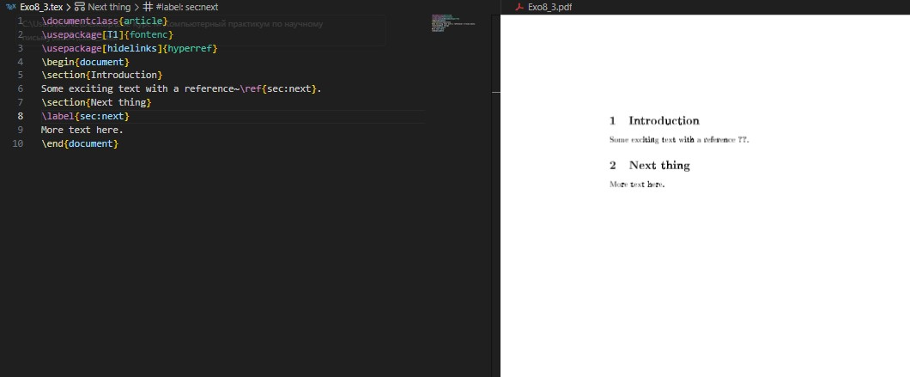{ #fig:007 width=50% }

```latex
\documentclass{article}
\usepackage[T1]{fontenc}
\usepackage[hidelinks]{hyperref}
\begin{document}
\section{Introduction}
Some exciting text with a reference~\ref{sec:next}.
\section{Next thing}
\label{sec:next}
More text here.
\end{document}
```
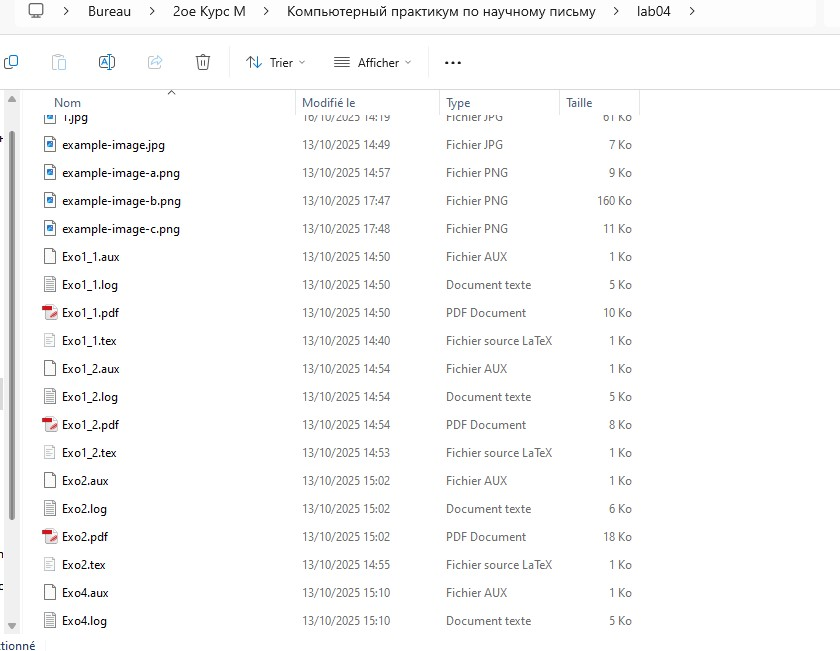{ #fig:008 width=100% }

# Выполнение лабораторной работы

## 4.10 Упражнения / Exercises

### Упражнение 1: Включение собственного изображения / Including Your Own Image

```latex
\documentclass{article}
\usepackage{graphicx}

\begin{document}
\begin{figure}[ht]
    \centering
    \includegraphics[width=0.6\textwidth]{my-image.png}
    \caption{Моё собственное изображение}
    \label{fig:myimage}
\end{document}
```

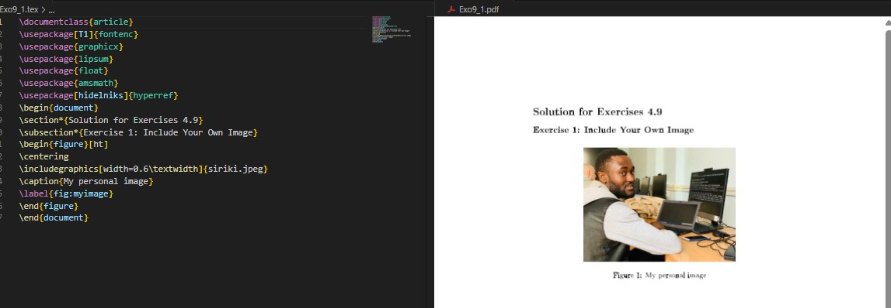{ #fig:009 width=100% }

### Упражнение 2: Исследование опций размера и поворота / Exploring Size and Rotation Options

```latex
\documentclass{article}
\usepackage{graphicx}

\begin{document}
\includegraphics[height=3cm]{example-image}
\includegraphics[width=0.3\textwidth]{example-image}
\includegraphics[scale=0.5]{example-image}
\includegraphics[angle=45, width=0.2\textwidth]{example-image}
\end{document}
```

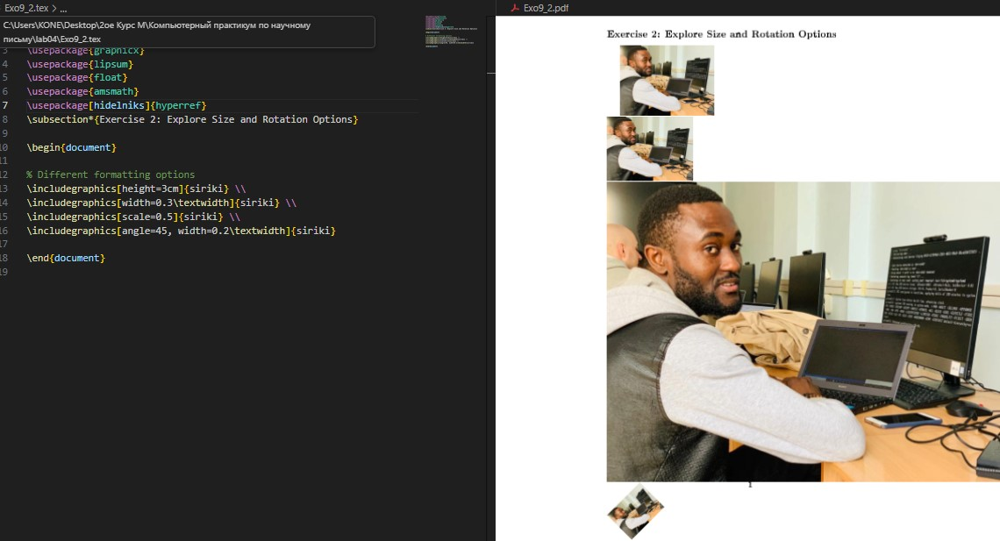{ #fig:010 width=100% }

### Упражнение 3: Сравнение \textbackslash textwidth и \textbackslash linewidth / Comparing textwidth and linewidth

```latex
\documentclass[twocolumn]{article}
\usepackage{graphicx}
\usepackage{lipsum}

\begin{document}
\lipsum[1]
\begin{figure}[ht]
    \centering
    \includegraphics[width=0.8\textwidth]{example-image}
    \caption{С использованием \textbackslash textwidth}
\end{figure}
\begin{figure}[ht]
    \centering
    \includegraphics[width=0.8\linewidth]{example-image}
    \caption{С использованием \textbackslash linewidth}
\end{figure}
\lipsum[2-5]
\end{document}
```

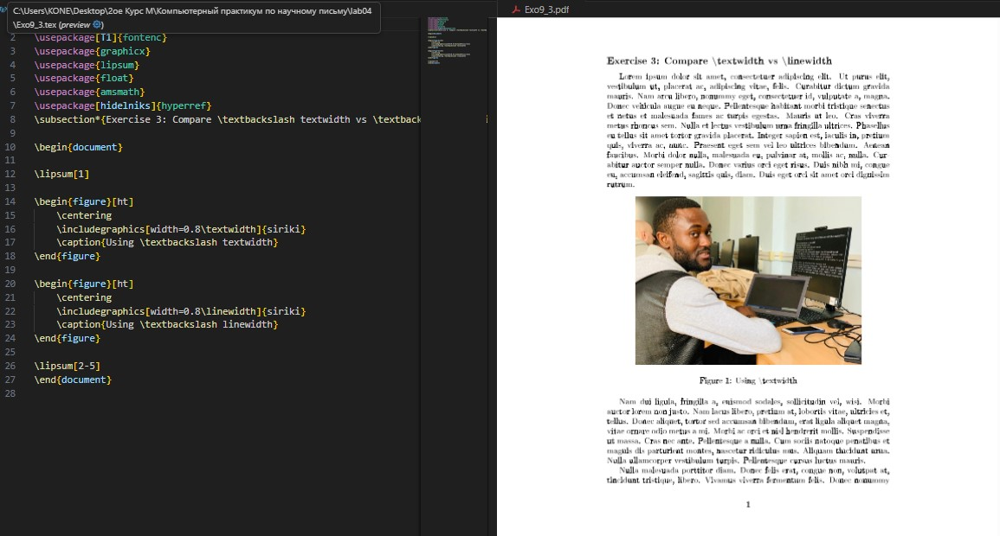{ #fig:011 width=100% }

### Упражнение 4: Размещение плавающих объектов с разными спецификаторами / Float Placement with Different Specifiers

```latex
\documentclass{article}
\usepackage{graphicx}
\usepackage{lipsum}

\begin{document}
\lipsum[1-2]
\begin{figure}[h]
    \centering
    \includegraphics[width=0.4\textwidth]{example-image-a}
    \caption{Опция h (здесь)}
\end{figure}
\lipsum[3]
\begin{figure}[t]
    \centering
    \includegraphics[width=0.4\textwidth]{example-image-b}
    \caption{Опция t (верх)}
\end{figure}
\begin{figure}[b]
    \centering
    \includegraphics[width=0.4\textwidth]{example-image-c}
    \caption{Опция b (низ)}
\end{figure}
\lipsum[4-8]
\end{document}
```

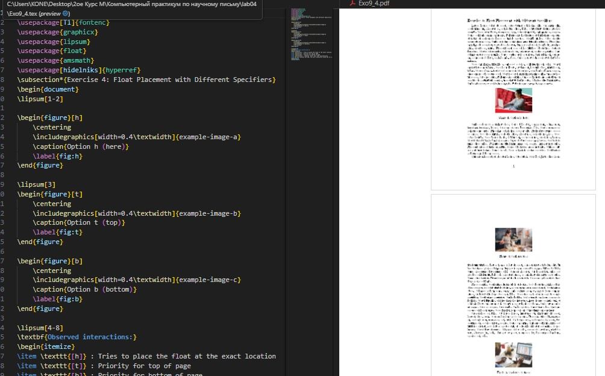{ #fig:012 width=100% }

### Упражнение 5: Перекрёстные ссылки и количество компиляций / Cross-references and Number of Compilations

```latex
\documentclass{article}
\usepackage{graphicx}

\begin{document}
\section{Введение}
\label{sec:intro}

В разделе~\ref{sec:intro} мы представляем...

\subsection{Первая подсекция}
\label{subsec:first}

Как видно в подсекции~\ref{subsec:first}...

\begin{figure}[ht]
    \centering
    \includegraphics[width=0.5\textwidth]{example-image}
    \caption{Тестовая фигура}
    \label{fig:test}
\end{figure}

Рисунок~\ref{fig:test} показывает...
\end{document}
```

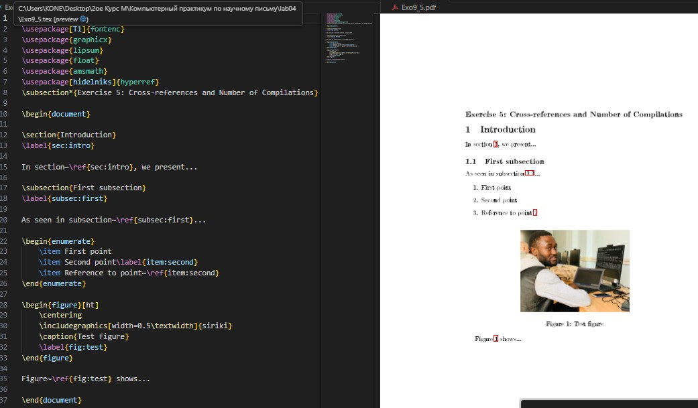{ #fig:013 width=100% }

### Упражнение 6: Размещение \textbackslash label до/после \textbackslash caption / Placing label Before/After caption

```latex
\documentclass{article}
\usepackage{graphicx}

\begin{document}
\begin{figure}[ht]
    \centering
    \includegraphics[width=0.4\textwidth]{example-image-a}
    \label{fig:before}
    \caption{Рисунок с label до caption}
\end{figure}
\begin{figure}[ht]
    \centering
    \includegraphics[width=0.4\textwidth]{example-image-b}
    \caption{Рисунок с label после caption}
    \label{fig:after}
\end{figure}
Ссылка на рисунок~\ref{fig:before} (неправильная)\\
Ссылка на рисунок~\ref{fig:after} (правильная)
\end{document}
```

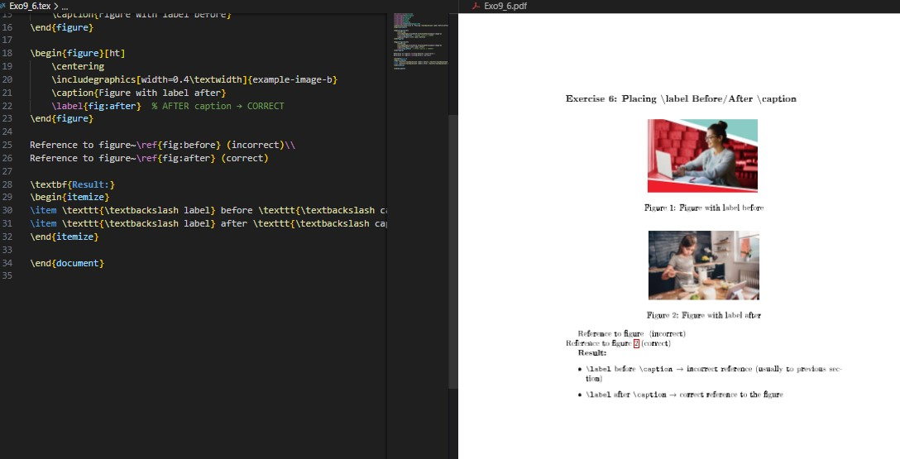{ #fig:014 width=100% }

### Упражнение 7: \textbackslash label после \textbackslash end\{equation\} / label After end{equation}

```latex
\documentclass{article}
\usepackage{amsmath}

\begin{document}
\begin{equation}
E = mc^2
\end{equation}
\label{eq:after}
\begin{equation}
F = ma
\label{eq:inside}
\end{equation}
Ссылка на уравнение~\ref{eq:after} (неправильная)\\
Ссылка на уравнение~\ref{eq:inside} (правильная)
\end{document}
```

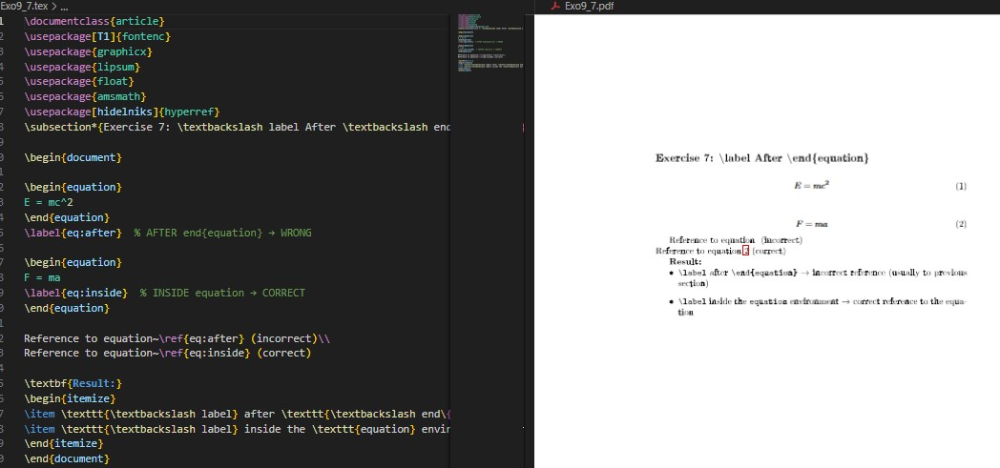{ #fig:015 width=100% }

# Выводы

В ходе лабораторной работы №4 я изучил основы включения и управления графикой в документах LaTeX. Освоил работу с пакетом `graphicx`, научился создавать плавающие объекты, управлять их размещением и создавать перекрёстные ссылки на изображения. Также изучил лучшие практики организации графических файлов и их именования.

In this lab work #4, I learned the fundamentals of including and manipulating graphics in LaTeX documents. I mastered the `graphicx` package, learned to create float objects, control their placement, and create cross-references to images. I also studied best practices for organizing graphic files and naming them.

# Список литературы{.unnumbered}

LaTeX/Математические формулы — Викиучебник. https://ru.wikibooks.org/wiki/LaTeX/

