---
## Front matter
lang: ru-RU
title: Отчёт по лабораторной работе №5  
subtitle: Tables
author:
  - Коне Сирики
institute:
  - Российский университет дружбы народов, Москва, Россия
  - Объединённый институт ядерных исследований, Дубна, Россия
date: 24 Ноября 2025

## i18n babel
babel-lang: russian
babel-otherlangs: english

## Formatting pdf
toc: false
toc-title: Содержание
slide_level: 2
aspectratio: 169
section-titles: true
theme: metropolis
header-includes:
 - \metroset{progressbar=frametitle,sectionpage=progressbar,numbering=fraction}
---

# Информация

## Докладчик

:::::::::::::: {.columns align=center}
::: {.column width="70%"}

  * Коне Сирики
  * Студент физмат
  * Российский университет дружбы народов
  * [konesirisil@yandex.ru](mailto:sirikisil@yandex.ru)
  * <https://github.com/skone19>

:::
::: {.column width="30%"}

:::
::::::::::::::

## Цель работы

Целью данной лабораторной работы является изучение создания и форматирования таблиц в документах LaTeX с использованием пакета array и других связанных инструментов.

The purpose of this lab work is to learn how to create and format tables in LaTeX documents using the array package and related tools.

## Задание

1. Использовать простой таблицы для начала экспериментов
2. Попробовать различные выравнивания с использованием типов колонок l, c и r  
3. Исследовать что происходит при слишком малом количестве элементов в строке таблицы
4. Исследовать что происходит при слишком большом количестве элементов в строке таблицы
5. Экспериментировать с командой multicolumn для объединения колонок

# Теоретическое введение

## Основы таблиц в LaTeX

Для создания таблиц в LaTeX используется окружение `tabular` и пакеты `array` и `booktabs`.

## Выравнивание колонок

Типы колонок l, c, r определяют выравнивание содержимого (влево, по центру, вправо).

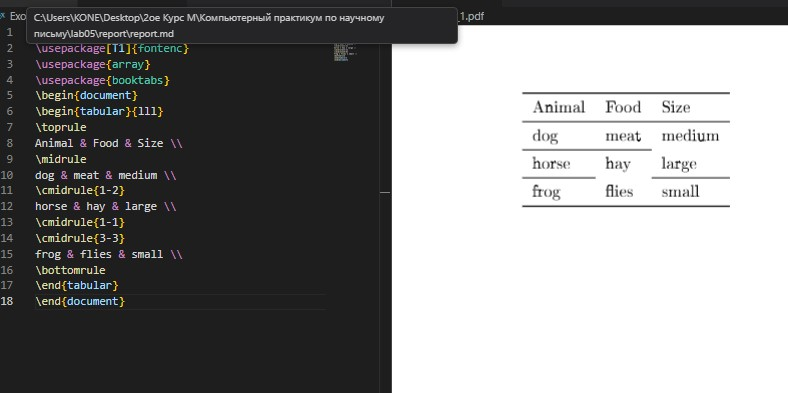

## Объединение колонок

Команда `\multicolumn` позволяет объединять несколько колонок в одну.

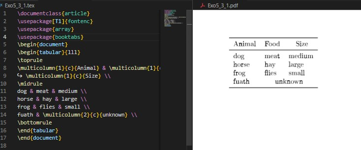

## Правила и линии

Пакет `booktabs` предоставляет команды для профессионального оформления таблиц.

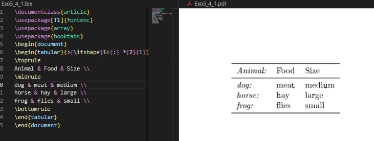

## Стилизация колонок

Различные способы стилизации и форматирования колонок таблиц.

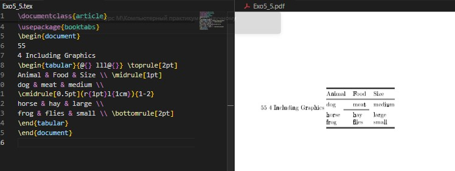

## Числовое выравнивание

Особенности выравнивания числовых данных в таблицах.

## Ширина таблицы

Управление шириной таблиц и колонок.

## Многостраничные таблицы

Работа с длинными таблицами, занимающими несколько страниц.

## Примечания к таблицам

Добавление примечаний и комментариев к таблицам.

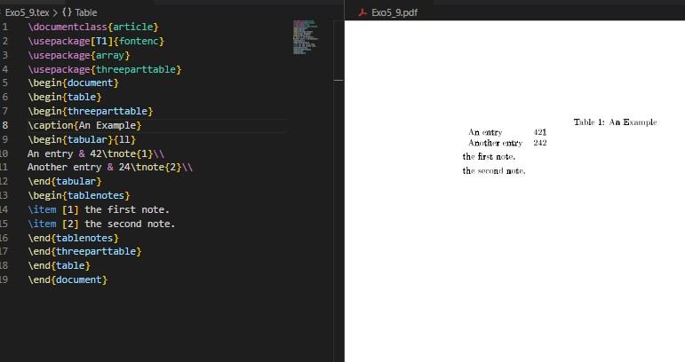

## Узкие колонки

Особенности работы с узкими колонками.

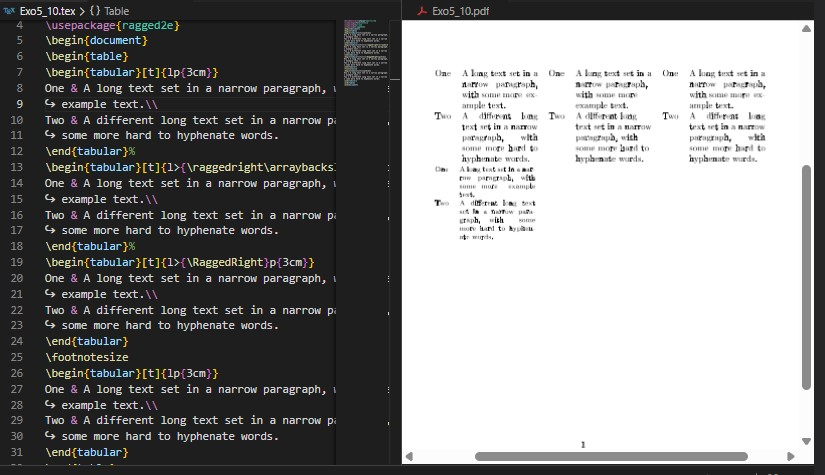

## Новые типы колонок

Создание пользовательских типов колонок.

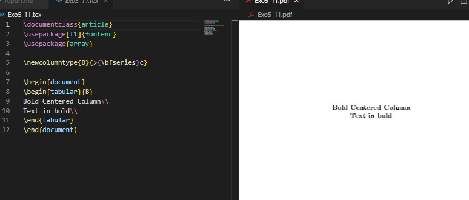

## Интервалы и spacing

Управление интервалами и расстояниями в таблицах.

# Выполнение лабораторной работы

## Упражнение 1-2: Базовые таблицы и выравнивание

:::::::::::::: {.columns align=center}
::: {.column width="50%"}

**Упражнение 1 - Простая таблица**
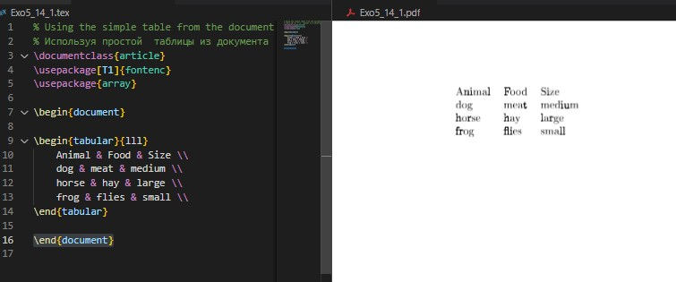

:::
::: {.column width="50%"}

**Упражнение 2 - Выравнивание**
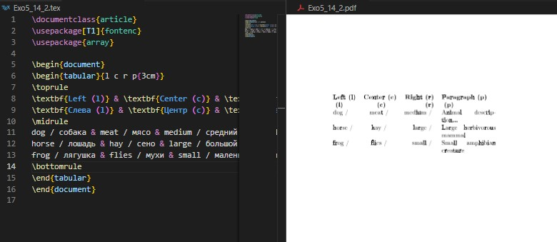

:::
::::::::::::::

## Упражнение 3-4: Количество элементов

:::::::::::::: {.columns align=center}
::: {.column width="50%"}

**Упражнение 3 - Мало элементов**

:::
::: {.column width="50%"}

**Упражнение 4 - Много элементов**
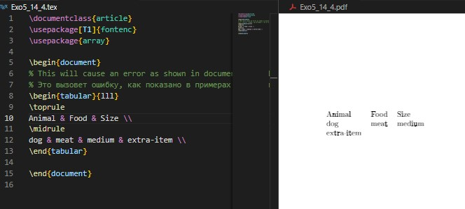

:::
::::::::::::::

## Упражнение 5: Объединение колонок

**Упражнение 5 - Мультиколонки**
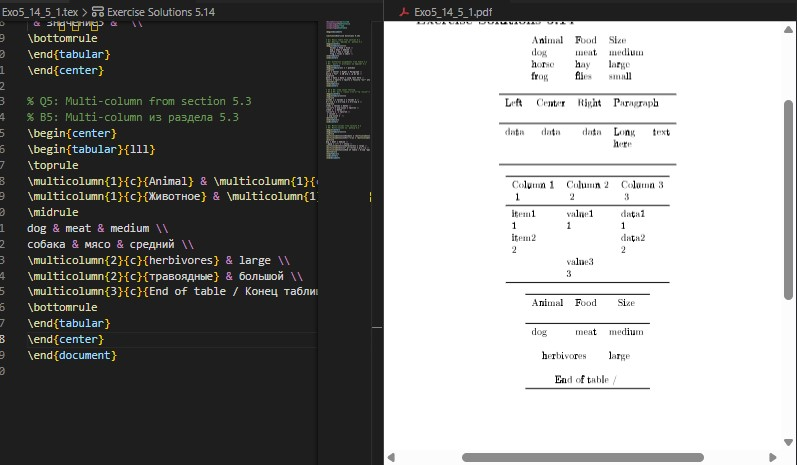

# Выводы

В ходе лабораторной работы №5 я изучил основы создания и форматирования таблиц в LaTeX. Освоил работу с пакетами array и booktabs, научился различным типам выравнивания колонок и объединению ячеек с помощью multicolumn.

In this lab work 5, I learned the fundamentals of creating and formatting tables in LaTeX. I mastered working with array and booktabs packages, learned various column alignment types and cell merging using multicolumn.

# Список литературы

# Спасибо за внимание
