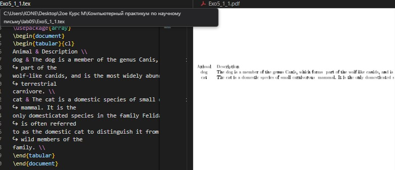
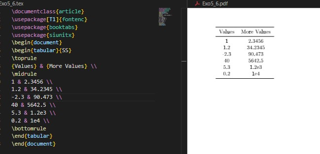
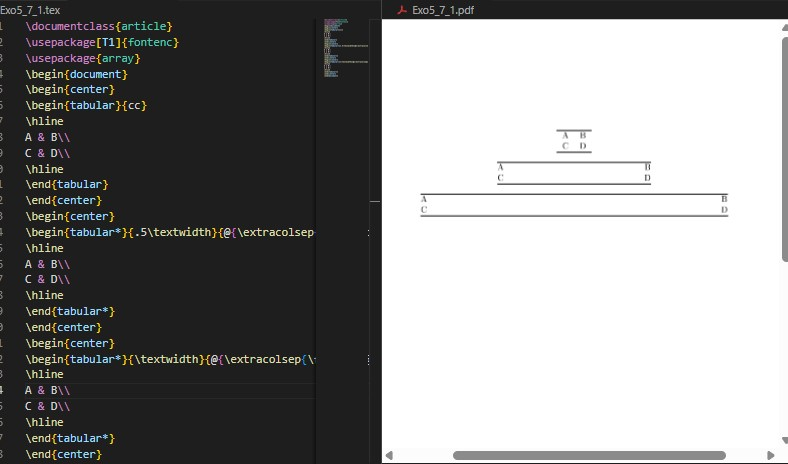
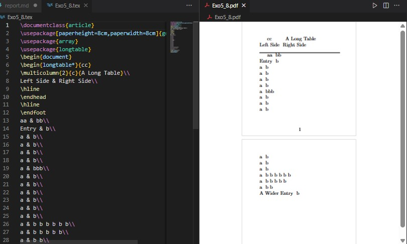
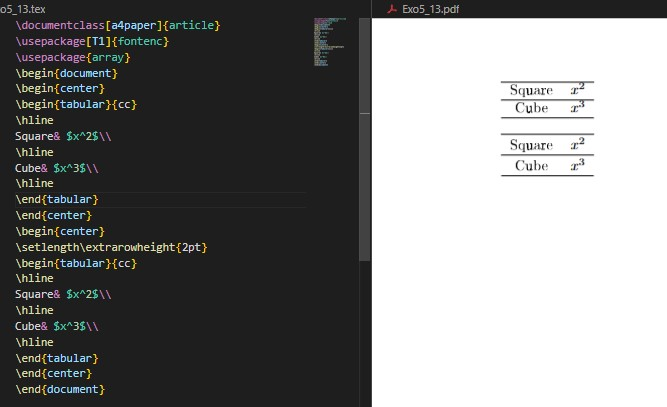
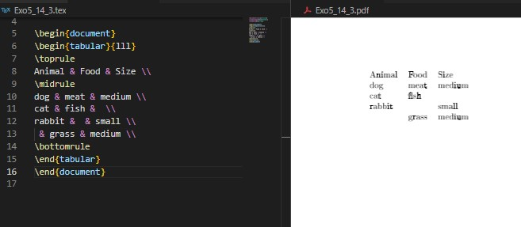

---
## Front matter
title: "Отчёт по лабораторной работе №5"
subtitle: "Tables"
author: "Коне Сирики"

## Generic options
lang: ru-RU
toc-title: "Содержание"

## Bibliography
bibliography: bib/cite.bib
csl: pandoc/csl/gost-r-7-0-5-2008-numeric.csl

## Pdf output format
toc: true
toc-depth: 2
lof: true
lot: true
fontsize: 12pt
linestretch: 1.5
papersize: a4
documentclass: scrreprt

## I18n polyglossia
polyglossia-lang:
  name: russian
  options:
    - spelling=modern
    - babelshorthands=true
polyglossia-otherlangs:
  name: english

## I18n babel
babel-lang: russian
babel-otherlangs: english

## Fonts
mainfont: IBM Plex Serif
romanfont: IBM Plex Serif
sansfont: IBM Plex Sans
monofont: IBM Plex Mono
mathfont: STIX Two Math

## Biblatex
biblatex: true
biblio-style: "gost-numeric"

## Misc options
indent: true
header-includes:
  - \usepackage{indentfirst}
  - \usepackage{float}
  - \floatplacement{figure}{H}
---

# Цель работы

Целью данной лабораторной работы является изучение создания и форматирования таблиц в документах LaTeX с использованием пакета array и других связанных инструментов.

The purpose of this lab work is to learn how to create and format tables in LaTeX documents using the array package and related tools.

# Задание

1. Использовать простой пример таблицы для начала экспериментов
2. Попробовать различные выравнивания с использованием типов колонок l, c и r
3. Исследовать что происходит при слишком малом количестве элементов в строке таблицы
4. Исследовать что происходит при слишком большом количестве элементов в строке таблицы
5. Экспериментировать с командой `\multicolumn` для объединения колонок

# Теоретическое введение

## 5 Таблицы / Tables

### 5.1 Пакет array / The array package

Таблицы в LaTeX создаются с использованием окружения tabular. Пакет array расширяет функциональность таблиц.
Tables in LaTeX are created using the tabular environment. The array package extends table functionality.

{ #fig:001 width=70% }

### 5.2 Добавление линий / Adding rules (lines)

Пакет booktabs предоставляет профессиональные горизонтальные линии.
The booktabs package provides professional horizontal rules.

{ #fig:002 width=70% }

### 5.3 Объединение ячеек / Merging cells

Команда `\multicolumn` позволяет объединять ячейки по горизонтали.
The `\multicolumn` command allows merging cells horizontally.

{ #fig:003 width=70% }

### 5.4 Другие элементы преамбулы / The other preamble contents

Токены > и < позволяют стилизовать колонки.
The > and < tokens allow column styling.

{ #fig:004 width=70% }

### 5.5 Настройка правил booktabs / Customizing booktabs rules

Все правила booktabs поддерживают опциональный аргумент для указания толщины линии.
All booktabs rules support an optional argument to specify rule thickness.

{ #fig:005 width=70% }

### 5.6 Числовое выравнивание в колонках / Numeric alignment in columns

Пакет siunitx предоставляет колонку S для правильного числового выравнивания.
The siunitx package provides the S column for proper numeric alignment.

{ #fig:006 width=70% }

### 5.7 Задание общей ширины таблицы / Specifying the total table width

Окружение tabular* позволяет контролировать общую ширину таблицы.
The tabular* environment allows controlling the total table width.

{ #fig:007 width=70% }

### 5.8 Многостраничные таблицы / Multi-page tables

Пакет longtable позволяет создавать таблицы, занимающие несколько страниц.
The longtable package allows creating tables that span multiple pages.

{ #fig:008 width=70% }

### 5.9 Примечания к таблице / Table notes

Пакет threeparttable упрощает добавление примечаний к таблицам.
The threeparttable package simplifies adding notes to tables.

{ #fig:009 width=70% }

### 5.10 Верстка в узких колонках / Typesetting in narrow columns

Команда `\RaggedRight` из пакета ragged2e обеспечивает компромиссное выравнивание.
The `\RaggedRight` command from the ragged2e package provides compromise alignment.

{ #fig:010 width=70% }

### 5.11 Определение новых типов колонок / Defining new column types

Пакет array позволяет определять пользовательские типы колонок.
The array package allows defining custom column types.

{ #fig:011 width=70% }

### 5.12 Вертикальные трюки / Vertical tricks

Вложенные таблицы позволяют создавать сложные вертикальные компоновки.
Nested tables allow creating complex vertical layouts.

{ #fig:012 width=70% }

### 5.13 Межстрочный интервал в таблицах / Line spacing in tables

Параметры `\arraystretch` и `\extrarowheight` контролируют вертикальное пространство.
The `\arraystretch` and `\extrarowheight` parameters control vertical spacing.

{ #fig:013 width=70% }

# Выполнение лабораторной работы

## 5.14 Упражнения / Exercises

### Упражнение 1: Базовая таблица с разным выравниванием / Basic Table with Different Alignments

**Наблюдение:** Создается базовая таблица с естественной шириной колонок
**Observation:** This creates a basic table with natural column widths

{ #fig:014 width=100% }

### Упражнение 2: Слишком мало элементов в строке / Too Few Items in a Row

**Результат:** Пустые ячейки создаются без ошибок компиляции
**Result:** Empty cells are created, no compilation error

{ #fig:015 width=100% }

### Упражнение 3: Слишком много элементов в строке / Too Many Items in a Row

**Результат:** Избыточные элементы вызывают ошибку компиляции
**Result:** Excess items cause compilation error

{ #fig:016 width=100% }

### Упражнение 4: Объединение колонок с multicolumn / Column Spanning with multicolumn

**Результат:** Успешное объединение ячеек по горизонтали
**Result:** Successful horizontal cell merging

{ #fig:017 width=100% }

### Упражнение 5: Комплексный пример / Comprehensive Example

**Результат:** Все упражнения объединены в один документ
**Result:** All exercises combined in one document

{ #fig:018 width=100% }

# Выводы

В ходе лабораторной работы №5 я изучил основы создания и форматирования таблиц в LaTeX. Освоил работу с пакетами array и booktabs, научился различным типам выравнивания колонок, объединению ячеек с помощью multicolumn, а также обработке ошибок при неправильном количестве элементов в строках. Особое внимание было уделено профессиональному оформлению таблиц с использованием правил booktabs и числовому выравниванию с пакетом siunitx.

In this lab work 5, I learned the fundamentals of creating and formatting tables in LaTeX. I mastered working with array and booktabs packages, learned various column alignment types, cell merging using multicolumn, and error handling for incorrect numbers of items in rows. Special attention was paid to professional table formatting using booktabs rules and numeric alignment with the siunitx package.

# Список литературы

1. Practical scientific writing - Tables chapter
2. LaTeX/Tables - Wikibooks. https://en.wikibooks.org/wiki/LaTeX/Tables
3. array package documentation
4. booktabs package documentation
