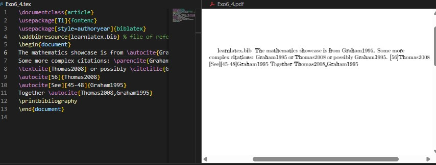
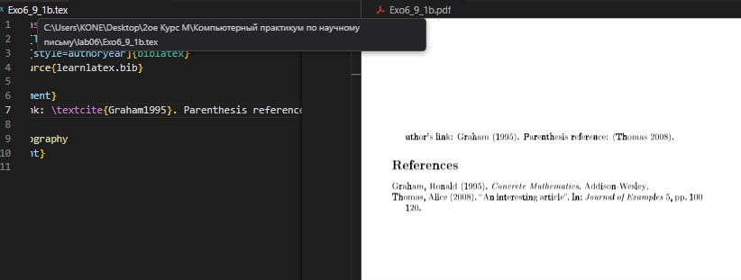
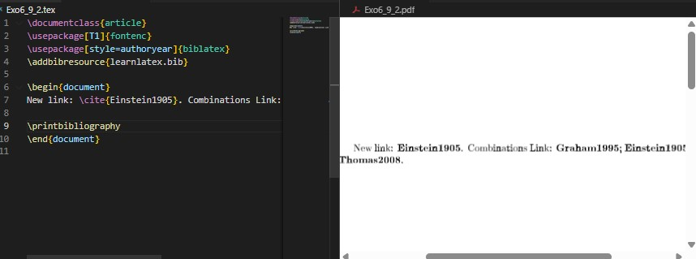
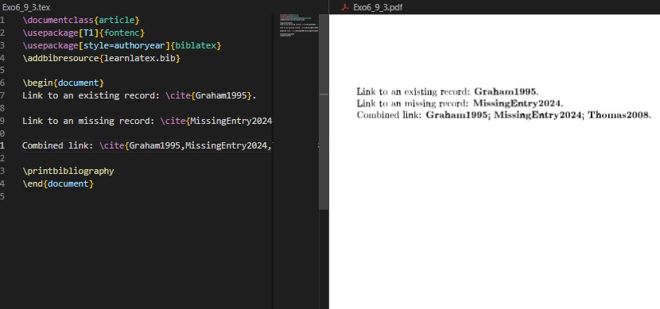
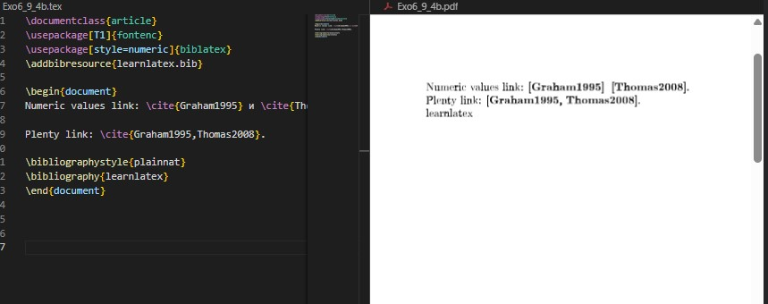

---
## Front matter
lang: ru-RU
title: Презентация лабораторной работе №6  
subtitle: Working with Bibliography
author:
  - Коне Сирики
institute:
  - Российский университет дружбы народов, Москва, Россия
  - Объединённый институт ядерных исследований, Дубна, Россия
date: 11 Ноября 2025

## i18n babel
babel-lang: russian
babel-otherlangs: english

## Formatting pdf
toc: false
toc-title: Содержание
slide_level: 2
aspectratio: 169
section-titles: true
theme: metropolis
header-includes:
 - \metroset{progressbar=frametitle,sectionpage=progressbar,numbering=fraction}
---

# Информация

## Докладчик

:::::::::::::: {.columns align=center}
::: {.column width="70%"}

  * Коне Сирики
  * Студент физмат
  * Российский университет дружбы народов
  * [konesirisil@yandex.ru](mailto:sirikisil@yandex.ru)
  * <https://github.com/skone19>

:::
::: {.column width="30%"}

:::
::::::::::::::

## Цель работы

Целью данной лабораторной работы является освоение методов работы с библиографией в LaTeX, включая использование систем BibTeX и biblatex для управления цитированием и списками литературы.

The purpose of this lab work is to learn how to work with bibliography in LaTeX, including using BibTeX and biblatex systems for managing citations and reference lists.

## Задание

1. Освоить workflow с natbib и BibTeX для работы с библиографией
2. Освоить workflow с biblatex и Biber и их особенности
3. Сравнить два подхода к работе с библиографией и их применение
4. Выполнить практические упражнения по созданию и управлению библиографическими ссылками

# Теоретическое введение

## 6 Работа с библиографией / Working with Bibliography

Для библиографических ссылок обычно используется информация из внешних файлов - библиографических баз данных.
For bibliographic citations, information is typically retrieved from external files - bibliographic databases.

## 6.1 Библиографические базы данных / Reference Databases

Базы данных BibTeX содержат записи с различными полями.
BibTeX databases contain entries with various fields.

{width=80%}

## 6.3 Workflow BibTeX с natbib / The BibTeX Workflow with natbib

Пакет natbib предоставляет расширенные возможности цитирования.
The natbib package provides enhanced citation capabilities.

{width=80%}

## 6.4 Workflow biblatex / The biblatex Workflow

Пакет biblatex работает несколько иначе, с загрузкой ресурсов в преамбуле.
The biblatex package works differently, loading resources in the preamble.

{width=80%}

## 6.7 Гиперссылки / Hyperlinks

Пакет hyperref автоматически создает ссылки в библиографии.
The hyperref package automatically creates links in bibliography.

:::::::::::::: {.columns align=center}
::: {.column width="50%"}

{width=90%}

:::
::: {.column width="50%"}

{width=90%}

:::
::::::::::::::

# Выполнение лабораторной работы

## Упражнение 1: Сравнение natbib и biblatex

:::::::::::::: {.columns align=center}
::: {.column width="50%"}

**natbib workflow**
{width=90%}

:::
::: {.column width="50%"}

**biblatex workflow**
{width=90%}

:::
::::::::::::::

## Упражнение 2: Создание новых записей

**Новая запись в базе данных и ссылки**
{width=80%}

## Упражнение 3: Работа с отсутствующими записями

**Ссылки на отсутствующие записи в базе данных**
{width=80%}

## Упражнение 4: Числовые стили библиографии

:::::::::::::: {.columns align=center}
::: {.column width="50%"}

**natbib с числовым стилем**
{width=90%}

:::
::: {.column width="50%"}

**biblatex с числовым стилем**
{width=90%}

:::
::::::::::::::

# Выводы

В ходе лабораторной работы №6 я освоил методы работы с библиографией в LaTeX. Изучил два основных подхода: традиционный workflow с natbib и BibTeX, а также современный подход с biblatex и Biber. Научился создавать библиографические базы данных, управлять стилями цитирования и создавать гиперссылки в библиографии.

In this lab work #6, I mastered bibliography management methods in LaTeX. I studied two main approaches: traditional workflow with natbib and BibTeX, as well as modern approach with biblatex and Biber. I learned to create bibliographic databases, manage citation styles, and create hyperlinks in bibliography.

# Список литературы

# Спасибо за внимание
