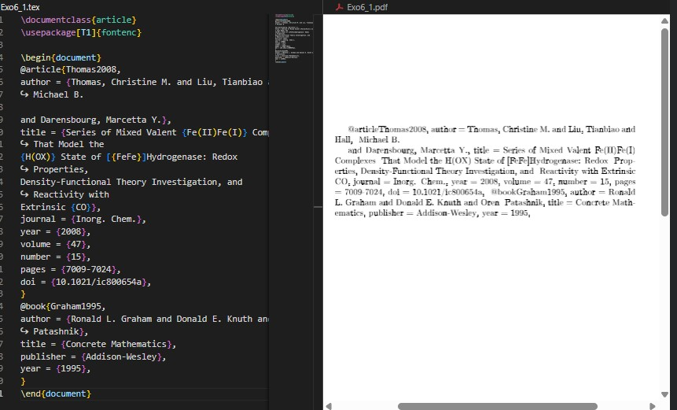
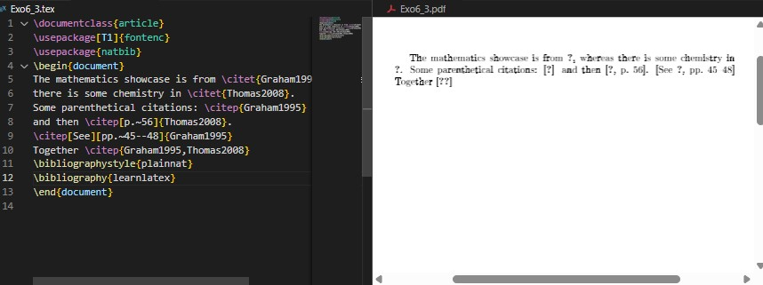
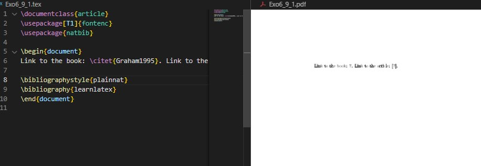
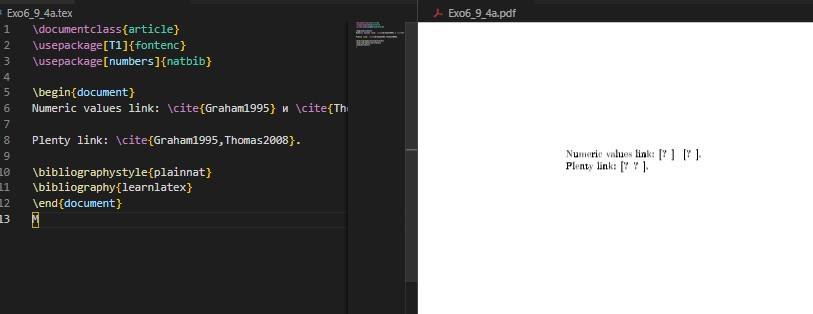

---
## Front matter
title: "Отчёт по лабораторной работе №6"
subtitle: "Working with Bibliography"
author: "Коне Сирики"

## Generic options
lang: ru-RU
toc-title: "Содержание"

## Bibliography
bibliography: bib/cite.bib
csl: pandoc/csl/gost-r-7-0-5-2008-numeric.csl

## Pdf output format
toc: true
toc-depth: 2
lof: true
lot: true
fontsize: 12pt
linestretch: 1.5
papersize: a4
documentclass: scrreprt

## I18n polyglossia
polyglossia-lang:
  name: russian
  options:
    - spelling=modern
    - babelshorthands=true
polyglossia-otherlangs:
  name: english

## I18n babel
babel-lang: russian
babel-otherlangs: english

## Fonts
mainfont: IBM Plex Serif
romanfont: IBM Plex Serif
sansfont: IBM Plex Sans
monofont: IBM Plex Mono
mathfont: STIX Two Math

## Biblatex
biblatex: true
biblio-style: "gost-numeric"

## Misc options
indent: true
header-includes:
  - \usepackage{indentfirst}
  - \usepackage{float}
  - \floatplacement{figure}{H}
---

# Цель работы

Целью данной лабораторной работы является освоение методов работы с библиографией в LaTeX, включая использование систем BibTeX и biblatex для управления цитированием и списками литературы.

The purpose of this lab work is to learn how to work with bibliography in LaTeX, including using BibTeX and biblatex systems for managing citations and reference lists.

# Задание
1. Освоить workflow с natbib и BibTeX для работы с библиографией
2. Освоить workflow с biblatex и Biber и их особенности
3. Сравнить два подхода к работе с библиографией и их применение
4. Выполнить практические упражнения по созданию и управлению библиографическими ссылками

# Теоретическое введение

## 6 Работа с библиографией / Working with Bibliography

Для библиографических ссылок обычно используется информация из внешних файлов - библиографических баз данных.
For bibliographic citations, information is typically retrieved from external files - bibliographic databases.

```latex
\documentclass{article}
\usepackage[T1]{fontenc}
\usepackage{natbib}

\begin{document}
Ссылка на книгу: \citet{Graham1995}. 
Ссылка на статью: \citep{Thomas2008}.

\bibliographystyle{plainnat}
\bibliography{learnlatex}
\end{document}
```

{ #fig:001 width=100% }

## 6.1 Библиографические базы данных / Reference Databases

Базы данных BibTeX содержат записи с различными полями.
BibTeX databases contain entries with various fields.

```bibtex
@article{Thomas2008,
author = {Thomas, Christine M. and Liu, Tianbiao and Hall, Michael B.
    and Darensbourg, Marcetta Y.},
title = {Series of Mixed Valent {Fe(II)Fe(I)} Complexes That Model the
    {H(0X)} State of [{FeFe}]Hydrogenase},
journal = {Inorg. Chem.},
year = {2008},
volume = {47},
number = {15},
pages = {7009-7024},
doi = {10.1021/ic800654a},
}
```
```latex
\documentclass{article}
\usepackage[T1]{fontenc}

\begin{document}
@article{Thomas2008,
author = {Thomas, Christine M. and Liu, Tianbiao and Hall,
↪ Michael B.
and Darensbourg, Marcetta Y.},
title = {Series of Mixed Valent {Fe(II)Fe(I)} Complexes
↪ That Model the
{H(OX)} State of [{FeFe}]Hydrogenase: Redox
↪ Properties,
Density-Functional Theory Investigation, and
↪ Reactivity with
Extrinsic {CO}},
journal = {Inorg. Chem.},
year = {2008},
volume = {47},
number = {15},
pages = {7009-7024},
doi = {10.1021/ic800654a},
}
@book{Graham1995,
author = {Ronald L. Graham and Donald E. Knuth and Oren
↪ Patashnik},
title = {Concrete Mathematics},
publisher = {Addison-Wesley},
year = {1995},
}
\end{document}
```

{ #fig:002 width=100% }

## 6.2 Перенос информации из базы данных / Transferring Information from Database

Для работы с библиографией требуется несколько шагов компиляции:
Working with bibliography requires multiple compilation steps:

- **natbib + BibTeX**: LaTeX → BibTeX → LaTeX → LaTeX
- **biblatex + Biber**: LaTeX → Biber → LaTeX

## 6.3 Workflow BibTeX с natbib / The BibTeX Workflow with natbib

Пакет natbib предоставляет расширенные возможности цитирования.
The natbib package provides enhanced citation capabilities.

```latex
\documentclass{article}
\usepackage[T1]{fontenc}
\usepackage{natbib}

\begin{document}
Математические примеры из \citet{Graham1995}, 
а химические из \citet{Thomas2008}.

Ссылки в скобках: \citep{Graham1995} 
и затем \citep[p.~56]{Thomas2008}.

\citep[См.][pp.~45--48]{Graham1995}

Вместе \citep{Graham1995,Thomas2008}

\bibliographystyle{plainnat}
\bibliography{learnlatex}
\end{document}
```

{ #fig:003 width=100% }

## 6.4 Workflow biblatex / The biblatex Workflow

Пакет biblatex работает несколько иначе, с загрузкой ресурсов в преамбуле.
The biblatex package works differently, loading resources in the preamble.

```latex
\documentclass{article}
\usepackage[T1]{fontenc}
\usepackage[style=authoryear]{biblatex}
\addbibresource{learnlatex.bib}

\begin{document}
Математические примеры из \autocite{Graham1995}.

Более сложные ссылки: \parencite{Graham1995} 
или \textcite{Thomas2008} 
или возможно \citetitle{Graham1995}.

\autocite[56]{Thomas2008}

\autocite[См.][45-48]{Graham1995}

Вместе \autocite{Thomas2008,Graham1995}

\printbibliography
\end{document}
```

{ #fig:004 width=100% }

## 6.5 Выбор между BibTeX и BibLaTeX / Choosing Between BibTeX and BibLaTeX

**BibTeX workflow:**
- Более установленный и поддерживаемый издательствами
- Использует .bst файлы для стилей
- Ограниченная поддержка Unicode

**biblatex workflow:**
- Лучшая кастомизация через LaTeX команды
- Полная поддержка Unicode сортировки
- Более сложные стили цитирования

## 6.6 Работа с не-английской сортировкой / Dealing with Non-English Sorting

Biber обеспечивает правильную сортировку для не-английских символов.
Biber provides proper sorting for non-English characters.

```bibtex
@article{Müller2023,
author = {Müller, Hans and École, Pierre and Смирнов, Иван},
title = {Международное исследование},
journal = {Журнал},
year = {2023}
}
```

## 6.7 Гиперссылки / Hyperlinks

Пакет hyperref автоматически создает ссылки в библиографии.
The hyperref package automatically creates links in bibliography.

```latex
\documentclass{article}
\usepackage[T1]{fontenc}
\usepackage[hidelinks]{hyperref}
\usepackage[style=authoryear]{biblatex}
\addbibresource{learnlatex.bib}

\begin{document}
Ссылка \autocite{Graham1995} будет гиперссылкой.

\printbibliography
\end{document}
```

{ #fig:005 width=100% }

## 6.8 Различия в лучших практиках для BibTeX / Differences in Best Practice for BibTeX Input

Различные стили библиографии поддерживают разные поля.
Different bibliography styles support different fields.

```bibtex
% Для старых стилей
@misc{Website2023,
author = {Author},
title = {Website Title},
howpublished = {\url{https://example.com}}
}

% Для новых стилей
@misc{Website2023,
author = {Author},
title = {Website Title},
url = {https://example.com}
}
```

# Выполнение лабораторной работы

## 6.9 Упражнения / Exercises

### Упражнение 1: Использовать примеры с natbib и biblatex

**natbib workflow:**
```latex
\documentclass{article}
\usepackage[T1]{fontenc}
\usepackage{natbib}

\begin{document}
Ссылка на книгу: \citet{Graham1995}. Ссылка на статью: \citep{Thomas2008}.

\bibliographystyle{plainnat}
\bibliography{learnlatex}
\end{document}
```
*Компиляция: LaTeX → BibTeX → LaTeX → LaTeX*

{ #fig:006 width=100% }

**biblatex workflow:**
```latex
\documentclass{article}
\usepackage[T1]{fontenc}
\usepackage[style=authoryear]{biblatex}
\addbibresource{learnlatex.bib}

\begin{document}
Авторская ссылка: \textcite{Graham1995}. Скобочная ссылка: \parencite{Thomas2008}.

\printbibliography
\end{document}
```
*Компиляция: LaTeX → Biber → LaTeX*

{ #fig:007 width=100% }

### Упражнение 2: Создать новые записи в базе данных и новые ссылки

**Новая запись в learnlatex.bib:**
```bibtex
@article{Einstein1905,
    author = {Albert Einstein},
    title = {On the Electrodynamics of Moving Bodies},
    journal = {Annalen der Physik},
    year = {1905},
    volume = {322},
    number = {10},
    pages = {891--921},
    doi = {10.1002/andp.19053221004}
}
```

**Документ с новой ссылкой:**
```latex
\documentclass{article}
\usepackage[T1]{fontenc}
\usepackage[style=authoryear]{biblatex}
\addbibresource{learnlatex.bib}

\begin{document}
Новая ссылка: \cite{Einstein1905}. Комбинированные ссылки: \cite{Graham1995,Einstein1905,Thomas2008}.

\printbibliography
\end{document}
```

{ #fig:008 width=100% }

### Упражнение 3: Добавить ссылку на отсутствующую запись в базе данных

```latex
\documentclass{article}
\usepackage[T1]{fontenc}
\usepackage[style=authoryear]{biblatex}
\addbibresource{learnlatex.bib}

\begin{document}
Ссылка на существующую запись: \cite{Graham1995}.

Ссылка на отсутствующую запись: \cite{MissingEntry2024}.

Комбинированные ссылки: \cite{Graham1995,MissingEntry2024,Thomas2008}.

\printbibliography
\end{document}
```

{ #fig:009 width=100% }

### Упражнение 4: Экспериментировать с числовыми стилями библиографии

**natbib с числовым стилем:**
```latex
\documentclass{article}
\usepackage[T1]{fontenc}
\usepackage[numbers]{natbib}

\begin{document}
Числовые ссылки: \cite{Graham1995} и \cite{Thomas2008}.

Множественные ссылки: \cite{Graham1995,Thomas2008}.

\bibliographystyle{plainnat}
\bibliography{learnlatex}
\end{document}
```

{ #fig:010 width=100% }

**biblatex с числовым стилем:**
```latex
\documentclass{article}
\usepackage[T1]{fontenc}
\usepackage[style=numeric]{biblatex}
\addbibresource{learnlatex.bib}

\begin{document}
Числовые ссылки: \cite{Graham1995} и \cite{Thomas2008}.

Множественные ссылки: \cite{Graham1995,Thomas2008}.

\printbibliography
\end{document}
```

{ #fig:011 width=100% }

# Выводы

В ходе лабораторной работы №6 я освоил методы работы с библиографией в LaTeX. Изучил два основных подхода: традиционный workflow с natbib и BibTeX, а также современный подход с biblatex и Biber. Научился создавать библиографические базы данных, управлять стилями цитирования, работать с не-английской сортировкой и создавать гиперссылки в библиографии.

In this lab work #6, I mastered bibliography management methods in LaTeX. I studied two main approaches: traditional workflow with natbib and BibTeX, as well as modern approach with biblatex and Biber. I learned to create bibliographic databases, manage citation styles, work with non-English sorting, and create hyperlinks in bibliography.

# Список литературы{.unnumbered}

1. Practical scientific writing - Tables chapter
2. LaTeX/Tables - Wikibooks. https://en.wikibooks.org/wiki/LaTeX/Tables
3. array package documentation
4. booktabs package documentation