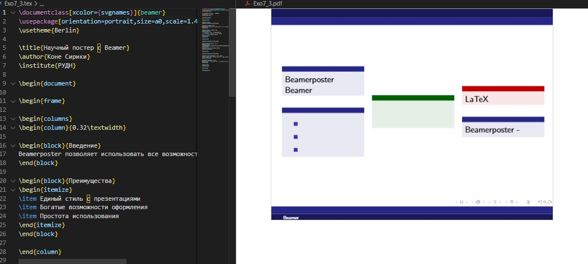

---
## Front matter
lang: ru-RU
title: Презентация лабораторной работе №7  
subtitle: LaTeX Presentations and Posters
author:
  - Коне Сирики
institute:
  - Российский университет дружбы народов, Москва, Россия
  - Объединённый институт ядерных исследований, Дубна, Россия
date: 30 Ноября 2025

## i18n babel
babel-lang: russian
babel-otherlangs: english

## Formatting pdf
toc: false
toc-title: Содержание
slide_level: 2
aspectratio: 169
section-titles: true
theme: metropolis
header-includes:
 - \metroset{progressbar=frametitle,sectionpage=progressbar,numbering=fraction}
---

# Информация

## Докладчик

:::::::::::::: {.columns align=center}
::: {.column width="70%"}

  * Коне Сирики
  * Студент физмат
  * Российский университет дружбы народов
  * [konesirisil@yandex.ru](mailto:sirikisil@yandex.ru)
  * <https://github.com/skone19>

:::
::: {.column width="30%"}

:::
::::::::::::::

## Цель работы

Целью данной лабораторной работы является освоение создания презентаций и постеров в LaTeX с использованием пакета Beamer и других инструментов для визуального представления научных работ.

The purpose of this lab work is to learn how to create presentations and posters in LaTeX using the Beamer package and other tools for visual presentation of scientific work.

## Задание

1. Освоить создание презентаций с использованием класса Beamer
2. Изучить структуру презентаций, создание слайдов и управление контентом
3. Научиться использовать паузы и эффекты появления для динамических презентаций

# Теоретическое введение

## 7 Презентации LaTeX / LaTeX Presentations

Для создания презентаций в LaTeX используется класс документов beamer.
In LaTeX it is possible to make presentations using the beamer document class.

## 7.1 Презентации с Beamer / Presentation with Beamer

Beamer предоставляет профессиональные темы и возможности анимации.
Beamer provides professional themes and animation capabilities.

{width=80%}

## Структура презентации / Presentation Structure

Основные элементы: титульный слайд, frame окружения, блоки и колонки.
Main elements: title slide, frame environments, blocks and columns.

{width=80%}

## Паузы и эффекты / Pauses and Effects

Команды `\pause` и `\uncover` для динамического появления контента.
`\pause` and `\uncover` commands for dynamic content appearance.

:::::::::::::: {.columns align=center}
::: {.column width="50%"}

**Паузы с \pause**
{width=90%}

:::
::: {.column width="50%"}

**Точное управление с \uncover**
{width=90%}

:::
::::::::::::::

## 7.2 Постеры / Posters

Три основных метода создания постеров в LaTeX.
Three main methods for creating posters in LaTeX.

## Методы создания постеров / Poster Creation Methods

:::::::::::::: {.columns align=center}
::: {.column width="33%"}

**a0poster**
{width=90%}

:::
::: {.column width="33%"}

**beamerposter**
{width=90%}

:::
::: {.column width="33%"}

**tikzposter**
{width=90%}

:::
::::::::::::::

# Выполнение лабораторной работы

## Создание постеров

:::::::::::::: {.columns align=center}
::: {.column width="50%"}

**Постер с a0poster**
{width=90%}

:::
::: {.column width="50%"}

**Постер с beamerposter**
{width=90%}

:::
::::::::::::::

# Выводы

В ходе лабораторной работы №7 я освоил создание презентаций и постеров в LaTeX. Изучил работу с классом Beamer для создания динамических презентаций с паузами и эффектами появления. Освоил три основных метода создания постеров: a0poster, beamerposter и tikzposter, изучил их преимущества и особенности применения.

In this lab work 7, I mastered creating presentations and posters in LaTeX. I studied working with the Beamer class for creating dynamic presentations with pauses and appearance effects. I mastered three main methods for creating posters: a0poster, beamerposter and tikzposter, studied their advantages and application features.

# Список литературы

# Спасибо за внимание