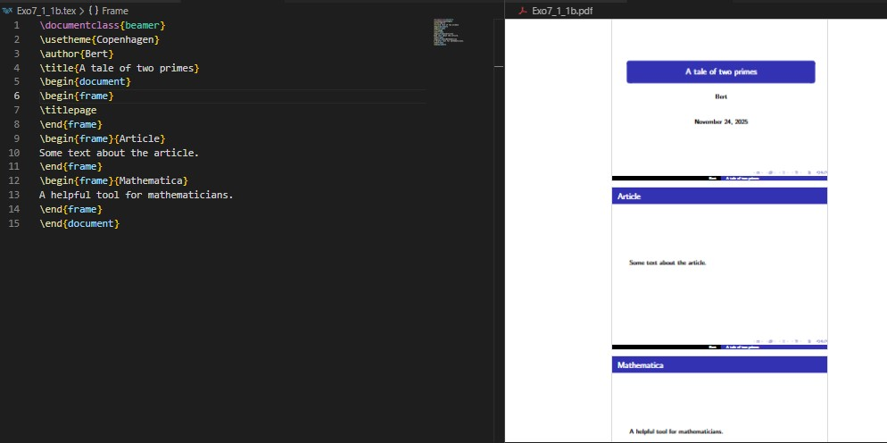
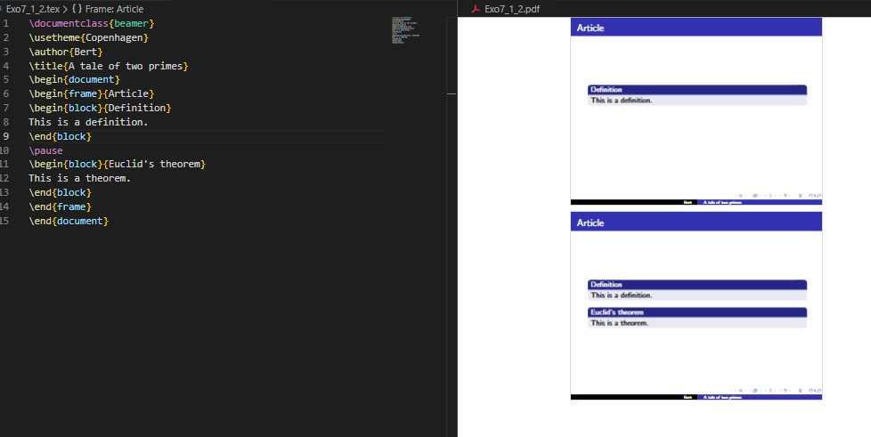
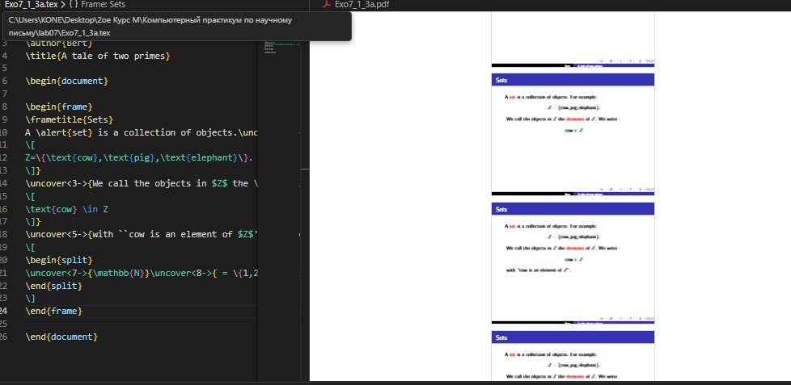
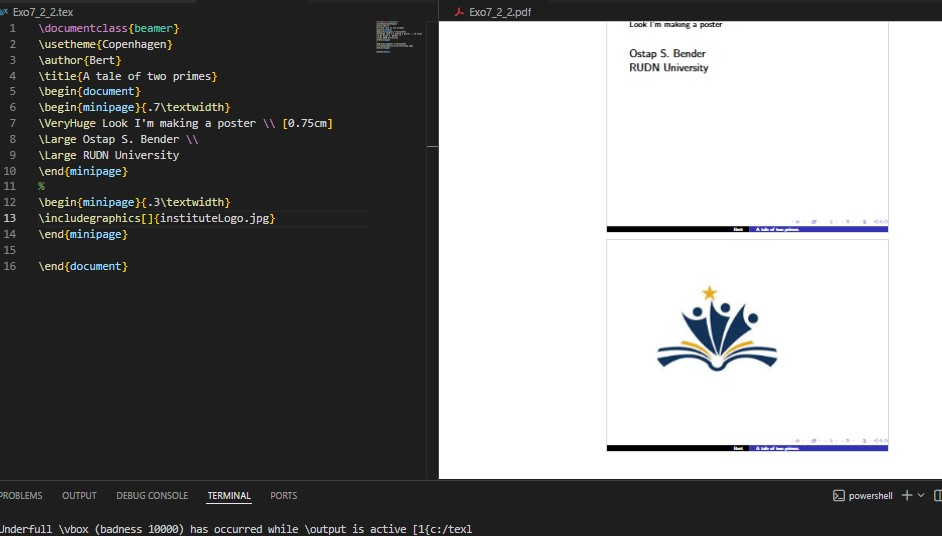
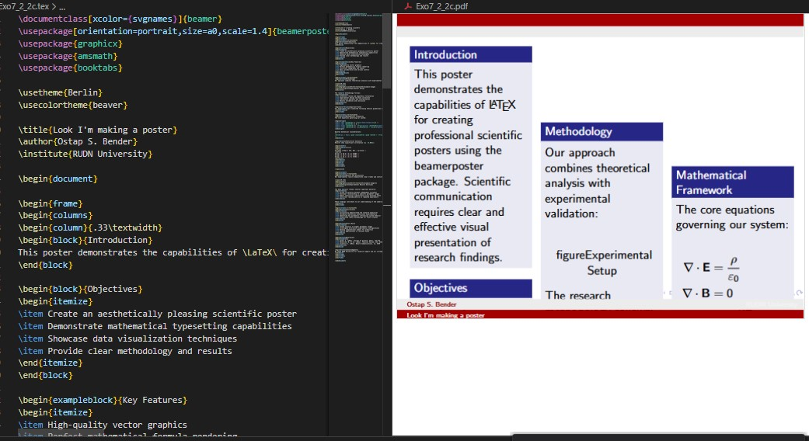
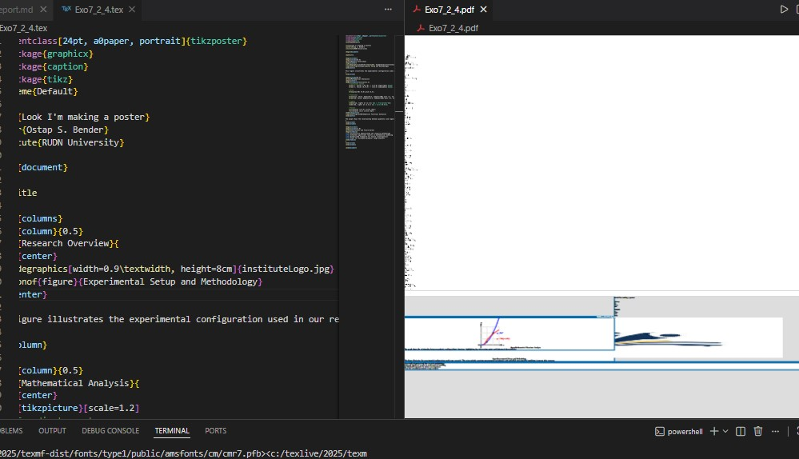

---
## Front matter
title: "Отчёт по лабораторной работе №7"
subtitle: "LaTeX Presentations and Posters"
author: "Коне Сирики"

## Generic options
lang: ru-RU
toc-title: "Содержание"

## Bibliography
bibliography: bib/cite.bib
csl: pandoc/csl/gost-r-7-0-5-2008-numeric.csl

## Pdf output format
toc: true
toc-depth: 2
lof: true
lot: true
fontsize: 12pt
linestretch: 1.5
papersize: a4
documentclass: scrreprt

## I18n polyglossia
polyglossia-lang:
  name: russian
  options:
    - spelling=modern
    - babelshorthands=true
polyglossia-otherlangs:
  name: english

## I18n babel
babel-lang: russian
babel-otherlangs: english

## Fonts
mainfont: IBM Plex Serif
romanfont: IBM Plex Serif
sansfont: IBM Plex Sans
monofont: IBM Plex Mono
mathfont: STIX Two Math

## Biblatex
biblatex: true
biblio-style: "gost-numeric"

## Misc options
indent: true
header-includes:
  - \usepackage{indentfirst}
  - \usepackage{float}
  - \floatplacement{figure}{H}
---

# Цель работы

Целью данной лабораторной работы является освоение создания презентаций и постеров в LaTeX с использованием пакета Beamer и других инструментов для визуального представления научных работ.

The purpose of this lab work is to learn how to create presentations and posters in LaTeX using the Beamer package and other tools for visual presentation of scientific work.

# Задание
1. Освоить создание презентаций с использованием класса Beamer
2. Изучить структуру презентаций, создание слайдов и управление контентом
3. Научиться использовать паузы и эффекты появления для динамических презентаций

# Теоретическое введение

## 7 Презентации LaTeX / LaTeX Presentations

### 7.1 Презентации с Beamer / Presentation with Beamer

В LaTeX можно создавать презентации с использованием класса документов beamer.
In LaTeX it is possible to make presentations using the beamer document class.

```latex
\documentclass{beamer}

\usetheme{Copenhagen}
\author{Bert}
\title{A tale of two primes}

\begin{document}

\begin{frame}
\titlepage
\end{frame}

\end{document}
```

{ #fig:001 width=100% }

### 7.1.1 Структура презентации / Structure of a Presentation

Для создания слайдов используется окружение frame с заголовком слайда.
To make slides you use the frame environment with the slide title.

```latex
\begin{frame}
\frametitle{Article}
Some text about the article.
\end{frame}

\begin{frame}
\frametitle{Mathematics}
A helpful tool for mathematicians.
\end{frame}
```

{ #fig:002 width=100% }

### 7.1.2 Паузы / Pauses

Команда `\pause` позволяет элементам появляться последовательно.
The `\pause` command allows elements to appear one by one.

```latex
\begin{frame}{Article}

\begin{block}{Definition}
This is a definition.
\end{block}

\pause

\begin{block}{Euclid's theorem}
This is a theorem.
\end{block}

\end{frame}
```

{ #fig:003 width=100% }

### 7.1.3 Появление элементов / Uncover

Команда `\uncover` дает больше контроля над появлением элементов.
The `\uncover` command gives more control over element appearance.

```latex
\begin{frame}
\frametitle{Sets}
A \alert{set} is a collection of objects.\uncover<2->{ For example:
\[ Z=\{\text{cow}, \text{pig}, \text{elephant}\}. \]}
\uncover<3->{ We call the objects in $Z$ the \alert{elements} of $Z$.}
\end{frame}
```

{ #fig:004 width=100% }

### 7.1.4 Оформление / Layout

Beamer предоставляет различные темы для изменения внешнего вида.
Beamer provides various themes to change appearance.

```latex
\usetheme{Warsaw}
\usecolortheme{beaver}
```

### 7.1.5 Советы для коротких презентаций / Tips for Short Presentations

- Изолируйте основную тему и представьте её рано / Isolate the main subject and cover it early
- Используйте картинки вместо текста / Use pictures instead of text
- Примеры вместо абстрактных определений / Examples instead of abstract definitions
- Следите за временем / Watch the time

## 7.2 Постеры / Posters

### Основные методы создания постеров / Main Poster Creation Methods

1. **Класс a0poster** - похож на article с колонками
2. **Пакет beamerposter** - использует возможности Beamer
3. **Класс tikzposter** - основан на TikZ с блочной структурой

### 7.2.1 Класс a0poster / The a0poster documentclass

```latex
\documentclass[a0, portrait]{a0poster}
\usepackage{multicol}
\setlength{\columnsep}{100pt}

\begin{document}
\begin{multicols}{2}
% Содержание постерa / Poster content
\end{multicols}
\end{document}
```

{ #fig:005 width=100% }

### 7.2.2 Пакет beamerposter / The beamerposter package

```latex
\documentclass[xcolor={svgnames}]{beamer}
\usepackage[orientation=portrait,size=a0,scale=1.4]{beamerposter}

\begin{document}
\begin{frame}
\begin{columns}
\begin{column}{.33\textwidth}
% Содержание колонки / Column content
\end{column}
\end{columns}
\end{frame}
\end{document}
```

{ #fig:006 width=100% }

### 7.2.3 Класс tikzposter / The tikzposter documentclass

```latex
\documentclass[24pt, a0paper, portrait]{tikzposter}
\usetheme{Default}

\begin{document}
\maketitle
\begin{columns}
\column{.33}
\block{Title}{Content}
\end{columns}
\end{document}
```

{ #fig:007 width=100% }

# Выполнение лабораторной работы

## Создание постера с beamerposter / Creating Poster with beamerposter

```latex
\documentclass[xcolor={svgnames}]{beamer}
\usepackage[orientation=portrait,size=a0,scale=1.4]{beamerposter}
\usetheme{Berlin}

\title{Научный постер с Beamer}
\author{Коне Сирики}
\institute{РУДН}

\begin{document}

\begin{frame}

\begin{columns}
\begin{column}{0.32\textwidth}

\begin{block}{Введение}
Beamerposter позволяет использовать все возможности Beamer для создания постеров
\end{block}

\begin{block}{Преимущества}
\begin{itemize}
\item Единый стиль с презентациями
\item Богатые возможности оформления
\item Простота использования
\end{itemize}
\end{block}

\end{column}

\begin{column}{0.32\textwidth}

\begin{exampleblock}{Пример}
\begin{center}
\includegraphics[width=0.8\textwidth]{example-image}
\end{center}
Графическое представление данных
\end{exampleblock}

\end{column}

\begin{column}{0.32\textwidth}

\begin{alertblock}{Важная информация}
LaTeX обеспечивает высокое качество типографики и математических формул
\end{alertblock}

\begin{block}{Заключение}
Beamerposter - отличный выбор для научных постеров
\end{block}

\end{column}
\end{columns}

\end{frame}

\end{document}
```

{ #fig:08 width=100% }


# Выводы

В ходе лабораторной работы №7 я освоил создание презентаций и постеров в LaTeX. Изучил работу с классом Beamer для создания динамических презентаций с паузами и эффектами появления. Освоил три основных метода создания постеров: a0poster, beamerposter и tikzposter, изучил их преимущества и особенности применения. На практике создал презентации с математическим содержанием и научные постеры, что позволило закрепить полученные знания.

In this lab work 7, I mastered creating presentations and posters in LaTeX. I studied working with the Beamer class for creating dynamic presentations with pauses and appearance effects. I mastered three main methods for creating posters: a0poster, beamerposter and tikzposter, studied their advantages and application features. In practice, I created presentations with mathematical content and scientific posters, which allowed me to consolidate the acquired knowledge.

# Список литературы{.unnumbered}

1. Practical scientific writing - Presentations and Posters chapter
2. Beamer User Guide - Till Tantau
3. LaTeX/Beamer - Wikibooks
4. a0poster, beamerposter, tikzposter package documentation

::: {#refs}
:::