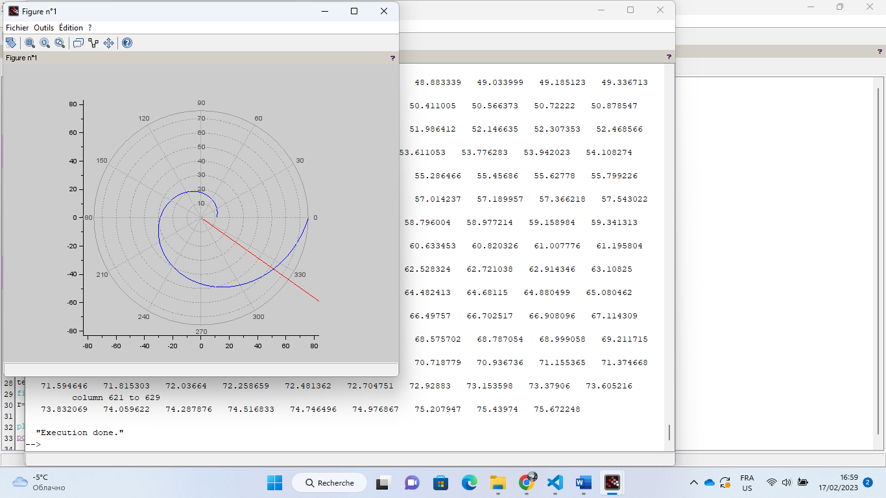

---
## Front matter
title: "Лабораторной работе №2. Задача о погоне"
subtitle: "Вариант № 19"
author: "Коне Сирики. НФИбд-01-20"

## Generic otions
lang: ru-RU
toc-title: "Содержание"

## Bibliography
bibliography: bib/cite.bib
csl: pandoc/csl/gost-r-7-0-5-2008-numeric.csl

## Pdf output format
toc: true # Table of contents
toc-depth: 2
lof: true # List of figures
lot: true # List of tables
fontsize: 12pt
linestretch: 1.5
papersize: a4
documentclass: scrreprt
## I18n polyglossia
polyglossia-lang:
  name: russian
  options:
	- spelling=modern
	- babelshorthands=true
polyglossia-otherlangs:
  name: english
## I18n babel
babel-lang: russian
babel-otherlangs: english
## Fonts
mainfont: PT Serif
romanfont: PT Serif
sansfont: PT Sans
monofont: PT Mono
mainfontoptions: Ligatures=TeX
romanfontoptions: Ligatures=TeX
sansfontoptions: Ligatures=TeX,Scale=MatchLowercase
monofontoptions: Scale=MatchLowercase,Scale=0.9
## Biblatex
biblatex: true
biblio-style: "gost-numeric"
biblatexoptions:
  - parentracker=true
  - backend=biber
  - hyperref=auto
  - language=auto
  - autolang=other*
  - citestyle=gost-numeric
## Pandoc-crossref LaTeX customization
figureTitle: "Рис."
tableTitle: "Таблица"
listingTitle: "Листинг"
lofTitle: "Список иллюстраций"
lotTitle: "Список таблиц"
lolTitle: "Листинги"
## Misc options
indent: true
header-includes:
  - \usepackage{indentfirst}
  - \usepackage{float} # keep figures where there are in the text
  - \floatplacement{figure}{H} # keep figures where there are in the text
---

# Цель лабораторной работы:

Цель работы - разобраться в алгоритме построения математической модели на примере задачи о погоне. Нам необходимо провести теоритические рассуждение и вывести дифференциальные уравнения, с помощью которых мы сможем определить точку пересечения лодки и катера из задачи. Для более наглядного примера нам были выданы варианты, с помощью которых можно будет смоделировать траектории движения лодки и катера. Условия задачи: "На море в тумане катер береговой охраны преследует лодку браконьеров. Через определенный промежуток времени туман рассеивается, и лодка обнаруживается на расстоянии k км от катера. Затем лодка снова скрывается в тумане и уходит прямолинейно в неизвестном направлении. Известно, что скорость катера в n раза больше скорости браконьерской лодки. Необходимо определить по какой траектории необходимо двигаться катеру, чтоб нагнать лодку."

# Задача лабораторной работы:

1.Изучить условия задачи. Провести теоритические рассуждения используя данные из варианта
2.Вывести дифференциальное уравнение, соответствующее условиям задачи
3.Написать программу для расчета траетории движения катера и лодки.
4.Построить модели.
5.Определить по моделям точку пересечения катера и лодки.

# Ход работы:
Начнем с теоритических рассуждений: Принимаем за $t_0=0$, $X_0=0$ - место нахождения лодки браконьеров в момент, когда их обнаруживают катера береговой охраны. Также $X_0=k$ - место нахождения катера береговой охраны относительно лодки браконьеров в момент обнаружения лодки браконьеров. После введем полярные координаты. Будем считать, что полюс - это точка обнаружения лодки браконьеров $x_0$=0($\theta$=$x_0=0$), а полярная ось r проходит через точку нахождения катера береговой охраны. Чтобы найти расстояние $x$  (расстояние после которого катер начнет двигаться вокруг полюса), необходимо составить простое уравнение. Пусть через время $t$ катер и лодка окажутся на одном расстоянии $x$ от полюса, а за это время лодка пройдет $x$, в то время как катер $x$-$k$( или $x$  + $k$ в зависимости от начального положения катера относительно полюса). Время, за которое они пройдут это расстояние, вычисляется как $\frac{x}{v}$ или $\frac{x+k}{v}$ (для второго случая  $\frac{x-k}{v}$).Так как время одно и то же, то эти величины одинаковы.

# Ход работы:
Тогда неизвестное расстояние можно найти из следующего уравнения: 
$\frac{x}{v}=\frac{x+k}{v}$- в первом случае, $\frac{x}{v}=\frac{x-k}{v}$  во втором случае. Отсюда мы найдем два значения $x_1$ и $x_2$ , задачу будем решать для двух случаев :

$x_1=\frac{k}{n+1}$,при($\theta=0$) 

$x_2=\frac{k}{n-1}$,при($\theta=-\pi$) 

# Ход работы:

После того, как катер береговой охраны окажется на одном расстоянии от полюса, что и лодка, он должен сменить прямолинейную траекторию и начать двигаться вокруг полюса удаляясь от него со скоростью лодки $v$. Для этого скорость катера раскладываем на две составляющие:$v_r$  - радиальная скорость и $v_t$ - тангенциальная скорость. Радиальная скорость - это скорость, с которой катер удаляется от полюса $v_r=\frac{dr}{dt}$ . Нам нужно, чтобы эта скорость была равна скорости лодки, поэтому полагаем $v=\frac{dr}{dt}$ . Тангенциальная скорость – это линейная скорость вращения катера относительно полюса. Она равна произведению угловой скорости $\frac{d\theta}{dt}$ на радиус $r$ , $v_r=r\frac{dr}{dt}$ Найдем тангенциальную скорость для нашей задачи  $v_t=r\frac{d\theta}{dt}$
 . Вектора образуют прямоугольный треугольник, откуда по теореме Пифагора можно найти тангенциальную скорость $v_t=\sqrt{(nv_r)^2-v^2}$. Поскольку, радиальная скорость равна $v_t=\sqrt{(nv)^2-v^2}$ , то тангенциальную скорость находим из уравнения . Следовательно, $v_\tau=v\sqrt{(n)^2-1}$

 Тогда получаем :

 $r\frac{d\theta}{dt}=v\sqrt{(n)^2-1}$ 

 Решение исходной задачи сводится к решению системы из двух дифференциальных уравнений, которые будут описаны в коде программы.

$\frac{dr}{dt}=v$ ;   $r\frac{d\theta}{dt}=v\sqrt{(10,56}$ 
Начало условие : $если$-

$\theta_0=0, r_0=\frac{k}{4,4}$

$\theta_0=0, r_0=\frac{k}{2,4}$

Тогда: $\frac{dr}{d\theta}=\frac{r}{\sqrt{10,56}}$ 

## Условие задачи:

На море в тумане катер береговой охраны преследует лодку браконьеров. Через определенный промежуток времени туман рассеивается, и лодка обнаруживается на расстоянии 10 км от катера. Затем лодка снова скрывается в тумане и уходит прямолинейно в неизвестном направлении. Известно, что скорость катера в 3.4 раза больше скорости браконьерской лодки.

## Произведение теоретических рассчетов:

###  Теоретические рассчеты и вивод дифференциальных уровнений в соответствии с условием задачи
 
$k=10 km, t_0=0, x_0=0, x_ko=k$

$t_n=\frac{x_1}{v}, t_k=\frac{k-x_1}{3,4*v}$

Первый способ:

$\frac{x_1}{v}=\frac{k-x_1}{3,4*v} => 3,4*v*x_1=v*(k-x_1)=>
3,4*x_1=k-x_1 => 4,4*x1=k => x_1=\frac{k}{4,4}$

Второе способ:

$\frac{x_2}{v}=\frac{k+x_2}{3,4*v} => 3,4*v*x_2=v*(k+x_2)=>
3,4*x_1=k+x_2 => 2,4*x2=k => x_2=\frac{k}{2,4}$

$v_r=\frac{dr}{dt}=v; v_\tau=r\frac{d\theta}{dt}$

$v_\tau=-\sqrt{(3,4*v)^2-v^2}=\sqrt{11,56v^2-v^2=\sqrt(10,56v^2)};
r\frac{d\theta}{dt}=v\sqrt{10,56}$

Начало условие : $если$-

$\theta_0=0, r_0=\frac{k}{4,4}$

$\theta_0=-\pi, r_0=\frac{k}{2,4}$

$\frac{dr}{d\theta}=\frac{r}{\sqrt{10,56}}$ 

## Код программы: 

  (рис. @fig:001).

{#fig:001 width=70%}

 (рис. @fig:002).

{#fig:002 width=70%}

 (рис. @fig:003).

{#fig:003 width=70%}

(рис. @fig:004).

{#fig:004 width=70%}

## Результаты работы программы

Точка пересечения красного и зеленого графиков является точкой пересечения катера береговой охраны и лодки браконьеров. Исходя из этого графика, мы имеем координаты: Координаты точки пересечения - ( 10.616 , -7.507)

(рис. @fig:005).

{#fig:005 width=70%}

(рис. @fig:006).

{#fig:006 width=70%}

## Результаты работы программы

Точка пересечения красного и зеленого графиков является точкой пересечения катера береговой охраны и лодки браконьеров. Исходя из этого графика, мы имеем координаты: Координаты точки пересечения - ( 51.175 , -36.186)

рис. @fig:007).

{#fig:007 width=70%}

# Выводы

Мы рассмотрели задачу о погоне, также провели анализ с помощью данных которые нам были даны, составили и решили дифференциальные уравнения. Смоделировали ситуацию и сделали вывод, что в первом случае погоня завершиться раньше.

# Список литературы

::: [Julia 1.8 Documentation](https://docs.julialang.org/en/v1/#:~:text=Julia%201.8%20Documentation)
:::
