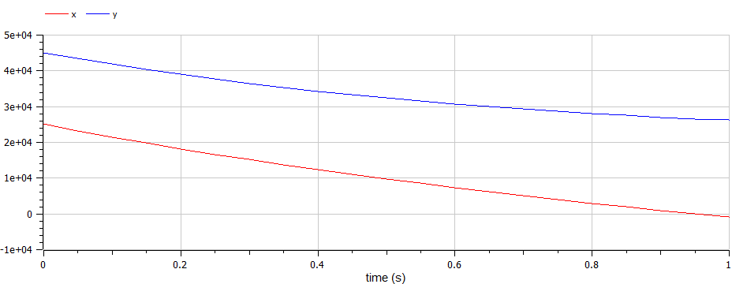
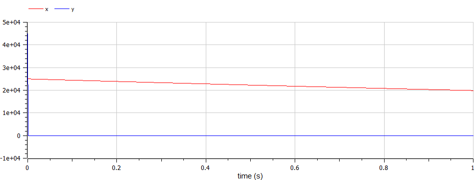

---
## Front matter
lang: ru-RU
title: Лабораторной работе №3. Задача о Модель боевых действий презентации
subtitle: Вариант № 19
author:
  - Коне Сирики.
institute:
  - Российский университет дружбы народов, Москва, Россия
date: 22 февраля, 2023, Москва, Россия

## i18n babel
babel-lang: russian
babel-otherlangs: english

## Formatting pdf
toc: false
toc-title: Содержание
slide_level: 2
aspectratio: 169
section-titles: true
theme: metropolis
header-includes:
 - \metroset{progressbar=frametitle,sectionpage=progressbar,numbering=fraction}
 - '\makeatletter'
 - '\beamer@ignorenonframefalse'
 - '\makeatother'
---

# Информация

## Докладчик

:::::::::::::: {.columns align=center}
::: {.column width="70%"}

  * Коне Сирики
  * Студент физмат 
  * Российский университет дружбы народов
  * [konesirisil@yandex.ru](mailto:sirikisil@yandex.ru)
  * <https://github.com/skone19>

:::
::: {.column width="30%"}

:::
::::::::::::::

# Цели и задачи работы

## Цель лабораторной работы
Нам необходимо рассмотреть модели простейших боевых действий, так называемые модели Ланчестера. 
В моделях мы будем рассматривать три случая битв, сражение регулярных войск, сражение регулярных и партизанских войск, сражение партизанских войск.
Если численность армии обращается в нуль, то данная сторона считается проигравшей (при условии, что численность другой стороны в данный момент положительна). 

## Задание к лабораторной работе
1. Выявить три случая модели Ланчестера, разобрать их теоретическое выведение
2. Вывести уравнения для постоения моделей Ланчестера для трех случаев
3. Построить графики изменения численности войск, используя текст лабораторной работы
4. Определить победившую сторону

# Процесс выполнения лабораторной работы

## Теоретический материал 

Рассмотри три случая ведения боевых действий: 

1. Боевые действия между регулярными войсками
2. Боевые действия с участием регулярных войск и партизанских отрядов
3. Боевые действия между партизанскими отрядами 

## Теоретический материал 

Будем рассматривать три случая ведения боевых действий с учетом различных типов войск: 
1. Боевые действия между регулярными войсками 
2. Боевые действия с участием регулярных войск и партизанских отрядов 
3. Боевые действия между партизанскими отрядами 

## Теоретический материал 
# Первый случай:
В первом случае модель боевых действий между регулярными войсками описывается следующим образом

$$
 \begin{cases}
	\frac{dx}{dt}= -a(t)x(t) - b(t)y(t) + P(t)
	\\   
	\frac{dy}{dt}= -c(t)x(t) - h(t)y(t) + Q(t)
 \end{cases}
$$

## Теоретический материал 
# Первый случай случай:
Модель боевых действий между регулярными войсками описывается как:

$$
 \begin{cases}
	\frac{dx}{dt}= -a(t)x(t) - b(t)y(t) + P(t)
	\\   
	\frac{dy}{dt}= -c(t)x(t) - h(t)y(t) + Q(t)
 \end{cases}
$$

## Теоретический материал 
# Второй случай:
Модель боевых действий между регулярными войсками и партизанскими отрядами описывается как:

$$
 \begin{cases}
	\frac{dx}{dt}= -a(t)x(t) - b(t)y(t) + P(t)
	\\   
	\frac{dy}{dt}= -c(t)x(t)y(t) - h(t)y(t) + Q(t)
 \end{cases}
$$

## Задача:
# Условие:

Между страной $X$ и страной $Y$ идет война. Численность состава войск исчисляется от начала войны, и являются временными функциями $x(t)$ и $y(t)$
В начальный момент времени страна $X$ имеет армию численностью 25 000 человек, а в распоряжении страны $Y$  армия численностью в 45 000 человек.
Для упрощения модели считаем, что коэффициенты $a, b, c, h$ постоянны. 
Также считаем $P(t), Q(t)$ непрерывные функции.
Постройте графики изменения численности войск армии $X$ и армии $Y$ для следующих случаев:

## Случай 1. 
# Модель боевых действий между регулярными войсками

$$
 \begin{cases}
	\frac{dx}{dt}= -0.22x(t) - 0.71y(t) + 2sin(3t)
	\\   
	\frac{dy}{dt}= -0.79x(t) - 0.32y(t) + cos(4t)
 \end{cases}
$$

{ #fig:001 width=70% height=70% }

Победа достается армии $Y$.

## Случай 2. 
# Модель ведение боевых действий с участием регулярных войск и партизанских отрядов

$$
 \begin{cases}
	\frac{dx}{dt}= -0.23x(t) - 0.84y(t) + 2sin(2t)
	\\   
	\frac{dy}{dt}= -0.91x(t)y(t) - 0.32y(t) + 2cos(4t)
 \end{cases}
$$

{ #fig:002 width=70% height=70% }

## Вывод

Рассмотрели модели простейших боевых действий, так называемые модели Ланчестера. 
В моделях мы рассмотрели два случая битв: 
1. Сражение регулярных войск.
2. Сражение регулярных и партизанских войск.
Проверили как работают модели в этих случаях, построили графики и сделали вывод о том, кто станет победителем в данных случаях.

:::

