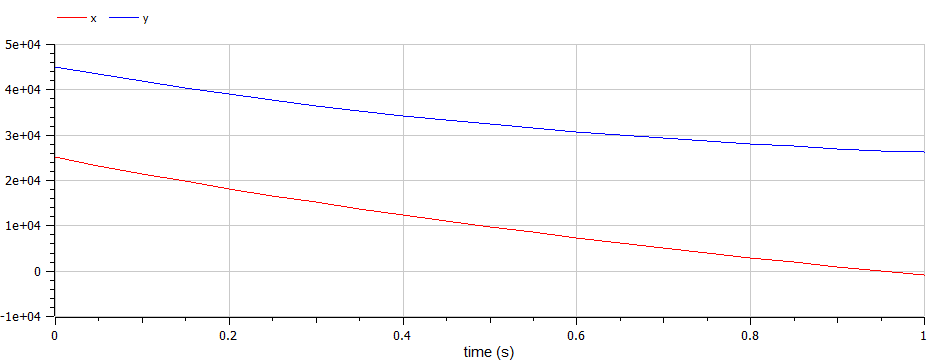
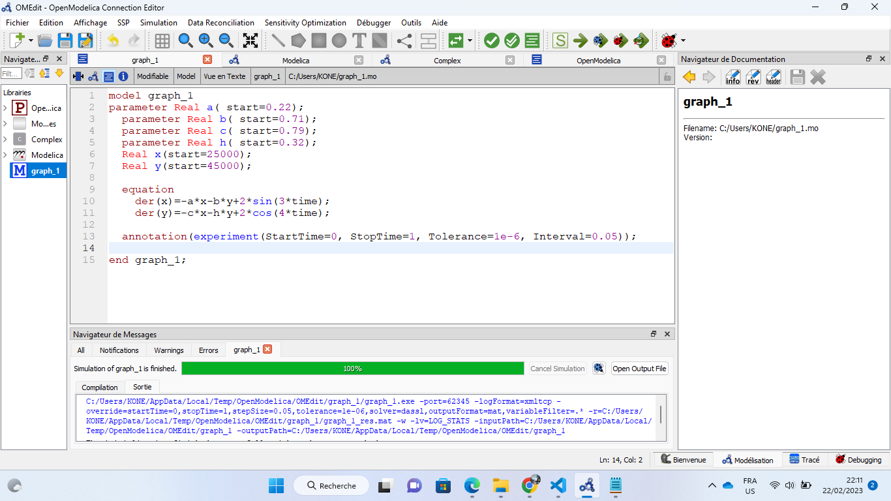
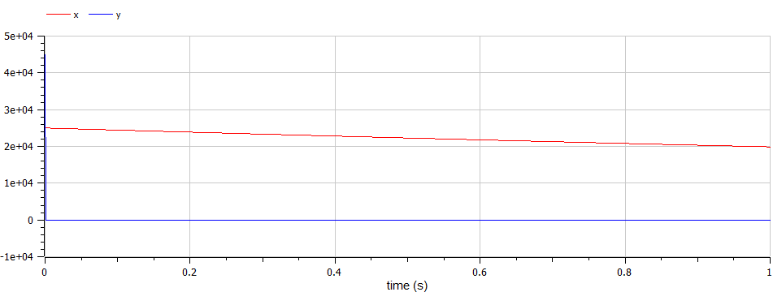
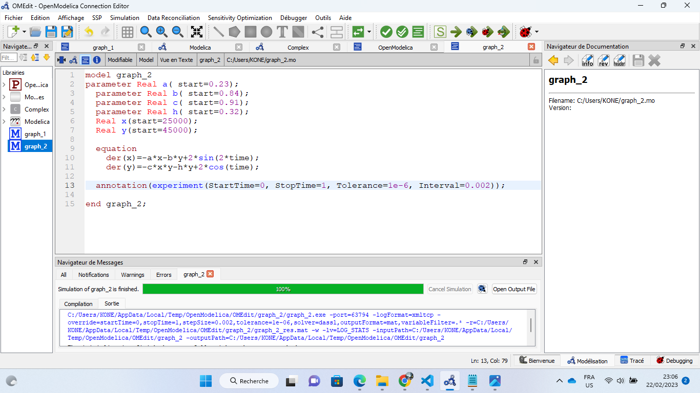

---
## Front matter
title: "Лабораторной работе №3. Модель боевых действий"
subtitle: "Вариант № 19"
author: "Коне Сирики. НФИбд-01-20"

## Generic otions
lang: ru-RU
toc-title: "Содержание"

## Bibliography
bibliography: bib/cite.bib
csl: pandoc/csl/gost-r-7-0-5-2008-numeric.csl

## Pdf output format
toc: true # Table of contents
toc-depth: 2
lof: true # List of figures
lot: true # List of tables
fontsize: 12pt
linestretch: 1.5
papersize: a4
documentclass: scrreprt
## I18n polyglossia
polyglossia-lang:
  name: russian
  options:
	- spelling=modern
	- babelshorthands=true
polyglossia-otherlangs:
  name: english
## I18n babel
babel-lang: russian
babel-otherlangs: english
## Fonts
mainfont: PT Serif
romanfont: PT Serif
sansfont: PT Sans
monofont: PT Mono
mainfontoptions: Ligatures=TeX
romanfontoptions: Ligatures=TeX
sansfontoptions: Ligatures=TeX,Scale=MatchLowercase
monofontoptions: Scale=MatchLowercase,Scale=0.9
## Biblatex
biblatex: true
biblio-style: "gost-numeric"
biblatexoptions:
  - parentracker=true
  - backend=biber
  - hyperref=auto
  - language=auto
  - autolang=other*
  - citestyle=gost-numeric
## Pandoc-crossref LaTeX customization
figureTitle: "Рис."
tableTitle: "Таблица"
listingTitle: "Листинг"
lofTitle: "Список иллюстраций"
lotTitle: "Список таблиц"
lolTitle: "Листинги"
## Misc options
indent: true
header-includes:
  - \usepackage{indentfirst}
  - \usepackage{float} # keep figures where there are in the text
  - \floatplacement{figure}{H} # keep figures where there are in the text
---

# Цель работы

Нам необходимо рассмотреть модели простейших боевых действий, так называемые модели Ланчестера. 
В моделях мы будем рассматривать три случая битв, сражение регулярных войск, сражение регулярных и партизанских войск, сражение партизанских войск.
Если численность армии обращается в нуль, то данная сторона считается проигравшей (при условии, что численность другой стороны в данный момент положительна). 

# Задание

1. Выявить три случая модели Ланчестера, разобрать их теоретическое выведение
2. Вывести уравнения для постоения моделей Ланчестера для трех случаев
3. Построить графики изменения численности войск, используя текст лабораторной работы
4. Определить победившую сторону

# Выполнение лабораторной работы
## Теоретические сведения

Рассмотри три случая ведения боевых действий с учетом различных типов войск: 
1. Боевые действия между регулярными войсками 
2. Боевые действия с участием регулярных войск и партизанских отрядов 
3. Боевые действия между партизанскими отрядами 

В первом случае ( сражение между регулярными войсками) численность войск определяется тремя факторами:

1. скорость уменьшения численности войск из-за причин, не связанных с боевыми действиями (болезни, травмы, дезертирство);
2. скорость потерь, обусловленных боевыми действиями противоборствующих сторон (что связанно с качеством стратегии, уровнем вооружения, профессионализмом солдат и т.п.);
3. скорость поступления подкрепления (задаётся некоторой функцией от времени). 

## Модель боевых действий между регулярными войсками описывается как:

$$
 \begin{cases}
	\frac{dx}{dt}= -a(t)x(t) - b(t)y(t) + P(t)
	\\   
	\frac{dy}{dt}= -c(t)x(t) - h(t)y(t) + Q(t)
 \end{cases}
$$

## Теоретические сведения:
Потери, которын не связанны с боевыми действиями, описывают члены $–a(t)x(t)$ и $–h(t)y(t)$, члены $–b(t)y(t)$ и $–c(t)x(t)$ отражают потери на поле боя. 
Коэффициенты $b(t)$, $c(t)$ указывают на эффективность боевых действий со стороны $y$ и $x$ соответственно, $a(t)$,$h(t)$  - величины, характеризующие степень влияния различных факторов на потери.
Функции $P(t)$,$Q(t)$  учитывают возможность подхода подкрепления к войскам $X$ и $Y$ в течение одного дня. 

## Модель боевых действий между регулярными войсками и партизанскими отрядами описывается как:

$$
 \begin{cases}
	\frac{dx}{dt}= -a(t)x(t) - b(t)y(t) + P(t)
	\\   
	\frac{dy}{dt}= -c(t)x(t)y(t) - h(t)y(t) + Q(t)
 \end{cases}
$$

## Модель боевых действий между партизанскими отрядами описывается как:

$$
 \begin{cases}
	\frac{dx}{dt}= -a(t)x(t) - b(t)x(t)y(t) + P(t)
	\\   
	\frac{dy}{dt}= -h(t)y(t) - c(t)x(t)y(t) + Q(t)
 \end{cases}
$$

## Модель простейший боевых действий:
В простейшей модели борьбы двух противников коэффициенты $b(t)$ и $c(t)$ являются постоянными. 
Состояние системы описывается точкой $(x,y)$ положительного квадранта плоскости. Координаты этой точки, $x$ и $y$ - это численности противостоящих армий. Тогда модель принимает вид

$$
 \begin{cases}
	\frac{dx}{dt}= -by
	\\   
	\frac{dy}{dt}= -ax
 \end{cases}
$$

## Это - жесткая модель, которая допускает точное решение

$\frac{dx}{dy}=\frac{by}{cx}$

$cxdx=bydy, cx^2 - by^2 = C$

Эволюция численностей армий x и y происходит вдоль гиперболы, заданной уравнениями в тексте лабораторной работы. По какой именно гиперболе пойдет война, зависит от начальной точки.

## Вывод из модели:
Для борьбы с вдвое более многочисленным противником нужно в четыре раза более мощное оружие, с втрое более многочисленным - в девять раз и т. д. (на это указывают квадратные корни в уравнении прямой). 
Стоит помнить, что эта модель сильно идеализирована и неприменима к реальной ситуации. Но может использоваться для начального анализа. 

## Рассотрим первый случай:
Война между регулярными войсками. Модель принимает вид:

$$
 \begin{cases}
	\frac{dx}{dt}= -a(t)x(t) - b(t)y(t) + P(t)
	\\   
	\frac{dy}{dt}= -c(t)x(t) - h(t)y(t) + Q(t)
 \end{cases}
$$

## Рассотрим второй случай:
Война между регулярными войсками и партизанскими отрядами. Модель принимает вид:

$$
 \begin{cases}
	\frac{dx}{dt}= -by(t)
	\\   
	\frac{dy}{dt}= -cx(t)y(t)
 \end{cases}
$$

Эта система приводит нас к уравнению $\frac{d}{dt}= (\frac{b}{2}x^2(t)-cy(t))=0$
которое, при заданных начальных условиях, имеет одно единственное решение:
$\frac{b}{2}x^2(t)-cy(t)=\frac{b}{2}x^2(0)-cy(0)=C_1$

## Задача.
# Условие:
Между страной $X$ и страной $Y$ идет война. Численность состава войск исчисляется от начала войны, и являются временными функциями $x(t)$ и $y(t)$
В начальный момент времени страна $X$ имеет армию численностью 25 000 человек, а в распоряжении страны $Y$  армия численностью в 45 000 человек.
Для упрощения модели считаем, что коэффициенты $a, b, c, h$ постоянны. 
Также считаем $P(t), Q(t)$ непрерывные функции.
Постройте графики изменения численности войск армии $X$ и армии $Y$ для следующих случаев:

## Случай 1. 
# Модель боевых действий между регулярными войсками

$$
 \begin{cases}
	\frac{dx}{dt}= -0.22x(t) - 0.71y(t) + 2sin(3t)
	\\   
	\frac{dy}{dt}= -0.79x(t) - 0.32y(t) + cos(4t)
 \end{cases}
$$

{ #fig:001 width=70% height=70% }

Победа достается армии $Y$.

## Код программы

{ #fig:003 width=70% height=70% }

## Случай 2. 
# Модель ведение боевых действий с участием регулярных войск и партизанских отрядов

$$
 \begin{cases}
	\frac{dx}{dt}= -0.23x(t) - 0.84y(t) + 2sin(2t)
	\\   
	\frac{dy}{dt}= -0.91x(t)y(t) - 0.32y(t) + 2cos(4t)
 \end{cases}
$$

{ #fig:002 width=70% height=70% }

Победа достается армии $Y$.

## Код программы

{ #fig:004 width=70% height=70% }

# Выводы

Рассмотрели модели простейших боевых действий, так называемые модели Ланчестера. 
В моделях мы рассмотрели два случая битв: 
1. Сражение регулярных войск.
2. Сражение регулярных и партизанских войск.
Проверили как работают модели в этих случаях, построили графики и сделали вывод о том, кто станет победителем в данных случаях.

# Список литературы

::: [Modelica Documentation](https://build.openmodelica.org/Documentation/)
:::
