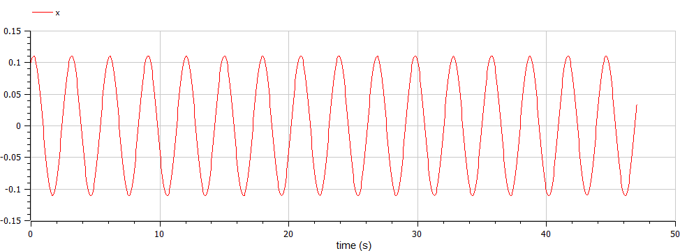
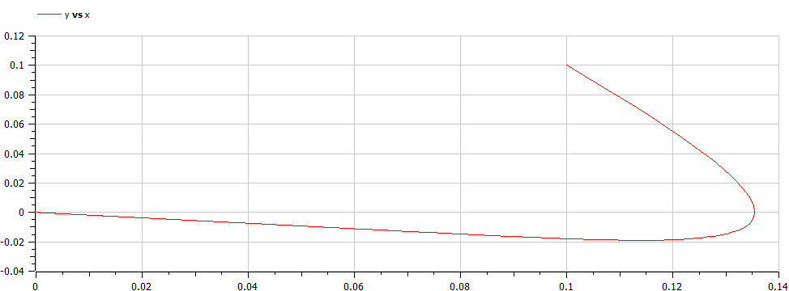
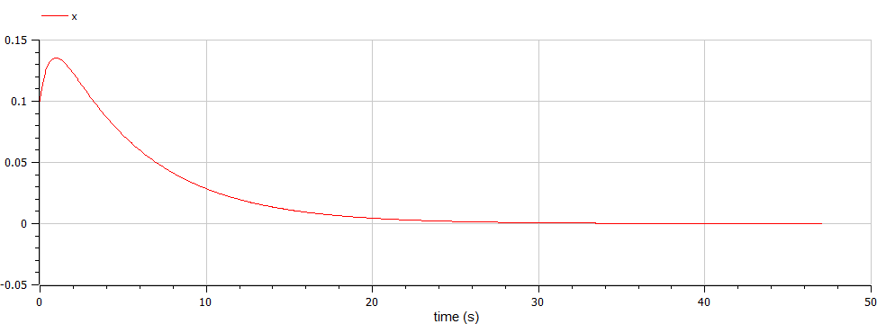
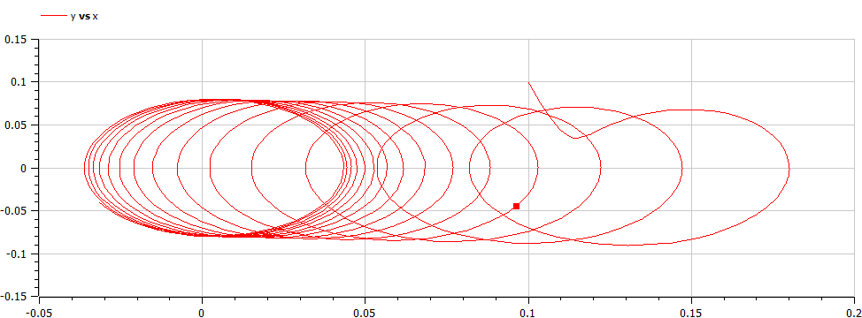

---
## Front matter
lang: ru-RU
title: Лабораторная работа №4 - "Модель гармонических колебаний"
subtitle: Вариант № 19
author:
  - Коне Сирики.
institute:
  - Российский университет дружбы народов, Москва, Россия
date: 02 Марта, 2023, Москва, Россия

## i18n babel
babel-lang: russian
babel-otherlangs: english

## Formatting pdf
toc: false
toc-title: Содержание
slide_level: 2
aspectratio: 169
section-titles: true
theme: metropolis
header-includes:
 - \metroset{progressbar=frametitle,sectionpage=progressbar,numbering=fraction}
 - '\makeatletter'
 - '\beamer@ignorenonframefalse'
 - '\makeatother'
---

# Информация

## Докладчик

:::::::::::::: {.columns align=center}
::: {.column width="70%"}

  * Коне Сирики
  * Студент физмат 
  * Российский университет дружбы народов
  * [konesirisil@yandex.ru](mailto:sirikisil@yandex.ru)
  * <https://github.com/skone19>

:::
::: {.column width="30%"}

:::
::::::::::::::

# Цели и задачи работы

## Цель лабораторной работы

Изучить уравнение гармонического осцилятора без затухания. Записать данное уравнение и построить фазовый портрет гармонических и свободных колебаний. 

## Задание к лабораторной работе

1.	Построить решение уравнения гармонического осциллятора без затухания
2.	Записать уравнение свободных колебаний гармонического осциллятора с затуханием, построить его решение. После построить фазовый портрет гармонических колебаний с затуханием.
3.	Записать уравнение колебаний гармонического осциллятора, если на систему действует внешняя сила, построить решение и фазовый портрет.

# Ход работы лабораторной:

## Теоретический материал 

Движение грузика на пружинке, маятника, заряда в электрическом контуре.
Также эволюция во времени многих систем в физике, химии, биологии и других науках при определенных предположениях можно описать одним дифференциальным уравнением, которое в теории колебаний выступает в качестве основной модели. 
Такая модель называется линейным гармоническим осциллятором.

Уравнение же свободных колебаний гармонического осциллятора имеет вид:
* $$\ddot{x}+2\gamma\dot{x}+\omega_0^2=0$$

## Теоретический материал 

При отсутствии потерь в системе ( $\gamma=0$ ) мы получим уравнение консервативного осциллятора энергии колебания, которое сохранится во времени.
* $$\ddot{x}+\omega_0^2x=0$$

## Теоретический материал 

Для однозначной разрешимости уравнения второго порядка необходимо задать два начальных условия вида:
 
$$
 \begin{cases}
	x(t_0)=x_0
	\\   
	\dot{x(t_0)}=y_0
 \end{cases}
$$

## Теоретический материал 

Уравнение второго порядка представляем в виде системы двух уравнений первого порядка:
$$
 \begin{cases}
	x=y
	\\   
	y=-\omega_0^2x
 \end{cases}
$$

## Теоретический материал 

Начальные условия для системы примут вид:
$$
 \begin{cases}
	x(t_0)=x_0
	\\   
	y(t_0)=y_0
 \end{cases}
$$

## Условие задачи

В условии лабораторной нас просят построить фазовый портрет гармонического осциллятора для разных случаев. А также построить решения для этих случаев: 

1. Колебания гармонического осциллятора без затуханий и без действий внешней силы $\ddot{x}+4.5x=0$
2. Колебания гармонического осциллятора c затуханием и без действий внешней силы $\ddot{x}+0.9\dot{x}+0.3x=0$
3. Колебания гармонического осциллятора c затуханием и под действием внешней силы $\ddot{x}+3\dot{x}+0.5x=0.5\sin{2t}$

На итнтервале $t \in [ 0;47 ]$, шаг 0.05, $x_0=0.1, y_0=0.1$

## Случай 1. 
Колебания гармонического осциллятора без затуханий и без действий внешней силы $$\ddot{x}+4.5x=0$$

{ #fig:001 width=70% height=70% }

## Случай 1. 
Колебания гармонического осциллятора без затуханий и без действий внешней силы $$\ddot{x}+4.5x=0$$

{ #fig:002 width=70% height=70% }

## Случай 2. 
Колебания гармонического осциллятора c затуханием и без действий внешней силы $$\ddot{x}+0.9\dot{x}+0.3x=0$$

{ #fig:003 width=70% height=70% }

## Случай 2. 
Колебания гармонического осциллятора c затуханием и без действий внешней силы $$\ddot{x}+0.9\dot{x}+0.3x=0$$

{ #fig:004 width=70% height=70% }

## Случай 3. 
Колебания гармонического осциллятора c затуханием и под действием внешней силы $$\ddot{x}+3\dot{x}+0.5x=0.5\sin{2t}$$

{ #fig:005 width=70% height=70% }

## Случай 3. 
Колебания гармонического осциллятора c затуханием и под действием внешней силы $$\ddot{x}+3\dot{x}+0.5x=0.5\sin{2t}$$

{ #fig:006 width=70% height=70% }

# Выводы по проделанной работе

## Вывод

В ходе выполнения лабораторной работы мы построили решения уравнений гармонического осциллятора, а также фазовые портреты для трех случаев:
1. Колебания гармонического осциллятора без затуханий и без действий внешней силы
2. Колебания гармонического осциллятора c затуханием и без действий внешней силы
3. Колебания гармонического осциллятора c затуханием и под действием внешней силы