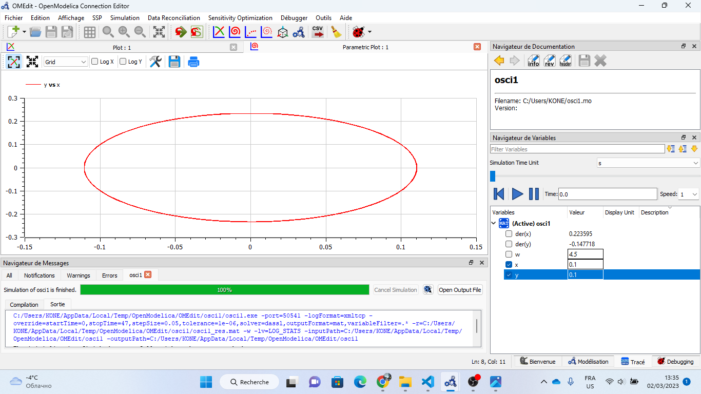
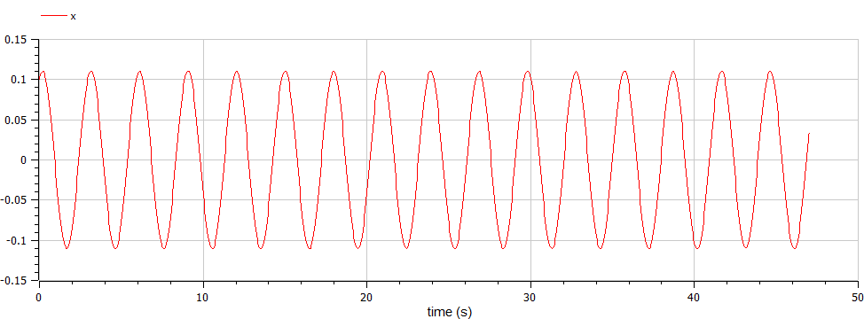
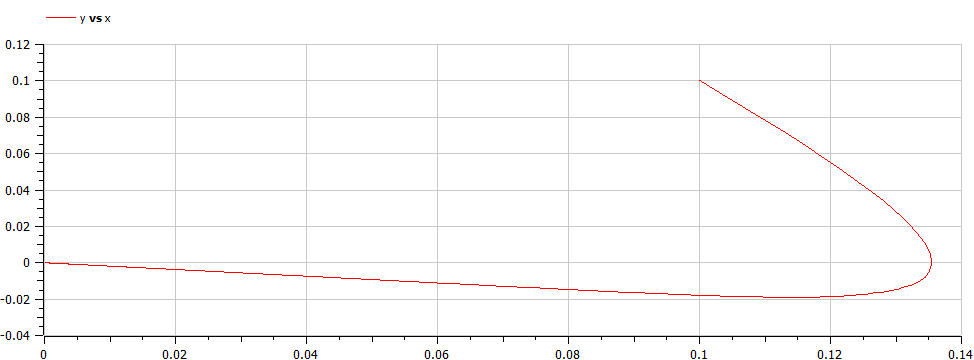
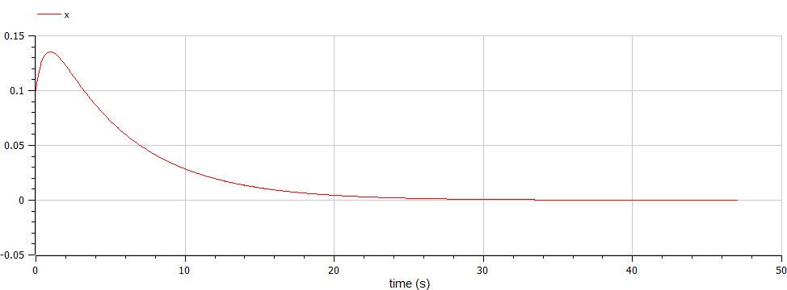
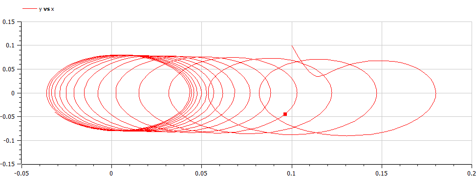
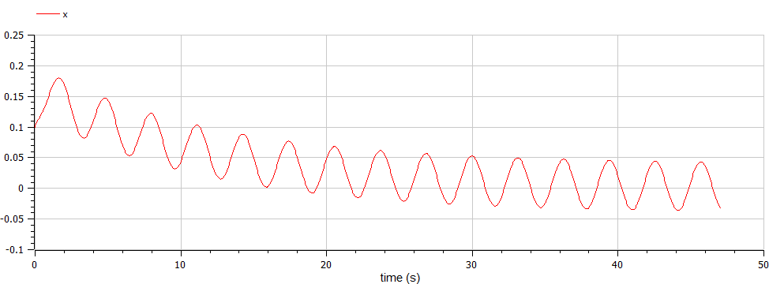

---
## Front matter
title: "Лабораторной работе №4"
subtitle: "Модель гармонических колебаний - вариант 19"
author: "Коне Сирики. НФИбд-01-20"

## Generic otions
lang: ru-RU
toc-title: "Содержание"

## Bibliography
bibliography: bib/cite.bib
csl: pandoc/csl/gost-r-7-0-5-2008-numeric.csl

## Pdf output format
toc: true # Table of contents
toc-depth: 2
lof: true # List of figures
lot: true # List of tables
fontsize: 12pt
linestretch: 1.5
papersize: a4
documentclass: scrreprt
## I18n polyglossia
polyglossia-lang:
  name: russian
  options:
	- spelling=modern
	- babelshorthands=true
polyglossia-otherlangs:
  name: english
## I18n babel
babel-lang: russian
babel-otherlangs: english
## Fonts
mainfont: PT Serif
romanfont: PT Serif
sansfont: PT Sans
monofont: PT Mono
mainfontoptions: Ligatures=TeX
romanfontoptions: Ligatures=TeX
sansfontoptions: Ligatures=TeX,Scale=MatchLowercase
monofontoptions: Scale=MatchLowercase,Scale=0.9
## Biblatex
biblatex: true
biblio-style: "gost-numeric"
biblatexoptions:
  - parentracker=true
  - backend=biber
  - hyperref=auto
  - language=auto
  - autolang=other*
  - citestyle=gost-numeric
## Pandoc-crossref LaTeX customization
figureTitle: "Рис."
tableTitle: "Таблица"
listingTitle: "Листинг"
lofTitle: "Список иллюстраций"
lotTitle: "Список таблиц"
lolTitle: "Листинги"
## Misc options
indent: true
header-includes:
  - \usepackage{indentfirst}
  - \usepackage{float} # keep figures where there are in the text
  - \floatplacement{figure}{H} # keep figures where there are in the text
---

# Цель работы

Изучить уравнение гармонического осцилятора без затухания. Записать данное уравнение и построить фазовый портрет гармонических и свободных колебаний. 


# Задание

1.	Построить решение уравнения гармонического осциллятора без затухания
2.	Записать уравнение свободных колебаний гармонического осциллятора с затуханием, построить его решение. Построить фазовый портрет гармонических колебаний с затуханием.
3.	Записать уравнение колебаний гармонического осциллятора, если на систему действует внешняя сила, построить его решение. Построить фазовый портрет колебаний с действием внешней силы.


# Выполнение лабораторной работы

## Теоретические сведения

Движение грузика на пружинке, маятника, заряда в электрическом контуре, а также эволюция во времени многих систем в разных науках при определенных предположениях можно описать одним дифференциальным уравнением.
Это уравнение в теории колебаний выступает в качестве основной модели. Эта модель называется линейным гармоническим осциллятором.
Уравнение свободных колебаний гармонического осциллятора имеет вид:

* $$\ddot{x}+2\gamma\dot{x}+\omega_0^2=0$$

где:
* $x$ - переменная, описывающая состояние системы (смещение грузика, заряд конденсатора и т.д.), 
* $\gamma$ - параметр, характеризующий потери энергии (трение в механической системе, сопротивление в контуре), 
* $\omega_0$ - собственная частота колебаний.
Это уравнение есть линейное однородное дифференциальное  уравнение второго порядка и оно является примером линейной динамической системы.

## Теоретические сведения

При отсутствии потерь в системе ( $\gamma=0$ ) получаем уравнение консервативного осциллятора энергия колебания которого сохраняется во времени.
$$\ddot{x}+\omega_0^2x=0$$

## Теоретические сведения
Для однозначной разрешимости уравнения второго порядка необходимо задать два начальных условия вида
 
$$
 \begin{cases}
	x(t_0)=x_0
	\\   
	\dot{y(t_0)}=y_0
 \end{cases}
$$

## Теоретические сведения

Уравнение второго порядка можно представить в виде системы двух уравнений первого порядка:
$$
 \begin{cases}
	x=y
	\\   
	y=-\omega_0^2x
 \end{cases}
$$

## Теоретические сведения

Начальные условия для системы примут вид:
$$
 \begin{cases}
	x(t_0)=x_0
	\\   
	y(t_0)=y_0
 \end{cases}
$$

## Теоретические сведения

Независимые	переменные	$x, y$	определяют	пространство,	в	котором «движется» решение. Это фазовое пространство системы, поскольку оно двумерно будем называть его фазовой плоскостью.
Значение фазовых координат $x, y$ в любой момент времени полностью определяет состояние системы. Решению уравнения движения как функции времени отвечает гладкая кривая в фазовой плоскости. Она называется фазовой траекторией. Если множество различных решений (соответствующих различным 
начальным условиям) изобразить на одной фазовой плоскости, возникает общая картина поведения системы. Такую картину, образованную набором фазовых траекторий, называют фазовым портретом.


## Условие задачи и пункты:

Постройте фазовый портрет гармонического осциллятора и решение уравнения гармонического осциллятора для следующих случаев 

1. Колебания гармонического осциллятора без затуханий и без действий внешней силы $\ddot{x}+4.5x=0$
2. Колебания гармонического осциллятора c затуханием и без действий внешней силы $\ddot{x}+0.9\dot{x}+0.3x=0$
3. Колебания гармонического осциллятора c затуханием и под действием внешней силы $\ddot{x}+3\dot{x}+0.5x=0.5\sin{2t}$

На итнтервале $t \in [ 0;47 ]$, шаг 0.05, $x_0=0.1, y_0=0.1$


## 1. В системе отсутствуют потери энергии (колебания без затухания)
Получаем уравнение 
* $$\ddot{x}+\omega_4^5x=0$$

## Код программы: 
```
model osci1
  parameter Real w(start=4.5);
  Real x(start=0.1);
  Real y(start=0.1);

equation

  der(x)=y;
  der(y)=-w*x;

  annotation(experiment(StartTime=0, StopTime=47, Tolerance=1e-6, Interval=0.05));

end osci1;

```

## Результат: 
{ #fig:001 width=70% height=70% }
{ #fig:002 width=70% height=70% }


## 2.  В системе присутствуют потери энергии (колебания с затуханием)
Получаем уравнение 
* $$\ddot{x}+0^9\gamma\dot{x}+\omega_0^3x=0$$

## Код программы: 
```
model osci2

parameter Real w(start=0.3);
parameter Real g(start=0.9);
  Real x(start=0.1);
  Real y(start=0.1);

equation

  der(x)=y;
  der(y)=-2*g*y-w*x;

  annotation(experiment(StartTime=0, StopTime=47, Tolerance=1e-6, Interval=0.05));


end osci2;

```
## Результаты: 
{ #fig:003 width=70% height=70% }
{ #fig:004 width=70% height=70% }


## 3. На систему действует внешняя сила.
Получаем уравнение 
* $$\ddot{x}+3\gamma\dot{x}+\omega_0^5x=F(t)$$

## Код программы: 
```
model osci3
parameter Real w(start=0.5);
parameter Real g(start=3.0);
  Real x(start=0.1);
  Real y(start=0.1);

equation

  der(x)=y;
  der(y)=-2*g*y-w*x+0.5*sin(2*time);

  annotation(experiment(StartTime=0, StopTime=47, Tolerance=1e-6, Interval=0.05));

end osci3;

```

## Результаты: 
{ #fig:005 width=70% height=70% }
{ #fig:006 width=70% height=70% }

# Выводы

В ходе выполнения лабораторной работы мы построили решения уравнений гармонического осциллятора, а также фазовые портреты для трех случаев:
1. Колебания гармонического осциллятора без затуханий и без действий внешней силы
2. Колебания гармонического осциллятора c затуханием и без действий внешней силы
3. Колебания гармонического осциллятора c затуханием и под действием внешней силы
