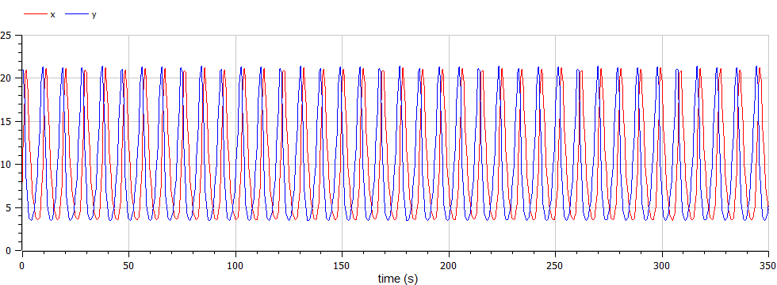

---
## Front matter
title: "Лабораторной работе №5. по ходу"
subtitle: "Модель хищник-жертва Лотки-Вольтерры. Вариант 19"
author: "Коне Сирики. НФИбд-01-20"

## Generic otions
lang: ru-RU
toc-title: "Содержание"

## Bibliography
bibliography: bib/cite.bib
csl: pandoc/csl/gost-r-7-0-5-2008-numeric.csl

## Pdf output format
toc: true # Table of contents
toc-depth: 2
lof: true # List of figures
lot: true # List of tables
fontsize: 12pt
linestretch: 1.5
papersize: a4
documentclass: scrreprt
## I18n polyglossia
polyglossia-lang:
  name: russian
  options:
	- spelling=modern
	- babelshorthands=true
polyglossia-otherlangs:
  name: english
## I18n babel
babel-lang: russian
babel-otherlangs: english
## Fonts
mainfont: PT Serif
romanfont: PT Serif
sansfont: PT Sans
monofont: PT Mono
mainfontoptions: Ligatures=TeX
romanfontoptions: Ligatures=TeX
sansfontoptions: Ligatures=TeX,Scale=MatchLowercase
monofontoptions: Scale=MatchLowercase,Scale=0.9
## Biblatex
biblatex: true
biblio-style: "gost-numeric"
biblatexoptions:
  - parentracker=true
  - backend=biber
  - hyperref=auto
  - language=auto
  - autolang=other*
  - citestyle=gost-numeric
## Pandoc-crossref LaTeX customization
figureTitle: "Рис."
tableTitle: "Таблица"
listingTitle: "Листинг"
lofTitle: "Список иллюстраций"
lotTitle: "Список таблиц"
lolTitle: "Листинги"
## Misc options
indent: true
header-includes:
  - \usepackage{indentfirst}
  - \usepackage{float} # keep figures where there are in the text
  - \floatplacement{figure}{H} # keep figures where there are in the text
---

# Цель работы

Изучить простейшую модель Лотки-Вольтерры хищник-жертва, основанную на нескольких предлоположениях. 
Построить модель с помощью дифференциальных уравнений. Сделать выводы по заданию

# Задание

1.	Построить график зависимости $x$ от $y$ и графики функций $x(t)$, $y(t)$
2.	Найти стационарное состояние системы


# Выполнение лабораторной работы

## Теоретические сведения

В данной лабораторной работе рассматривается математическая модель системы «Хищник-жертва». 

* Рассмотрим базисные компоненты системы: $X$ хищников и $Y$ жертв.  
* Пусть для этой системы выполняются следующие предположения: (Модель Лотки-Вольтерра)
1.	Численность популяции жертв и хищников зависят только от времени (модель не учитывает пространственное распределение популяции на занимаемой территории) 
2.	В отсутствии взаимодействия численность видов изменяется по модели Мальтуса, при этом число жертв увеличивается, а число хищников падает 
3.	Естественная смертность жертвы и естественная рождаемость хищника считаются несущественными 
4.	Эффект насыщения численности обеих популяций не учитывается 
5.	Скорость роста численности жертв уменьшается пропорционально численности хищников:

$$
 \begin{cases}
	\frac{dx}{dt} = -ax(t) + by(t)x(t)
	\\   
	\frac{dy}{dt} = cy(t) - dy(t)x(t)
 \end{cases}
$$

## Теоретические сведения
Параметр $a$ определяет коэффициент смертности хищников, $b$ – коэффициент естественного прироста хищников, $c$ – коэффициент прироста жертв и $d$ – коэффициент смертности жертв

В зависимости от этих параметрах система и будет изменяться. Однако следует выделить одно важное состояние системы, при котором не происходит никаких изменений как со стороны хищников, так и со стороны жертв. Это, так называемое, стационарное состояние системы. При нем, как уже было отмечено, изменение численности популяции равно нулю.
Следовательно, при отсутствии изменений в системе $\frac{dx}{dt} = 0, \frac{dy}{dt} = 0$

Пусть по условию есть хотя бы один хищник и хотя бы одна жертва: $x>0, y>0$
Тогда стационарное состояние системы определяется следующим образом: 
$$
	x_0=\frac{a}{b}, y_0=\frac{c}{d}
$$

# Задача

##Условие задачи:
В лесу проживают х число волков, питающихся зайцами, число которых в
этом же лесу у. Пока число зайцев достаточно велико, для прокормки всех волков,
численность волков растет до тех пор, пока не наступит момент, что корма
перестанет хватать на всех. Тогда волки начнут умирать, и их численность будет
уменьшаться. В этом случае в какой-то момент времени численность зайцев снова
начнет увеличиваться, что повлечет за собой новый рост популяции волков. Такой
цикл будет повторяться, пока обе популяции будут существовать. Помимо этого,
на численность стаи влияют болезни и старение. 
Данная модель описывается следующим уравнением:
$$
 \begin{cases}
	\frac{dx}{dt} = -ax(t) + by(t)x(t)
	\\   
	\frac{dy}{dt} = cy(t) - dy(t)x(t)
 \end{cases}
$$

## Мой вариант: 
$$
 \begin{cases}
	\frac{dx}{dt} = -0.71x(t) + 0.072y(t)x(t)
	\\   
	\frac{dy}{dt} = 0.73y(t) - 0.074y(t)x(t)
 \end{cases}
$$

Постройте график зависимости численности хищников от численности жертв, а также графики изменения численности хищников и численности жертв 
при следующих начальных условиях: $x_0=8, y_0=21$
Найдите стационарное состояние системы

## Код программы:

```
model osci1
parameter Real a =0.71;
parameter Real b = 0.072;
parameter Real c =0.73;
parameter Real d =0.074;

parameter Real x0=8;
parameter Real y0=21;

Real x(start =x0);
Real y(start =y0);

equation
der(x)=-a*x + b*x*y;
der(y)= c*y - d*x*y;

 annotation(experiment(StartTime=0, StopTime=350, Tolerance=1e-6, Interval=0.5));

end osci1;


```

## Код программы:

```
model osci2

parameter Real a =0.71;
parameter Real b = 0.072;
parameter Real c =0.73;
parameter Real d =0.074;

parameter Real x0=0.73/0.074;
parameter Real y0=0.71/0.072;

Real x(start =x0);
Real y(start =y0);

equation
der(x)=-a*x + b*x*y;
der(y)= c*y - d*x*y;

 //annotation(experiment(StartTime=0, StopTime=25, Tolerance=1e-6, Interval=0.5));


end osci2;

```
# Результаты работы: 

##График численности жертв и хищников от времени
{ #fig:001 width=70% height=70% }

##График численности хищников от численности жертв
{ #fig:002 width=70% height=70% }

##Стационарное состояние
{ #fig:003 width=70% height=70% }

Стационарное состояние $x_0=\frac{a}{b}=9.86486, y_0=\frac{c}{d}=9.86111$

# Выводы

В ходе выполнения лабораторной работы была изучена модель хищник-жертва и построены графики зависимости количества хищников и жертв в разных отношениях и в разные периоды времени. 

# Список литературы {.unnumbered}

1. [Модель Лотки-Вольтерры](https://math-it.petrsu.ru/users/semenova/MathECO/Lections/Lotka_Volterra.pdf)
2. [Биология математическая](http://www.library.biophys.msu.ru/MathMod/BM.HTML)