---
# Front matter
lang: ru-RU
title: "Отчёта по лабораторной работе 1"
subtitle: "Математическое моделирование"
author: "КОНЕ СИРИКИ"

# Formatting
toc-title: "Содержание"
toc: true # Table of contents
toc_depth: 2
lof: true # List of figures
lot: true # List of tables
fontsize: 12pt
linestretch: 1.5
papersize: a4paper
documentclass: scrreprt
polyglossia-lang: russian
polyglossia-otherlangs: english
mainfont: PT Serif
romanfont: PT Serif
sansfont: PT Sans
monofont: PT Mono
mainfontoptions: Ligatures=TeX
romanfontoptions: Ligatures=TeX
sansfontoptions: Ligatures=TeX,Scale=MatchLowercase
monofontoptions: Scale=MatchLowercase
indent: true
pdf-engine: lualatex
header-includes:
  - \linepenalty=10 # the penalty added to the badness of each line within a paragraph (no associated penalty node) Increasing the value makes tex try to have fewer lines in the paragraph.
  - \interlinepenalty=0 # value of the penalty (node) added after each line of a paragraph.
  - \hyphenpenalty=50 # the penalty for line breaking at an automatically inserted hyphen
  - \exhyphenpenalty=50 # the penalty for line breaking at an explicit hyphen
  - \binoppenalty=700 # the penalty for breaking a line at a binary operator
  - \relpenalty=500 # the penalty for breaking a line at a relation
  - \clubpenalty=150 # extra penalty for breaking after first line of a paragraph
  - \widowpenalty=150 # extra penalty for breaking before last line of a paragraph
  - \displaywidowpenalty=50 # extra penalty for breaking before last line before a display math
  - \brokenpenalty=100 # extra penalty for page breaking after a hyphenated line
  - \predisplaypenalty=10000 # penalty for breaking before a display
  - \postdisplaypenalty=0 # penalty for breaking after a display
  - \floatingpenalty = 20000 # penalty for splitting an insertion (can only be split footnote in standard LaTeX)
  - \raggedbottom # or \flushbottom
  - \usepackage{float} # keep figures where there are in the text
  - \floatplacement{figure}{H} # keep figures where there are in the text
---

## Цель работы
Познакомиться с Работа с git.

## Выполнение работы.
1.1.1 Установка имени и электронной почты 

(рис. -@fig:001) 

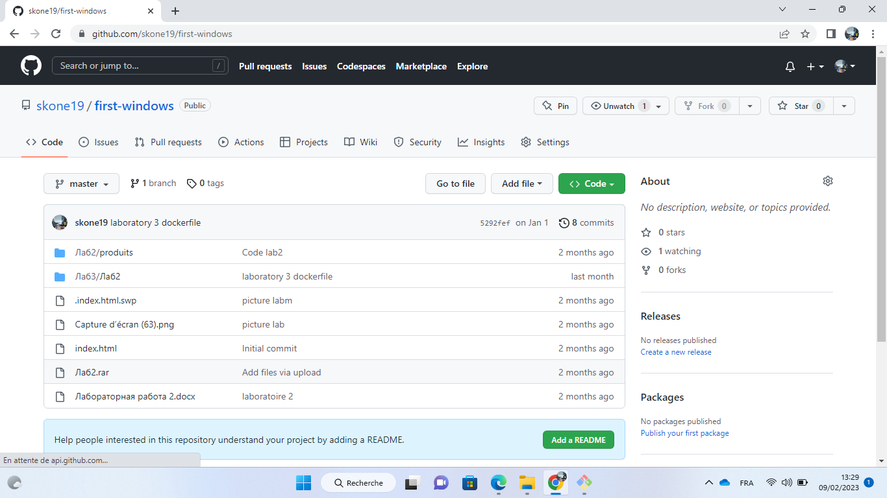 { # fig:001 width=70%} 

1.1.2 Параметры установки окончаний строк.
 
1.1.3 Установка отображения unicode

1.2 Создание проекта

1.2.1 Создайте страницу «Hello, World»

1.2.2 Создание репозитория

1.2.3 Добавление файла в репозиторий

(рис. -@fig:002) 

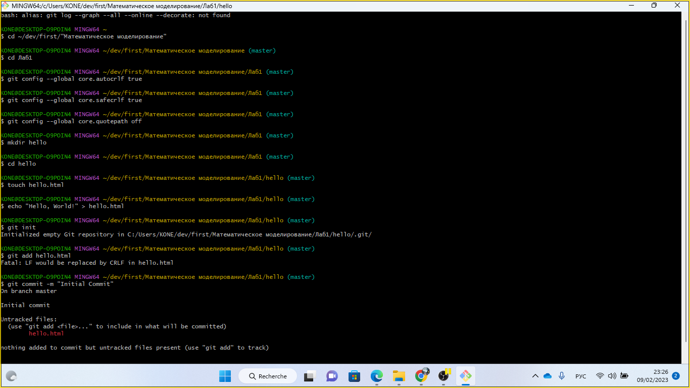 { # fig:002 width=70%} 

1.2.4 Проверка состояние репозитория

1.3 Внесение изменений

1.3.1 Измените страницу «Hello, World»

1.4 Индексация изменений

(рис. -@fig:003) 

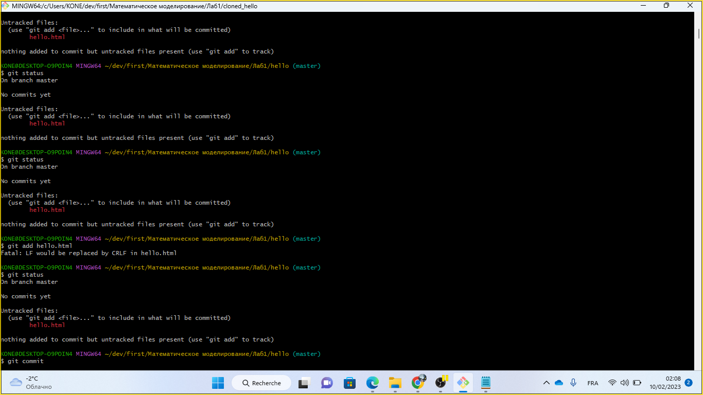 { # fig:003 width=70%} 

1.4.1 Коммит изменений

1.4.2 Добавьте стандартные теги страницы

(рис. -@fig:004) 

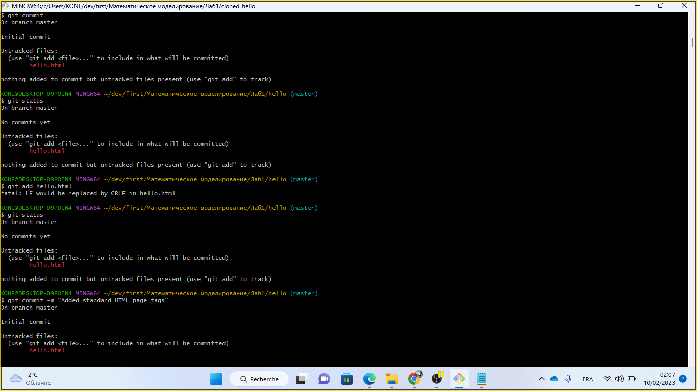 { # fig:004 width=70%} 

(рис. -@fig:005) 

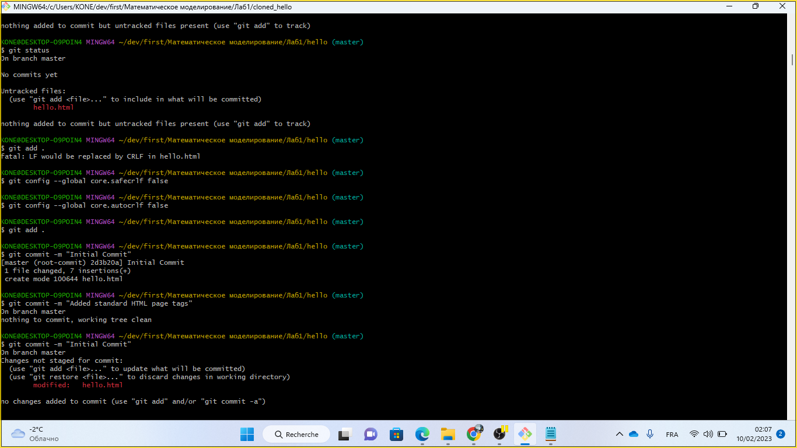 { # fig:005 width=70%} 

1.4.3 История

1.4.4 Получение старых версий

(рис. -@fig:006) 

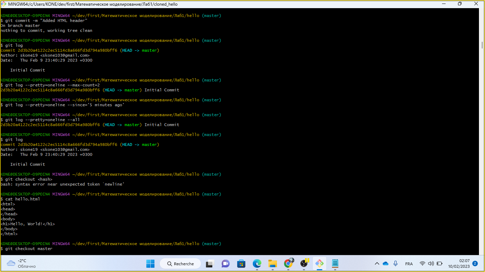 { # fig:006 width=70%} 

1.4.5 Создание тегов версий

1.4.6 Переключение по имени тега

(рис. -@fig:007) 

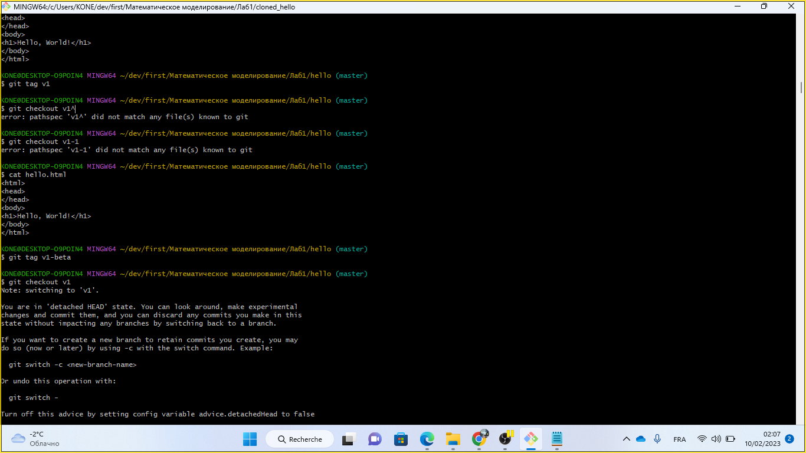 { # fig:007 width=70%}

1.4.7 Просмотр тегов с помощью команды tag

1.5 Отмена локальных изменений (до индексации)

1.5.1 Переключитесь на ветку master

1.5.2 Измените hello.html

1.5.3 Проверьте состояние

1.5.4 Отмена изменений в рабочем каталоге

(рис. -@fig:008) 

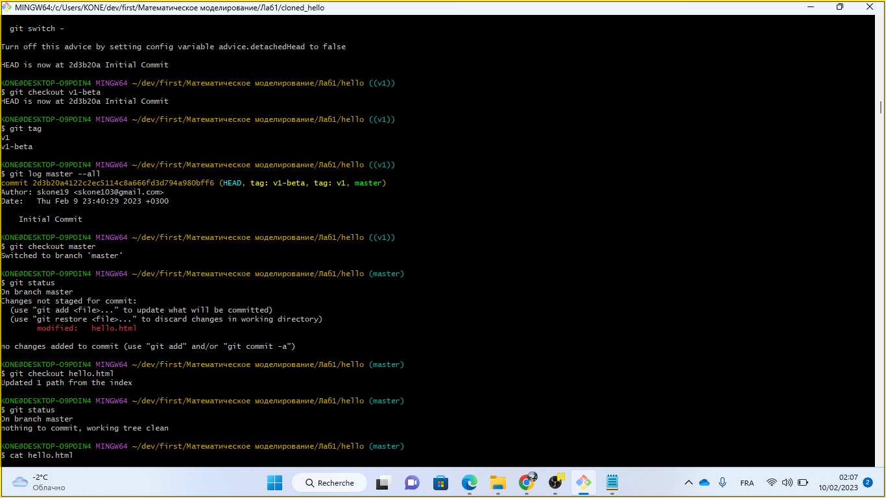 { # fig:008 width=70%} 

1.6 Отмена проиндексированных изменений (перед коммитом)

1.6.1 Измените файл и проиндексируйте изменения

1.6.2 Проверьте состояние

1.6.3 Выполните сброс буферной зоны

1.6.4 Переключитесь на версию коммита

1.7 Отмена коммитов

1.7.1 Отмена коммитов

1.7.2 Измените файл и сделайте коммит

1.7.3 Сделайте коммит с новыми изменениями, отменяющими предыдущие

(рис. -@fig:009) 

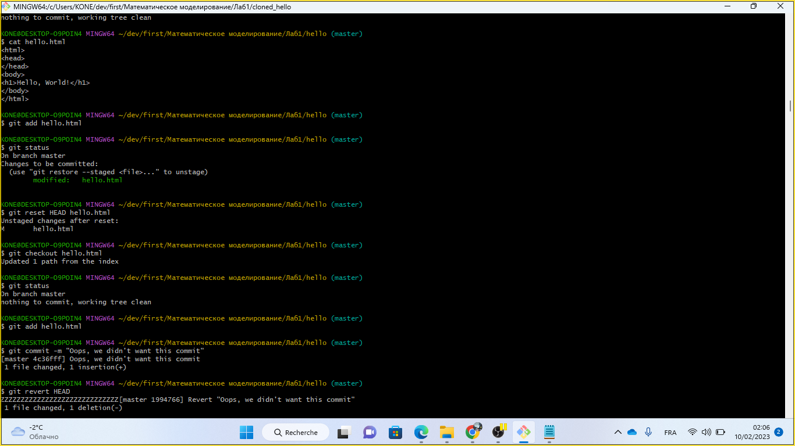 { # fig:009 width=70%} 

1.7.4 Проверьте лог

Проверка лога показывает нежелательные и отмененные коммиты в 

наш репози торий.

1.8 Удаление коммиттов из ветки

1.8.1 Команда git reset

1.8.2 Проверьте нашу историю

1.8.3 Для начала отметьте эту ветку

(рис. -@fig:010) 

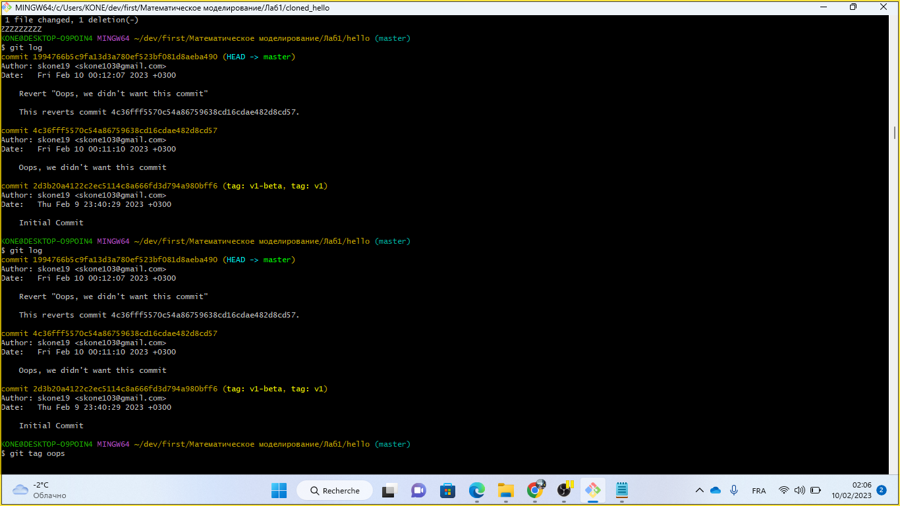 { # fig:010 width=70%} 

1.8.4 Сброс коммитов к предшествующим коммиту Oops

1.8.5 Ничего никогда не теряется

1.8.6 Опасность сброса

1.9 Удаление тега oops

1.9.1 Удаление тега oops

(рис. -@fig:011) 

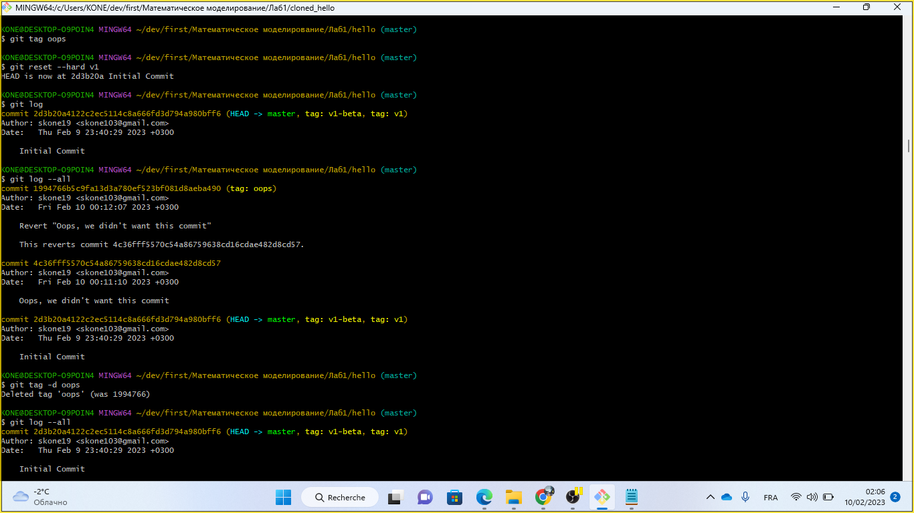 { # fig:011 width=70%} 

1.10 Внесение изменений в коммиты

1.10.1 Измените страницу, а затем сделайте коммит

1.10.2 Необходим email

1.10.3 Измените предыдущий коммит

1.10.4 Просмотр истории

1.11 Перемещение файлов

1.11.1 Переместите файл hello.html в каталог lib

1.12 Второй способ перемещения файлов

1.12.1 Коммит в новый каталог

1.13 Подробнее о структуре

1.13.1 Добавление index.html

(рис. -@fig:012) 

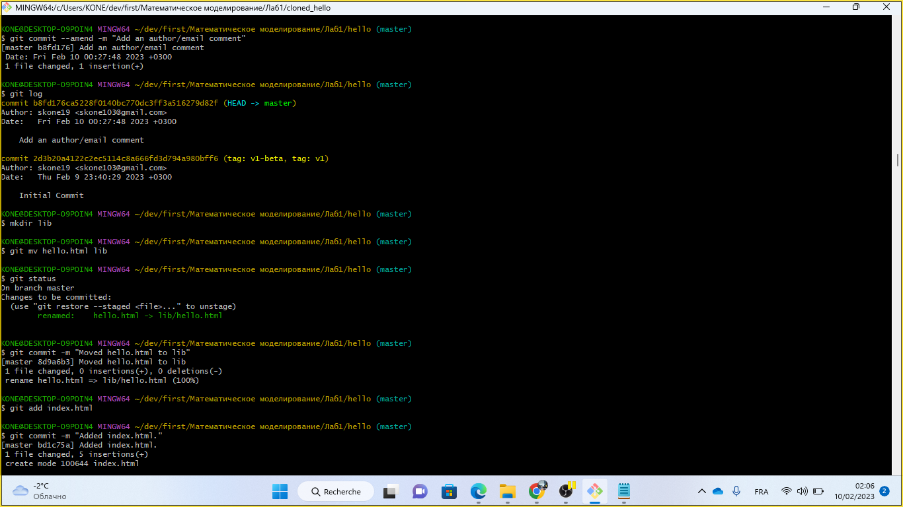 { # fig:012 width=70%} 

1.14 Git внутри: Каталог .git

1.14.1 Каталог .git

1.14.2 База данных объектов

1.14.3 Углубляемся в базу данных объектов

1.14.4 Config File

1.14.5 Ветки и теги

1.14.6 Файл HEAD

1.15 Работа непосредственно с объектами git

1.15.1 Поиск последнего коммита

(рис. -@fig:013) 

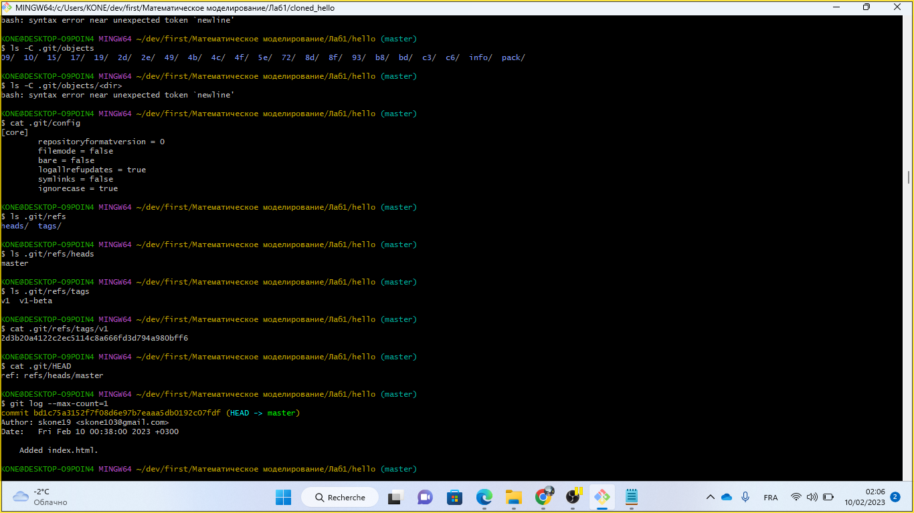 { # fig:013 width=70%} 

1.15.2 Вывод последнего коммита с помощью SHA1 хэша

(рис. -@fig:014) 

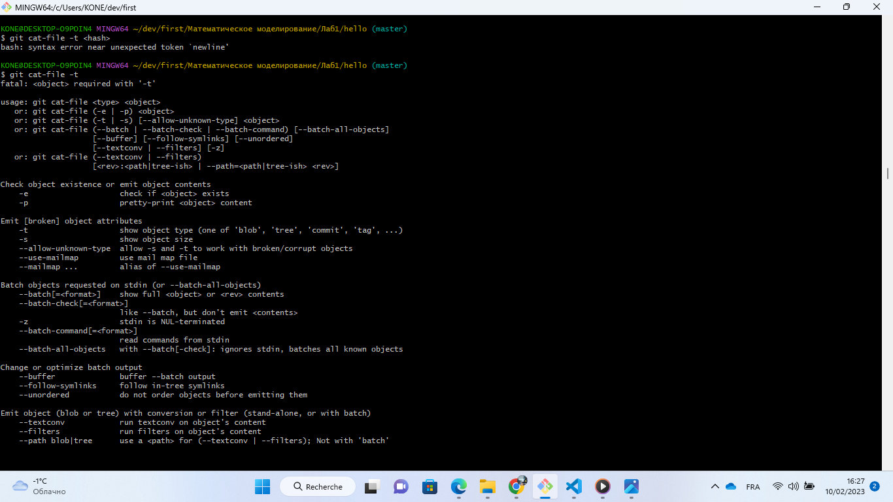 { # fig:014 width=70%} 

(рис. -@fig:015) 

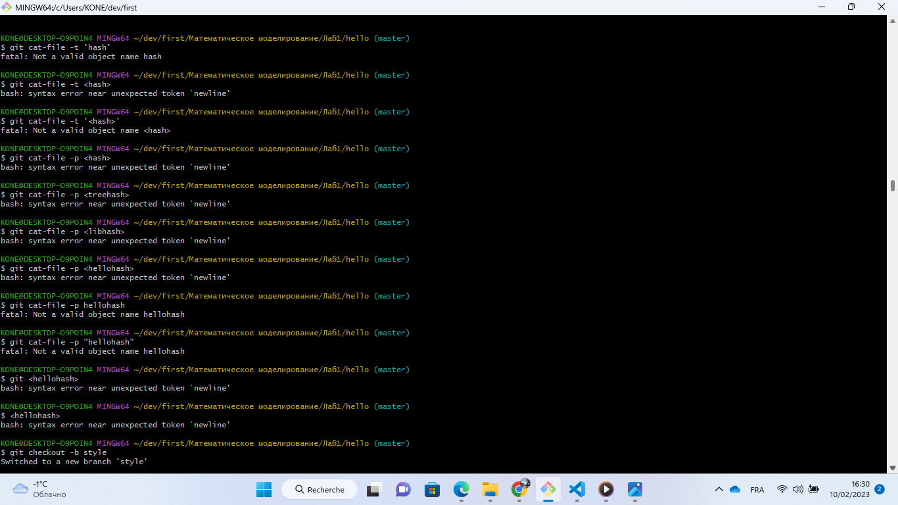 { # fig:015 width=70%} 

1.15.3 Поиск дерева

1.15.4 Вывод каталога lib

1.15.5 Вывод файла hello.html

1.15.6 Исследуйте самостоятельно

1.16 Создание ветки

1.16.1 Создайте ветку

1.16.2 Добавьте файл стилей style.css

1.16.3 Измените основную страницу

1.16.4 Измените index.html

(рис. -@fig:016) 

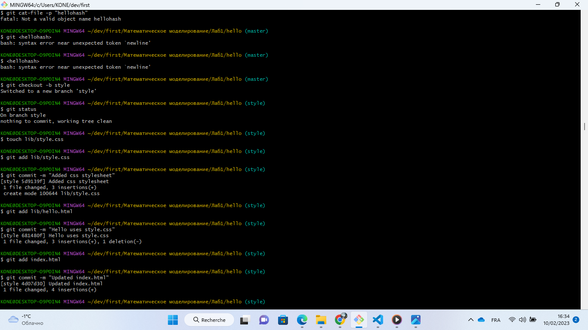 { # fig:016 width=70%} 

1.17 Навигация по веткам

1.17.1 Переключение на ветку master

1.17.2 Вернемся к ветке style

1.18 Изменения в ветке master

1.18.1 Создайте файл README в ветке master

1.19 Сделайте коммит изменений README.md в ветку master.

(рис. -@fig:017) 

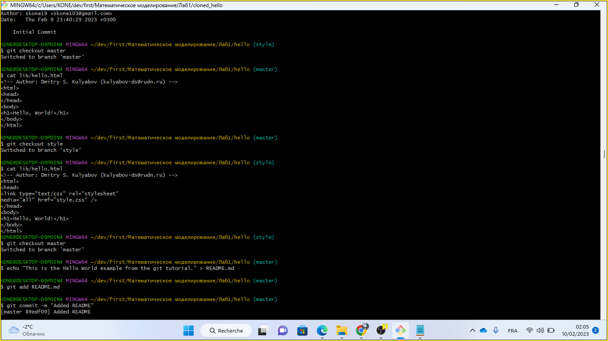 { # fig:017 width=70%} 

1.19.1 Просмотр отличающихся веток

1.19.2 Просмотрите текущие ветки

1.20 Слияние

1.20.1 Слияние веток

(рис. -@fig:018) 

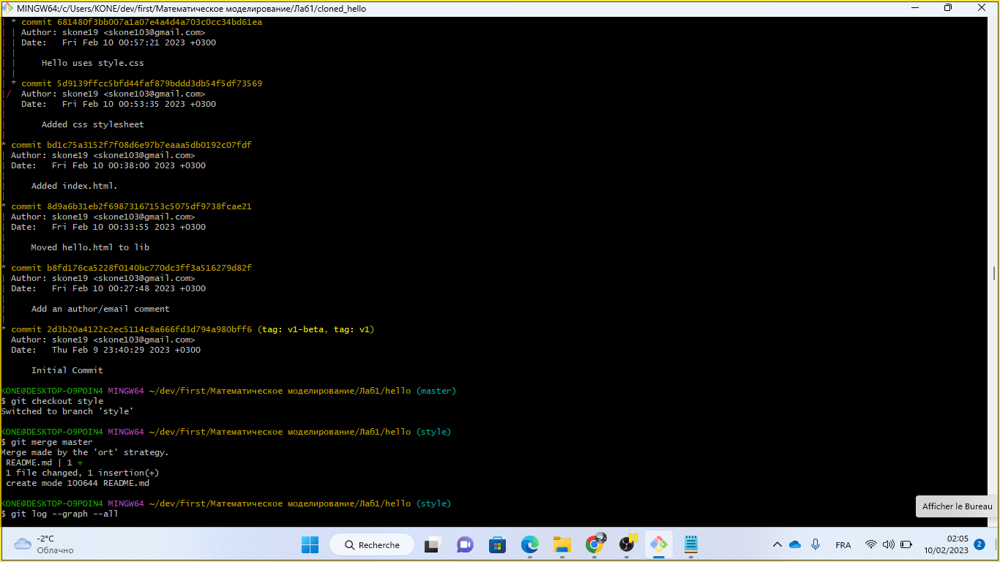 { # fig:018 width=70%} 

1.21 Создание конфликта

1.21.1 Вернитесь в master и создайте конфликт

1.21.2 Просмотр веток

(рис. -@fig:019) 

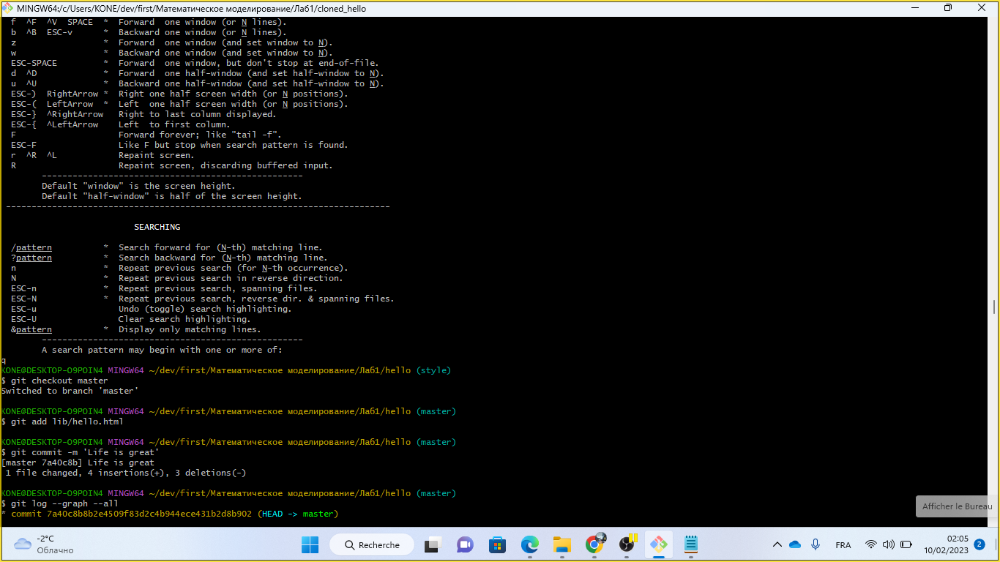 { # fig:019 width=70%} 

1.22 Разрешение конфликтов

1.22.1 Слияние master с веткой style

1.22.2 Решение конфликта

1.22.3 Сделайте коммит решения конфликта

(рис. -@fig:020) 

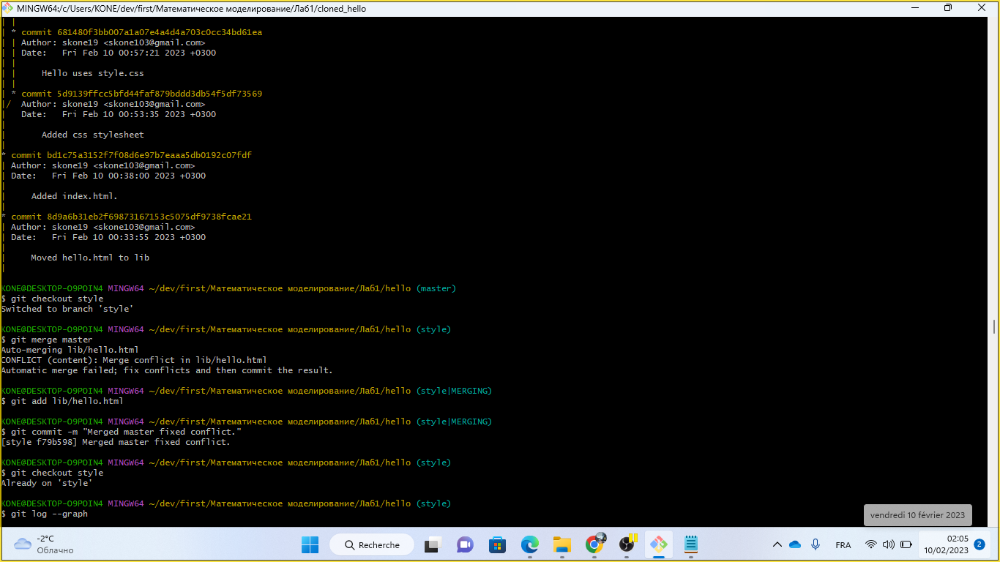 { # fig:020 width=70%} 

1.22.4 Перебазирование как альтернатива слиянию

1.23 Сброс ветки style

1.23.1 Сброс ветки style

1.23.2 Проверьте ветку.

1.24 Сброс ветки master

1.24.1 Сброс ветки master

1.25 Перебазирование

(рис. -@fig:021) 

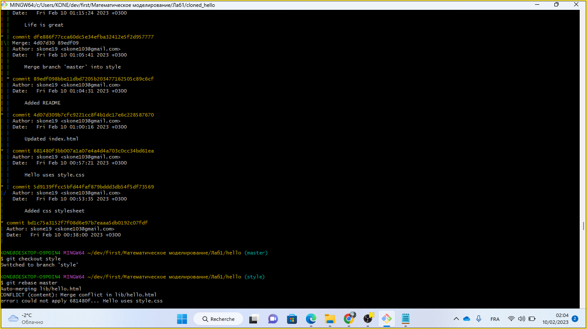 { # fig:021 width=70%} 

1.25.1 Слияние VS перебазирование

1.26 Слияние в ветку master

1.26.1 Слияние style в master

(рис. -@fig:022) 

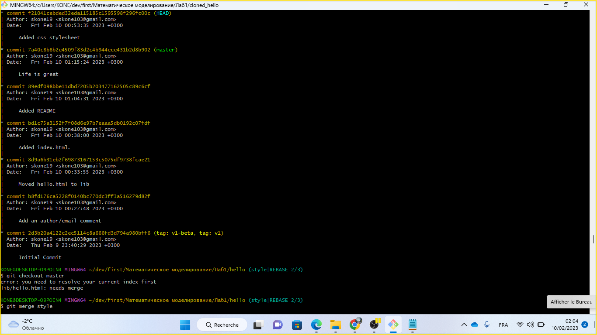 { # fig:022 width=70%} 

1.26.2 Просмотрите логи

1.27 Клонирование репозиториев

1.27.1 Перейдите в рабочий каталог

1.27.2 Создайте клон репозитория hello

1.28 Просмотр клонированного репозитория

1.28.1 Давайте взглянем на клонированный репозиторий.

1.28.2 Просмотрите историю репозитория

(рис. -@fig:023) 

 { # fig:023 width=70%} 

1.28.3 Удаленные ветки

1.29 Что такое origin?

1.30 Удаленные ветки

1.30.1 Список удаленных веток

1.31 Изменение оригинального репозитория

1.31.1 Внесите изменения в оригинальный репозиторий hello

(рис. -@fig:024) 

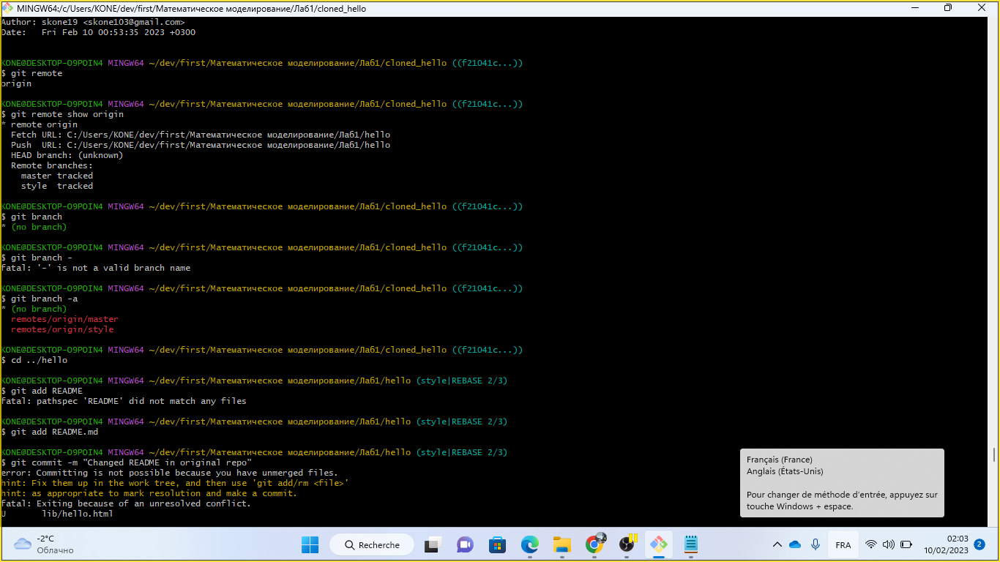 { # fig:024 width=70%} 

1.31.2 Извлечение изменений

(рис. -@fig:025) 

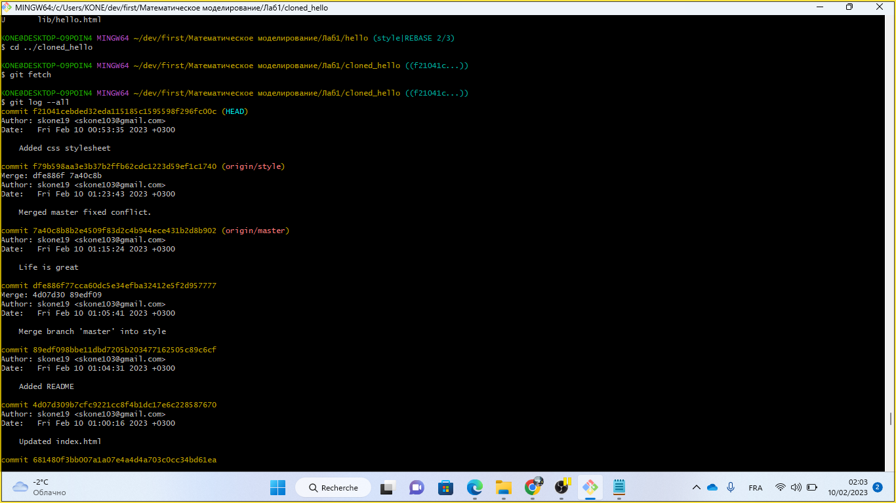 { # fig:025 width=70%} 

1.31.3 Проверьте README.md

1.32 Слияние извлеченных изменений

1.32.1 Слейте извлеченные изменения в локальную ветку master

1.32.2 Еще раз проверьте файл README.md

1.33 Добавление ветки наблюдения

1.33.1 Добавьте локальную ветку, которая отслеживает удаленную ветку

(рис. -@fig:026) 

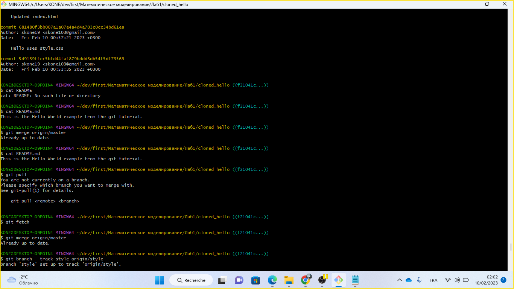 { # fig:026 width=70%} 

1.34 Чистые репозитории

1.35 Создайте чистый репозиторий

1.36 Добавление удаленного репозитория

(рис. -@fig:027) 

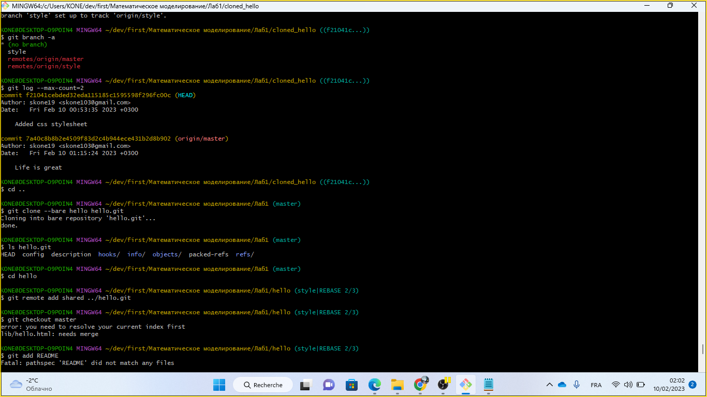 { # fig:027 width=70%} 

1.37 Отправка изменений

(рис. -@fig:028) 

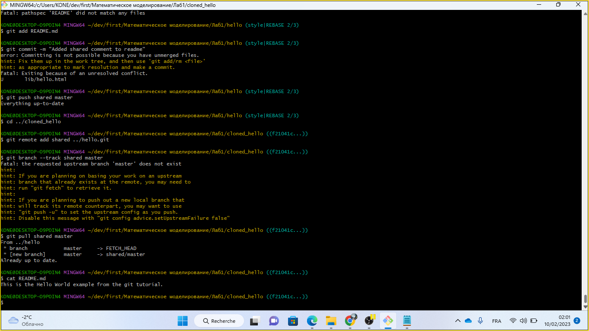 { # fig:028 width=70%}

1.38 Извлечение общих изменений

(рис. -@fig:029) 

 { # fig:029 width=70%}

(рис. -@fig:030) 

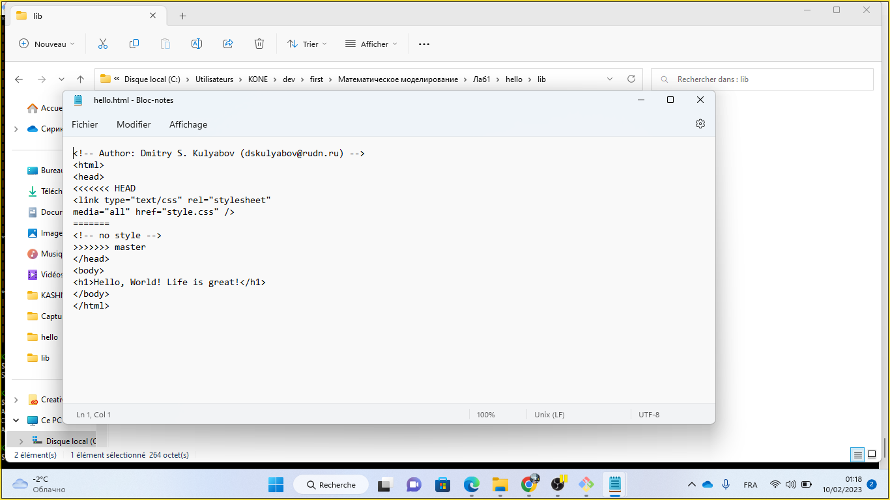 { # fig:030 width=70%}

## Вывод:
Изучил познакомился с работа git.

